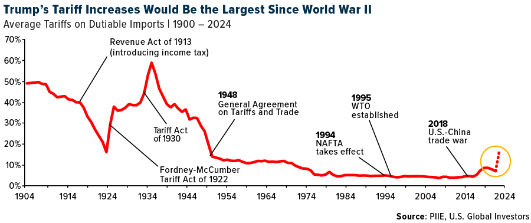

## Table of Contents

## What is a tariff war?

A tariff war is when two or more countries keep raising taxes on each other's goods. These taxes are called tariffs. When one country puts a tariff on another country's products, the other country might do the same thing back. This back-and-forth can make things more expensive and cause problems for businesses and people.

Tariff wars can hurt the economy of the countries involved. When tariffs go up, it can make goods more expensive for people to buy. This can lead to fewer sales for businesses, which might have to lay off workers. Also, if a country relies on imports for important things, like food or medicine, a tariff war can make these things harder to get and more expensive.

## How do tariff wars start?

Tariff wars usually start when one country decides to put a tax, called a tariff, on goods coming from another country. This can happen for many reasons. Sometimes, a country wants to protect its own businesses from cheaper products made in other places. Other times, it might be a way to punish another country for something they did, like not following trade rules or having unfair trade practices.

When the first country puts up a tariff, the other country might feel upset and decide to put a tariff on goods from the first country. This back-and-forth can quickly turn into a tariff war. Both countries keep adding more tariffs, trying to make the other country stop. It's like a game of "you hit me, I hit you back," but with taxes on goods.

Sometimes, other countries might join in, making the tariff war even bigger. This can happen if countries are part of the same trade group or if they want to show support for one side. The more countries that get involved, the harder it can be to stop the tariff war, and the more people and businesses can be affected.

## What are the immediate economic impacts of a tariff war?

When a tariff war starts, the immediate effect is that goods become more expensive. This happens because the tariffs are like extra taxes that get added to the price of things coming from other countries. For example, if a country puts a tariff on imported cars, those cars will cost more for people to buy. This can make people buy fewer things, which can hurt businesses that sell those goods. If businesses sell less, they might have to lay off workers or even close down.

Another quick impact is that it can mess up supply chains. Many businesses rely on parts or materials from other countries to make their products. When tariffs go up, these parts become more expensive, which can slow down production and make things cost more. This can lead to delays and shortages, making it hard for businesses to keep up with demand. In the end, both businesses and consumers can feel the pinch from these higher costs and disruptions.

## Can you provide historical examples of tariff wars?

One big example of a tariff war happened in the 1930s, during the Great Depression. The United States passed a law called the Smoot-Hawley Tariff Act in 1930. This law put high tariffs on many goods coming into the U.S. Other countries got upset and started putting tariffs on American goods too. This made trade between countries much harder and made the Great Depression even worse. Many people lost their jobs and businesses struggled because they couldn't sell their products as easily.

Another example is the trade war between the United States and China that started in 2018. The U.S. put tariffs on lots of Chinese goods, like electronics and machinery. China responded by putting tariffs on American goods, like soybeans and cars. This back-and-forth made things more expensive for people in both countries. It also caused problems for businesses that relied on trade between the two countries. The tariff war lasted for a few years and had a big impact on the global economy.

## How do tariff wars affect global trade?

Tariff wars make global trade harder. When countries put tariffs on each other's goods, it's like putting up walls that make it tough for businesses to sell their products in other countries. This can slow down trade because goods become more expensive and harder to get. When trade slows down, it can hurt the economy of the countries involved. Businesses might sell less, which can lead to fewer jobs and less money for people to spend.

The effects of tariff wars can spread beyond just the countries directly involved. Other countries that trade with them can also feel the impact. For example, if a country can't sell its goods to one of its big trading partners because of tariffs, it might try to sell those goods somewhere else. This can cause problems for other countries that now have to deal with more competition. In the end, tariff wars can make the whole world's economy less stable and more unpredictable.

## What are the long-term implications of tariff wars on international relations?

Tariff wars can make countries feel angry and distrustful of each other. When one country puts tariffs on another, it can seem like they are trying to hurt the other country's economy on purpose. This can lead to bad feelings and make it harder for the countries to work together in the future. Over time, these bad feelings can make it tough to solve other problems, like climate change or security issues, because the countries might not want to trust each other or work together.

In the long run, tariff wars can also change how countries think about trade. If a country keeps getting hit with tariffs, it might decide to focus more on making things at home instead of trading with other countries. This can lead to less global trade overall. It can also make countries form new groups or alliances with other countries that they think will help them avoid tariff wars in the future. These changes can reshape the world's economy and how countries interact with each other for many years.

## How do tariff wars influence domestic industries and consumers?

Tariff wars can make things harder for businesses at home. When a country puts tariffs on goods from other countries, it can help some businesses by making their products cheaper compared to the imported ones. But it can also hurt other businesses that need to buy things from other countries to make their own products. For example, a car maker might need to buy parts from another country, and if those parts get more expensive because of tariffs, the car maker might have to charge more for their cars or make fewer of them. This can lead to fewer jobs and less money for the businesses.

For people who buy things, tariff wars can make life more expensive. When tariffs go up, the price of imported goods goes up too. This means that things like clothes, electronics, and food can cost more. People might have to spend more money on these things, which can leave them with less money for other stuff they need or want. If people start buying less because things are too expensive, it can hurt businesses even more, leading to more job losses and a weaker economy at home.

## What role do governments play in escalating or resolving tariff wars?

Governments are the ones who start tariff wars by putting taxes on goods from other countries. They might do this to protect their own businesses or to get back at another country for something they did. When one government puts up a tariff, the other government might feel mad and put up a tariff too. This back-and-forth can make the tariff war worse. Governments can keep adding more tariffs, trying to make the other side stop, but this just makes things more expensive and causes more problems.

Governments can also help end tariff wars. They can do this by talking to each other and trying to find a way to agree. Sometimes, they might meet and decide to lower or take away the tariffs. Other times, they might need help from big groups like the World Trade Organization to solve the problem. When governments work together and find a solution, it can help make things cheaper again and help businesses and people feel better.

## How are different sectors of the economy impacted differently by tariff wars?

Tariff wars can hit different parts of the economy in different ways. For example, the farming sector can get hurt a lot if another country puts tariffs on their crops. Farmers might not be able to sell as much of their stuff, which can make them lose money. On the other hand, some businesses that make things at home might do better because their products become cheaper compared to the imported ones. But even these businesses can have problems if they need to buy parts from other countries that now cost more because of tariffs.

The car industry is another part of the economy that can feel the impact of tariff wars. Car makers often need to buy parts from other countries to build their cars. If tariffs make these parts more expensive, it can make the cars cost more too. This can make people buy fewer cars, which can hurt the car makers and the people who work for them. The same thing can happen in other industries that rely on parts or materials from other countries, like electronics or clothing.

In the end, tariff wars can make life harder for everyone. People who buy things might have to pay more for stuff like food, clothes, and electronics. This can make them spend less money on other things they need or want. When people buy less, it can hurt businesses and lead to fewer jobs. So, even though some parts of the economy might do better because of tariffs, the overall effect can be bad for a lot of people and businesses.

## What strategies can countries use to mitigate the negative effects of tariff wars?

Countries can try to make things better during a tariff war by finding new places to sell their stuff. If one country puts tariffs on their goods, they can look for other countries that want to buy them. This can help keep businesses going and people working. Another way is to help businesses at home by giving them money or other help to make up for the money they lose because of tariffs. This can keep the economy strong and stop too many people from losing their jobs.

Countries can also talk to each other to try to end the tariff war. They can meet and try to agree on lowering or getting rid of the tariffs. Sometimes, they might need help from big groups like the World Trade Organization to solve the problem. When countries work together and find a solution, it can help make things cheaper again and help businesses and people feel better. By working together and finding new ways to sell their goods, countries can make the bad effects of tariff wars less strong.

## How do tariff wars affect global supply chains and logistics?

Tariff wars can mess up global supply chains and make things harder for businesses. When countries put tariffs on each other's goods, it can make parts and materials more expensive. Many businesses rely on these parts to make their products. If the parts cost more, it can slow down production and make things more expensive for people to buy. This can lead to delays and shortages, which can make it hard for businesses to keep up with what people want.

The logistics of moving goods around the world can also get more complicated because of tariff wars. Companies might have to find new ways to get their products to people, which can take more time and money. They might need to use different routes or find new suppliers in other countries that don't have tariffs. All of these changes can make the whole process of getting goods from one place to another more difficult and less predictable. In the end, tariff wars can make global supply chains less efficient and more expensive for everyone involved.

## What are the potential future scenarios for ongoing tariff wars and their resolution?

In the future, ongoing tariff wars could keep going and get worse if countries can't agree on how to solve their problems. If this happens, more tariffs might be added, making things even more expensive for people and businesses. This could lead to more job losses and make the economy weaker in the countries involved. Other countries that trade with them might also feel the impact, causing problems around the world. If countries keep fighting over tariffs, it could make it harder for them to work together on other big issues, like climate change or security.

On the other hand, countries could find ways to end the tariff wars. They might talk to each other and agree to lower or get rid of the tariffs. This could happen if they see that the tariff war is hurting their economies too much. Big groups like the World Trade Organization could help them find a solution. If the tariff wars end, it could make things cheaper again and help businesses and people feel better. It could also make countries trust each other more and work together better in the future.

## References & Further Reading

[1]: Congressional Research Service. ["U.S.-China Trade Relations."](https://crsreports.congress.gov/product/pdf/IF/IF11284) 

[2]: American Farm Bureau Federation. ["Trade Impacts on Agriculture."](https://www.fb.org/farm-bureau-news/farm-bureau-details-trade-tariff-impacts-on-agriculture) Accessed 2023.

[3]: Bown, Chad P. (2019). ["The 2018 US-China Trade Conflict after Forty Years of Special Protection."](https://www.tandfonline.com/doi/full/10.1080/17538963.2019.1608047) National Bureau of Economic Research.

[4]: Haldane, A. G., & May, R. M. (2011). ["Systemic risk in banking ecosystems."](https://www.nature.com/articles/nature09659) Nature, 469(7330), 351-355.

[5]: Kissell, R. (2014). ["The Science of Algorithmic Trading and Portfolio Management."](https://www.sciencedirect.com/book/9780124016897/the-science-of-algorithmic-trading-and-portfolio-management) Academic Press.