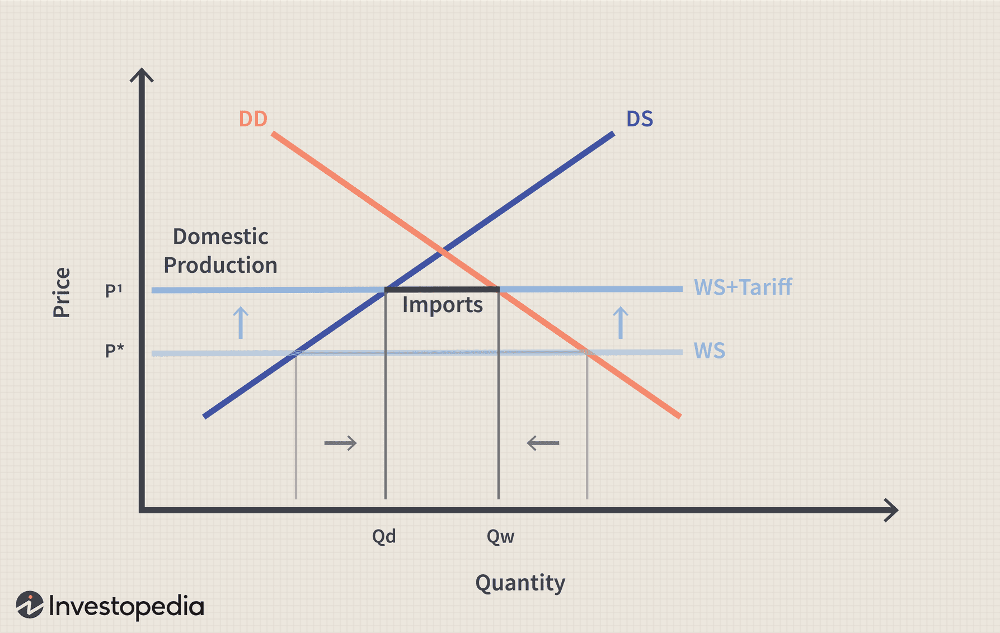

In the rapidly evolving global economy, trade policies and tariffs are integral components that define the contours of international economic interactions. Trade policies establish the regulations governing the exchange of goods and services across borders, while tariffs serve as a primary tool within these policies to manage and influence trade flows. These mechanisms not only protect domestic industries but also have wide-reaching implications on consumer prices, international relations, and global supply chains. Consequently, the dynamics of trade policies and tariffs can provoke trade wars, alter competitive landscapes, and influence economic growth patterns globally.

Algorithmic trading—an advanced method of executing financial transactions through complex algorithms—has gained prominence within financial markets, significantly influencing the dynamics of trade policies and tariffs. This modern approach leverages computational algorithms to optimize trading processes and decisions, accounting for a substantial volume of transactions in today's markets. The effects of algorithmic trading include enhanced market liquidity and efficiency, although it also introduces potential risks such as increased market volatility during periods of rapid change. This dual-edged influence positions algorithmic trading as a crucial factor in understanding the real-time impacts of trade policies and tariffs on economic stability and market conditions.



The intertwined relationship between trade policies, tariffs, and algorithmic trading creates a complex matrix of interactions affecting both domestic and international economic landscapes. Changes in trade policy or the imposition of tariffs can trigger algorithmic trading strategies that, in turn, impact stock prices, currency valuations, and economic forecasts. Algorithmic trading's rapid responsiveness enables markets to adjust swiftly to new trade conditions, potentially mitigating adverse impacts or exacerbating volatility depending on the context.

This article aims to explore these interconnected effects, offering insights into how trade policies and tariffs influence global markets and how algorithmic trading might amplify or mitigate these effects. By comprehending these relationships, stakeholders, including policymakers, economists, and market participants, can better navigate the global market's complexities, fostering strategies that promote economic resilience and informed decision-making. Through this understanding, stakeholders can anticipate market trends and devise adaptive strategies to harness the benefits while mitigating the risks associated with these powerful economic forces.

## Table of Contents

## Understanding Trade Policies and Tariffs

Trade policies are essential instruments that shape the economic interactions between nations. At their core, trade policies consist of strategies and regulations governing international economic activities, which include tariffs, trade agreements, import quotas, and other regulatory measures. These policies are designed to manage the exchange of goods and services, protect domestic industries, and promote fair trade practices.

**Tariffs** play a significant role within trade policies. A tariff is a tax imposed by a government on imported goods and services. The primary purpose of tariffs is to increase the cost of foreign products, making them less competitive compared to domestic goods. This helps in protecting local industries from overseas competition and can be used as a tool to regulate trade imbalances.

Tariffs, however, do not function in isolation. They can lead to the creation of economic barriers, affecting not only the countries involved but the global market as well. When a country imposes high tariffs on imports, it can trigger retaliatory measures from trading partners, potentially leading to trade wars. These disputes can result in strained diplomatic relations and affect global economic stability.

The imposition of tariffs tends to increase consumer prices. As import costs rise, businesses may pass these expenses onto consumers through higher prices for goods and services. This inflationary pressure can reduce consumer purchasing power and alter spending habits, influencing economic growth.

Beyond national borders, the ripple effects of tariffs are evident in global supply chains. A modern economy relies on interconnected networks of production and distribution spanning multiple countries. Tariff changes can disrupt these networks by increasing costs, causing supply chain inefficiencies, and necessitating rapid adjustments in sourcing and logistics strategies. This, in turn, affects international cooperation as businesses globally realign to mitigate tariff impacts.

To understand the broader economic impact of trade policies, it is crucial to analyze these dynamics systematically. Economists and policymakers assess the implications of tariff structures and other trade measures by evaluating their impacts on trade volumes, market access, domestic job protection, and overall economic welfare. These assessments are indispensable for crafting trade policies that balance national interests with the benefits of global trade. 

Overall, as nations increasingly engage in international trade, the effectiveness of trade policies, and particularly the strategic use of tariffs, remains a pivotal aspect of economic policy-making. Their influence extends across borders, affecting domestic markets, global supply chains, and international economic relations.

## Algorithmic Trading in the Modern Economy

Algorithmic trading is an advanced trading strategy that employs computer algorithms to conduct financial transactions automatically. These algorithms are designed to make decisions about aspects such as timing, price, and quantity with high precision and speed, aiming to optimize trading effectiveness and efficiency.

The proliferation of [algorithmic trading](/wiki/algorithmic-trading) in modern financial markets has been significant. It is estimated that a considerable proportion of equity and currency trades are now facilitated by sophisticated algorithms. The efficiency brought about by algorithmic trading increases [liquidity](/wiki/liquidity-risk-premium); transactions are executed swiftly with minimal manual intervention, reducing market friction and improving pricing transparency.

However, the rapid execution that characterizes algorithmic trading also introduces potential risks. For example, market instability can occur during periods of sudden shifts or [volatility](/wiki/volatility-trading-strategies). One notable instance is the "flash crash" of May 6, 2010, where major stock indices in the United States dramatically dropped and recovered within a very short span, exacerbated by automated trading systems. These occurrences underscore the importance of robust risk management protocols to mitigate potential oversights in automated systems.

Understanding the mechanisms of algorithmic trading is crucial for evaluating its broader economic impact. Algorithms frequently incorporate diverse datasets and complex mathematical models to execute trades. A typical algorithm might employ statistical [arbitrage](/wiki/arbitrage), analyzing the price differences of similar financial instruments across different markets. By doing so, it capitalizes on slight discrepancies, often operating on timescales measured in milliseconds.

For instance, a simple moving average crossover strategy might be implemented in Python as follows:

```python
import pandas as pd

def moving_average_crossover(data, short_window=5, long_window=20):
    data['Short_MAvg'] = data['Close'].rolling(window=short_window, min_periods=1).mean()
    data['Long_MAvg'] = data['Close'].rolling(window=long_window, min_periods=1).mean()
    data['Signal'] = 0
    data['Signal'][short_window:] = np.where(data['Short_MAvg'][short_window:] > data['Long_MAvg'][short_window:], 1, 0)
    data['Position'] = data['Signal'].diff()
    return data

# Example usage:
# df = pd.read_csv('stock_data.csv')
# trading_signals = moving_average_crossover(df)
```

This script calculates the short and long-term moving averages of a stock’s closing prices, generating a 'buy' signal when the short-term average crosses above the long-term average, and vice versa for 'sell' signals.

In the context of economic impact, algorithmic trading influences liquidity and price discovery in financial markets. By rapidly processing unique or large incoming information, these systems contribute to efficient market functioning. However, their reactive nature can also propagate shocks from policy changes, including those related to trade tariffs, which can affect the economic landscape.

Overall, the use of algorithmic trading strategies continues to shape the dynamics of modern economies, making a deeper understanding of its mechanisms and impacts essential for policymakers and market participants.

## The Interaction between Trade Policies and Algorithmic Trading

Trade policies and algorithmic trading have a complex and dynamic relationship that significantly affects global financial markets. Changes in trade policies, such as the imposition of tariffs, often lead to immediate responses in the financial markets. These responses are increasingly driven by algorithmic trading systems, which are designed to execute trades based on predefined criteria and can react swiftly to economic news.

When a tariff is implemented or adjusted, it alters the cost structure and profitability of affected industries. Algorithmic trading systems, which rely on real-time data and [machine learning](/wiki/machine-learning) models, can quickly analyze these changes and adjust their trading strategies accordingly. For example, a tariff increase on steel imports might prompt algorithms to short sell stocks of companies reliant on steel, anticipating a decrease in their profitability.

Algorithmic trading enhances the ability of market participants to adapt to policy changes. This speed and efficiency can optimize market positions, allowing traders to capitalize on volatility or mitigate potential losses. However, this rapid adjustment process also introduces risks. Algorithms can sometimes exacerbate market volatility by overreacting to policy announcements or misinterpreting data, leading to a cascade of trading activity that might destabilize markets.

Consider a scenario where an unexpected trade policy announcement leads to a surge in automated sell orders, causing a sharp decline in stock prices. This is often referred to as a "flash crash," where the speed of algorithmic trading increases market instability. The interaction between trade policies and algorithmic trading, therefore, requires careful consideration and balancing to maintain economic stability.

The interplay between these elements also influences economic forecasts. Algorithmic systems are capable of processing vast amounts of information quickly, contributing to more accurate and timely economic predictions. However, their reliance on historical data and pattern recognition means they might fail to account for unprecedented policy changes or external economic shocks, potentially leading to systemic forecasting errors.

To better understand these dynamics, one can simulate the impact of trade policy changes on algorithmic trading strategies using computer models. For instance, a simple Python model could be created to simulate how a change in tariff rates affects stock prices and subsequently triggers algorithmic trading responses:

```python
import numpy as np

# Simulating an initial stock price
stock_price = 100

# Function to simulate the effect of a tariff change
def simulate_tariff_impact(tariff_change, sensitivity):
    # Calculate the impact on stock price using a sensitivity factor
    impact = stock_price * (1 + tariff_change * sensitivity)
    return impact

# Simulating the response of an algorithmic trading strategy
tariff_change = 0.05  # 5% increase in tariffs
sensitivity = -0.3    # Sensitivity of the stock to tariff changes
new_stock_price = simulate_tariff_impact(tariff_change, sensitivity)

print(f"New stock price after tariff change: {new_stock_price}")
```

This code demonstrates how a 5% increase in tariffs, with a stock sensitivity of -0.3, could lead to a new adjusted stock price. Such models help traders and policymakers anticipate the responses of algorithmic systems to changes in trade policies, thereby enhancing their ability to navigate the complexities of the modern economic landscape.

In summary, the interaction between trade policies and algorithmic trading is a significant driver of market dynamics. While algorithmic trading enables rapid responses to policy changes, it also carries the risk of magnifying market volatility. A nuanced understanding of these interactions is crucial for maintaining economic stability and leveraging algorithmic systems to achieve strategic financial objectives.

## Economic Impact of Trade Policy and Algorithmic Trading

The combined effects of trade policy and algorithmic trading significantly shape macroeconomic trends and individual markets. Trade policies, particularly tariffs, have historically played a role in adjusting the competitive landscape. By imposing duties on imported goods, tariffs can make foreign products more expensive, thus promoting domestic production. However, this can lead to retaliation by trading partners, affecting international trade dynamics and leading to potential trade wars. Tariffs can influence currency values by altering trade balances. A country with a trade surplus, fostered by high tariffs, might see its currency appreciate due to increased demand for its goods and, consequently, its currency. Conversely, a trade deficit could depreciate the currency, impacting global economic relations.

Algorithmic trading, characterized by the use of computer algorithms to execute and manage trades at high speeds and frequencies, reacts dynamically to changes in trade policies like tariffs. For example, announcements of new tariffs or changes in existing ones can lead to immediate and automated buying or selling decisions in financial markets. This capability can rapidly alter stock prices and market forecasts, thereby impacting investor behavior and economic expectations. As a result, algorithmic trading can magnify the economic adjustments necessitated by trade policy shifts, often leading to increased market volatility. 

Economic growth and employment are also influenced by the interplay between trade policies and algorithmic trading. When tariffs protect domestic industries, they may lead to increased employment in the short term as local production ramps up. However, the resulting higher consumer prices and potential retaliatory tariffs can negate these benefits. Algorithmic trading, by swiftly adjusting investments and capital flows, can either bolster these employment effects or exacerbate economic instability, depending on how investment strategies align with policy changes.

Investment strategies are particularly sensitive to the synergy between policy changes and trading technologies. Algorithmic trading enables investors to swiftly react to policy shifts, optimizing their portfolios more efficiently compared to manual trading. This agility can benefit economies by redirecting capital to sectors that become more competitive due to trade barriers. Alternatively, it can also lead to capital flight from regions perceived to be economically disadvantaged by new policies.

Case studies illustrate these interactions. For instance, during the U.S.-China trade tensions, tariffs imposed by both nations led to significant fluctuations in stock markets, which were accentuated by algorithmic trading. The rapid buying and selling facilitated by algorithms intensified market reactions, sometimes leading to sharp declines or gains based on news flows related to trade discussions and policy implementations. These real-world examples highlight how algorithmic trading can both stabilize and destabilize economic environments, depending on the underlying conditions and responses to trade policies.

Overall, understanding the economic impact of trade policy and algorithmic trading requires an acknowledgment of their interconnected roles in shaping modern economies. As technologies and trade strategies evolve, stakeholders must adapt to these rapid changes to maintain economic stability and growth.

## Future Trends and Considerations

As globalization continues, the intricate connection between trade policies and algorithmic trading is anticipated to grow increasingly significant. The interplay of these forces will likely result in rapidly evolving dynamics within global financial markets. 

Technological advancements are poised to further refine algorithmic trading strategies. Increasing the sophistication and efficiency of algorithms will enhance their influence across financial systems. Algorithms powered by [artificial intelligence](/wiki/ai-artificial-intelligence) and machine learning will be capable of analyzing vast datasets in real-time, thereby optimizing trading decisions and enhancing market liquidity. For example, machine learning techniques like neural networks and decision trees can improve predictive accuracy and facilitate faster adjustments to market conditions.

As a result, trade policies may need to adapt to these advancements. The rapid response capabilities of algorithmic trading mean that market reactions to policy changes can occur almost instantaneously, creating a more volatile but potentially more efficient economic landscape. Policymakers will have to consider the accelerated pace of market responses when designing trade regulations to ensure they do not inadvertently destabilize economies or exacerbate market fluctuations.

Balancing the benefits of protecting domestic industries with maintaining global economic stability will be a crucial consideration for policymakers. The imposition of tariffs, for instance, might protect local jobs and industries but could also trigger reactive shifts in algorithmic trading strategies, influencing currency values and equity markets on a global scale. Such volatility could undermine the intended protective measures, necessitating a more nuanced approach that considers both immediate and longer-term economic impacts.

In discussing these future trends, it's essential to consider how these powerful forces might reshape economic landscapes. The potential for stronger integration between trade policies and trading technologies will require careful monitoring and strategy from stakeholders. Adaptive regulatory frameworks and informed decision-making will be vital in harnessing the benefits of these advancements while mitigating associated risks.

By anticipating the trajectory of trade policies and algorithmic trading, stakeholders can make more informed decisions to promote economic resilience and sustainable growth. The future will likely demand a collaborative approach, where economists, policymakers, and technologists work closely to navigate these complex, fast-evolving dynamics.

## Conclusion

Trade policies, tariffs, and algorithmic trading each play pivotal roles in shaping the modern economic environment. The complex interplay between these elements necessitates a comprehensive understanding to enable economists, policymakers, and market participants to effectively respond to shifting economic paradigms. As the global market continues to evolve, the integration and influence of algorithmic trading with trade policy will likely intensify, requiring precise navigation through these intricate dynamics.

The influence of algorithmic trading is expected to grow as technological advancements continue to enhance its capabilities, making it a significant [factor](/wiki/factor-investing) in the execution and impact of trade policies. Algorithmic trading can rapidly react to policy shifts, thereby affecting markets on a global scale in real time. Consequently, this increasing integration emphasizes the need for informed strategies and adaptive policy frameworks to manage potential opportunities and risks.

Effective navigation through these complexities requires stakeholders to harness data-driven insights and predictive analytics, ensuring that decisions are not only reactive but also strategic and foresighted. By anticipating future trends and the ramifications of their interactions, policymakers and market participants can devise strategies that foster economic resilience and growth.

To ensure robust economic frameworks, it is essential to balance the protective measures of trade policies and the reactive nature of algorithmic trading with an overarching goal of sustaining global economic stability. An informed and proactive approach, characterized by adaptive strategies, can empower stakeholders to manage uncertainties and harness opportunities in the evolving economic landscape. This strategic foresight is crucial to maintaining resilience and promoting growth within the global economy.

## References & Further Reading

[1]: Irwin, D. A. (1996). ["Against the Tide: An Intellectual History of Free Trade."](https://www.jstor.org/stable/j.ctvzsmfjm) Princeton University Press.

[2]: ["The Rise of the Machines: The Future has Lots of Automation, AI, and Algorithms"](https://seas.harvard.edu/news/2021/10/present-and-future-ai) by Bain & Company

[3]: ["Algorithmic and High-Frequency Trading"](https://www.cambridge.org/us/universitypress/subjects/mathematics/mathematical-finance/algorithmic-and-high-frequency-trading) by Álvaro Cartea, Sebastian Jaimungal, and José Penalva

[4]: Baldwin, R. E. (2009). ["The Great Trade Collapse: Causes, Consequences and Prospects."](https://cepr.org/publications/books-and-reports/great-trade-collapse-causes-consequences-and-prospects) VoxEU.org Book.

[5]: Menkveld, A. J. (2013). ["High Frequency Trading and the New Market Makers."](https://www.sciencedirect.com/science/article/pii/S1386418113000281) Journal of Financial Markets.