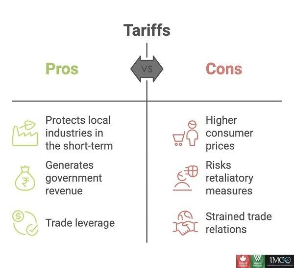

## Table of Contents

## What is a tariff?

A tariff is a tax that a country puts on goods that come from another country. It makes these goods more expensive for people to buy. Governments use tariffs to protect their own businesses and workers. By making foreign goods more expensive, people might choose to buy things made in their own country instead.

Tariffs can also be used as a way to make money for the government. When people pay more for imported goods, that extra money goes to the government. However, tariffs can sometimes cause problems. They can lead to higher prices for consumers and might cause other countries to put tariffs on goods from the country that started it. This can lead to a trade war, where countries keep adding more tariffs, making it harder for everyone to trade.

## How do tariffs affect the price of imported goods?

Tariffs make imported goods more expensive. When a country puts a tariff on a product coming from another country, it adds an extra cost to that product. This means that when the product arrives, the price goes up because of the tariff. People who want to buy these imported goods have to pay more money than they would if there were no tariffs.

Because of the higher prices, people might decide to buy things made in their own country instead of the more expensive imported goods. This can help local businesses because more people are buying their products. However, it can also mean that people have fewer choices and might have to pay more for things they need or want.

## What is the difference between a tariff and a quota?

A tariff is a tax that a country puts on goods coming from another country. It makes these goods more expensive for people to buy. The goal of a tariff is to protect local businesses by making foreign goods cost more, so people might choose to buy things made at home instead. Tariffs also bring in money for the government because they collect the tax from the imported goods.

A quota, on the other hand, is a limit on the number of goods that can come into a country. Instead of making the goods more expensive, a quota controls how many of them can be imported. Once the limit is reached, no more of that product can come in until the next period. Quotas are used to protect local industries by reducing the amount of competition from foreign goods.

Both tariffs and quotas aim to protect local businesses, but they do it in different ways. Tariffs increase the price of imported goods, while quotas limit the amount of goods that can be imported. Each method can affect the choices available to consumers and the prices they have to pay.

## Can tariffs be used as a tool for protectionism?

Yes, tariffs can be used as a tool for protectionism. Protectionism is when a country tries to protect its own businesses and workers by making it harder for foreign goods to compete. By putting a tariff on imported goods, a country makes these goods more expensive. This means people might choose to buy things made in their own country instead, which helps local businesses and workers.

However, using tariffs for protectionism can also have downsides. It can lead to higher prices for consumers because they have to pay more for the imported goods. It can also cause other countries to put tariffs on goods from the country that started it, leading to a trade war. This can make it harder for everyone to trade and can hurt the global economy.

## How do tariffs impact domestic industries?

Tariffs can help domestic industries by making foreign goods more expensive. When people see that imported products cost more, they might choose to buy things made in their own country instead. This can lead to more sales for local businesses, which can help them grow and create more jobs. For example, if a country puts a tariff on imported cars, people might buy more cars made at home, helping the local car industry.

However, tariffs can also have some negative effects on domestic industries. If the cost of imported materials goes up because of tariffs, it can make it more expensive for local businesses to produce their goods. This can lead to higher prices for consumers, which might make them buy less. Also, if other countries put tariffs on goods from the country that started it, it can hurt the domestic industries that rely on exporting their products. So, while tariffs can protect some industries, they can also create challenges for others.

## What are the economic arguments for and against tariffs?

Economic arguments in favor of tariffs often focus on protecting domestic industries and jobs. When a country puts a tariff on imported goods, it makes those goods more expensive. This can help local businesses because people might choose to buy things made at home instead of the more expensive imports. This can lead to more jobs and growth in the domestic economy. Tariffs can also be used to help new industries get started by giving them time to grow without too much competition from foreign companies. Plus, tariffs bring in money for the government, which can be used for public services.

On the other hand, there are strong economic arguments against tariffs. They can lead to higher prices for consumers because imported goods cost more. This means people have to pay more for things they need or want, which can hurt their wallets. Tariffs can also cause other countries to put tariffs on goods from the country that started it, leading to a trade war. This can make it harder for everyone to trade and can hurt the global economy. Also, if local businesses rely on imported materials, tariffs can make it more expensive for them to produce their goods, which can slow down the economy instead of helping it.

## How do tariffs influence international trade relations?

Tariffs can change how countries work together in trade. When one country puts a tariff on goods from another country, it can make the other country upset. They might think it's not fair and decide to put tariffs on goods from the first country. This can start a trade war, where countries keep adding more tariffs. It makes it harder for them to trade with each other and can hurt their economies. Good trade relations are important for countries to work well together, and tariffs can make these relations worse.

On the other hand, tariffs can also be used to help fix trade problems. Sometimes, countries use tariffs to make other countries follow trade rules. For example, if one country is not playing fair in trade, another country might use tariffs to make them stop. This can lead to talks and agreements that make trade better for everyone. So, while tariffs can cause tension, they can also be a tool to make trade fairer and improve international relations in the long run.

## What is the role of tariffs in a country's trade policy?

Tariffs are an important part of a country's trade policy. They are taxes put on goods coming from other countries. By making these goods more expensive, tariffs help protect local businesses. When people see that imported products cost more, they might choose to buy things made at home instead. This can help local industries grow and create more jobs. Tariffs also bring in money for the government, which can be used for public services like schools and roads.

However, tariffs can also cause problems. They can make things more expensive for people to buy, which can hurt their wallets. If other countries get upset about the tariffs, they might put tariffs on goods from the country that started it. This can lead to a trade war, where countries keep adding more tariffs, making it harder for everyone to trade. So, while tariffs can help protect local businesses, they need to be used carefully to avoid hurting the economy and trade relations with other countries.

## How do tariffs affect consumer choice and welfare?

Tariffs can change what people can buy and how much they have to pay. When a country puts a tariff on goods from another country, it makes those goods more expensive. This means people might not be able to buy as many of those things, or they might have to choose something else that's made at home. If the things they want to buy are more expensive because of tariffs, they might have to spend more money, which can make it harder for them to buy everything they need.

On the other hand, tariffs can also help people by making more things available from their own country. When local businesses do better because of tariffs, they can make more products and create more jobs. This can be good for people because they might have more choices of things made at home. But if the cost of everything goes up because of tariffs, it can still be hard for people to buy what they need. So, tariffs can help some people by giving them more choices, but they can also make things more expensive and harder to buy.

## What are the long-term economic effects of imposing tariffs?

In the long run, putting tariffs on goods can change how a country's economy works. When a country uses tariffs to make foreign goods more expensive, it can help local businesses grow. More people might buy things made at home, which can lead to more jobs and more money being spent in the country. This can make the economy stronger over time. Also, the money from tariffs can help the government pay for things like schools and roads, which can make life better for people.

But tariffs can also cause problems in the long run. If other countries get upset about the tariffs, they might put tariffs on goods from the country that started it. This can lead to a trade war, where countries keep adding more tariffs, making it harder for everyone to trade. This can hurt the global economy and make things more expensive for people. Also, if local businesses rely on things from other countries to make their products, tariffs can make it more expensive for them to produce goods. This can slow down the economy instead of helping it. So, while tariffs can help some parts of the economy, they can also cause big problems if they're not used carefully.

## How do retaliatory tariffs impact global trade dynamics?

Retaliatory tariffs can change how countries trade with each other. When one country puts a tariff on goods from another country, the other country might get upset and put tariffs on goods from the first country. This can start a trade war, where countries keep adding more tariffs. It makes it harder for them to trade with each other and can hurt their economies. Good trade relations are important for countries to work well together, and retaliatory tariffs can make these relations worse.

On the other hand, retaliatory tariffs can also be used to help fix trade problems. Sometimes, countries use tariffs to make other countries follow trade rules. For example, if one country is not playing fair in trade, another country might use tariffs to make them stop. This can lead to talks and agreements that make trade better for everyone. So, while retaliatory tariffs can cause tension, they can also be a tool to make trade fairer and improve international relations in the long run.

## What are the implications of tariffs on global supply chains and economic efficiency?

Tariffs can make global supply chains more complicated and less efficient. When a country puts a tariff on goods from another country, it makes those goods more expensive. This can make companies think twice about using parts or materials from that country. They might have to find new places to get what they need, which can take time and cost more money. This can slow down how quickly things are made and shipped around the world. It can also make it harder for companies to work together across different countries, which can hurt the global economy.

On the other hand, tariffs can also help some parts of the economy by protecting local businesses. When people see that imported goods cost more, they might choose to buy things made at home instead. This can help local industries grow and create more jobs. But if other countries get upset about the tariffs, they might put tariffs on goods from the country that started it. This can lead to a trade war, where countries keep adding more tariffs, making it harder for everyone to trade. So, while tariffs can help some parts of the economy, they can also cause big problems if they're not used carefully.

## References & Further Reading

[1]: Irwin, D. A. (1996). ["Against the Tide: An Intellectual History of Free Trade."](https://www.jstor.org/stable/j.ctvzsmfjm) Princeton University Press.

[2]: ["The Rise of the Machines: The Future has Lots of Automation, AI, and Algorithms"](https://seas.harvard.edu/news/2021/10/present-and-future-ai) by Bain & Company

[3]: ["Algorithmic and High-Frequency Trading"](https://www.cambridge.org/us/universitypress/subjects/mathematics/mathematical-finance/algorithmic-and-high-frequency-trading) by Álvaro Cartea, Sebastian Jaimungal, and José Penalva

[4]: Baldwin, R. E. (2009). ["The Great Trade Collapse: Causes, Consequences and Prospects."](https://cepr.org/publications/books-and-reports/great-trade-collapse-causes-consequences-and-prospects) VoxEU.org Book.

[5]: Menkveld, A. J. (2013). ["High Frequency Trading and the New Market Makers."](https://www.sciencedirect.com/science/article/pii/S1386418113000281) Journal of Financial Markets.