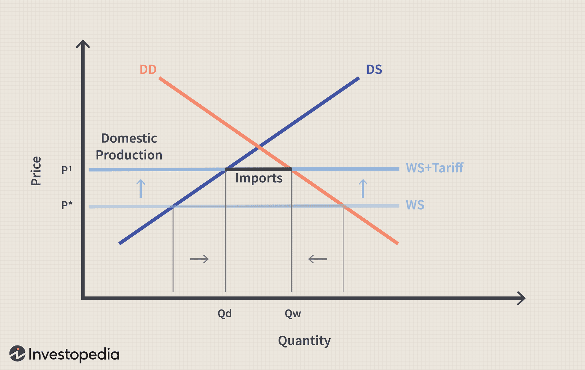

Tariffs and trade policies have traditionally been vital instruments in influencing global economic frameworks. In recent years, the accelerated pace of international trade and technological advancements has further expanded their influence across various sectors. Their economic impact is especially pronounced in the domain of algorithmic trading, where trading decisions occur in milliseconds, and minor shifts in trade policy can translate into significant financial gains or losses.

Trade policies and tariffs not only shape market dynamics but also affect businesses and consumers in profound ways. These tools can alter competitive landscapes and consumer behavior by impacting prices and availability of goods. In our rapidly changing commercial environment, gaining a clear understanding of these effects is essential for businesses aiming to remain competitive and for policymakers striving to foster economic growth.

This article discusses the historical context, contemporary dynamics, and prospective developments related to tariffs and trade policies, with a particular focus on algorithmic trading. Such examination is crucial for comprehending how these economic tools might influence the global market's future direction. By evaluating past occurrences and current trends, stakeholders can better navigate the complex web of interdependencies among economic policy and technological evolution.

Join us as we examine the intricate interactions between tariffs, trade policies, and algorithmic trading, shedding light on how these factors collectively shape today’s global market landscape.

## Table of Contents

## Understanding Tariffs and Their Economic Role

Tariffs, primarily taxes levied on imported goods, have historically served as tools to protect domestic industries and generate government revenue. Their role in the economic sphere is significant, affecting various facets of the market such as consumer prices, domestic production, and international relations.

Economically, tariffs can elevate the cost of imported goods, making them less attractive compared to locally produced items. This can lead to increased consumer prices for imported items and a potential rise in demand for domestic alternatives. For domestic producers, tariffs serve as protective barriers against international competition, thereby fostering local industry growth. However, for consumers, the increase in prices may lead to reduced purchasing power and a potential decline in overall economic welfare.

The history of tariffs is steeped in attempts to balance trade deficits and protect burgeoning domestic industries. In the late 19th and early 20th centuries, tariffs were extensively used to support industrialization efforts in countries like the United States and Germany (Irwin, 2017). Despite their historical prominence, the debate over tariffs' effectiveness remains contentious. Critics argue that while tariffs can protect specific industries, they may also lead to market distortions, inefficiencies, and potential retaliation from trading partners.

In recent decades, the scope of tariffs has broadened beyond economic protectionism to embrace geopolitical strategies. Modern economies have seen tariffs applied as instruments of foreign policy, used to exert pressure or gain leverage in international negotiations. For instance, recent trade disputes between the United States and China involved tariff implementations as part of broader political and economic strategies.

Overall, the economic role of tariffs is multifaceted, with implications that extend beyond mere revenue generation. As the global economy continues to evolve, understanding tariffs' impacts on market dynamics, consumer behavior, and international relations remains essential.

**References:**
- Irwin, D. A. (2017). *Clashing over commerce: A history of US trade policy*. University of Chicago Press.

## Trade Policies and Global Economic Interactions

Trade policies are crucial instruments in shaping the framework of international economic interactions. These policies include mechanisms such as tariffs, quotas, and trade agreements, each serving distinct but often interrelated purposes.

Countries leverage trade policies to address economic challenges, bolster competitive advantages, and build diplomatic relationships. For instance, by imposing tariffs, a nation might seek to protect its domestic industries from foreign competition. Conversely, trade agreements can open new markets for domestic producers, facilitating economic growth and cooperation.

The landscape of global trade has evolved considerably, influencing economic policies worldwide. The trend has largely been towards open markets and reduced trade barriers, aimed at fostering economic integration and increasing the efficiency of global supply chains. Historically, the General Agreement on Tariffs and Trade (GATT) and its successor, the World Trade Organization (WTO), have played significant roles in promoting free trade across nations [1].

Despite the push towards open markets, protectionist measures have not vanished. Recent global events, including economic uncertainties and geopolitical tensions, have led to a resurgence of trade barriers. These measures can significantly disrupt global supply chains, as seen with the tariffs and trade restrictions imposed during trade tensions between major economic entities like the United States and China [2].

Understanding trade policies is essential for predicting economic shifts and preparing for market changes. For businesses, adaptability to changing trade environments can be the difference between success and failure. For policymakers, crafting effective trade strategies can protect national interests while promoting international economic cooperation.

In conclusion, trade policies are dynamic tools that require careful crafting and understanding. Their impacts are wide-ranging, affecting everything from consumer prices to international diplomacy. As the global economy becomes increasingly interconnected and complex, the ability to navigate these policies strategically is crucial for both national economic stability and global economic progress.

---

**References:**

1. World Trade Organization. **Understanding the WTO.** Available at: [https://www.wto.org/english/thewto_e/whatis_e/tif_e/tif_e.htm](https://www.wto.org/english/thewto_e/whatis_e/tif_e/tif_e.htm)
2. Bown, C. P. & Kolb, M. **Trump's Trade War Timeline: An Up-to-Date Guide.** Petersen Institute for International Economics. Available at: [https://www.piie.com/blogs/trade-and-investment-policy-watch/trump-trade-war-china-date-guide](https://www.piie.com/blogs/trade-and-investment-policy-watch/trump-trade-war-china-date-guide)

## The Impact of Tariffs on Consumers and Businesses

Tariffs, by their very nature, impose a tax on imported goods, thereby increasing their costs. This has direct repercussions for consumers as prices of goods rise, leading to a decrease in disposable income and an altered consumption pattern. For example, if a $100 product is subject to a 20% tariff, the price to consumers rises to $120. Such increases can lead to a decrease in demand, which can adversely affect the overall economy.

For businesses, especially those dependent on imported materials, tariffs can increase production costs. This includes higher expenses for raw materials and components, which can compress profit margins and necessitate price adjustments to retain competitiveness. A significant rise in operational costs can be particularly detrimental to small businesses, which often do not have the financial cushioning to absorb such shocks. This can lead to downsizing, reduced investment in innovation, and ultimately, a stifling of economic growth.

Moreover, small businesses and lower-income consumers frequently bear a heavier burden from tariffs, as they are less equipped to deal with price hikes. For small businesses, the lack of economies of scale can make passing on the increased costs to consumers more challenging, placing them at a disadvantage compared to larger enterprises. Low-income consumers, who spend a larger portion of their income on necessities, may find themselves disproportionately affected by rising prices, exacerbating inequalities.

Industries heavily reliant on global supply chains, such as the automotive and technology sectors, encounter significant disruptions from tariffs. These industries depend on a complex web of suppliers and manufacturers across different countries. Tariffs can distort the pricing structure, prompting companies to rethink and potentially reroute their supply chains. For instance, a car manufacturer importing parts from a country subject to tariffs may face significant cost escalations, prompting a shift in supplier strategy or even relocation of production facilities, which can be both time-consuming and costly.

Furthermore, the broader economic implications of tariffs cannot be overstated. They can strain international trade relationships, leading to retaliatory measures and trade wars. This in turn can further destabilize regional economies and lead to geopolitical tensions. A notable example includes the U.S.-China trade war, where reciprocal tariff impositions disrupted global supply chains and reverberated through diverse economic sectors worldwide.

Overall, while tariffs may be intended to protect domestic industries, their impact on consumers and businesses is multifaceted, often leading to increased costs, economic distortions, and strained international relationships. Understanding and strategically navigating these impacts is crucial for businesses and policymakers aiming to foster economic stability and growth.

## Algorithmic Trading and Tariffs: A Complex Relationship

Algorithmic trading, or algo trading, represents a significant shift in how trades are conducted, utilizing complex algorithms to determine optimal trading strategies and execute trades at speeds beyond human capability. This method of trading is inherently reactive to market shifts, including those instigated by trade policies and tariffs.

Tariffs, by altering the cost of goods and influencing supply and demand dynamics, can introduce price [volatility](/wiki/volatility-trading-strategies) in financial markets. Such fluctuations are critical inputs for [algorithmic trading](/wiki/algorithmic-trading) systems, which are designed to rapidly assess new information and adjust strategies accordingly. A sudden announcement of tariff changes can trigger large-scale buy or sell orders, as algorithms attempt to re-optimize positions based on new price expectations. This can result in heightened market volatility and unpredictable price swings.

The sensitivity of algorithmic trading systems to policy changes can be attributed to their reliance on real-time data analytics and high-frequency trading capabilities. Even minor adjustments in tariffs can set off a cascade of trades, as algorithms react not only to the changes themselves but also to the anticipated reactions of other market participants. For example, a 1% increase in tariffs might not only affect the direct cost calculations but also ripple through related sectors, prompting a reevaluation of risk and investment strategies across financial markets.

To illustrate, consider a scenario where a country increases tariffs on imported steel. An algorithm detecting this change might forecast an increase in construction costs. Consequently, it might predict a fall in the profit margins of construction companies and an effect on real estate markets. This prediction would lead the trading system to adjust its holdings in related stocks, commodities, and potentially foreign exchange positions, all within milliseconds.

Such rapid decision-making processes underscore the importance for investors and policy makers to understand the interactions between tariffs and algorithmic trading systems. They must consider not only the direct impact of tariff-induced price changes but also the secondary effects caused by algorithmic responses. Effective risk management strategies might include diversifying portfolios to hedge against abrupt policy shifts, implementing circuit breakers to mitigate extreme volatility, or developing robust predictive models to anticipate algorithmic behavior in response to potential tariff changes.

In conclusion, as tariffs continue to play a role in shaping global economic policies, the intersection between these policies and algorithmic trading presents both challenges and opportunities. Stakeholders equipped with a deep understanding of these dynamics will be better positioned to navigate the complexities of modern financial markets.

## Case Studies: Tariff Implementation and Economic Outcomes

Historical case studies, such as the Smoot-Hawley Tariff and Trump-era trade policies, provide crucial insights into the real-world impacts of tariffs. These examples underscore the multifaceted effects of tariff implementation, ranging from economic protection and revenue generation to profound trade conflicts and stagnation.

The Smoot-Hawley Tariff of 1930 was designed to protect American industries and generate revenue through the introduction of import duties on over 20,000 goods. While the intention was to shield domestic producers from foreign competition, it precipitated global trade retaliations, leading to an approximate 66% reduction in international trade between 1929 and 1934. Economists like Paul Krugman have cited it as a [factor](/wiki/factor-investing) that exacerbated the Great Depression, illustrating the potential for tariffs to trigger economic standstills rather than protection**[1]**.

Fast forward to the Trump-era trade policies, implemented between 2018 and 2021, these tariffs primarily targeted China with the objective of reducing trade deficits and bringing manufacturing jobs back to the United States. While initially showing signs of revenue generation and limited domestic industry protection, these tariffs led to a trade war, impacting global supply chains and causing economic uncertainty. According to a National Bureau of Economic Research study, the trade war cost American consumers and importers $68.8 billion annually in increased prices and lost efficiency**[2]**. This period exemplifies how tariffs can initiate broader geopolitical tensions and economic upheavals.

By examining these past instances, we can identify patterns that highlight the importance of strategic formulation and execution of trade policies. Both case studies reflect the delicate balance required between protectionism and participation in the global economy. The consequences of these tariffs demonstrate the potential for both protection and unintended economic stagnation.

As global markets continue to intertwine, these historical examples emphasize the importance of nuanced tariff strategies. With economic interactions becoming increasingly complex, policymakers must carefully consider both immediate and long-term implications. Crafting informed, well-executed trade policies can enable countries to harness the benefits of tariffs while mitigating potential downsides, ensuring stability and growth in an interconnected world.

**References**:

1. Irwin, D. A. (2011). Peddling Protectionism: Smoot-Hawley and the Great Depression. Princeton University Press.
2. Fajgelbaum, P. D., Goldberg, P. K., Kennedy, P. J., & Khandelwal, A. K. (2020). "The Return to Protectionism," The Quarterly Journal of Economics, 135(1), 1-55.

## Future Implications and Strategies in a Global Market

Moving forward, the role of tariffs and trade policies is becoming increasingly complex as it intertwines with technological advancements and geopolitical shifts. This convergence creates both challenges and opportunities, requiring different stakeholders to adapt with agility and foresight.

Emerging markets and advanced economies must navigate this terrain by employing strategic foresight and adaptability. Emerging markets, in particular, can leverage favorable policies to attract foreign investments and technologies that accelerate their economic growth. Advanced economies, on the other hand, are tasked with maintaining competitive international positions while dealing with the realities of political and economic pressures.

For businesses, strategies include diversifying supply chains to mitigate risks associated with tariff impositions and trade tensions. By sourcing materials and manufacturing capabilities from multiple locations, companies can reduce dependency on any single market, minimizing the impact of trade disruptions. This approach also allows businesses to respond swiftly to changes in tariff structures or trade agreements.

Investing in tech-driven solutions is pivotal for businesses aiming to maintain a competitive edge. Automation, [artificial intelligence](/wiki/ai-artificial-intelligence), and data analytics offer tools to enhance efficiency, streamline operations, and enable more informed decision-making. These technologies provide businesses with the agility to swiftly adapt to changes in the global trade environment.

Advocating for policy changes is another strategy businesses can employ. By engaging with policymakers and industry groups, companies can help shape favorable trade policies, seeking reductions in trade barriers that may affect their operations. Lobbying for policies that encourage global collaboration can also support long-term growth and stability.

Policymakers face the challenge of balancing protectionism with globalization. Protectionist measures can offer short-term benefits but may lead to retaliatory actions, distorting global trade. Collaborative solutions through multi-national agreements and technological cooperation can provide a more sustainable path to economic prosperity. This approach promotes open markets while ensuring that domestic industries are not unfairly disadvantaged.

In an era characterized by rapid technological change, understanding the nuanced effects of tariffs and trade strategies remains pivotal for sustained economic success. Stakeholders must remain informed of technological trends and their potential impact on global trade. By leveraging insights from past experiences and adopting innovative approaches, economies can strategically position themselves to harness growth opportunities while mitigating risks associated with tariffs and shifting trade policies. 

Ultimately, the future of global trade involves embracing a multifaceted approach, where adaptability, technological advancement, and collaborative policymaking work in unison to achieve economic resilience and growth.

## Conclusion

Tariffs and trade policies exert significant influence within the global economic framework, affecting a myriad of industries and populations. The integration of algorithmic trading into financial markets further emphasizes the need for a nuanced understanding of these economic tools. Algorithmic trading, with its capacity for executing transactions within microseconds, requires stakeholders to appreciate the subtle yet profound impacts tariffs and trade policies can impose on market dynamics.

As global conditions continually transform, stakeholders, including businesses, governments, and investors, must stay informed and agile. The rapid evolution of economic landscapes necessitates a strategic approach to navigating potential challenges and opportunities. This involves analyzing past experiences where tariff implementations panned out successfully or led to detrimental trade wars, thus deriving lessons applicable in contemporary scenarios.

Technological advancements present opportunities to fortify economic strategies. By harnessing technology, economies can enhance their resilience, optimize supply chain operations, and improve decision-making processes. Incorporating data-driven insights and automating compliance with shifting trade regulations are ways economies can leverage technology for sustainable growth.

The intersection of tariffs, trade policies, and algorithmic trading opens new avenues for exploring economic resilience. Recognizing their interconnectedness provides a crucial foundation for achieving long-term economic stability and success in an ever-evolving global market. As economies face unprecedented challenges, understanding these complex relationships is vital to positioning themselves advantageously for future growth and maintaining a competitive edge on the global stage.

## References & Further Reading

[1]: Irwin, D. A. (2017). [*Clashing over commerce: A history of US trade policy*](https://www.nber.org/books-and-chapters/clashing-over-commerce-history-us-trade-policy). University of Chicago Press.

[2]: World Trade Organization. ["Understanding the WTO."](https://www.wto-ilibrary.org/content/books/9789287044662c001)

[3]: Bown, C. P. & Kolb, M. ["Trump's Trade War Timeline: An Up-to-Date Guide."](https://www.wita.org/atp-research/trumps-trade-war-timeline-an-up-to-date-guide/) Petersen Institute for International Economics.

[4]: Irwin, D. A. (2011). [*Peddling Protectionism: Smoot-Hawley and the Great Depression*](https://www.jstor.org/stable/j.ctt7svnx). Princeton University Press.

[5]: Fajgelbaum, P. D., Goldberg, P. K., Kennedy, P. J., & Khandelwal, A. K. (2020). ["The Return to Protectionism"](https://www.nber.org/papers/w25638), The Quarterly Journal of Economics, 135(1), 1-55.