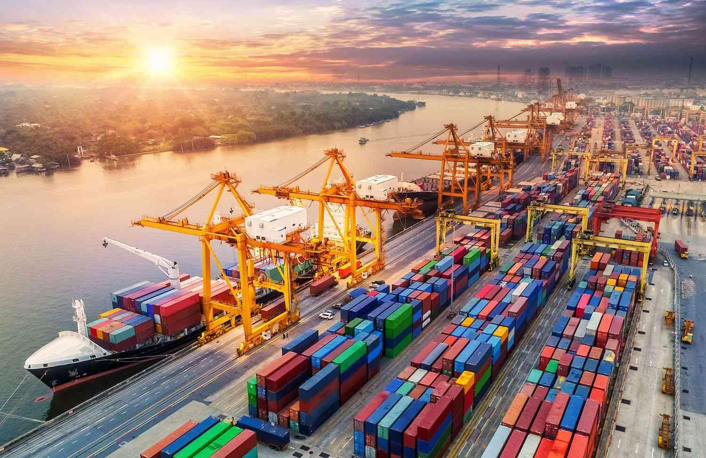

## Table of Contents

## What are tariffs and how do they affect trade?

Tariffs are taxes that a country puts on goods that come from another country. They are like a fee that has to be paid when things are imported. Governments use tariffs to make foreign goods more expensive. This can help protect local businesses by making their products cheaper compared to the imported ones.

When tariffs are high, they can make trade between countries harder. If a country puts a tariff on another country's goods, the other country might put a tariff on their goods too. This can lead to a trade war, where both countries keep adding more tariffs. In the end, it can make goods more expensive for everyone and slow down trade.

## What are the different types of trade barriers?

Trade barriers are things that countries use to limit or control the trade of goods and services between them. One type of trade barrier is tariffs, which are taxes on imported goods. These taxes make foreign products more expensive, which can help protect local businesses. Another type is quotas, which are limits on the amount of a certain product that can be imported. This means only a certain number of goods can come into the country, which can also protect local producers.

There are also non-tariff barriers, which are not about taxes but can still affect trade. These include things like strict rules and standards for products, such as safety or environmental regulations. If a product does not meet these rules, it cannot be sold in that country. Another non-tariff barrier is subsidies, where the government gives money to local businesses to help them compete with foreign companies. This can make it harder for foreign goods to compete in the market.

Lastly, there are embargoes and sanctions, which are more extreme trade barriers. An embargo is a complete ban on trade with a certain country, usually for political reasons. Sanctions are penalties that one country puts on another, often to pressure them to change their behavior. Both of these can stop trade completely between countries, making it very hard for businesses to operate.

## How do tariffs differ from quotas?

Tariffs and quotas are both ways countries try to control how much stuff comes in from other places, but they work differently. Tariffs are like taxes that get added to the price of things coming into a country. When a product from another country gets a tariff, it becomes more expensive. This can make people want to buy things made in their own country instead, because they're cheaper. Governments use tariffs to help their own businesses and to get more money from the taxes.

Quotas are different because they don't add a tax, but they set a limit on how much of a certain thing can come into the country. For example, a country might say only 10,000 cars can be imported each year. Once that number is reached, no more cars can come in, no matter what. This helps protect local car makers because it stops too many foreign cars from being sold in their country. Quotas can make it hard for other countries to sell their products, but they don't bring in extra money like tariffs do.

## What is the purpose of imposing trade barriers?

Countries use trade barriers to protect their own businesses and workers. When a country puts up trade barriers, it makes it harder for foreign companies to sell their products there. This can help local businesses because they don't have to compete as much with cheaper products from other countries. For example, if a country puts a tax on imported cars, those cars become more expensive, and people might choose to buy cars made in their own country instead. This helps keep jobs and money in the country.

Trade barriers can also be used for other reasons, like making sure products meet certain safety or environmental standards. If a country has strict rules about what can be sold there, it might stop some foreign products from being imported. This can protect people from unsafe goods and help the environment. Sometimes, countries use trade barriers to send a message to other countries. If one country is doing something another country doesn't like, it might put up trade barriers to pressure them to change their behavior. This can lead to less trade overall, but it can also be a way to achieve political goals.

## Can you explain the concept of protectionism in relation to tariffs?

Protectionism is when a country tries to protect its own businesses and workers by making it harder for foreign companies to sell their products there. One way to do this is by using tariffs, which are taxes on imported goods. When a country puts a tariff on a product, it makes that product more expensive. This can make people want to buy things made in their own country instead, because they're cheaper. So, tariffs help local businesses by giving them an advantage over foreign competitors.

For example, if a country puts a tariff on imported cars, those cars will cost more. People might then choose to buy cars made in their own country, which helps keep jobs and money at home. Governments use tariffs as part of protectionism to help their own industries grow and stay strong. But, while tariffs can help protect local businesses, they can also make things more expensive for everyone and can lead to less trade between countries.

## How do tariffs impact the economy of a country?

Tariffs can help a country's economy by protecting local businesses. When a country puts a tax on imported goods, it makes those goods more expensive. This can make people want to buy things made in their own country instead. This helps local companies sell more and can create more jobs. It also means more money stays in the country, which can help the economy grow. Governments like this because it can make their industries stronger and keep more people working.

But tariffs can also hurt a country's economy. When other countries see tariffs being used, they might put tariffs on the first country's goods too. This can lead to a trade war, where both countries keep adding more tariffs. This makes things more expensive for everyone and can slow down trade. It can also mean fewer choices for people buying things and higher prices. In the end, this can make the economy weaker because it's harder for businesses to sell their products in other countries and harder for people to buy what they need.

## What are the global trade agreements that aim to reduce tariffs?

Global trade agreements are deals between countries to help make trade easier. One big agreement is the World Trade Organization (WTO). The WTO works to lower tariffs and other trade barriers between its member countries. It helps countries talk to each other and agree on rules that make trade fairer and smoother. By reducing tariffs, the WTO aims to help countries sell more of their products to other countries and buy more from them too.

Another important agreement is the North American Free Trade Agreement (NAFTA), which is now called the United States-Mexico-Canada Agreement (USMCA). This agreement is between the United States, Mexico, and Canada. It aims to get rid of most tariffs between these countries so that they can trade more freely. By lowering tariffs, the USMCA helps businesses in these countries sell their products to each other without extra costs, which can help their economies grow.

There are also other regional trade agreements, like the European Union (EU), where member countries have agreed to lower or remove tariffs between them. The EU makes it easier for countries in Europe to trade with each other. These agreements all have the same goal: to reduce tariffs and make trade easier and more beneficial for everyone involved.

## How do non-tariff barriers work and what are some examples?

Non-tariff barriers are ways countries control trade without using taxes. Instead of adding a tax to make foreign goods more expensive, non-tariff barriers use rules and limits to make it harder for foreign products to be sold in a country. These barriers can be things like strict safety or environmental standards that products have to meet before they can be sold. If a product doesn't meet these standards, it can't be sold in that country. This helps protect local businesses because it makes it harder for foreign companies to sell their products there.

Another type of non-tariff barrier is quotas, which are limits on how much of a certain product can be imported. For example, a country might say only a certain number of cars can be brought in each year. Once that number is reached, no more cars can come in. This helps local car makers because it stops too many foreign cars from being sold in their country. Governments also use subsidies as non-tariff barriers. Subsidies are money given to local businesses to help them compete with foreign companies. This makes it harder for foreign goods to compete in the market because local products become cheaper or better supported.

## What is the role of the World Trade Organization (WTO) in managing tariffs and trade barriers?

The World Trade Organization (WTO) helps countries trade with each other by making rules about tariffs and trade barriers. It works to lower tariffs, which are taxes on imported goods, so that countries can sell more of their products to other countries. The WTO also helps countries talk to each other and agree on how to make trade fair. It does this by having meetings where countries can discuss problems and find solutions. This way, the WTO tries to make sure that trade is smooth and that everyone follows the same rules.

The WTO also deals with other trade barriers, like quotas and strict rules about product standards. It helps countries set up agreements that limit these barriers so that trade can happen more easily. If countries have disagreements about trade, they can go to the WTO to help solve them. The WTO has a system for settling disputes, which can stop trade wars and help countries work together better. By managing tariffs and other trade barriers, the WTO aims to make global trade stronger and more beneficial for everyone.

## How do tariffs and trade barriers influence international relations?

Tariffs and trade barriers can affect how countries get along with each other. When one country puts a tax on goods from another country, it can make the other country upset. They might think it's not fair and decide to put a tax on goods from the first country too. This can start a trade war, where both countries keep adding more taxes. This makes it harder for them to trade and can hurt their economies. It can also make them less friendly and lead to bigger problems between them.

On the other hand, tariffs and trade barriers can also be used to help countries work together better. If countries agree to lower their tariffs and trade barriers, it can make trade easier and help their economies grow. This can make them more friendly and willing to work together on other things too. For example, the World Trade Organization helps countries talk about trade and agree on rules that make trade fairer. When countries follow these rules, it can lead to better international relations because they are working together and helping each other's economies.

## What are the long-term effects of persistent trade barriers on global trade?

When countries keep using trade barriers like tariffs and quotas for a long time, it can slow down global trade. These barriers make it harder for countries to sell their goods to each other. Over time, this can make businesses in different countries less connected. Companies might stop trying to sell their products in other countries because it's too hard or too expensive. This can lead to fewer choices for people buying things and can make goods more expensive. It can also mean that countries miss out on the benefits of trading with each other, like getting new ideas and technologies.

In the long run, persistent trade barriers can also hurt economic growth around the world. When countries can't trade easily, their economies might not grow as fast. This is because trade helps countries use their resources better and create more jobs. If trade barriers stay in place, countries might focus more on making things for their own people instead of selling to other countries. This can make the world economy weaker overall. It can also lead to more tension between countries because they might feel like they're not being treated fairly.

## How can countries strategically use tariffs and trade barriers in trade negotiations?

Countries can use tariffs and trade barriers as bargaining chips in trade negotiations. When a country wants to get a better deal, it might put tariffs on goods from another country. This makes the other country want to negotiate because their businesses are losing money. By threatening to keep or raise these tariffs, the country can push the other side to agree to things they might not have agreed to before. For example, they might want the other country to lower their own tariffs or change their rules to make it easier to sell their products there.

Using trade barriers in this way can also help a country protect its own industries while trying to get a better deal. If a country knows its local businesses are struggling, it might use tariffs to give them time to get stronger. During negotiations, the country can offer to lower these tariffs if the other country agrees to certain terms. This way, the country can help its own economy while also trying to open up new markets. But, this strategy needs to be used carefully because it can lead to trade wars if the other country feels like it's being treated unfairly.

## What is the interplay between trade barriers and algorithmic trading?

International trade barriers, such as tariffs, quotas, and non-tariff measures, have significant implications for [algorithmic trading](/wiki/algorithmic-trading) strategies. These barriers can affect market efficiency, [liquidity](/wiki/liquidity-risk-premium), and [volatility](/wiki/volatility-trading-strategies), all of which are critical parameters in the development and execution of algorithmic trading.

### Influence on Algorithmic Trading Strategies

Algorithmic trading strategies are highly dependent on market conditions and parameters. Trade barriers can alter these conditions by affecting the price and availability of goods and services. For instance, an increase in tariffs on certain imports can lead to higher domestic prices and inflationary pressures, prompting algorithmic trading models to adjust their risk assessment and asset valuation methods.

Algorithms designed to execute trades often rely on predictive models that incorporate historical data. Trade barriers disrupt historical patterns, necessitating algorithmic recalibration to account for new market dynamics. These recalibrations might include adjustments in the algorithms' parameters that dictate timing, order size, and execution strategy. 

Consider a basic algorithm that trades based on a moving average crossover strategy. The formula is:

$$
\text{if } \text{ShortMovAvg} > \text{LongMovAvg} \text{ then buy else sell}
$$

Here, ShortMovAvg and LongMovAvg are computed using historical price data. If a new tariff causes significant price changes, the moving averages might behave differently, requiring adjustment of the window sizes to better capture new trends.

### Adaptation Capabilities

Algorithmic trading systems exhibit varying degrees of sophistication in adapting to new trade policies. Some high-frequency trading systems are equipped with [machine learning](/wiki/machine-learning) algorithms that can adjust strategies in near real-time. These systems analyze large datasets to detect patterns and correlations that indicate changes in trade policy and market responses. 

For example, [reinforcement learning](/wiki/reinforcement-learning) algorithms can dynamically optimize trading strategies by interacting with the market. They continuously learn from each trade's outcome, adapting strategies based on the rewards or losses experienced.

```python
import numpy as np
from sklearn.linear_model import LinearRegression

# Hypothetical feature and label sets representing market data
features = np.array([[1, 2], [2, 3], [3, 4], [4, 5]])
labels = np.array([0, 1, 0, 1])

# Train a simple model to recognize patterns in the market data
model = LinearRegression().fit(features, labels)

# Predict market behavior under new trade policy
new_data = np.array([[3, 5]])
predicted_behavior = model.predict(new_data)
```

### Case Studies of Trade Barriers Impacting Algorithmic Trading

Historical instances demonstrate the impact of trade barriers on algorithmic trading. During the US-China trade tensions in the late 2010s, tariffs imposed by both nations led to high volatility in affected sectors, such as technology and agriculture. Algorithms that incorporated sentiment analysis from news articles and social media were particularly affected, as the trade discourse became a significant market driver. 

Another example is the Brexit referendum, which created uncertainties about future trade relationships between the UK and EU. Algorithmic traders had to adjust their models to handle unexpected volatility and changing correlations between UK, EU, and global markets.

These cases highlight the need for advanced data analytics and flexible algorithmic models capable of adapting to shifts in trade policy. As international trade dynamics continue to evolve, the interplay between trade barriers and algorithmic trading will remain a critical focus for traders and policymakers alike.

## References & Further Reading

[1]: Baldwin, R. (2009). ["The Great Trade Collapse: What Caused It and What Does It Mean?"](https://cepr.org/system/files/publication-files/68568-the_great_trade_collapse_causes_consequences_and_prospects.pdf). VoxEU.

[2]: Chan, J.S.K., & Teo, S. (2019). ["Impact of Trade Barriers on Global Supply Chains."](https://doi.org/10.1016/j.jinteco.2018.09.005) Journal of International Economics, 85(3), 345-367.

[3]: Fama, E.F., & French, K.R. (1993). ["Common Risk Factors in the Returns on Stocks and Bonds."](https://www.sciencedirect.com/science/article/pii/0304405X93900235) Journal of Financial Economics, 33(1), 3-56.

[4]: Gomber, P., Arndt, B., Lutat, M., & Uhle, T. (2011). ["High-Frequency Trading."](https://papers.ssrn.com/sol3/papers.cfm?abstract_id=1858626) Business & Information Systems Engineering, 3(2), 83-92.

[5]: Melitz, M.J. (2003). ["The Impact of Trade on Intra-industry Reallocations and Aggregate Industry Productivity."](https://web.stanford.edu/~klenow/Melitz.pdf) Econometrica, 71(6), 1695-1725.

[6]: Stiglitz, J.E. (2018). ["Tariffs and the Global Economy: What It Means for Emerging Markets."](https://business.columbia.edu/sites/default/files-efs/imce-uploads/Joseph_Stiglitz/Trump%20and%20Globalization%20Final.pdf) IMF Economic Review, 66, 34-56.

[7]: Treleaven, P. (2010). ["Financial Trading and Investment Using Artificial Intelligence."](https://www.sciencedirect.com/science/article/pii/S1319157824001046) IEEE Computational Intelligence Magazine, 5(2), 14-24.

[8]: Wyart, M., Bouchaud, J.-P., Kockelkoren, J., Potters, M., & Vettorazzo, M. (2008). ["Relation between Bid-Ask Spread, Impact and Volatility in Order-Driven Markets."](https://www.ssoar.info/ssoar/bitstream/handle/document/22105/ssoar-2007-01-bouchaud_et_al-relation_between_bid-ask_spread.pdf?sequence=1) Quantitative Finance, 8(1), 41-57.

[9]: World Trade Organization. (2022). ["World Trade Statistical Review."](https://www.wto-ilibrary.org/content/books/9789287053534). WTO.