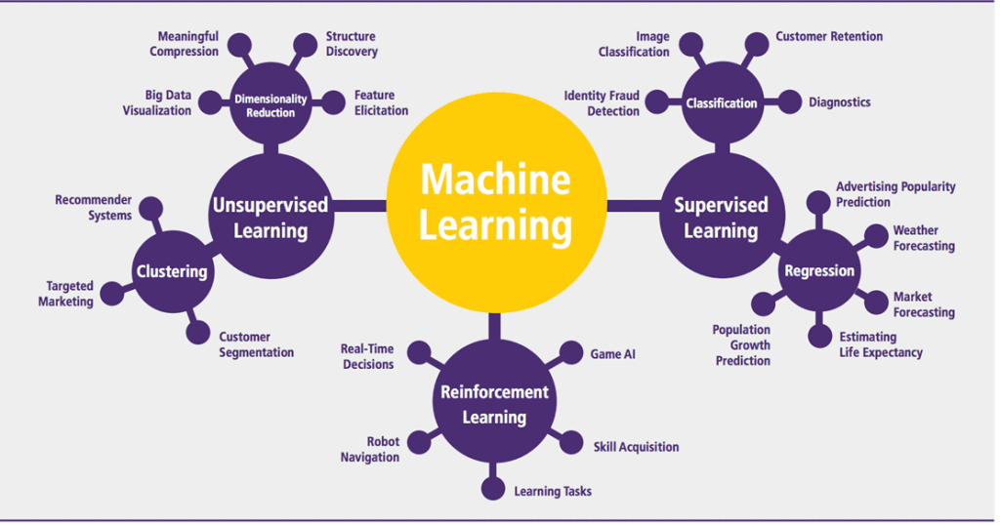

## Table of Contents

## What is a task in the context of machine learning?

In machine learning, a task is a specific problem or goal that you want a machine learning model to solve or achieve. This could be something like predicting future sales, recognizing faces in photos, or translating text from one language to another. Think of it as the job you are asking the computer to do using data and algorithms.

Tasks in machine learning can be categorized into different types, such as classification, regression, and clustering. For example, in a classification task, the model learns to assign labels to new data based on patterns it finds in the training data. If you're trying to predict whether an email is spam or not, that's a classification task. On the other hand, a regression task involves predicting a continuous value, like guessing the price of a house based on its features.

Understanding the type of task you're working on helps in choosing the right algorithms and methods to train your model. It's like knowing whether you need a hammer or a screwdriver before you start fixing something. By clearly defining the task, you can better prepare your data, select appropriate models, and evaluate their performance to achieve the best results.

## How do tasks differ from algorithms in machine learning?

In [machine learning](/wiki/machine-learning), a task is what you want the computer to do, like predicting a value or classifying an item. It's the goal or problem you're trying to solve. For example, if you want to guess the price of a house based on its size and location, that's a task. The task doesn't tell you how to do it; it just tells you what you want to achieve.

An algorithm, on the other hand, is the method or set of rules you use to solve the task. It's like a recipe that tells the computer step-by-step how to learn from data and make predictions or decisions. For example, to predict house prices, you might use a linear regression algorithm. The algorithm is the "how" part, while the task is the "what" part. So, the task defines the problem, and the algorithm provides the solution approach.

To sum it up, tasks and algorithms are closely related but different. The task is the specific problem you want to solve, like predicting if it will rain tomorrow. The algorithm is the tool you use to solve that problem, like using a decision tree to make the prediction. You choose the algorithm based on the task, and together they help you achieve your machine learning goals.

## Can you explain the difference between supervised and unsupervised learning tasks?

Supervised learning tasks are like having a teacher who shows you examples and tells you the right answers. In these tasks, you give the computer a bunch of data with labels, like pictures of cats and dogs labeled as "cat" or "dog." The computer learns from these examples and tries to guess the right label for new, unseen data. For example, if you want to predict house prices, you might use supervised learning by giving the computer data on past house sales with their prices. The goal is to find a pattern that helps predict the price of a new house. Common algorithms for supervised learning include linear regression, where you might use a formula like $$y = mx + b$$ to predict a continuous value, and decision trees for classification tasks.

Unsupervised learning tasks are different because there's no teacher telling the computer the right answers. Instead, the computer looks at the data and tries to find patterns or groups all by itself. For example, if you have a bunch of customer data, the computer might try to find groups of customers who are similar to each other, without you telling it what those groups should be. This is called clustering. Another type of unsupervised learning is dimensionality reduction, where the computer tries to simplify the data by finding the most important features. Unsupervised learning is useful when you want to explore your data and find hidden structures without having specific labels to guide the process.

Both supervised and unsupervised learning are important in machine learning, but they serve different purposes. Supervised learning is great when you know what you're looking for and have labeled data to train on. Unsupervised learning is useful when you want to discover new patterns or relationships in your data without any preconceived notions about what those patterns might be.

## What are some common types of tasks in machine learning?

In machine learning, there are several common types of tasks that people use to solve problems. One type is classification, where the goal is to put things into different groups. For example, if you want to tell if an email is spam or not, that's a classification task. The computer looks at the email and decides which group it belongs to. Another type is regression, where you predict a number instead of a group. If you're trying to guess the price of a house based on its size and location, that's a regression task. You can use a simple formula like $$y = mx + b$$ to make the prediction.

Another common task is clustering, where the computer finds groups in data without being told what the groups should be. Imagine you have a bunch of customer data and want to see if there are different types of customers. The computer can look at the data and find these groups all by itself. Dimensionality reduction is another task where the computer tries to simplify the data by finding the most important parts. This can help make the data easier to understand or use. Lastly, there's [reinforcement learning](/wiki/reinforcement-learning), where the computer learns by trying things and getting feedback. It's like learning to play a game by trial and error, getting better over time as it figures out what works best.

## How do you choose the right task for a specific machine learning problem?

Choosing the right task for a specific machine learning problem starts with understanding what you want to achieve. If you're trying to sort things into groups, like deciding if an email is spam or not, then you need a classification task. For example, if you want to predict whether it will rain tomorrow based on weather data, that's also a classification task because you're deciding between "rain" or "no rain." On the other hand, if you're trying to predict a number, like guessing the price of a house based on its size and location, then you need a regression task. You can use a simple formula like $$y = mx + b$$ to make the prediction. The key is to figure out if your problem involves labeling things, predicting numbers, or finding patterns without labels.

Sometimes, you might not know exactly what you're looking for in your data. In those cases, you might choose an unsupervised learning task like clustering or dimensionality reduction. Clustering helps you find groups in your data without telling the computer what those groups should be. For example, if you have customer data and want to see if there are different types of customers, clustering can help you find these groups. Dimensionality reduction is useful when you want to simplify your data by finding the most important parts, making it easier to understand or use. By clearly defining your goal and understanding your data, you can pick the right task to solve your machine learning problem effectively.

## What is the role of a task in the machine learning workflow?

The role of a task in the machine learning workflow is to define the specific problem you want to solve. It's like setting a goal for what you want the computer to do, whether it's predicting a value, sorting things into groups, or finding patterns in data. For example, if you want to guess the price of a house based on its size and location, that's a regression task. You can use a simple formula like $$y = mx + b$$ to make the prediction. By clearly defining the task, you guide the entire machine learning process, from choosing the right data to selecting the appropriate algorithms.

Once the task is defined, it helps you pick the right tools and methods to achieve your goal. If your task is classification, like deciding if an email is spam or not, you'll use algorithms designed for that purpose. If it's an unsupervised task like clustering, where you want to find groups in customer data without knowing what those groups should be, you'll choose different algorithms. The task acts as a roadmap, ensuring that all steps in the machine learning workflow, from data preparation to model evaluation, are aligned with your ultimate goal. This makes the whole process more efficient and increases your chances of success.

## How does the complexity of a task affect the choice of model?

The complexity of a task plays a big role in choosing the right model for your machine learning project. If your task is simple, like predicting a single number or sorting things into two groups, you might be able to use a simple model. For example, if you want to guess the price of a house based on its size, a simple linear regression model like $$y = mx + b$$ could work well. Simple models are easier to understand and quicker to train, but they might not capture all the details in more complex data.

On the other hand, if your task is more complex, like predicting many different outcomes or working with lots of data, you'll need a more complex model. For example, if you're trying to recognize different types of animals in pictures, a [deep learning](/wiki/deep-learning) model like a [neural network](/wiki/neural-network) might be better. These models can learn from lots of data and find patterns that simpler models might miss. But, they can be harder to understand and take more time to train. So, the complexity of your task helps you decide whether to use a simple or a more advanced model to get the best results.

## What are multi-task learning and its benefits?

Multi-task learning is when you train a machine learning model to do more than one thing at the same time. Instead of training separate models for each task, you use one model to learn from all the tasks together. For example, if you want to predict the price of a house and also guess how many bedrooms it has, you can use multi-task learning to do both at once. This can be done by setting up the model to have different outputs for each task, like using a formula like $$y_1 = mx_1 + b$$ for the price and $$y_2 = mx_2 + b$$ for the number of bedrooms.

The main benefit of multi-task learning is that it can make your model better at each task. When the model learns from multiple tasks, it can find patterns that are useful for all of them. This can help the model perform better than if it was trained on just one task. Another benefit is that it can save time and resources. Instead of training many different models, you only need to train one, which can be faster and use less computer power. So, multi-task learning can help you get better results and be more efficient at the same time.

## How do you evaluate the performance of a machine learning task?

To evaluate the performance of a machine learning task, you use different measures depending on the type of task. For example, if you're doing a classification task like deciding if an email is spam or not, you might look at accuracy, which is the percentage of correct predictions. But accuracy isn't always the best measure, especially if your data is unbalanced. So, you might also use precision and recall. Precision tells you how many of the emails you labeled as spam were actually spam, while recall tells you how many of the actual spam emails you correctly identified as spam. For regression tasks, like predicting the price of a house with a formula like $$y = mx + b$$, you might use mean squared error (MSE) or mean absolute error (MAE) to see how close your predictions are to the real values.

To make sure your evaluation is fair and reliable, you split your data into a training set and a test set. You use the training set to teach your model and the test set to see how well it performs on new data. This helps you avoid overfitting, where your model does well on the training data but not on new data. Sometimes, you might also use cross-validation, where you split your data into several parts and train and test your model multiple times to get a more accurate measure of performance. By using these methods, you can get a good idea of how well your model will work in the real world and make any needed improvements.

## What are some advanced techniques for handling complex tasks in machine learning?

When dealing with complex tasks in machine learning, one advanced technique is to use ensemble methods. This involves combining multiple models to improve performance. Imagine you have several friends who are good at guessing the price of a house based on its size and location, but they each use a different method. If you take their guesses and combine them, you might get a better prediction than if you relied on just one friend. This is similar to how ensemble methods work. By using techniques like bagging, boosting, or stacking, you can create a more robust model that's better at handling complex tasks. For example, in bagging, you train several models on different subsets of your data and then average their predictions. In boosting, you train models one after the other, with each new model trying to fix the mistakes of the previous one.

Another advanced technique is to use deep learning, which involves using neural networks with many layers. Deep learning is great for tasks like recognizing objects in pictures or understanding human speech. These models can learn from lots of data and find patterns that simpler models might miss. For example, if you want to guess the price of a house based on its size, location, and many other factors, a deep learning model can handle all these inputs and find complex relationships between them. You can use a simple formula like $$y = f(x_1, x_2, ..., x_n)$$ to represent how the model makes predictions, where $$f$$ is a complex function learned by the neural network. By using these advanced techniques, you can tackle complex tasks more effectively and get better results.

## How do transfer learning and task-specific fine-tuning work in machine learning?

Transfer learning is like using what you already know to learn something new. Imagine you've learned to play the guitar and now you want to learn the ukulele. You can use what you know about the guitar to help you learn the ukulele faster. In machine learning, you start with a model that's already been trained on a big dataset, like recognizing objects in pictures. Then, you take that model and use it to help you learn a new task, like recognizing specific types of animals. This can save time and make your new model better because it's already learned some useful things from the first task.

Task-specific fine-tuning is the next step after transfer learning. It's like adjusting the ukulele after you've used your guitar skills to start playing it. You take the model that you've used for transfer learning and make small changes to it to make it better at your specific task. For example, if you're trying to guess the price of a house based on its size and location, you might use a formula like $$y = mx + b$$ to start, but then fine-tune it to fit your specific data better. This helps the model perform even better on your new task by focusing on the details that matter most for what you're trying to do.

## What are the current research trends in task-oriented machine learning?

Current research in task-oriented machine learning is focusing a lot on making models better at doing many things at once. This is called multi-task learning. Imagine you're trying to guess the price of a house and also figure out how many bedrooms it has. Instead of training two separate models, you train one model to do both jobs at the same time. This can help the model learn useful patterns from both tasks and perform better overall. Researchers are looking into how to design these models to share information between tasks in smart ways, so they can improve each other's performance. They're also exploring new ways to combine different types of data, like text and images, to make the models even more powerful.

Another big trend is transfer learning and fine-tuning. Transfer learning is like using what you already know to learn something new. For example, if you've trained a model to recognize objects in pictures, you can use that same model to help you recognize specific types of animals. This can save a lot of time and make your new model better because it's already learned some useful things. After transfer learning, researchers often use task-specific fine-tuning to make the model even better at the new task. This is like adjusting the model to fit the new task perfectly. For instance, if you're trying to guess the price of a house based on its size and location, you might start with a simple formula like $$y = mx + b$$ and then fine-tune it to fit your specific data better. By doing this, the model can focus on the details that matter most for what you're trying to do.

## References & Further Reading

[1]: Alpaydin, E. (2020). ["Introduction to Machine Learning, Fourth Edition."](https://mitpress.mit.edu/9780262043793/introduction-to-machine-learning/) MIT Press.

[2]: Bishop, C. M. (2006). ["Pattern Recognition and Machine Learning."](https://www.cs.uoi.gr/~arly/courses/ml/tmp/Bishop_book.pdf) Springer.

[3]: Goodfellow, I., Bengio, Y., & Courville, A. (2016). ["Deep Learning."](https://www.deeplearningbook.org/) MIT Press.

[4]: Murphy, K. P. (2012). ["Machine Learning: A Probabilistic Perspective."](https://www.cs.ubc.ca/~murphyk/MLbook/pml-toc-1may12.pdf) MIT Press.

[5]: Aggarwal, C. C. (2015). ["Data Mining: The Textbook."](https://link.springer.com/book/10.1007/978-3-319-14142-8) Springer.

[6]: Mitchell, T. M. (1997). ["Machine Learning."](https://www.cs.cmu.edu/~tom/mlbook.html) McGraw-Hill.

[7]: Hastie, T., Tibshirani, R., & Friedman, J. H. (2009). ["The Elements of Statistical Learning: Data Mining, Inference, and Prediction."](https://link.springer.com/book/10.1007/978-0-387-84858-7) Springer.