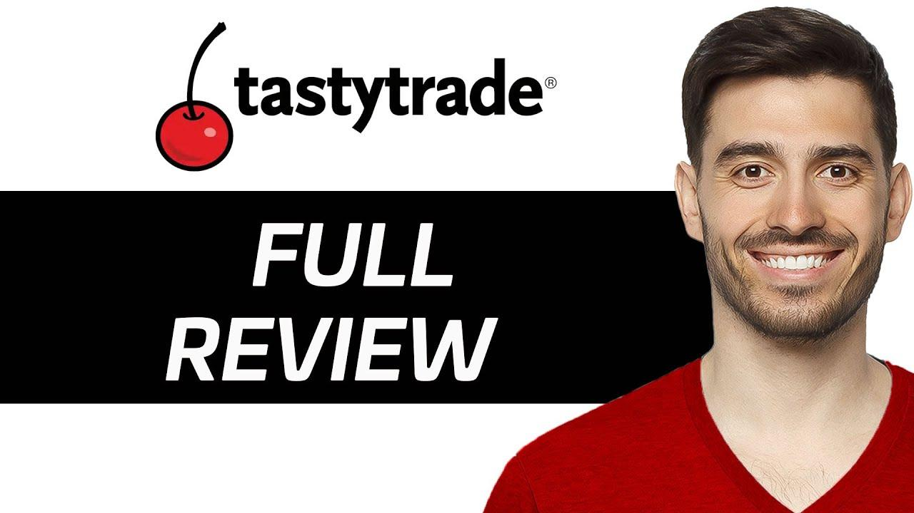

## Table of Contents

## What is Tastytrade and what services does it offer?

Tastytrade is a financial network and online brokerage that helps people learn about and trade in the stock market. It was started by people who wanted to make trading easier and more fun for everyone. They have a lot of videos and shows that teach you how to trade, and they also let you actually buy and sell stocks and options on their website.

The services at Tastytrade include a trading platform where you can trade stocks, options, and futures. They also have a lot of educational content, like videos and live shows, that explain how trading works. This can help you learn and get better at trading. Plus, they have tools and calculators to help you make smart choices about what to buy and sell.

## How does Tastytrade's platform cater to beginners in trading?

Tastytrade's platform is really good for people who are just starting to trade. They have a lot of videos and shows that explain trading in a simple way. These videos cover everything from the basics of what stocks and options are, to more advanced strategies. This means you can learn at your own pace and start trading when you feel ready. They also have a practice account where you can trade with fake money, so you can try things out without risking your own cash.

Another way Tastytrade helps beginners is by having tools that make trading easier. They have calculators that help you figure out how much money you might make or lose on a trade. This can be really helpful when you're new and trying to understand how everything works. Plus, their trading platform is designed to be easy to use, so you don't need to be a computer expert to start trading. All these things together make Tastytrade a great place for beginners to start their trading journey.

## What are the fee structures and account minimums for Tastytrade in 2024?

In 2024, Tastytrade has a simple fee structure that makes it easy for people to start trading. They don't charge any fees for opening an account, and there's no minimum amount of money you need to put in to get started. This means you can begin trading with whatever amount you feel comfortable with. For trading stocks, Tastytrade charges a flat fee of $1 per trade, no matter how many shares you buy or sell. This can be a good deal if you're trading a lot of shares.

When it comes to options trading, Tastytrade charges a fee of $1 per contract, but they cap the total fee at $10 per leg of the trade. This means if you're trading a lot of options at once, you won't pay more than $10 for that part of the trade. For futures trading, the fee is $1.25 per contract. These fees are pretty competitive and can help you keep more of your money while you're learning to trade.

## Can you explain the unique features of Tastytrade that set it apart from other trading platforms?

Tastytrade stands out from other trading platforms because it focuses a lot on teaching people how to trade. They have a whole network of videos and live shows that explain trading in a fun and easy way. This is different from many other platforms that might not have as much educational content. Tastytrade's videos cover everything from the basics to advanced strategies, so whether you're just starting or you've been trading for a while, you can learn something new. They also have a practice account where you can trade with fake money, which is a great way to try things out without risking your own cash.

Another unique feature of Tastytrade is their fee structure. They keep their fees low and simple, which can save you money compared to other platforms. For example, they charge just $1 per stock trade, no matter how many shares you're buying or selling. For options, they charge $1 per contract but cap the total fee at $10 per leg of the trade. This can be a big deal if you're trading a lot of options at once. Plus, Tastytrade doesn't have any account minimums, so you can start trading with whatever amount you feel comfortable with. These features make Tastytrade a great choice for people who want to learn and save money while trading.

## How does Tastytrade's educational content help users improve their trading skills?

Tastytrade's educational content is really helpful for people who want to get better at trading. They have a lot of videos and live shows that explain everything in a simple way. Whether you're just starting out or you've been trading for a while, you can find something that helps you learn. They cover all sorts of topics, from the basics of what stocks and options are, to more advanced strategies. This means you can keep learning and improving your skills over time.

Another great thing about Tastytrade's educational content is that it's fun and easy to understand. They use real examples and show you how to apply what you're learning to actual trades. This makes it easier to see how the lessons work in the real world. Plus, they have a practice account where you can try out what you've learned without risking your own money. This hands-on approach helps you get better at trading by letting you make mistakes and learn from them in a safe way.

## What types of assets can be traded on Tastytrade and how has the selection changed in 2024?

Tastytrade lets you trade different types of assets like stocks, options, and futures. Stocks are pieces of a company that you can buy and sell. Options are contracts that give you the right to buy or sell stocks at a certain price. Futures are agreements to buy or sell something at a future date. This variety means you can choose what fits your trading style and goals.

In 2024, Tastytrade has made some changes to what you can trade. They've added more options and futures to their list, so you have more choices now. This means you can find more ways to trade and maybe find new opportunities that weren't there before. But they still keep the same focus on stocks, options, and futures, so if you liked trading those before, you can keep doing it.

## How does Tastytrade's mobile app enhance the trading experience for users on the go?

Tastytrade's mobile app makes it easy for you to trade even when you're not at home. You can use your phone to buy and sell stocks, options, and futures from anywhere. The app is designed to be simple and easy to use, so you don't need to be a tech expert to figure it out. You can quickly check your account, see how your trades are doing, and make new trades all from your phone.

The app also lets you watch Tastytrade's educational videos and live shows. This means you can keep learning about trading even when you're on the go. If you have a question or want to try a new strategy, you can watch a video right on your phone. Plus, the app has all the same tools and calculators as the website, so you can make smart trading choices no matter where you are.

## What are the advanced trading tools available on Tastytrade for experienced traders?

Tastytrade has a lot of advanced tools that can help experienced traders do better. One of the main tools is the options chain, which shows you all the options available for a stock. This helps you see all your choices and pick the best one for your strategy. They also have a risk profile tool that shows you how much money you could make or lose on a trade. This is really helpful for planning and making smart choices. Plus, Tastytrade has a feature called "Analyze" that lets you look at different trading scenarios and see what might happen. This can help you test out new ideas without risking your money.

Another useful tool is the "Trade Hacker" which lets you see how different options strategies would work in real-time. This can help you find the best way to trade based on what's happening in the market right now. Tastytrade also has a feature called "Probability of Profit" that shows you how likely it is that a trade will make money. This can help you decide if a trade is worth doing. All these tools together make Tastytrade a great choice for experienced traders who want to use advanced strategies and make smart trading decisions.

## How does Tastytrade handle customer support and what are the available channels in 2024?

Tastytrade makes sure you can get help when you need it. In 2024, they have different ways for you to reach out to them. You can call them on the phone, send an email, or use their live chat on their website. They also have a help center with lots of articles and videos that can answer your questions. This means you can get help quickly and easily, no matter what time it is or what you need help with.

Their customer support team is really good at helping you. They know a lot about trading and can answer your questions in a way that's easy to understand. If you're having trouble with the platform or need advice on a trade, they're there to help. Plus, they're friendly and want to make sure you have a good experience with Tastytrade.

## What security measures does Tastytrade implement to protect user data and funds?

Tastytrade takes security very seriously to keep your data and money safe. They use strong encryption to protect your information when you're using their website or app. This means your personal details and trading data are kept private and secure. They also have two-[factor](/wiki/factor-investing) authentication, which adds an extra step to make sure it's really you logging in. This helps keep your account safe even if someone else knows your password.

Another way Tastytrade protects your funds is by keeping them in separate accounts from their own money. This is called segregation of funds, and it means your money is safe even if something goes wrong with Tastytrade. They also follow all the rules set by financial regulators to make sure they're doing everything right. Plus, they have systems in place to watch for any strange activity on your account, so they can stop any problems before they get too big.

## How does Tastytrade's performance in terms of trade execution and platform stability compare to its competitors?

Tastytrade is known for being fast and reliable when it comes to making trades. They use technology that helps them execute trades quickly, which is important if you want to buy or sell at the right time. Compared to some other platforms, Tastytrade's speed can be a big advantage. They also have a stable platform that doesn't crash often, so you can trade without worrying about technical problems. This makes it easier for you to focus on your trading strategies instead of dealing with glitches.

When you look at other trading platforms, you might find that some are faster or more stable than others. For example, some big names like Robinhood or E*TRADE also have good trade execution and platform stability. But Tastytrade holds its own by offering competitive speeds and a reliable platform. Plus, their focus on education and user-friendly tools can make the trading experience smoother and more enjoyable, even if you're new to trading.

## What are the future plans and potential developments for Tastytrade beyond 2024?

Tastytrade is always looking to make their platform better and help more people learn about trading. They plan to keep adding new educational videos and live shows to teach people more about trading. They also want to make their trading tools even better, so you can make smarter choices about what to buy and sell. They might add new types of assets you can trade, like cryptocurrencies, to give you more options.

Another thing Tastytrade is thinking about is making their mobile app even easier to use. They want to make sure you can trade and learn from anywhere, no matter what device you're using. They also plan to keep their fees low and simple, so you can save money while you're trading. All these plans are about helping you get better at trading and making the whole experience more fun and easy.

## References & Further Reading

[1]: Bergstra, J., Bardenet, R., Bengio, Y., & Kégl, B. (2011). ["Algorithms for Hyper-Parameter Optimization."](https://papers.nips.cc/paper/4443-algorithms-for-hyper-parameter-optimization) Advances in Neural Information Processing Systems 24.

[2]: ["Advances in Financial Machine Learning"](https://www.amazon.com/Advances-Financial-Machine-Learning-Marcos/dp/1119482089) by Marcos Lopez de Prado

[3]: ["Evidence-Based Technical Analysis: Applying the Scientific Method and Statistical Inference to Trading Signals"](https://www.amazon.com/Evidence-Based-Technical-Analysis-Scientific-Statistical/dp/0470008741) by David Aronson

[4]: ["Machine Learning for Algorithmic Trading"](https://github.com/stefan-jansen/machine-learning-for-trading) by Stefan Jansen

[5]: ["Quantitative Trading: How to Build Your Own Algorithmic Trading Business"](https://www.amazon.com/Quantitative-Trading-Build-Algorithmic-Business/dp/1119800064) by Ernest P. Chan