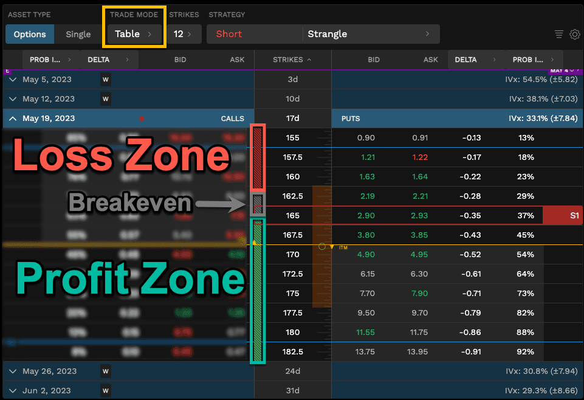

In 2024, the investment landscape stands on the pillars of technological innovation, increased accessibility, and diversification. The evolution of investment platforms continues to democratize finance, allowing individuals at all levels to participate in a market once dominated by large institutional players. These platforms have transformed investment practices, offering tools and resources that were previously inaccessible to casual traders.

Investment platforms play a crucial role by providing essential services such as trading securities, commodities, and derivatives. They also offer analytic tools and educational resources to aid decision-making processes. In this competitive and rapidly evolving environment, being conversant with the most relevant platforms is vital for any investor aiming to maximize their returns.



Tastytrade emerges as a significant player among these platforms, recognized for its user-centric design and innovative features. Known for fostering active trading through a comprehensive suite of tools, tastytrade is particularly noted for its support of options trading and its commitment to investor education. These aspects make it a preferred choice for both new and seasoned investors looking to navigate complex investment strategies.

The relevance of reviewing tastytrade's features in 2024 cannot be overstated, especially with the growing importance of algorithmic trading—commonly known as algo trading. Algo trading uses mathematical models and computational algorithms to execute trades at speeds and frequencies that human traders cannot achieve. Understanding how platforms like tastytrade facilitate and enhance this form of trading is essential for potential users who want to leverage technology to optimize their investment strategies.

This article will explore tastytrade's offerings, emphasizing its capabilities and innovations in 2024, particularly in algorithmic trading. Given the platform's prominence and the increasing sophistication of trading technologies, it is crucial for investors to be well-informed about its features and what it offers to optimize trading outcomes.

## Table of Contents

## What is tastytrade?

Tastytrade is an innovative financial services platform that has garnered attention for its unique approach to trading and investments. Established in 2011 by Tom Sosnoff, a familiar name from the financial industry known for his background in creating thinkorswim, tastytrade has quickly become a notable entity among trading platforms. The company was founded with the intent to redefine the investment landscape by offering more accessible, educational, and engaging trading experiences.

The core philosophy of tastytrade emphasizes empowering traders through knowledge and proficiency in trading strategies. This education-focused approach is evident in the platform's extensive library of educational content that aims to help investors make informed decisions. Tastytrade prioritizes transparency and a deeper understanding of market mechanics, setting it apart from many traditional investment platforms that often focus more narrowly on facilitating trades alone.

Regarding the types of investments available, tastytrade offers a diverse array of financial instruments. Users have access to stocks, options, futures, and cryptocurrencies, reflecting the platform's commitment to catering to various trading preferences and risk appetites. This variety ensures that both novice and experienced traders can find suitable investment opportunities aligned with their strategic goals.

Over the years, tastytrade has received several recognitions and accolades which testify to its impact and reputation in the trading community. The platform has been praised for its user-friendly interface, quality of educational resources, and commitment to innovation in finance. These honors have solidified its position as a trusted provider of trading solutions.

As of 2024, tastytrade boasts a substantial and growing user base, reflecting its widespread appeal and effectiveness in meeting the needs of traders. The platform has witnessed consistent growth in active users, attributed to its strategic enhancements and commitment to user satisfaction. This growth trend underscores the platform's relevance and capability in adapting to evolving market needs.

Overall, tastytrade stands out as a platform that not only offers a wide range of trading instruments but also prioritizes education and strategic trading, [earning](/wiki/earning-announcement) it a strong reputation and a robust user community.

## Key Features of tastytrade in 2024

As of 2024, tastytrade has made significant developments in its platform to enhance user experience and expand its trading capabilities. The platform is designed to cater to a wide range of investors, from novices to seasoned traders.

### Platform Interface and User Experience Enhancements
Tastytrade prioritizes a seamless, intuitive user interface, making it easily accessible for traders of all levels. In 2024, the platform introduced a revamped dashboard that streamlines the trading workflow, providing users with a comprehensive view of their portfolios and market trends. Enhanced navigation features allow for quicker access to essential tools, and an adaptive design ensures optimal functionality across both desktop and mobile devices.

### Financial Instruments
Tastytrade continues to offer a variety of financial instruments, including stocks, options, futures, and ETFs. In 2024, the platform expanded its offerings to include a broader range of crypto assets and international equities, allowing users to diversify their investment portfolios further. This expansion reflects tastytrade's commitment to keeping pace with evolving market demands.

### Investment Tools and Resources
The platform is well-equipped with advanced investment tools and resources. In 2024, tastytrade introduced a robust set of analytical tools that include real-time market data, historical data analysis, and customizable technical indicators. These tools assist traders in making informed decisions by providing insights into market dynamics and potential investment opportunities. The integration of educational materials, such as webinars and tutorials, further supports users in developing their trading strategies and understanding complex market structures.

### Recent Updates and Changes
Significant updates in 2024 include improved [algorithmic trading](/wiki/algorithmic-trading) infrastructure, leveraging [machine learning](/wiki/machine-learning) algorithms to analyze vast datasets efficiently. This update aims at enhancing the speed and accuracy of trade executions. Additionally, tastytrade has rolled out security enhancements, incorporating blockchain technology to ensure data integrity and privacy. 

### Comparative Analysis with Other Platforms
When compared to other trading platforms, tastytrade stands out for its user-centered design and diverse investment options. For instance, its educational resources and simplified interface might appeal more to beginners compared to competitors like [Interactive Brokers](/wiki/interactive-brokers-api), which may cater more to advanced traders due to their complex and feature-rich platforms. Furthermore, the cost-efficiency of tastytrade is notable, offering competitive pricing structures that appeal to cost-conscious investors.

In summary, the enhancements and features introduced by tastytrade in 2024 underscore its commitment to providing an inclusive and technologically advanced trading environment. The platform's emphasis on user experience, coupled with its wide array of investment tools, establishes it as a significant player within the highly competitive investment platform market.

## Algo Trading on tastytrade

Algorithmic trading, often referred to as algo trading, involves using computer programs to execute trades based on pre-defined criteria and algorithms. It allows for the fast and efficient execution of orders, minimizing human intervention and emotional biases. In the rapidly evolving financial markets of 2024, algorithmic trading plays a vital role by offering scalability, precision, and the ability to exploit market opportunities too fast for human traders.

### Facilitation of Algorithmic Trading by tastytrade

Tastytrade facilitates algorithmic trading by offering a suite of tools tailored to meet the needs of both novice and advanced traders. The platform's integration with popular programming languages such as Python empowers users to develop, backtest, and deploy custom trading algorithms efficiently. By providing a comprehensive set of application programming interfaces (APIs), tastytrade enables seamless data access and trade execution directly from algorithmic scripts.

### Tools and Technologies for Algo Trading

Tastytrade's tools for algo trading include robust APIs, comprehensive historical data, and advanced analytic capabilities. The APIs allow for secure and quick access to market data, account information, and order execution. Tastytrade also offers a powerful scripting environment where traders can test strategies under simulated conditions before going live, reducing the risk of unexpected outcomes.

Additionally, the platform supports integration with popular Python libraries such as NumPy, pandas, and Matplotlib, which are instrumental in data analysis, manipulation, and visualization. These libraries assist in building sophisticated trading models and strategies.

```python
import numpy as np
import pandas as pd
import matplotlib.pyplot as plt

# Sample code to compute moving average and plot it
def moving_average(data, window_size):
    return data.rolling(window=window_size).mean()

# Example: Calculate 20-day moving average of stock prices
stock_data = pd.Series([/* stock prices here */])
ma_20 = moving_average(stock_data, 20)

plt.plot(stock_data, label='Stock Price')
plt.plot(ma_20, label='20-Day MA', linestyle='--')
plt.legend()
plt.show()
```

### Success Stories on the Platform

Many users on tastytrade have achieved success through algorithmic trading. A notable example includes a trader who developed a [volatility](/wiki/volatility-trading-strategies) [arbitrage](/wiki/arbitrage) strategy leveraging real-time data streaming via tastytrade's APIs. By programmatically identifying discrepancies in option pricing, the trader was able to consistently capture arbitrage opportunities, leading to significant returns.

Another success story is a user who employed machine learning algorithms to predict price movements and executed trades automatically. By leveraging tastytrade's data and analytic tools, the trader optimized their model's predictive accuracy, resulting in improved trade performance and profitability.

### Comparative Analysis with Other Platforms

When comparing tastytrade to other algo trading platforms, several factors stand out. Unlike competitors who might restrict the programmatic customization of strategies, tastytrade offers a high degree of flexibility through open APIs and extensive data access. Platforms such as Interactive Brokers and E*TRADE also provide algo trading capabilities, but tastytrade distinguishes itself with its user-friendly interface, cost-effective trading environment, and dedicated support for algorithmic traders.

Furthermore, tastytrade is committed to continuous innovation, regularly updating its platform with new features and enhancements to support the ever-evolving needs of algo traders. Its focus on community and educational resources further supports traders in maximizing their potential in algorithmic trading.

In conclusion, through its sophisticated tools and technologies, along with a supportive trading environment, tastytrade effectively provides robust opportunities for algorithmic traders in 2024.

## Benefits of Using tastytrade for Algo Trading

Tastytrade's algorithmic trading offerings provide significant advantages to both novice and experienced traders looking to enhance their trading strategies. Key among these benefits is the platform's robust customization options for algorithmic strategies. Traders can tailor strategies to meet their specific investment goals and risk tolerance levels, enabling them to optimize performance across diverse market conditions. This flexibility allows users to adjust parameters, test different models, and refine approaches without significant limitations.

Cost-effectiveness and efficiency are also paramount benefits of utilizing tastytrade for algo trading. The platform offers competitive pricing structures, which minimize the cost of executing high-frequency trades. Additionally, the system's advanced architecture ensures rapid trade execution, reducing latency and slippage—factors that are crucial when implementing algorithmic strategies that rely on speed. This efficiency is supported by state-of-the-art infrastructure that processes substantial volumes of market data in real-time, enabling users to capitalize on fleeting market opportunities.

Furthermore, tastytrade supports a vibrant community and provides comprehensive support systems for algo traders. A wealth of educational resources, webinars, and community discussions is available, empowering users to deepen their understanding of algorithmic trading. This supportive ecosystem facilitates knowledge sharing and collaboration, driving innovation and enhancing trading strategies. The platform also offers robust customer support services, ensuring that traders receive timely assistance with any technical or strategic queries.

The impact on trading results and potential profitability when using tastytrade for algorithmic trading can be profound. By leveraging advanced algorithms and real-time data analytics, traders are better equipped to identify profitable opportunities and manage risk more effectively. This can lead to improved trading outcomes, as algorithmic strategies systematically execute trades based on predefined criteria, eliminating emotional biases from decision-making. Consequently, traders can achieve more consistent returns while adhering to disciplined trading practices.

In summary, tastytrade's algorithmic trading offerings provide a comprehensive suite of benefits including customization, cost-effectiveness, a supportive community, and enhanced profitability potential, making it a compelling choice for traders seeking to incorporate algorithmic strategies into their investment approach.

## Challenges and Considerations

Algorithmic trading on tastytrade presents both opportunities and challenges for users aiming to leverage automated strategies for investment purposes. By automating decision-making processes through sophisticated algorithms, traders can potentially increase efficiency and execute trades at speeds unattainable by human traders. However, there are several challenges and considerations associated with this type of trading on the platform.

### Technical and User Challenges

One primary technical challenge in algo trading arises from the complexity of building and maintaining robust algorithms. Users must have a strong foundational knowledge of programming and quantitative analysis to create effective trading models. Furthermore, the necessity for constant monitoring and updating of these algorithms is crucial to adapt to the continuously evolving market conditions. Users must ensure their algorithms are not only optimized for current conditions but are also flexible enough to accommodate unforeseen market shifts.

Another challenge relates to the integration of these algorithms within the tastytrade ecosystem. While tastytrade offers tools to facilitate such integrations, the process can be daunting for users without a technical background. This includes ensuring data flows smoothly between the trading platform and the algorithms, necessitating a robust understanding of both the platform's API and data handling.

### Risks Involved in Algorithmic Trading

Algorithmic trading inherently involves risks that can lead to significant financial losses if not properly managed. This includes the risk of over-optimization, where algorithms are excessively fine-tuned to perform well on historical data at the expense of future performance—a phenomenon known as "curve fitting." Furthermore, algorithms can be susceptible to market anomalies, such as flash crashes or unexpected economic events, leading to potential losses.

Another risk is the algorithmic bias, where the strategy may systematically favor certain market conditions based on historical data, potentially leading to biased decisions not reflective of future market trends.

### Necessity for Understanding and Staying Updated

A comprehensive understanding of algorithmic models is indispensable for users engaging in algo trading on tastytrade. This entails not just an initial learning phase but an ongoing commitment to staying informed about advancements in trading algorithms and market dynamics. The rapidly changing landscape of financial markets requires traders to continuously update and refine their strategies in response to new information and technological developments.

### Security and Data Privacy Concerns

Security and privacy are critical considerations when employing algorithmic trading strategies. Users need to safeguard their trading algorithms and data against unauthorized access or cyber threats. This includes implementing measures such as secure coding practices, data encryption, and regular security audits. Protecting proprietary algorithms and sensitive trading data is paramount, as breaches could lead to intellectual property theft or exploitation by malicious actors.

### Measures Taken by Tastytrade

To address these challenges, tastytrade has implemented several measures aimed at mitigating the risks associated with algorithmic trading. The platform provides educational resources to help users enhance their understanding of algorithmic trading principles and the tools available on the platform. Additionally, tastytrade offers robust support and community engagement platforms, enabling users to share insights and solutions to common issues.

Security is a top priority, with tastytrade employing industry-standard security protocols to protect user data and trading activities. Regular updates and improvements to the platform's infrastructure help ensure a secure trading environment.

In conclusion, while algorithmic trading on tastytrade presents certain challenges, the platform's continued efforts to provide educational and technical support, alongside rigorous security measures, cushioned against potential pitfalls, making it an attractive option for those equipped or willing to navigate these complexities.

## User Reviews and Feedback

In 2024, tastytrade continues to garner a wide range of user reviews, with feedback highlighting a mixture of praise and criticism. Many users commend the platform's user-friendly interface and robust array of educational resources, which are particularly beneficial to both novice and advanced traders. The platform's focus on options trading is frequently noted as a key strength, offering extensive tools and insights that are invaluable for those engaged in options market strategies. 

User testimonials often highlight the platform's innovation in algorithmic trading features. Specifically, many algo traders appreciate tastytrade's integration of state-of-the-art technologies that facilitate streamlined trading processes. Users frequently mention the platform's algorithmic tools as effective in enhancing strategy automation, citing increased efficiency and execution speeds as notable advantages. Moreover, the customization options available for algorithmic strategies on tastytrade receive positive feedback, as they allow users to tailor their trading algorithms to suit individual preferences and market conditions.

Despite the positive feedback, there are common criticisms from users. Some express concerns regarding occasional technical glitches, which can impact trading activities. These issues, though not widespread, are significant enough to warrant attention, as they can affect trade executions. Additionally, while the platform's focus on options trading is appreciated, some users criticize the limited availability of certain other financial instruments, suggesting that broader offerings would enhance its appeal to a wider audience.

Regarding algorithmic trading, feedback from users reflects both success stories and challenges. Some traders report significant improvements in trading results due to automated strategies, while others point out the learning curve associated with developing and optimizing these algorithms. There have been calls from users for more comprehensive support and resources, particularly tutorials and user communities, to assist traders in refining their algorithmic approaches.

According to ratings on trustworthy review sites, tastytrade consistently scores favorably, with rankings that often place it among the top platforms for options and algo trading. However, there are suggestions for improvement, such as enhancing the reliability of its technology infrastructure to minimize downtime and glitches. Users also advocate for expanded educational resources to better equip traders in the field of algorithmic trading.

In summary, while tastytrade receives high marks for its intuitive design and potent trading tools, there remain areas for growth. Continuous enhancements in technological reliability and expanding educational resources can further cement its position as a leading investment platform in the market.

## Conclusion

Tastytrade has established itself as a formidable investment platform, recognized for its user-friendly interface, comprehensive suite of financial instruments, and robust trading tools. The platform's focus on empowering both novice and seasoned traders through education and innovative trading solutions underscores its commitment to enhancing user experience and investment success. One of tastytrade's most compelling offerings is its support for algorithmic trading, which is increasingly vital in the fast-evolving financial markets of 2024. 

The algorithmic trading capabilities of tastytrade stand out due to their accessibility and flexibility. The platform provides a suite of tools and technologies that enable traders to develop, back-test, and implement custom trading strategies with precision and efficiency. This capability becomes crucial in a market where speed and data-driven decisions are paramount. For prospective users considering algo trading, tastytrade offers a viable and attractive option, particularly for those seeking a blend of cost-effectiveness and comprehensive support systems. The platform's community and educational resources further amplify its desirability, fostering a collaborative environment where traders can share insights and refine their strategies.

Looking ahead, the prospects of tastytrade in the investment platform landscape appear promising. As algorithmic trading continues to gain traction, tastytrade's commitment to innovation and user engagement positions it well for sustained growth and relevance. The platform's ongoing enhancements and responsiveness to user feedback will likely contribute to its evolution and refinement, ensuring it remains a competitive choice for traders seeking cutting-edge investment solutions.

In conclusion, tastytrade offers a compelling proposition for individuals aiming to engage in algorithmic trading. Its strengths—ranging from extensive educational resources to sophisticated trading tools—make it an appealing platform for informed investment decisions. Prospective users are encouraged to explore the offerings of tastytrade to leverage its benefits and align with the dynamic demands of trading in 2024.

## References & Further Reading

[1]: Bergstra, J., Bardenet, R., Bengio, Y., & Kégl, B. (2011). ["Algorithms for Hyper-Parameter Optimization."](https://papers.nips.cc/paper/4443-algorithms-for-hyper-parameter-optimization) Advances in Neural Information Processing Systems 24.

[2]: ["Advances in Financial Machine Learning"](https://www.amazon.com/Advances-Financial-Machine-Learning-Marcos/dp/1119482089) by Marcos Lopez de Prado

[3]: ["Evidence-Based Technical Analysis: Applying the Scientific Method and Statistical Inference to Trading Signals"](https://www.amazon.com/Evidence-Based-Technical-Analysis-Scientific-Statistical/dp/0470008741) by David Aronson

[4]: ["Machine Learning for Algorithmic Trading"](https://github.com/stefan-jansen/machine-learning-for-trading) by Stefan Jansen

[5]: ["Quantitative Trading: How to Build Your Own Algorithmic Trading Business"](https://www.amazon.com/Quantitative-Trading-Build-Algorithmic-Business/dp/1119800064) by Ernest P. Chan