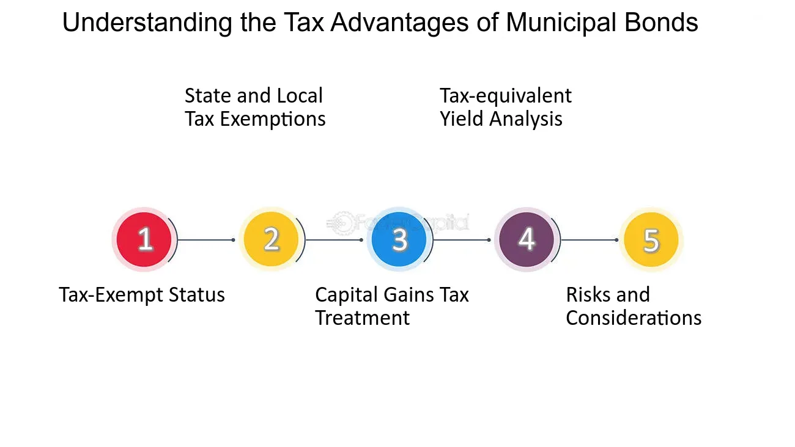

## Table of Contents

## What are municipal bonds?

Municipal bonds, often called "munis," are loans that people give to local governments or their agencies. These loans help pay for things like building schools, roads, and other public projects. When you buy a municipal bond, you're basically lending money to the government. In return, the government promises to pay you back the money you lent them, plus some extra money as interest, over a certain period of time.

These bonds are popular because they are usually seen as safe investments. This is because the government is less likely to go bankrupt compared to a company. Also, the interest you earn from municipal bonds is often not taxed by the federal government, and sometimes not by the state government either. This can make them a good choice for people looking to save on taxes while still earning a steady income from their investments.

## How do municipal bonds work?

Municipal bonds work by letting people lend money to local governments or their agencies. When you buy a municipal bond, you're giving the government money to help pay for things like new schools, roads, or other public projects. The government agrees to pay you back the money you lent them, plus some extra money as interest, over a set period of time. This period can be short, like a few years, or long, like 30 years.

These bonds are seen as safe because the government is less likely to go bankrupt than a company. Also, the interest you get from municipal bonds is often not taxed by the federal government, and sometimes not by the state government either. This makes them a good choice for people who want to earn a steady income without paying a lot in taxes. So, when you invest in a municipal bond, you're not only helping your community but also getting a reliable and potentially tax-free return on your investment.

## What are the different types of municipal bonds?

There are two main types of municipal bonds: general obligation bonds and revenue bonds. General obligation bonds are backed by the full faith and credit of the issuing government. This means the government promises to use its taxing power to pay back the money it borrowed. These bonds are often used to pay for things that benefit the whole community, like schools or parks.

Revenue bonds are different. They are not backed by the government's taxing power. Instead, they are paid back using money earned from the specific project they were used to fund. For example, if a bond is used to build a toll road, the money to pay back the bond would come from the tolls people pay to use the road. Revenue bonds are often used for projects that can generate their own income, like airports or water treatment plants.

There's also a third type called private activity bonds. These are a bit more complicated. They are used to help private projects that serve a public purpose, like building a hospital or a low-income housing project. The interest on these bonds might not be tax-free, depending on the project. So, when you're looking at municipal bonds, it's good to know these differences to choose the right one for your investment goals.

## What are the tax advantages of municipal bonds?

Municipal bonds have a big tax advantage: the interest you earn from them is often not taxed by the federal government. This means you get to keep more of the money you earn. For example, if you earn $1,000 in interest from a municipal bond, you don't have to pay federal taxes on that $1,000. This can make a big difference, especially if you're in a high tax bracket.

Sometimes, the interest is also not taxed by the state government, but only if you live in the state that issued the bond. So, if you buy a bond from your own state, you might not have to pay state taxes on the interest either. This double tax-free benefit can make municipal bonds a smart choice for people looking to save on taxes while still earning a steady income from their investments.

## How do federal income tax exemptions apply to municipal bonds?

When you invest in municipal bonds, the interest you earn is often not taxed by the federal government. This means you get to keep all the interest money you make, without having to pay any federal taxes on it. This can be a big help, especially if you're in a high tax bracket, because it means more money stays in your pocket.

Sometimes, the interest is also not taxed by the state government, but this only happens if you live in the same state that issued the bond. So, if you buy a bond from your own state, you might not have to pay state taxes on the interest either. This double tax-free benefit makes municipal bonds a smart choice for people looking to save on taxes while still earning a steady income from their investments.

## Can municipal bond interest be exempt from state and local taxes?

Yes, municipal bond interest can be exempt from state and local taxes, but only if you live in the state that issued the bond. This means if you buy a bond from your own state, you won't have to pay state taxes on the interest you earn. This can be a big help because it means you get to keep more of the money you make from the bond.

This tax advantage makes municipal bonds a good choice for people who want to save on taxes while earning a steady income. It's like getting a bonus for investing in projects that help your own community. So, if you're thinking about buying municipal bonds, it's a good idea to look at bonds from your own state to take full advantage of these tax benefits.

## What is the difference between tax-exempt and taxable municipal bonds?

Tax-exempt municipal bonds are special because the interest you earn from them is not taxed by the federal government. This means you get to keep all the money you make from the interest without paying federal taxes. Sometimes, if you live in the same state that issued the bond, you won't have to pay state taxes on the interest either. This double tax-free benefit makes these bonds a good choice for people looking to save on taxes while earning a steady income.

On the other hand, taxable municipal bonds are different. The interest you earn from these bonds is taxed by the federal government, just like interest from other investments. These bonds are usually used for projects that don't serve a public purpose, like building a stadium or funding a private project. Even though you have to pay taxes on the interest, these bonds can still be a good investment if they offer a high enough return to make up for the taxes you have to pay.

## How do alternative minimum tax (AMT) considerations affect municipal bond investments?

The alternative minimum tax (AMT) can affect your municipal bond investments in a special way. Some municipal bonds are called "private activity bonds," and the interest you earn from these bonds might be taxed under the AMT. This means if you have to pay the AMT, you might have to pay taxes on the interest from these bonds, even though it's usually tax-free. This can be important to know because it can change how much money you actually get to keep from your investment.

To avoid this, you can look for municipal bonds that are not subject to the AMT. These are often called "AMT-free" or "non-AMT" bonds. By choosing these bonds, you can make sure that the interest you earn stays tax-free, even if you have to pay the AMT. This can help you plan your investments better and keep more of your money.

## What are the potential risks associated with investing in municipal bonds?

Investing in municipal bonds can be a good choice, but there are some risks you should know about. One risk is that the government or agency that issued the bond might not be able to pay you back. This is called default risk. It doesn't happen often, but if it does, you might lose some or all of the money you invested. Another risk is interest rate risk. If interest rates go up after you buy a bond, the value of your bond might go down. This is because new bonds will be issued with higher interest rates, making your bond less attractive to other investors.

There's also inflation risk to think about. Inflation means the value of money goes down over time. If inflation goes up a lot, the interest you earn from your bond might not be enough to keep up with the rising costs. This means your investment might not grow as much as you hoped. Lastly, there's the risk that comes from changes in tax laws. If the tax benefits of municipal bonds change, it could affect how much money you actually get to keep from your investment. Knowing these risks can help you make smarter choices when investing in municipal bonds.

## How can investors evaluate the tax benefits of municipal bonds compared to other investments?

When investors are thinking about the tax benefits of municipal bonds compared to other investments, they should look at how much tax they would have to pay on the interest from different kinds of investments. Municipal bonds are special because the interest you earn is often not taxed by the federal government, and sometimes not by the state government either if you live in the state that issued the bond. This means you get to keep more of the money you earn from the bond, especially if you're in a high tax bracket. On the other hand, interest from other investments, like corporate bonds or savings accounts, is usually taxed by the federal government and sometimes by the state government too.

To figure out if municipal bonds are a better deal for you, you can compare the after-tax return of a municipal bond to the after-tax return of other investments. For example, if a municipal bond gives you 3% interest and it's tax-free, you keep all of that 3%. But if a corporate bond gives you 4% interest and you have to pay 25% in taxes, you only keep 3% after taxes. So, even though the corporate bond has a higher interest rate before taxes, the municipal bond might be better for you after taxes. This kind of comparison helps you see which investment will leave more money in your pocket at the end of the day.

## What strategies can be used to maximize the tax advantages of municipal bonds?

To get the most out of the tax advantages of municipal bonds, you should think about where you live and what kind of bonds you buy. If you live in the same state that issues the bond, you won't have to pay state taxes on the interest you earn. This can be a big help because it means more money stays in your pocket. Also, look for bonds that are not subject to the alternative minimum tax (AMT). These are often called "AMT-free" or "non-AMT" bonds. By choosing these, you make sure the interest stays tax-free, even if you have to pay the AMT.

Another good strategy is to think about your tax bracket. If you're in a high tax bracket, the tax-free interest from municipal bonds can be really valuable. You can compare the after-tax return of a municipal bond to other investments like corporate bonds or savings accounts. For example, if a municipal bond gives you 3% interest and it's tax-free, you keep all of that 3%. But if a corporate bond gives you 4% interest and you have to pay 25% in taxes, you only keep 3% after taxes. So, even though the corporate bond has a higher interest rate before taxes, the municipal bond might be better for you after taxes. This kind of comparison helps you see which investment will leave more money in your pocket at the end of the day.

## How do changes in tax laws impact the benefits of investing in municipal bonds?

Changes in tax laws can really affect how much you benefit from investing in municipal bonds. If the government decides to change the rules about what kinds of bonds are tax-free, it could mean you have to pay taxes on the interest you earn. For example, if a new law says that the interest from certain municipal bonds is no longer tax-free, you might end up with less money in your pocket than you expected. This is why it's important to keep an eye on tax law changes when you're thinking about buying municipal bonds.

Also, if tax rates go up or down, it can change how good a deal municipal bonds are for you. If tax rates go up, the tax-free interest from municipal bonds becomes even more valuable because you're saving more money on taxes. But if tax rates go down, the benefit of the tax-free interest might not be as big. So, understanding how tax laws might change in the future can help you decide if municipal bonds are the right choice for your investment goals.

## What are the tax benefits of municipal bonds?

Municipal bonds offer compelling tax benefits, a primary [factor](/wiki/factor-investing) contributing to their popularity among investors, especially those in higher tax brackets. Primarily, the interest income generated from municipal bonds is exempt from federal income taxes. Additionally, if the bonds are issued by entities within the investor’s home state, they might also be exempt from state and local taxes. This tax-exempt status significantly enhances the after-tax yield, making municipal bonds a strategic choice in portfolio diversification.

For instance, consider an investor in the 35% federal tax bracket. If such an investor is choosing between a municipal bond offering a 3% yield and a taxable corporate bond with a 4.5% yield, the taxable-equivalent yield of the municipal bond can be calculated using the formula:

$$
\text{Taxable Equivalent Yield} = \frac{\text{Municipal Bond Yield}}{1 - \text{Tax Rate}}
$$

For the given example:

$$
\text{Taxable Equivalent Yield} = \frac{0.03}{1 - 0.35} \approx 4.62\%
$$

In this scenario, the municipal bond provides a higher after-tax yield than the corporate bond, illustrating why high-income investors might prefer municipal bonds despite their lower nominal yields.

The importance of tax benefits extends to influencing investment strategies. High-income investors frequently invest in municipal bonds not only to mitigate tax liabilities but also to achieve portfolio stability and predictable income. Considering that municipal bonds are typically less volatile than stocks and other types of securities, they serve as a stabilizing component within a diversified investment portfolio. 

This strategy is particularly advantageous in times of economic uncertainty or market [volatility](/wiki/volatility-trading-strategies), where the tax-exempt income from municipal bonds can act as a reliable revenue stream while minimizing tax burdens. Consequently, understanding the tax implications and effectively incorporating municipal bonds can play a vital role in maximizing after-tax returns for investors in higher tax brackets.

Overall, the tax benefits of municipal bonds are instrumental in shaping prudent investment strategies, particularly for those seeking to optimize their portfolios through tax-efficient income streams while balancing moderate risk.

## References & Further Reading

[1]: Fabozzi, F. J. (2007). ["Fixed Income Analysis."](https://books.google.com/books/about/Fixed_Income_Analysis.html?id=lujLawVLS3YC) CFA Institute Investment Series.

[2]: "Municipal Bonds: A Comprehensive Study" by W. Bartley Hildreth, Rick L. Harris, and J. Richard Aronson (Book)

[3]: Ang, A. (2014). ["Asset Management: A Systematic Approach to Factor Investing."](https://archive.org/details/assetmanagements0000anga) Oxford University Press.

[4]: ["Algorithmic Trading: Winning Strategies and Their Rationale"](https://www.wiley.com/en-us/Algorithmic+Trading%3A+Winning+Strategies+and+Their+Rationale-p-9781118746912) by Ernie Chan

[5]: Harris, L. (2003). ["Trading and Exchanges: Market Microstructure for Practitioners."](https://academic.oup.com/book/52292) Oxford University Press.