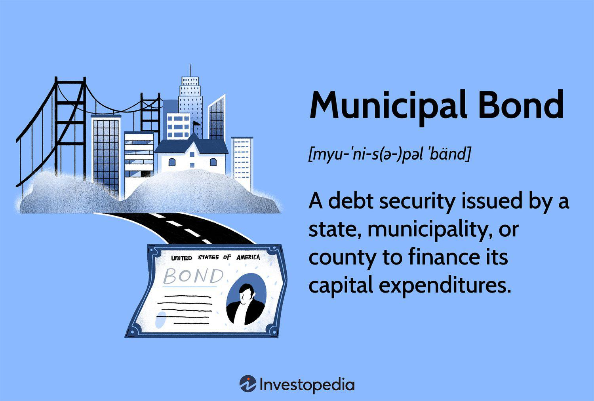

Municipal bonds, or 'munis', are a class of fixed-income securities that present a compelling investment opportunity, particularly due to their tax-exempt status. These financial instruments are issued by various governmental entities, including states, municipalities, counties, and other local entities, to raise capital for public projects. Such projects often involve the construction and maintenance of critical infrastructure, such as schools, roads, and water systems, which are essential for community development and well-being.

These bonds are distinctive for their tax benefits, notably the exemption from federal income taxes, and in many cases, state and local taxes as well, making them attractive to a wide range of investors, especially those in higher income brackets seeking to minimize tax liabilities. Municipal bonds play a crucial role in the larger securities market, offering an alternative to taxable bonds and contributing to a diversified portfolio strategy.



Beyond the traditional mechanisms of investment in municipal bonds, recent advancements such as algorithmic trading have begun to influence their market dynamics. Algorithmic trading has introduced a new layer of efficiency, providing enhanced liquidity, precision in trade execution, and improved market dynamics. This article aims to dissect the intricacies of municipal bonds by examining their tax advantages, their function within the securities market, and the transformative impact of algorithmic trading on these securities and overall investment strategies. By balancing these elements, investors can make informed decisions that leverage both the tax benefits and emerging technologies in the bond market.

## Table of Contents

## Understanding Municipal Bonds

Municipal bonds are financial instruments issued by state and local governments to finance public projects, such as infrastructure, schools, and utilities. These bonds are characterized by their tax-exempt status, meaning that the interest income earned by investors is often exempt from federal income taxes and, in some cases, state and local taxes as well. This tax advantage makes them particularly appealing for investors in higher tax brackets.

Municipal bonds are divided into two main categories: general obligation bonds and revenue bonds. General obligation bonds are backed by the full faith and credit of the issuing government entity, which has the power to levy taxes to repay the bondholders. This taxation power often translates into a lower risk of default, making them more secure compared to other types of bonds. On the other hand, revenue bonds are supported by the income generated from specific projects or sources, such as toll roads, airports, or utilities. Unlike general obligation bonds, these are not backed by the issuer's taxing power, which can result in higher risk since repayment depends on the project's success in generating revenue.

The role of municipal bonds in local government financing is pivotal. They provide needed capital for essential public services and infrastructure development without necessitating immediate tax hikes. For example, the construction of highways, bridges, hospitals, schools, and water systems is often funded through these bonds. By enabling these projects, municipal bonds contribute to community development and economic growth.

One of the key characteristics of municipal bonds is their typically lower default risk compared to corporate bonds. Since they are issued by governmental entities that have the capacity to generate revenue through taxes, the likelihood of default is reduced. Historically, municipal bonds have had a much lower default rate compared to corporate bonds, providing a safer investment choice for risk-averse investors. Furthermore, the inclusion of insurance on some municipal bonds can further mitigate the risk of default, although it may not entirely eliminate it.

Overall, municipal bonds serve as crucial investment vehicles for funding public projects while offering tax advantages and low default risk for investors. These features make them an important component of a diversified investment portfolio, particularly for those looking to balance risk and return with favorable tax treatment.

## Types of Municipal Bonds

Municipal bonds are essential instruments for funding public projects, and they are primarily categorized into two types: general obligation bonds (GO bonds) and revenue bonds. These categories differ significantly in terms of their backing and repayment structures, which consequently impacts investment choices.

**General Obligation Bonds (GO Bonds):**

General obligation bonds are backed by the full faith and credit of the issuing municipality. This means that the issuer has the legal authority to levy taxes to fulfill its payment obligations. GO bonds do not rely on revenue generated from a specific project but instead are secured by the issuer's taxing power. For example, a city might issue GO bonds to build schools or maintain emergency services, using property taxes as a repayment source.

The key implication for investors considering GO bonds is their relative security. Since these bonds are backed by the issuer's ability to tax residents, they typically represent a lower risk investment. However, the creditworthiness of the issuing municipality heavily influences this security, and potential investors often consider the municipality’s fiscal health before investing.

**Revenue Bonds:**

In contrast, revenue bonds are repaid from the income generated by the specific project they fund. Typical projects financed through revenue bonds include toll roads, hospitals, and utilities. As these bonds depend on project-specific revenue, they do not draw from tax funds. If the financed project does not produce sufficient revenue, the issuer may default on the bond.

Investors in revenue bonds focus on the projected income stream and the feasibility of the project behind the bond issuance. This type of bond often presents a higher risk compared to GO bonds due to its reliance on project success, but it can offer higher yields as compensation.

**Implications for Investment Choices:**

The choice between investing in GO bonds and revenue bonds hinges on a few critical factors: risk tolerance, desired returns, and portfolio strategy. Risk-averse investors might lean towards GO bonds due to their stability and lower risk of default. Conversely, those seeking higher returns may opt for revenue bonds, accepting a higher level of risk in exchange for potentially greater gains.

Additionally, the selection between these bonds might be influenced by broader investment strategies, such as a preference for diversification. An investor with a diversified portfolio might include both types of bonds to balance security with growth potential.

In summary, understanding the fundamental differences between general obligation and revenue bonds is crucial for investors as they align their investment choices with their risk profiles and financial goals. These bonds offer distinct advantages and challenges, influencing decisions in a nuanced municipal bond market.

## Tax Benefits of Municipal Bonds

Municipal bonds offer compelling tax benefits, a primary [factor](/wiki/factor-investing) contributing to their popularity among investors, especially those in higher tax brackets. Primarily, the interest income generated from municipal bonds is exempt from federal income taxes. Additionally, if the bonds are issued by entities within the investor’s home state, they might also be exempt from state and local taxes. This tax-exempt status significantly enhances the after-tax yield, making municipal bonds a strategic choice in portfolio diversification.

For instance, consider an investor in the 35% federal tax bracket. If such an investor is choosing between a municipal bond offering a 3% yield and a taxable corporate bond with a 4.5% yield, the taxable-equivalent yield of the municipal bond can be calculated using the formula:

$$
\text{Taxable Equivalent Yield} = \frac{\text{Municipal Bond Yield}}{1 - \text{Tax Rate}}
$$

For the given example:

$$
\text{Taxable Equivalent Yield} = \frac{0.03}{1 - 0.35} \approx 4.62\%
$$

In this scenario, the municipal bond provides a higher after-tax yield than the corporate bond, illustrating why high-income investors might prefer municipal bonds despite their lower nominal yields.

The importance of tax benefits extends to influencing investment strategies. High-income investors frequently invest in municipal bonds not only to mitigate tax liabilities but also to achieve portfolio stability and predictable income. Considering that municipal bonds are typically less volatile than stocks and other types of securities, they serve as a stabilizing component within a diversified investment portfolio. 

This strategy is particularly advantageous in times of economic uncertainty or market [volatility](/wiki/volatility-trading-strategies), where the tax-exempt income from municipal bonds can act as a reliable revenue stream while minimizing tax burdens. Consequently, understanding the tax implications and effectively incorporating municipal bonds can play a vital role in maximizing after-tax returns for investors in higher tax brackets.

Overall, the tax benefits of municipal bonds are instrumental in shaping prudent investment strategies, particularly for those seeking to optimize their portfolios through tax-efficient income streams while balancing moderate risk.

## Risks Associated with Municipal Bonds

Municipal bonds, while offering notable benefits such as tax exemptions, are not devoid of risks. Investors need to evaluate a range of market and specific risks before committing capital. Understanding these risks is crucial for optimizing investment decisions.

### Market Risks
One of the primary market risks associated with municipal bonds is the [interest rate](/wiki/interest-rate-trading-strategies) risk. As interest rates rise, the value of existing bonds typically declines, making them less attractive compared to newly issued bonds offering higher yields. This inverse relationship means that investors holding long-term bonds are particularly susceptible to fluctuations in interest rates, which can significantly impact the overall return on investment.

Another significant market risk is purchasing-power risk, also known as inflation risk. This risk highlights the possibility that inflation could erode the purchasing power of the bond yields over time. If the inflation rate surpasses the bond's yield, the real return on the investment could be negative, diminishing the bond's attractiveness.

### Specific Risks

**Call Risk**
Municipal bonds often contain call provisions, allowing the issuer to repay the bond before its maturity date, typically during periods of declining interest rates. This call risk can lead to reinvestment risk, where investors must reinvest the returned principal at a lower interest rate than the original bond. This can be detrimental to investors relying on predictable income streams.

**Tax Traps**
While municipal bonds are generally exempt from federal income tax, and sometimes state taxes if the investor resides in the same state as the issuer, there are specific tax-related pitfalls to be aware of. Notably, the Alternative Minimum Tax (AMT) may apply to certain municipal bonds, reducing or eliminating the expected tax benefits for high-income investors. Understanding the AMT implications is important to avoid unexpected tax liabilities.

Investors also need to be aware that the tax exemptions on municipal bonds do not apply universally. Bonds issued for private activity purposes may not benefit from the same level of tax exemption as those used for public projects, potentially diminishing the anticipated tax advantages.

In conclusion, while municipal bonds can provide attractive features such as reduced taxes, investors must be vigilant about the associated risks. Understanding the nuances of interest rate changes, inflation, call options, and tax implications ensures a well-informed investment strategy tailored to individual risk appetites and financial goals.

## Algorithmic Trading in Municipal Bonds

Algorithmic trading has significantly transformed the municipal bond market by enhancing both efficiency and [liquidity](/wiki/liquidity-risk-premium). This automated form of trading employs complex algorithms to execute trades at high speed, thereby minimizing human intervention. The use of algorithms in this domain streamlines trade execution, allowing for more precise and timely transactions, which can be particularly beneficial given the traditionally lower liquidity of municipal bonds compared to other securities.

Algorithms aid in market dynamics by facilitating effective price discovery. Price discovery, the process through which the price of an asset is determined by market participants, is crucial for maintaining market stability and ensuring that assets are traded at fair values. By analyzing vast amounts of market data quickly, algorithms can identify price discrepancies and execute trades that help correct these inconsistencies. This leads to more accurate pricing, which benefits all market participants.

Moreover, [algorithmic trading](/wiki/algorithmic-trading) contributes to greater liquidity in the municipal bond market. Liquidity refers to the ease with which an asset can be bought or sold in the market without affecting its price. In less liquid markets, such as municipal bonds, large trades can significantly impact prices. Algorithms enable traders to break down large orders into smaller parts and execute them over time, reducing the potential for market disruption and improving overall market liquidity.

In terms of trade execution, algorithms optimize the timing and size of trades based on real-time market conditions, thus reducing transaction costs and enhancing execution quality. For instance, algorithms can be programmed to execute trades only when certain market conditions are met, such as when a bond's price reaches a predefined threshold or when market volatility is within acceptable limits. This level of precision in executing trades ensures that investors receive the best possible prices for their transactions.

The deployment of algorithmic trading in municipal bonds also supports the integration of large datasets, including historical price movements, interest rates, and other relevant financial indicators, to make informed trading decisions. The use of [machine learning](/wiki/machine-learning) techniques within these algorithms further refines their ability to predict market trends and respond adaptively, thus enhancing their effectiveness.

Overall, the introduction of algorithmic trading in the municipal bond market has brought about significant advancements in efficiency and liquidity, contributing to a more robust and transparent trading environment. These enhancements not only benefit institutional investors but also provide opportunities for retail investors seeking to navigate the complexities of the municipal bond market.

## The Impact of Algorithmic Trading on Investment Strategies

Algorithmic trading has significantly transformed the dynamics of municipal bond trading, influencing investment strategies by integrating advanced computational techniques with traditional trading approaches. At its core, algorithmic trading utilizes complex mathematical models and real-time data analysis to execute trades at high speeds and with minimal human intervention. This shift towards automation provides enhanced liquidity and improved efficiency in the bond market, which traditionally suffers from lower liquidity compared to equity markets.

One of the principal impacts of algorithmic trading on municipal bonds is its ability to facilitate price discovery and trade execution. Algorithms can process vast amounts of market data quickly, identifying trading opportunities that might be missed by human traders. This acceleration of trade execution reduces the bid-ask spreads, benefiting both buyers and sellers with more competitive pricing.

From an investor's perspective, incorporating algorithmic trading into bond portfolio management can optimize investment outcomes. Algorithms can be programmed to execute trades based on specific criteria, such as yield targets or risk thresholds, allowing investors to tailor their strategies according to their financial goals. For instance, a simple Python code snippet that could represent an algorithm for identifying high-yield municipal bonds might look like this:

```python
import pandas as pd

# Hypothetical dataset of bonds with 'Yield' and 'RiskScore'
data = {
    'Bond': ['Bond A', 'Bond B', 'Bond C'],
    'Yield': [3.5, 4.2, 3.8],
    'RiskScore': [1, 3, 2]
}

df = pd.DataFrame(data)

# Define yield target and maximum risk tolerance
yield_target = 3.75
max_risk = 2

# Filter bonds that meet the yield target and risk criteria
selected_bonds = df[(df['Yield'] >= yield_target) & (df['RiskScore'] <= max_risk)]

print(selected_bonds)
```

This code identifies bonds that meet a predefined yield and risk criteria, showcasing how algorithms streamline the selection process.

Moreover, algorithmic trading allows the integration of traditional investment techniques, such as [fundamental analysis](/wiki/fundamental-analysis), with automated systems. For instance, an investor may use algorithms to continuously monitor bond issuance announcements and relevant macroeconomic indicators, enabling timely decision-making. Such integration ensures that portfolios are diversified not only in terms of assets but also in terms of strategies, providing a robust defense against market volatility.

While the algorithms enhance precision and efficiency, investors still benefit from the insights provided by traditional approaches, particularly in the analysis of bond fundamentals and local economic conditions that algorithms may overlook. By seamlessly blending algorithmic and traditional methods, investors can harness the strengths of both approaches, optimizing their municipal bond portfolios for better returns.

In conclusion, as algorithmic trading continues to evolve, its influence on municipal bond investment strategies becomes increasingly profound. It equips investors with the tools to execute trades with speed and accuracy, while still allowing the flexibility to incorporate human judgment where necessary. This synergy of traditional and algorithmic techniques empowers investors to navigate the municipal bond market more effectively, ensuring their strategies are aligned with both market dynamics and individual risk preferences.

## Conclusion

Municipal bonds stand out as a compelling investment choice due to their significant tax benefits and reduced risk profiles. These bonds, primarily issued by state and local governments, often provide exemptions from federal income tax, and in some cases, state and local taxes as well. This tax advantage is particularly beneficial for high-income investors who seek to optimize their after-tax returns. The lower default risk commonly associated with municipal bonds, particularly general obligation bonds, adds an additional layer of security to investors' portfolios.

The emergence of algorithmic trading has revolutionized the municipal bond market by enhancing liquidity and efficiency. Algorithms facilitate faster trade execution and improve price discovery, making the market more accessible and responsive. By automating the trading process, these algorithms help mitigate transaction costs and allow for the efficient management of bond portfolios. This has significant implications for investment strategies, enabling more frequent adjustments and optimizations based on real-time market data.

Investors are advised to strategically balance the tax benefits, market risks, and technological advancements inherent in municipal bonds. While enjoying the tax advantages and lower risk, it is crucial to remain vigilant about interest rate changes and economic conditions that could impact bond performance. Integrating algorithmic trading into traditional investment approaches can optimize portfolio outcomes, enhancing both returns and risk management. Accordingly, a comprehensive understanding of these elements can significantly contribute to a well-rounded investment strategy in municipal bonds.

## References & Further Reading

[1]: Fabozzi, F. J. (2007). ["Fixed Income Analysis."](https://books.google.com/books/about/Fixed_Income_Analysis.html?id=lujLawVLS3YC) CFA Institute Investment Series.

[2]: "Municipal Bonds: A Comprehensive Study" by W. Bartley Hildreth, Rick L. Harris, and J. Richard Aronson (Book)

[3]: Ang, A. (2014). ["Asset Management: A Systematic Approach to Factor Investing."](https://archive.org/details/assetmanagements0000anga) Oxford University Press.

[4]: ["Algorithmic Trading: Winning Strategies and Their Rationale"](https://www.wiley.com/en-us/Algorithmic+Trading%3A+Winning+Strategies+and+Their+Rationale-p-9781118746912) by Ernie Chan

[5]: Harris, L. (2003). ["Trading and Exchanges: Market Microstructure for Practitioners."](https://academic.oup.com/book/52292) Oxford University Press.