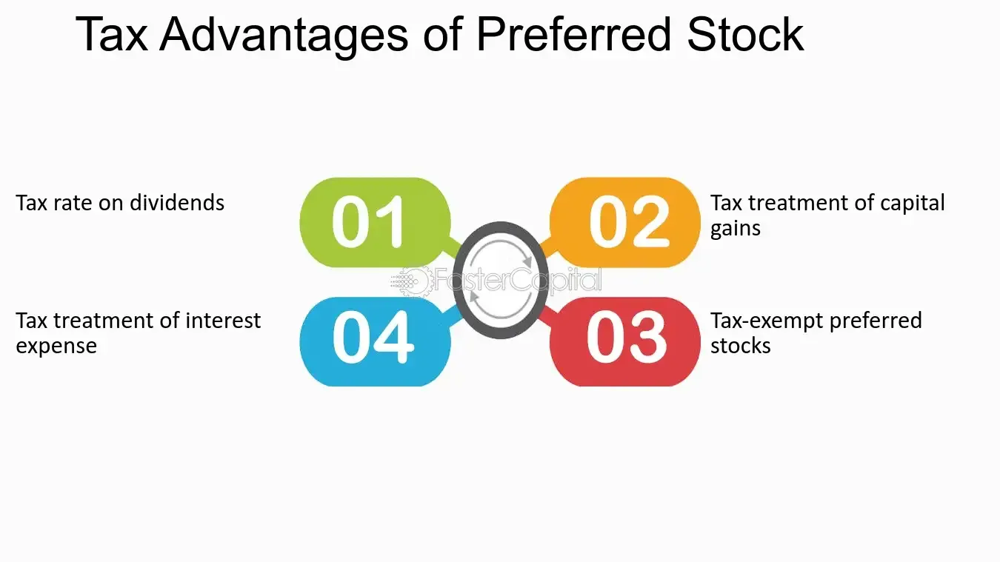

## Table of Contents

## What are preferred shares and how do they differ from common shares?

Preferred shares are a type of stock that companies issue to investors. They are called "preferred" because they have certain advantages over common shares. One main advantage is that preferred shareholders get paid dividends before common shareholders. Dividends are payments companies make to shareholders from their profits. If a company goes bankrupt, preferred shareholders also get their money back before common shareholders.

Common shares are the most common type of stock that companies issue. When people talk about buying "stocks," they usually mean common shares. Common shareholders can vote on important company decisions, like who should be on the board of directors. However, they get paid dividends only after preferred shareholders. If a company goes bankrupt, common shareholders are the last to get any money back, if there is any left.

In summary, preferred shares offer more security and priority in receiving dividends and assets in case of bankruptcy, but they usually don't come with voting rights. Common shares offer voting rights and the potential for higher returns, but they come with more risk because they are last in line for dividends and assets.

## How do preferred shares provide tax advantages to companies?

Preferred shares can help companies save on taxes because the dividends they pay to preferred shareholders are often treated differently than other types of payments. When a company pays dividends on preferred shares, it can sometimes deduct these payments from its taxable income. This is different from interest payments on debt, which are always deductible. By using preferred shares, a company can lower its tax bill and keep more of its profits.

Another way preferred shares provide tax advantages is through the way they are treated by investors. Many investors, especially corporations, find preferred share dividends attractive because they are often taxed at a lower rate than interest income. This can make preferred shares a more appealing investment option, helping companies raise money more easily and at a lower cost than if they had to offer higher interest rates on debt.

## What is the dividend tax credit and how does it apply to preferred shares?

The dividend tax credit is a way to help people who get money from company profits, called dividends, pay less tax. When you get dividends from preferred shares, you might get a tax credit. This means you can subtract a certain amount from the tax you owe. The idea is to stop the same money from being taxed twice - once when the company makes a profit and again when you get the dividend.

For preferred shares, the dividend tax credit works a bit differently than for common shares. When you get dividends from preferred shares, the tax credit can be bigger. This is because preferred share dividends are often seen as a return on investment, kind of like interest. So, the government gives a bigger tax break to make these dividends more attractive to investors. This can make preferred shares a good choice if you want to save on taxes.

## Can you explain the concept of dividend imputation and its relevance to preferred shares?

Dividend imputation is a system that helps avoid double taxation on company profits. When a company makes money, it pays tax on that profit. If the company then gives some of that profit to shareholders as dividends, the shareholders would normally have to pay tax on those dividends too. This would mean the same money is taxed twice. To fix this, dividend imputation gives shareholders a tax credit for the tax the company already paid. This way, the money is only taxed once, either at the company level or the shareholder level, but not both.

For preferred shares, dividend imputation can be especially helpful. Preferred shareholders often get bigger dividends than common shareholders, and these dividends can come with a larger tax credit under an imputation system. This makes preferred shares more attractive to investors because they can keep more of their dividend income after taxes. So, if you're thinking about investing in preferred shares, understanding how dividend imputation works can help you make a smarter choice.

## How do the tax implications of preferred shares compare to those of debt financing?

When a company uses preferred shares, it can sometimes save on taxes because the dividends it pays to preferred shareholders might be deductible from its taxable income. This is different from debt financing, where interest payments on loans are always deductible. So, preferred shares can be a good choice for a company that wants to lower its tax bill but doesn't want to take on more debt. Also, investors who buy preferred shares might get a tax credit on the dividends they receive, which can make these shares more attractive than other investments.

On the other hand, debt financing has its own tax benefits. The interest payments a company makes on its loans are always tax-deductible, which can help the company save a lot on taxes. But, debt also comes with the risk of having to make regular interest payments, which can be a problem if the company's profits go down. Preferred shares don't have this risk because dividends can be skipped if the company is struggling, but they might not always offer the same level of tax savings as debt. So, companies need to think carefully about whether preferred shares or debt financing will be better for their tax situation and overall financial health.

## What are the specific tax benefits of issuing preferred shares in different jurisdictions?

In the United States, issuing preferred shares can help companies save on taxes because the dividends they pay might be treated as tax-deductible under certain conditions, like when the shares are considered "dividend-paid deduction" eligible. This can lower the company's taxable income. For investors, dividends from preferred shares are often taxed at a lower rate than regular income, which can make these shares more attractive. Also, the U.S. has a system called the "dividend received deduction" that lets corporations deduct a part of the dividends they get from other companies, which can be useful if they invest in preferred shares.

In Canada, preferred shares can offer tax benefits through the dividend tax credit system. When a company pays dividends on preferred shares, shareholders can get a tax credit that reduces the amount of tax they owe on those dividends. This helps avoid double taxation, where the same money is taxed at both the company and shareholder levels. For the company, issuing preferred shares can be a way to raise money without taking on more debt, and the dividends might be deductible under certain conditions, helping to lower the company's tax bill.

In the United Kingdom, companies can also benefit from issuing preferred shares. The dividends paid on these shares are not tax-deductible for the company, but they can be attractive to investors because they are often taxed at a lower rate than other types of income. Additionally, the UK has a system called the "dividend allowance," which lets investors earn a certain amount of dividend income each year without paying tax on it. This can make preferred shares a good choice for investors looking to minimize their tax burden.

## How do companies strategically use preferred shares to optimize their tax position?

Companies use preferred shares to optimize their tax position by taking advantage of the different tax treatments these shares offer. In some countries, the dividends paid on preferred shares can be tax-deductible for the company, which means they can lower their taxable income. This can be especially helpful if the company wants to avoid the risk of debt but still wants to reduce its tax bill. By issuing preferred shares, a company can raise money and potentially save on taxes at the same time.

Investors also play a role in this strategy. Preferred shares often come with tax benefits for shareholders, like lower tax rates on dividends or tax credits. This makes preferred shares more attractive to investors, which can help the company raise money more easily. For example, in Canada, the dividend tax credit can help shareholders keep more of their dividend income after taxes, making preferred shares a smart choice for both the company and the investor. By understanding how preferred shares are taxed in different places, companies can use them to improve their overall tax situation and financial health.

## What are the potential tax drawbacks of using preferred shares for companies?

Using preferred shares can have some tax drawbacks for companies. In many places, the dividends paid on preferred shares are not tax-deductible for the company. This means the company can't lower its taxable income by paying these dividends, unlike interest payments on debt, which are always deductible. This can make preferred shares less attractive if the company is looking to save on taxes.

Another potential drawback is that the tax benefits of preferred shares can change depending on where the company is located. For example, in the United States, dividends might be deductible under certain conditions, but this isn't always the case. Companies need to keep up with tax laws in different places to make sure they're getting the best deal. If the tax rules change, the benefits of using preferred shares could go away, leaving the company with a less favorable tax situation.

## How do changes in tax laws affect the attractiveness of preferred shares as a financing option?

Changes in tax laws can make preferred shares more or less attractive for companies looking to raise money. If the government changes the rules so that dividends on preferred shares become tax-deductible, companies might find them more appealing. This is because they could lower their tax bill by paying dividends, just like they do with interest on loans. On the other hand, if the tax laws change to make dividends less favorable, like by removing any tax benefits, companies might not want to use preferred shares as much. They would have to look at other ways to finance their business that offer better tax savings.

For investors, changes in tax laws can also affect how attractive preferred shares are. If the tax rate on dividends goes down, or if there are new tax credits for dividend income, more people might want to buy preferred shares. This is because they could keep more of their dividend money after taxes. But if the tax laws change to make dividends less attractive, like by increasing the tax rate or removing tax credits, investors might look for other investments that offer better tax benefits. So, both companies and investors need to keep an eye on tax laws to decide if preferred shares are a good choice for them.

## What are the accounting treatments for preferred shares and their tax implications?

When a company issues preferred shares, it records them on its balance sheet as part of its equity. This means the money the company gets from selling preferred shares is shown as an increase in the company's total equity. The dividends the company pays to preferred shareholders are recorded as a reduction in the company's retained earnings, which is also part of the equity section on the balance sheet. If the dividends are cumulative, meaning they must be paid before any dividends can be paid to common shareholders, the company also keeps track of any unpaid dividends as a liability until they are paid.

The tax implications of preferred shares can be different depending on where the company is located. In some places, the dividends paid on preferred shares might be tax-deductible for the company, which means they can lower their taxable income. This can be a big help for the company's tax bill. For investors, the dividends they get from preferred shares might be taxed at a lower rate than other types of income, or they might get a tax credit that reduces the amount of tax they owe. But, if the tax laws change, the benefits of using preferred shares could go away, so companies and investors need to keep an eye on these rules.

## How do the tax benefits of preferred shares impact a company's overall cost of capital?

When a company uses preferred shares, it can sometimes lower its overall cost of capital because of the tax benefits. If the dividends on preferred shares are tax-deductible, the company can reduce its taxable income, which means it pays less in taxes. This can make preferred shares a cheaper way to raise money compared to other options like debt, where the company has to pay back the money with interest. By saving on taxes, the company can keep more of its profits, which helps lower the cost of using preferred shares to get money.

For investors, the tax benefits of preferred shares can also make them more attractive. If the dividends they get are taxed at a lower rate or come with a tax credit, investors can keep more of their money after taxes. This can make them more willing to buy preferred shares, which can help the company raise money more easily and at a lower cost. So, the tax benefits of preferred shares can help a company lower its overall cost of capital by making it cheaper to raise money and keep more of its profits.

## What advanced tax planning strategies can companies employ with preferred shares to maximize benefits?

Companies can use preferred shares to lower their taxes by carefully planning how they issue and manage these shares. One strategy is to issue preferred shares that are eligible for tax deductions on dividends. In some places, if the dividends are structured in a certain way, the company can deduct them from its taxable income, just like interest payments on debt. This can save the company a lot of money on taxes. Another approach is to use preferred shares to raise money from other corporations, which can benefit from the "dividend received deduction." This means the corporations that buy the preferred shares can deduct a part of the dividends they get, making the shares more attractive to them and helping the issuing company raise money more easily.

Another advanced strategy involves timing the issuance and redemption of preferred shares to take advantage of changing tax laws. Companies can watch for changes in tax rules that might make preferred shares more or less beneficial and adjust their strategies accordingly. For example, if the tax rate on dividends is expected to go down, a company might issue preferred shares just before the change to lock in the lower tax rate for its investors. On the other hand, if tax benefits are expected to go away, the company might redeem its preferred shares before that happens to keep the tax advantages. By staying on top of tax laws and planning carefully, companies can use preferred shares to maximize their tax savings and improve their financial position.

## References & Further Reading

[1]: ["Preferred Stocks: A Hybrid Investment"](https://fastercapital.com/content/Preferred-stocks--A-Hybrid-Investment-with-Fixed-Dividends-and-Priority-Claims.html) by Ryan Fuhrmann, Investopedia

[2]: ["Tax Treatment of Preferred Stock"](https://www.investopedia.com/ask/answers/102714/how-are-preferred-stock-dividends-taxed.asp) by Scott Greenberg, Tax Foundation

[3]: ["Algorithmic Trading and DMA: An Introduction to Direct Access Trading Strategies"](https://www.amazon.com/Algorithmic-Trading-DMA-introduction-strategies/dp/0956399207) by Barry Johnson

[4]: ["Risk Management and Financial Institutions"](https://www.simonfoucher.com/MBA/FINA%20695%20-%20Risk%20Management/riskmanagementandfinancialinstitutions4theditionjohnhull-150518225205-lva1-app6892.pdf) by John C. Hull

[5]: ["High-Frequency Trading: A Practical Guide to Algorithmic Strategies and Trading Systems"](https://www.amazon.com/High-Frequency-Trading-Practical-Algorithmic-Strategies/dp/1118343506) by Irene Aldridge