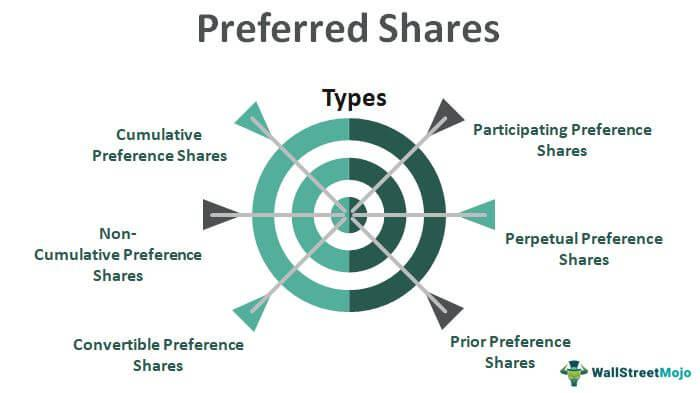

Understanding different investment options and strategies is essential for both corporate and individual investors in today's rapidly changing financial markets. Among the key topics in corporate finance, preferred shares and algorithmic trading stand out. Preferred shares are known for their unique combination of equity and debt characteristics. They give investors priority in dividend payments and liquidation events, offering a potential steady income. On the other hand, algorithmic trading is reshaping how trades are executed by utilizing automated systems that rely on computer algorithms, enabling faster and more efficient transactions.

This article examines the tax benefits associated with preferred shares and evaluates the impact of algorithmic trading in corporate finance. By understanding how these elements connect within the broader financial ecosystem, investors can make more informed decisions tailored to their financial objectives and risk tolerance. This integration can lead to sophisticated strategies that enhance portfolio management and can help investors achieve improved returns while navigating the complexities of modern financial markets. Understanding these dynamics enables both corporate and individual investors to strategically leverage the benefits of preferred shares and algorithmic trading, aligning their investments with their long-term goals.



## Table of Contents

## Understanding Preferred Shares

Preferred shares are a unique class of equity that provide specific advantages in corporate finance. They are structured to offer priority over common shares in terms of dividend payments and assets during liquidation events. This priority means that preferred shareholders receive dividend payments before any dividends are distributed to common shareholders. In case of a company's liquidation, preferred shareholders are also prioritized over common shareholders when assets are distributed.

Unlike debt instruments such as bonds, preferred shares do not offer tax-deductible benefits for issuing companies, as the dividends distributed are paid from after-tax earnings. This is a significant distinction from interest payments on debt, which can often be deducted from taxable income, providing a tax shield for the company.

Despite this lack of tax deductibility, preferred shares remain popular among income-focused investors due to their fixed dividend payments. This feature introduces a level of stability and predictability to income flows, which can be particularly appealing in economic climates where volatility is a concern. The fixed nature of these dividends can be especially advantageous when compared to the variable dividends associated with common shares.

Companies may choose to issue preferred shares as a strategic tool to raise capital while avoiding the pitfalls of increased debt. By doing so, they maintain their existing levels of financial leverage. Issuing additional debt could compromise a company's leverage ratios, potentially impacting credit ratings and borrowing costs. In contrast, issuing preferred shares allows firms to inject fresh capital into the business without compromising their debt structure or diluting voting rights, since preferred shares typically do not carry voting privileges under normal circumstances.

In summary, the distinctive characteristics of preferred shares—priority in dividend and liquidation, stability due to fixed dividends, and maintaining financial leverage—play a pivotal role in corporate finance strategies, appealing to both investors seeking regular income and companies aiming for flexible financing solutions.

## Tax Implications of Preferred Shares in Corporate Finance

Preferred shares occupy a distinct position in the corporate finance ecosystem due to their hybrid characteristics, providing companies with financing alternatives that balance equity and debt-like features. However, their impact on a corporation's tax obligations is significant and warrants careful consideration.

Unlike bonds or debt securities, the dividends paid on preferred shares are not tax-deductible. This absence of interest deductibility means that corporations cannot deduct dividend payments from their taxable income, making preferred shares a relatively expensive financing choice from a tax standpoint. In a corporate tax setting, interest on debt reduces taxable income, providing a tax shield that effectively lowers the after-tax cost of debt. Conversely, dividends are paid from after-tax profits, leading to a higher effective cost when using preferred shares as a funding mechanism.

Despite this apparent disadvantage, preferred shares offer strategic utility. One major advantage is that they do not dilute existing shareholders' voting rights, unlike issuing new common shares. This [factor](/wiki/factor-investing) is particularly appealing to companies seeking to preserve control while raising additional capital. Furthermore, preferred shares do not increase a company's leverage ratio, which is crucial for maintaining an optimal capital structure, especially in industries sensitive to leverage thresholds.

For investors considering preferred shares, potential tax benefits exist on the individual level, particularly concerning qualified dividends. In jurisdictions like the United States, qualified dividends received from preferred shares may be taxed at a lower capital gains tax rate rather than ordinary income tax rates. This tax treatment can make preferred shares an appealing choice for individual investors seeking tax-efficient income, in addition to the attractiveness of their fixed dividend feature.

In summary, while preferred shares do not offer direct corporate tax advantages as financing options compared to debt, their strategic benefits, such as minimal impact on voting rights and leverage ratios, provide valuable options for financial structuring. For individual investors, the prospect of lower tax rates on dividends can enhance the appeal of preferred shares within a diversified investment portfolio.

## Automated Trading and Algorithmic Strategies

Algorithmic trading revolutionizes the financial industry by utilizing computer algorithms to execute trades with remarkable speed and precision, capabilities that are beyond human reach. The primary objective of [algorithmic trading](/wiki/algorithmic-trading) is to enhance trading efficiency and minimize biases that can arise from human emotions. By adhering strictly to pre-established criteria, algorithmic trading ensures consistent execution, thereby creating a more predictable trading environment.

Algorithms used in trading can vary widely in complexity. Simple algorithms might involve basic mathematical models, such as moving averages or [momentum](/wiki/momentum) indicators, which trigger trades based on straightforward signals. More sophisticated algorithms may incorporate advanced statistical methods, [machine learning](/wiki/machine-learning) techniques, or even [deep learning](/wiki/deep-learning) systems, all of which enable the algorithms to swiftly interpret and react to dynamic market changes. This adaptability allows algorithmic systems to adjust their trading strategies nearly instantaneously in response to new market data.

High-frequency trading ([HFT](/wiki/high-frequency-trading-strategies)) is one notable domain where algorithmic trading plays a crucial role. HFT strategies seek to exploit tiny price discrepancies that may occur across various markets or securities. These strategies depend on the ability to execute a vast number of orders in fractions of a second, a feat achievable only through algorithmic trading systems. The competitive edge in HFT often comes down to not just the algorithms themselves but also the technology infrastructure that supports rapid order execution and market data processing.

Here is a simple example in Python to illustrate how a basic trading algorithm might look using moving averages:

```python
import pandas as pd

# Load historical price data
data = pd.read_csv('historical_prices.csv')

# Calculate moving averages
data['SMA_50'] = data['close'].rolling(window=50).mean()
data['SMA_200'] = data['close'].rolling(window=200).mean()

# Define conditions for buy and sell signals
data['Signal'] = 0  # 0: Hold, 1: Buy, -1: Sell
data.loc[data['SMA_50'] > data['SMA_200'], 'Signal'] = 1
data.loc[data['SMA_50'] < data['SMA_200'], 'Signal'] = -1

# Output signals
buy_signals = data[data['Signal'] == 1]
sell_signals = data[data['Signal'] == -1]
```

In this script, a basic moving average crossover strategy is implemented. The algorithm calculates 50-day and 200-day simple moving averages (SMA) of the closing prices. It generates a buy signal when the 50-day SMA crosses above the 200-day SMA, and a sell signal when the opposite occurs. This strategy serves as an example of how algorithms can be employed to make systematic trading decisions.

Overall, algorithmic trading represents a significant advancement in financial trading, providing tools to automate decision-making processes and optimize trading strategies efficiently across various financial instruments.

## Integrating Algorithmic Trading with Preferred Shares Strategies

Institutional investors and large firms often leverage the capabilities of algorithmic trading to enhance their strategies involving preferred shares. By using sophisticated algorithms, these investors can identify optimal buy and sell opportunities, enhancing their ability to capture favorable market conditions and maximize returns. Specifically, algorithms can be tailored to detect patterns in market trends and assess dividend policies that signal lucrative trading moments for preferred shares.

The automation of decision-making processes is a core advantage of applying algorithmic trading to preferred shares. By predefining conditions under which trades are executed, investors can ensure decisions are made consistently and without the emotional biases that might otherwise influence human traders. This approach enables a more disciplined investment strategy and optimizes positions in preferred shares efficiently.

Moreover, algorithmic trading allows for rigorous [backtesting](/wiki/backtesting) using historical market data. This process involves running the algorithm on past data to evaluate how it would perform in different market conditions, thus providing valuable insights into its robustness and reliability. The results of backtesting can be used to fine-tune the algorithms, improving their accuracy and effectiveness in live trading environments. By continuously refining these automated strategies, investors can adapt to changing market dynamics and maintain an edge in trading preferred shares.

## Conclusion

Preferred shares and algorithmic trading offer distinct advantages in both corporate finance and investing. Preferred shares are valued for their stability, providing investors with fixed dividends and priority over common stockholders in the event of liquidation. These characteristics make them a strategic choice for investors seeking consistent income and companies looking to raise capital without increasing their debt burden.

On the other hand, algorithmic trading revolutionizes execution with its efficiency and precision. By automating trading decisions based on predefined criteria, algorithms minimize emotional biases and enable rapid transactions that are challenging for human traders to achieve. This not only increases the speed of execution but also the consistency, crucial in volatile markets. Algorithms range from basic rule-based strategies to complex models utilizing machine learning to make real-time decisions, especially prominent in high-frequency trading.

The integration of preferred shares investment strategies with algorithmic trading provides investors with a powerful toolkit. By programming algorithms to optimize purchase and sale timings for preferred shares, one can capitalize on market trends and dividend schedules, thus enhancing overall return potential. Backtesting these algorithms using historical data refines their performance, ensuring robustness when applied to live trading scenarios.

For investors, understanding how to leverage both preferred shares and algorithmic trading can significantly bolster portfolio management. These tools, when used effectively, align investments with the investor's objectives and risk tolerance, ensuring a balanced approach to risk and return. Educated investors can navigate the complexities of modern financial markets, enhancing their prospects for achieving superior returns.

## References & Further Reading

[1]: ["Preferred Stocks: A Hybrid Investment"](https://fastercapital.com/content/Preferred-stocks--A-Hybrid-Investment-with-Fixed-Dividends-and-Priority-Claims.html) by Ryan Fuhrmann, Investopedia

[2]: ["Tax Treatment of Preferred Stock"](https://www.investopedia.com/ask/answers/102714/how-are-preferred-stock-dividends-taxed.asp) by Scott Greenberg, Tax Foundation

[3]: ["Algorithmic Trading and DMA: An Introduction to Direct Access Trading Strategies"](https://www.amazon.com/Algorithmic-Trading-DMA-introduction-strategies/dp/0956399207) by Barry Johnson

[4]: ["Risk Management and Financial Institutions"](https://www.simonfoucher.com/MBA/FINA%20695%20-%20Risk%20Management/riskmanagementandfinancialinstitutions4theditionjohnhull-150518225205-lva1-app6892.pdf) by John C. Hull

[5]: ["High-Frequency Trading: A Practical Guide to Algorithmic Strategies and Trading Systems"](https://www.amazon.com/High-Frequency-Trading-Practical-Algorithmic-Strategies/dp/1118343506) by Irene Aldridge