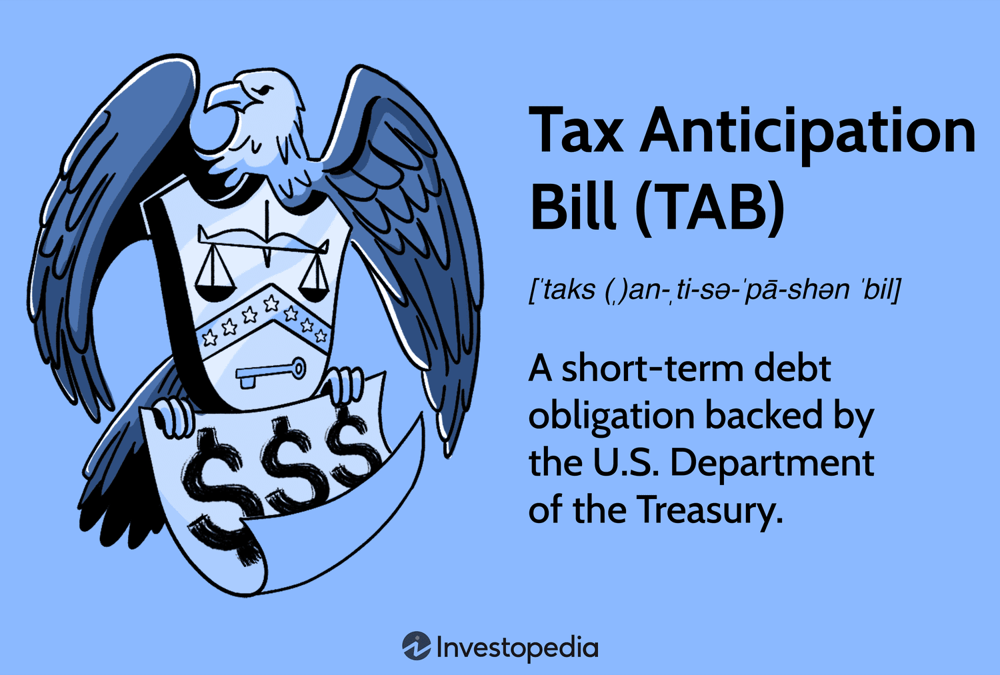

## Table of Contents

## What is a Tax Anticipation Bill?

A Tax Anticipation Bill is a type of short-term loan that governments use to help manage their cash flow. When a government expects to receive tax revenues at a certain time in the future, but needs money before that, it can issue these bills. Investors buy the bills, giving the government the money it needs right away. In return, the government promises to pay back the investors with interest once it collects the taxes.

These bills are useful because they help governments keep running smoothly without waiting for tax money to come in. For example, if a government knows it will get a lot of tax money in April, but needs to pay for services in January, it can use a Tax Anticipation Bill to get the money it needs in January. Once the taxes are collected in April, the government uses that money to pay back the investors. This way, the government can continue to provide services without interruption.

## How does a Tax Anticipation Bill work?

A Tax Anticipation Bill is like a short-term loan that a government uses when it needs money before it gets its tax money. Imagine the government knows it will get a lot of taxes in April, but it needs money in January to pay for things like schools and roads. So, it sells Tax Anticipation Bills to people or companies who want to invest their money. These investors give the government the money it needs right away, and in return, the government promises to pay them back with a little extra, called interest, once it gets the tax money in April.

When the government sells these bills, it's like borrowing money with a promise to pay it back soon. The investors trust that the government will collect the taxes and pay them back. This helps the government keep running smoothly without having to wait for the tax money to come in. Once April comes and the taxes are collected, the government uses that money to pay back the investors, including the interest they were promised. This way, everyone is happy: the government gets the money it needs when it needs it, and the investors get their money back with a little extra.

## What are the benefits of using a Tax Anticipation Bill?

Using a Tax Anticipation Bill helps governments a lot. It lets them get money they need right away, even if their tax money is coming later. This is important because governments need money to pay for things like schools, roads, and hospitals all the time. If they have to wait for taxes, they might not be able to pay for these things on time. By using Tax Anticipation Bills, governments can keep everything running smoothly without any gaps in service.

Investors also benefit from Tax Anticipation Bills. They can lend money to the government and get it back with some extra money, called interest. This is a safe way for them to make a little more money because governments usually pay back what they borrow. So, it's a good deal for both the government, which gets the money it needs, and the investors, who earn some extra money.

## Who typically uses Tax Anticipation Bills?

Governments are the main users of Tax Anticipation Bills. They use these bills when they need money before their tax money comes in. For example, if a government knows it will get a lot of taxes in April but needs money in January to pay for things like schools and roads, it can use Tax Anticipation Bills to get that money right away.

Investors are the ones who buy these bills. They lend money to the government and get it back with a little extra, called interest, once the government collects the taxes. This is a safe way for investors to make some money because governments usually pay back what they borrow.

## What are the risks associated with Tax Anticipation Bills?

One risk for governments using Tax Anticipation Bills is if they don't collect as much tax money as they expected. If this happens, they might not have enough money to pay back the investors. This could make it hard for the government to keep running smoothly and could even hurt its reputation. Another risk is if the government keeps borrowing too much using these bills. Over time, this could lead to bigger financial problems and make it harder for the government to manage its money.

For investors, the main risk is if the government can't pay back the money they borrowed. While this is rare because governments usually pay their debts, it can happen. If the government doesn't pay back the investors, they could lose their money. Also, if interest rates go up after they buy the bills, they might miss out on better investment opportunities. So, while Tax Anticipation Bills are usually safe, there are still some risks to think about.

## How does one apply for a Tax Anticipation Bill?

Governments don't really "apply" for Tax Anticipation Bills like you might apply for a loan at a bank. Instead, if a government needs money before its tax money comes in, it decides to use these bills. The government works with its financial department to figure out how much money it needs and when it will get the tax money. Then, it tells investors that it's selling Tax Anticipation Bills. Investors can buy these bills if they want to lend money to the government.

For investors, buying a Tax Anticipation Bill is pretty simple. They find out that the government is selling these bills and decide if they want to invest. They give their money to the government, and in return, the government promises to pay them back with a little extra, called interest, once it collects the taxes. It's like lending money to a friend, but with the government, it's usually safer because they almost always pay back what they borrow.

## What are the eligibility criteria for a Tax Anticipation Bill?

Governments don't have to meet certain criteria to use Tax Anticipation Bills like you might for a loan. If a government needs money before it gets its tax money, it can decide to use these bills. The government figures out how much money it needs and when it will get the taxes. Then, it tells investors that it's selling Tax Anticipation Bills. This way, the government can get the money it needs right away.

For investors, there are no strict rules to buy a Tax Anticipation Bill. They just need to have the money they want to invest. When a government offers these bills, investors can choose to buy them if they want to lend money to the government. The government promises to pay back the investors with a little extra, called interest, once it collects the taxes. It's a simple and usually safe way for investors to make some money.

## How are the fees and interest rates determined for Tax Anticipation Bills?

The fees and interest rates for Tax Anticipation Bills are decided by the government selling the bills. They think about how much money they need and how much they can pay back when they get their tax money. The government also looks at what other similar investments are offering to make sure their bills are attractive to investors. They want to offer a good deal so people will buy their bills, but not so high that it costs the government too much money.

Once the government decides on an interest rate, they let investors know. The interest rate is usually lower than other short-term investments because Tax Anticipation Bills are seen as very safe. Investors know that governments usually pay back what they borrow, so they don't need a high interest rate to feel safe about their investment. The fee, if there is one, is often just a small cost for handling the transaction, and it's usually included in the interest rate they offer.

## What is the difference between a Tax Anticipation Bill and other types of tax loans?

A Tax Anticipation Bill is a short-term loan that a government uses to get money before its tax money comes in. It's like borrowing money from investors and promising to pay it back with a little extra, called interest, once the taxes are collected. Other types of tax loans, like Tax Anticipation Notes or Tax Anticipation Loans, can be similar but might have different terms. For example, Tax Anticipation Notes might have a longer time before they need to be paid back compared to Tax Anticipation Bills, which are usually very short-term.

The main difference between a Tax Anticipation Bill and other tax loans is how long the government has to pay back the money. Tax Anticipation Bills are meant for quick cash flow needs and are paid back as soon as the taxes come in. Other types of tax loans might be used for bigger projects or longer-term needs, and the repayment could be spread out over time. This makes Tax Anticipation Bills a good choice for the government when it needs money right away and knows exactly when it will get its taxes.

## How have Tax Anticipation Bills evolved over time?

Tax Anticipation Bills have been around for a long time, helping governments manage their money. In the past, governments used these bills to get money before taxes came in, just like they do now. But over time, the way they use them has changed a bit. Back then, they might have used these bills more for big projects or emergencies. Now, they are often used for everyday money needs, like paying for schools and roads.

Today, Tax Anticipation Bills are seen as very safe investments. This is because governments usually pay back what they borrow. Because of this, the interest rates on these bills are usually lower than other short-term investments. Also, with better technology and communication, it's easier for governments to sell these bills to investors all over the world. This makes it quicker and easier for governments to get the money they need when they need it.

## What regulatory measures are in place to protect consumers using Tax Anticipation Bills?

Governments have rules to make sure Tax Anticipation Bills are safe for everyone. These rules help make sure the government pays back the money it borrows on time. They also make sure that the information about the bills is clear and easy to understand, so investors know what they are getting into. This way, people who buy these bills can feel safe that the government will keep its promise to pay them back.

There are also groups that watch over how governments use Tax Anticipation Bills. These groups check to make sure the government is not borrowing too much money or using the bills in the wrong way. If the government does something wrong, these groups can step in and help fix the problem. This helps keep the whole system fair and safe for everyone involved.

## What are some advanced strategies for managing finances using Tax Anticipation Bills?

Governments can use Tax Anticipation Bills in smart ways to manage their money better. One way is to use these bills to smooth out their cash flow. If the government knows it will get a lot of tax money at certain times of the year, it can sell Tax Anticipation Bills to get money when it needs it most. This way, the government can keep paying for things like schools and roads without any gaps. It's like borrowing money from friends to help you through a tight spot, knowing you'll pay them back when you get your next paycheck.

Another strategy is to use Tax Anticipation Bills to take advantage of low interest rates. If interest rates are low, the government can borrow money cheaply by selling these bills. This can help the government save money over time because they won't have to pay back as much interest. It's like getting a good deal on a loan because the interest rate is low, which can help the government manage its money more efficiently. By using these strategies, governments can keep their finances in good shape and make sure they can pay for all the things people need.

## What are the current market trends and investment opportunities?

The demand for short-term municipal notes, particularly Tax Anticipation Notes (TANs), has surged in today's volatile markets. These financial instruments are increasingly seen as vital for ensuring [liquidity](/wiki/liquidity-risk-premium) amid fluctuating revenue streams. This growing interest from institutional investors can primarily be attributed to their inherent structure and benefits.

TANs are leveraged by institutional investors for stable, short-term investments due to their predictable yield and tax-exempt status. In an economic environment characterized by uncertainty, these notes provide a reliable vehicle for managing short-term cash flows. They offer an attractive blend of minimal risk and tax advantages that appeal to investors looking to preserve capital while enjoying favorable tax treatment.

Market trends indicate a robust demand for TANs as municipalities increasingly opt for short-term borrowings to bridge funding deficits. The notes provide a buffer against unforeseen expenditures and revenue delays, which are particularly pertinent in periods of fiscal constraint. Furthermore, the low-interest-rate environment has propelled the issuance of these notes, as they represent a cost-effective borrowing solution for municipalities.

Investor behavior reflects a strategic shift towards risk-averse, short-term securities, and TANs fit this profile. They offer liquidity and diversification benefits, mitigating some of the risks associated with longer-term bond investments in volatile markets. Their appeal is further boosted by their ability to provide stable cash flows that are largely insulated from broader market fluctuations.

The potential for higher yields in tax-exempt securities like TANs arises from several factors, including prevailing economic conditions, [interest rate](/wiki/interest-rate-trading-strategies) changes, and evolving tax regulations. While yields on TANs have traditionally been modest, their tax-exempt nature often results in a higher effective yield compared to taxable securities. For instance, the effective yield $Y_e$ can be calculated using the formula:

$$
Y_e = \frac{Y_t}{1 - t}
$$

where $Y_t$ is the nominal yield of the taxable security, and $t$ is the investor's marginal tax rate. This formula underscores the attractiveness of TANs, especially for investors in higher tax brackets seeking optimized post-tax returns.

In conclusion, TANs represent an indispensable component of municipal finance, offering investors a stable, tax-advantaged, short-term investment avenue. Their strategic importance is magnified amid economic uncertainties, providing both liquidity and fiscal prudence. As market dynamics evolve, the role of TANs is likely to remain prominent, driven by their ability to address the dual imperatives of financial stability and efficient capital deployment.

## What are the tax implications of investing in TANs?

Tax Anticipation Notes (TANs) are a popular option among investors due to their tax-exempt status. This attribute makes them particularly attractive for individuals and entities seeking to optimize their tax liabilities while engaging in investment activities. The primary benefit of TANs lies in their exemption from federal income tax, and they may also be exempt from state and local taxes depending on the jurisdiction in which they are issued and held.

### Tax Benefits of TANs

The exclusion of TANs from federal income tax allows investors to retain more of their earned interest relative to taxable securities. For individuals in high tax brackets, this can result in significant tax savings, effectively increasing the yield on these investments. To illustrate this, consider the equation for the taxable equivalent yield:

$$
\text{Taxable Equivalent Yield} = \frac{\text{Tax-Exempt Yield}}{1 - \text{Tax Rate}}
$$

For instance, if a TAN offers a tax-exempt yield of 3% and an investor is in the 30% tax bracket, the equivalent yield from a taxable security would need to be approximately 4.29% (calculated as $\frac{0.03}{1-0.30}$) to deliver the same after-tax return.

### Navigating the Tax Landscape

Investors should carefully review the specific tax-exempt status of TANs issued by different municipalities. While most TANs are exempt from federal income tax, state and local tax exemptions can vary. It is advisable to consult a tax advisor or financial planner who is well-versed in municipal securities to ensure accurate tax planning.

### Potential Changes in Tax Laws 

Investing in TANs requires a proactive approach to monitoring the legislative environment, as tax laws can change, potentially affecting the appeal of TANs. Proposed changes to tax policies at state or federal levels could either increase or decrease the tax advantages associated with TANs. For instance, alterations to personal income tax rates or modifications to the criteria for tax-exemption status could influence their investment appeal. Thus, investors should stay informed about potential legislative changes through reliable financial news sources and engage with tax professionals to assess how such changes may impact their investment strategies.

### Conclusion

The tax-exempt nature of TANs remains a compelling feature for many investors, providing a means to achieve favorable after-tax returns. Understanding the various layers of tax implications is crucial for maximizing the benefits of TAN investments. Maintaining awareness of potential changes in tax legislation and seeking informed advice are key steps toward optimizing investment outcomes with TANs.

## References & Further Reading

[1]: Faulkender, M., & Petersen, M. A. (2006). ["Does the Source of Capital Affect Capital Structure?"](https://www.nber.org/papers/w9930) The Review of Financial Studies, 19(1), 45-79.

[2]: Sakji, S., Mouakhar, A., & Arvanitis, S. (2020). ["Algorithmic Trading and Liquidity Interactions: Evidence from the Evolution of Market Liquidity"](https://link.springer.com/article/10.1007/s11408-020-00362-1) Review of Derivatives Research, 23, 5-38.

[3]: ["Municipal Debt Finance: A Practitioner's Guide."](https://uclg-localfinance.org/documents/publication/municipal-finances-handbook-local-governments) by Benjamin H. Jerry.

[4]: López de Prado, M. (2018). ["Advances in Financial Machine Learning,"](https://www.amazon.com/Advances-Financial-Machine-Learning-Marcos/dp/1119482089) Wiley.

[5]: Weiss, J., & Luby, M. J. (2018). ["Understanding Municipal Securities Market."](https://www.brookings.edu/wp-content/uploads/2018/04/Berg-Luby-2018-20180716.pdf) Journal of Economic Perspectives, 103(11), 3-23.