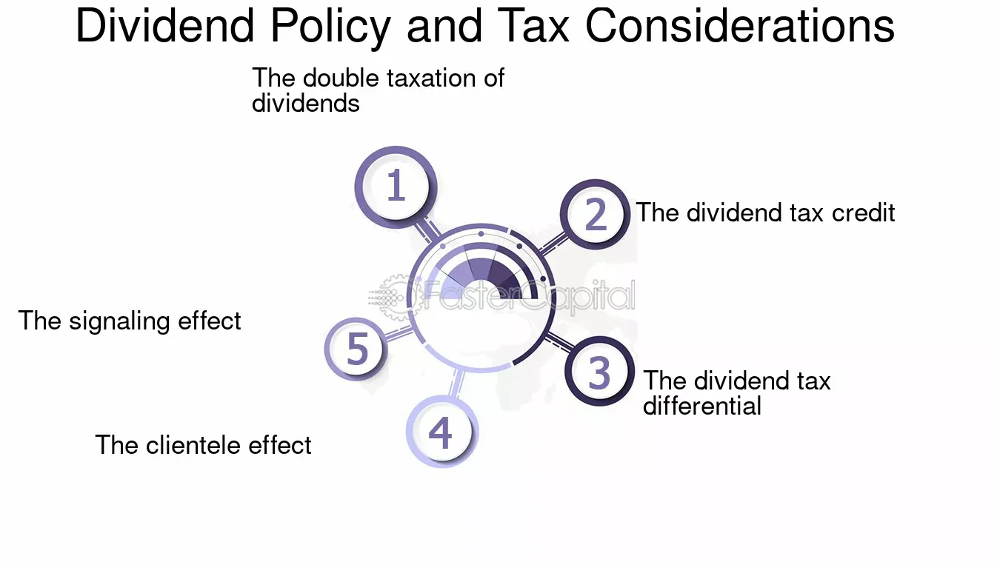

## Table of Contents

## What is a tax differential in the context of dividend policy?

A tax differential in the context of dividend policy refers to the difference in tax rates that shareholders pay on dividends versus capital gains. When a company pays out dividends, shareholders receive this money and must pay taxes on it according to their personal income tax rate. On the other hand, if a company chooses to reinvest its profits instead of paying dividends, the value of the company's stock may increase, leading to capital gains for shareholders when they sell their stock. These capital gains are often taxed at a lower rate than dividends, creating a tax differential.

This tax differential can influence a company's dividend policy. If the tax on dividends is significantly higher than the tax on capital gains, shareholders might prefer the company to retain earnings and reinvest them, hoping for an increase in stock value. This way, they can benefit from lower taxes on their gains when they decide to sell their shares. Companies are aware of these preferences and may adjust their dividend policies to maximize shareholder value by considering the tax implications for their investors.

## How does tax differential affect a company's decision to pay dividends?

Tax differential can play a big role in whether a company decides to pay dividends or not. When the tax on dividends is higher than the tax on capital gains, shareholders might not want the company to pay out dividends. They would rather the company keep the money and use it to grow the business. If the business grows, the value of the stock goes up. When shareholders sell their stock later, they pay a lower tax on the profit they make, which is called capital gains. So, if the tax on dividends is much higher, companies might choose to pay fewer dividends to make their shareholders happier.

On the other hand, if the tax on dividends is not much different from the tax on capital gains, or if it's even lower, companies might be more likely to pay dividends. Shareholders might like getting regular payments from the company, and if the tax on these payments isn't too high, it can be a good deal for them. Companies look at these tax differences and try to make the best choice for their shareholders. By understanding what their shareholders want and how taxes affect them, companies can decide whether to pay dividends or keep the money to grow the business.

## What are the differences between tax rates on dividends and capital gains?

Tax rates on dividends and capital gains can be different, and this difference can affect how much money people keep after paying taxes. Dividends are payments that companies make to their shareholders from their profits. When shareholders get these payments, they have to pay taxes on them. The tax rate on dividends depends on the country and the person's income level. In many places, dividends are taxed at the same rate as regular income, which can be pretty high.

Capital gains are the profits people make when they sell something, like a stock, for more than they paid for it. The tax rate on capital gains is often lower than the tax rate on dividends. This is because many countries want to encourage people to invest in things like stocks and real estate. So, if someone buys a stock and sells it later for a profit, they will pay a lower tax on that profit than they would on dividends. This difference in tax rates can make a big impact on how much money people end up with after taxes.

In some countries, there are special rules that can change these tax rates. For example, some places have a lower tax rate on "qualified dividends," which are dividends that meet certain requirements. Also, how long someone holds onto an investment before selling it can affect the capital gains tax rate. If they hold it for a long time, they might pay an even lower tax rate on the profit. These rules can make the tax situation more complicated, but the basic idea is that capital gains are often taxed less than dividends.

## Can you explain the concept of double taxation and its impact on dividend policy?

Double taxation happens when the same money gets taxed twice. In the case of dividends, the company first pays taxes on its profits. Then, when the company gives some of those profits to shareholders as dividends, the shareholders have to pay taxes on that money too. This means the same money is taxed once at the company level and again at the shareholder level. It can make shareholders unhappy because they end up with less money after taxes.

Because of double taxation, companies might think twice before paying dividends. If the company knows that shareholders will have to pay a lot of taxes on the dividends, it might decide to keep the money instead. The company could use that money to grow the business, which might make the stock price go up. Shareholders could then sell their stock later and pay a lower tax on the profit they make. So, double taxation can push companies to pay fewer dividends and focus more on growing the business to help their shareholders save on taxes.

## How do tax laws in different countries influence dividend policies?

Tax laws in different countries can really change how companies decide to pay dividends. In some countries, the tax on dividends is high, so companies might choose to keep their profits and use them to grow the business instead of paying them out. This way, shareholders can sell their stocks later and pay a lower tax on the profit they make. For example, in the United States, dividends are often taxed at a lower rate than regular income, but they are still taxed twice - once at the company level and again when shareholders get them. This double taxation can make companies think twice about paying dividends.

In other countries, the tax on dividends might be lower or there might be special rules that make dividends more attractive. For instance, some countries have a system called imputation, where shareholders get a credit for the taxes the company already paid on its profits. This can make dividends more appealing because shareholders don't have to pay as much tax on them. So, companies in these countries might be more likely to pay dividends because it's a good deal for their shareholders. Overall, the way tax laws are set up in different places can lead companies to choose different dividend policies to make their shareholders happy and save on taxes.

## What is the dividend tax credit and how does it work?

The dividend tax credit is a way to help people who get dividends pay less tax. It's like a discount on the taxes they owe on the money they get from dividends. Some countries use this system to make it fairer for people who own stocks. When a company makes money, it pays taxes on that money. Then, if the company gives some of that money to its shareholders as dividends, the shareholders also have to pay taxes on it. The dividend tax credit gives shareholders a break on their taxes to make up for the fact that the money was already taxed once at the company level.

In countries that use the dividend tax credit, the government gives shareholders a credit for the taxes the company already paid. This credit reduces the amount of tax the shareholders have to pay on their dividends. For example, if a company paid $10 in taxes on its profits and then gave those profits to shareholders as dividends, the shareholders might get a $10 credit on their taxes. This means they pay less tax on the dividends they receive. The idea is to avoid double taxation, where the same money gets taxed twice, and to make it more attractive for people to invest in stocks.

## How do investors' tax brackets influence their preference for dividends versus capital gains?

Investors' tax brackets can really change how they feel about getting dividends or making money from selling stocks, which is called capital gains. If someone is in a high tax bracket, they might not like dividends as much. This is because dividends are often taxed at the same rate as regular income, which can be high for people in higher tax brackets. So, if they get a lot of dividends, they might have to pay a big chunk of it in taxes. On the other hand, capital gains are usually taxed at a lower rate. So, people in high tax brackets might prefer it if the company keeps the money and uses it to grow the business, hoping the stock price goes up. Then, they can sell their stocks later and pay less tax on the profit.

For people in lower tax brackets, the difference might not be as big. They might not mind getting dividends because the tax they have to pay on them isn't as high. Sometimes, the tax on dividends can even be lower than the tax on capital gains for people in the lowest tax brackets. So, these investors might be happy to get regular payments from the company as dividends. In the end, it all depends on how much tax someone has to pay. Companies try to understand what their investors want and might change their dividend policies to make everyone happy.

## What role does the tax differential play in the dividend clientele effect?

The tax differential is a big part of the dividend clientele effect. This effect says that different groups of investors, or "clienteles," like different kinds of dividend policies because of their tax situations. If the tax on dividends is a lot higher than the tax on capital gains, investors who are in high tax brackets might not want dividends. They would rather the company keep the money and use it to grow the business. This way, the stock price might go up, and they can sell their stocks later and pay less tax on the profit they make.

On the other hand, investors in lower tax brackets might not mind getting dividends. The tax they have to pay on dividends might not be as high for them, so they might like getting regular payments from the company. Because of these different tax situations, companies might choose a dividend policy that fits what their investors want. If a company knows its investors are in high tax brackets, it might pay fewer dividends. But if its investors are in lower tax brackets, it might pay more dividends. This way, the company can make its shareholders happy by considering the tax differential.

## How have changes in tax legislation historically impacted dividend payout strategies?

Changes in tax laws have often made companies rethink how much they pay out in dividends. For example, in the United States, the tax rate on dividends used to be a lot higher than the tax rate on capital gains. This made companies less likely to pay dividends because shareholders would have to pay a lot of taxes on them. But in 2003, the U.S. government changed the tax laws to make the tax rate on dividends lower and more like the tax rate on capital gains. This change made dividends more attractive to shareholders, so more companies started paying them out.

Another big change happened in the UK with the introduction of the dividend tax credit system. This system gave shareholders a credit for the taxes the company already paid on its profits, which made dividends more appealing. When the UK government changed this system in 2016 and started taxing dividends more like regular income, it made dividends less attractive again. Companies had to adjust their dividend policies to fit the new tax rules and keep their shareholders happy. These examples show how tax laws can push companies to change their dividend strategies to help their shareholders save on taxes.

## What are the implications of tax differential for multinational corporations' dividend policies?

Multinational corporations have to deal with different tax laws in the countries where they operate. This can make their decisions about paying dividends more complicated. If the tax on dividends is high in one country but low in another, the company might choose to pay more dividends in the country with lower taxes. This way, shareholders in that country can keep more of their money after taxes. But it's not always easy to do this because the company has to think about what all its shareholders want, not just the ones in one country.

To make things even trickier, some countries have special rules like dividend tax credits that can make dividends more attractive. If a multinational corporation knows that shareholders in one country will get a tax credit for the dividends they receive, it might decide to pay more dividends there. But if another country has high taxes on dividends without any credits, the company might pay fewer dividends there. In the end, multinational corporations have to balance the tax laws in different countries and try to make the best choice for all their shareholders.

## How can companies use tax-efficient dividend strategies to maximize shareholder value?

Companies can use tax-efficient dividend strategies to help their shareholders keep more money after taxes. One way to do this is by understanding the tax laws in the countries where their shareholders live. If the tax on dividends is high in one country, the company might choose to pay fewer dividends there. Instead, it could keep the money and use it to grow the business, which might make the stock price go up. Then, shareholders can sell their stocks later and pay a lower tax on the profit they make. This can be a good deal for shareholders in high tax brackets who don't want to pay a lot of taxes on dividends.

Another way companies can help their shareholders is by taking advantage of special tax rules. Some countries have a system called a dividend tax credit, which gives shareholders a break on their taxes for the dividends they get. If a company knows its shareholders will get this credit, it might decide to pay more dividends. This can make shareholders happy because they end up with more money after taxes. By understanding what their shareholders want and how taxes affect them, companies can choose the best dividend strategy to make everyone happy and maximize shareholder value.

## What advanced modeling techniques can be used to analyze the impact of tax differential on dividend policy?

Companies can use advanced modeling techniques like regression analysis to understand how tax differences affect their dividend policies. Regression analysis helps them see how changes in tax rates on dividends and capital gains might change how much they pay out in dividends. By looking at past data, companies can predict what might happen if tax laws change. They can also use this technique to see how different groups of shareholders might react to changes in dividend policies based on their tax situations. This helps companies make smart choices about paying dividends that will make their shareholders happy and keep them from paying too much in taxes.

Another useful technique is simulation modeling. This lets companies create different scenarios to see how changes in tax laws could affect their dividend decisions. For example, they can simulate what would happen if the tax on dividends went up or down and see how that might change their dividend policy. Simulation modeling can also help companies understand how their shareholders in different countries might react to these changes. By running these simulations, companies can find the best way to pay dividends that will help their shareholders save on taxes and keep more of their money.

## References & Further Reading

[1]: Black, F. (1976). ["The Dividend Puzzle."](https://www.fecos.nfkatzke.com/Papers/Dividend_Puzzle.pdf) The Journal of Portfolio Management, 2(2), 5-8.

[2]: Elton, E. J., & Gruber, M. J. (1970). ["Marginal Stockholder Tax Rates and the Clientele Effect."](https://www.researchgate.net/publication/24093020_Marginal_Stockholder_Tax_Rates_and_the_Clientele_Effect) The Review of Economics and Statistics, 52(1), 68-74.

[3]: Brennan, M. J. (1970). ["Taxes, Market Valuation and Corporate Financial Policy."](https://www.jstor.org/stable/41792223?item_view=read_online) National Tax Journal, 23(4), 417-427.

[4]: Frankfurter, G. M., & Wood, B. G. (2002). ["Dividend Policy Theories and Their Empirical Tests."](https://www.sciencedirect.com/science/article/abs/pii/S1057521902000716) International Review of Financial Analysis, 11(2), 111-138.

[5]: Narang, R. K. (2009). ["Inside the Black Box: The Simple Truth About Quantitative Trading."](https://onlinelibrary.wiley.com/doi/book/10.1002/9781118267738) John Wiley & Sons.