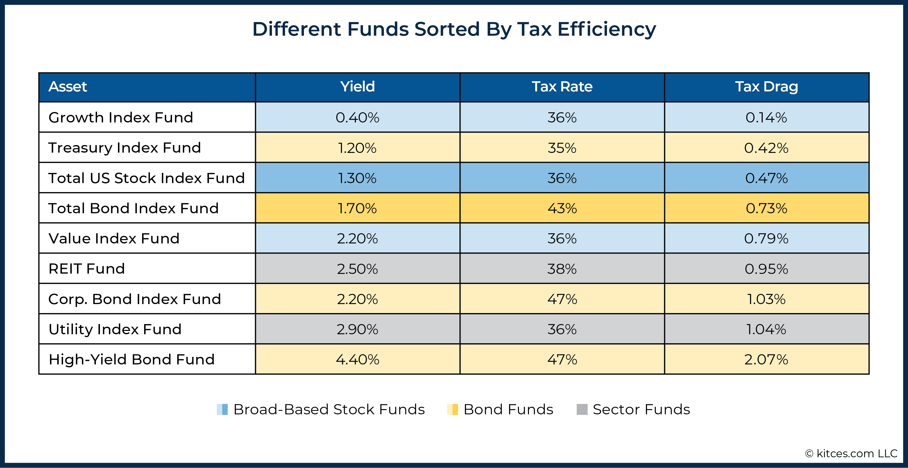

## Table of Contents

## What are tax-efficient funds?

Tax-efficient funds are investment funds designed to help investors keep more of their earnings by minimizing the taxes they have to pay. These funds often invest in assets that generate lower levels of taxable income, like stocks that pay little or no dividends. They also use strategies to reduce the amount of capital gains they distribute to investors, which can be taxed. By doing this, tax-efficient funds aim to increase the overall return for investors after taxes.

One common type of tax-efficient fund is an index fund, which tries to match the performance of a market index like the S&P 500. Index funds usually have lower turnover, meaning they buy and sell securities less often. This results in fewer taxable events, helping to keep taxes down. Another strategy used by tax-efficient funds is tax-loss harvesting, where the fund sells securities at a loss to offset any gains, reducing the overall tax burden. These methods make tax-efficient funds a smart choice for investors looking to grow their wealth while minimizing their tax liability.

## How do tax-efficient funds work?

Tax-efficient funds work by investing in ways that help you pay less in taxes. They often choose stocks that don't pay much in dividends because dividends can be taxed. Instead, they might focus on stocks that grow in value over time. When these stocks are sold, any profit is called a capital gain. If you hold onto these stocks for more than a year, the tax on the gain is usually lower than the tax on dividends.

These funds also use smart strategies to keep your taxes down. One strategy is called tax-loss harvesting. This means the fund sells stocks that have lost value to offset any gains from other stocks. By doing this, the fund can reduce the amount of taxes you owe. Another way they save on taxes is by not trading stocks too often. When funds buy and sell a lot, it can create more taxable events. By keeping trading low, tax-efficient funds help you keep more of your money.

## What are the different types of tax-efficient funds?

Tax-efficient funds come in different types, each with its own way of helping you save on taxes. One common type is the index fund. Index funds try to match the performance of a big group of stocks, like the S&P 500. They don't trade stocks very often, which means fewer times you have to pay taxes. Another type is the tax-managed fund. These funds are run by managers who use special strategies, like tax-loss harvesting, to lower the taxes you have to pay. They might sell stocks that have lost value to offset gains from other stocks, which can reduce your tax bill.

Another type of tax-efficient fund is the exchange-traded fund ([ETF](/wiki/etf-trading-strategies)). ETFs are similar to index funds but can be bought and sold like stocks during the trading day. They often have lower turnover, which means fewer taxable events. Some ETFs are specifically designed to be tax-efficient, focusing on stocks that grow in value rather than paying dividends. Lastly, there are municipal bond funds. These funds invest in bonds issued by local governments, and the interest from these bonds is often tax-free at the federal level, and sometimes at the state level too. This makes them a good choice if you want to earn income without paying much in taxes.

## What are the benefits of investing in tax-efficient funds?

Investing in tax-efficient funds can help you keep more of your money. These funds are designed to lower the amount of taxes you have to pay on your investments. By focusing on stocks that grow in value instead of paying dividends, tax-efficient funds can reduce the taxes you owe. They also use smart strategies like tax-loss harvesting, where they sell stocks at a loss to offset any gains, which can lower your overall tax bill. This means more of your investment returns stay in your pocket, helping your wealth grow faster.

Another benefit of tax-efficient funds is that they often have lower turnover. This means they don't buy and sell stocks as often as other funds, which can lead to fewer taxable events. When funds trade a lot, it can create more times you have to pay taxes. By keeping trading low, tax-efficient funds help you save on taxes. This can be especially helpful if you're in a high tax bracket, where every bit of tax savings counts. Overall, tax-efficient funds are a smart choice if you want to grow your investments while keeping your tax bill down.

## Who should consider investing in tax-efficient funds?

People who want to keep more of their investment earnings should think about tax-efficient funds. These funds are good for anyone who wants to grow their money without paying a lot in taxes. If you're in a high tax bracket, tax-efficient funds can help you save even more on taxes. They're also a smart choice if you're investing for the long term, like for retirement, because they focus on stocks that grow in value over time.

Tax-efficient funds can be helpful for anyone, but they're especially useful for people who already have a lot of investments. If you have a big portfolio, using tax-efficient funds can make a big difference in how much you pay in taxes each year. Even if you're just starting to invest, choosing tax-efficient funds can set you up for better returns in the future by keeping more of your money working for you.

## How do tax-efficient funds compare to other investment options?

Tax-efficient funds are different from other investment options because they focus on helping you pay less in taxes. For example, regular mutual funds might trade a lot and pay out dividends, which can lead to more taxes. But tax-efficient funds, like index funds or tax-managed funds, trade less and choose stocks that grow in value instead of paying dividends. This means you pay less in taxes and keep more of your money. They also use smart strategies like tax-loss harvesting to lower your tax bill even more.

Other investment options, like actively managed funds, might try to beat the market but can have higher turnover and more taxable events. This can mean more taxes for you. On the other hand, tax-efficient funds aim to grow your wealth over time while keeping your taxes low. They're a good choice if you want to save on taxes and still grow your money. But if you're looking for quick gains or are okay with paying more in taxes, other types of investments might be better for you.

## What are the tax implications of investing in tax-efficient funds?

Investing in tax-efficient funds can help you pay less in taxes. These funds focus on stocks that grow in value instead of paying dividends. When you sell these stocks after holding them for more than a year, you pay a lower tax rate on the profit, called a capital gain. Tax-efficient funds also use a strategy called tax-loss harvesting. This means they sell stocks that have lost value to offset any gains from other stocks, which can lower the amount of taxes you owe. By doing this, tax-efficient funds help you keep more of your investment earnings.

However, tax-efficient funds are not completely tax-free. You might still have to pay some taxes, especially if the fund does have to distribute any capital gains. But compared to other types of investments, like regular mutual funds that trade a lot and pay out dividends, tax-efficient funds usually result in a lower tax bill. This makes them a good choice if you want to grow your money while keeping your taxes down.

## How can one evaluate the performance of tax-efficient funds?

To evaluate the performance of tax-efficient funds, you should look at how much money the fund makes after taxes. This is called the after-tax return. You can find this information in the fund's performance reports. These reports show how the fund has done over different periods, like one year, three years, or five years. It's important to compare the after-tax return of the tax-efficient fund to other funds or investments to see if it's doing a good job at saving you money on taxes.

Another way to evaluate tax-efficient funds is by looking at the fund's turnover rate. This tells you how often the fund buys and sells stocks. A lower turnover rate means fewer taxable events, which can help keep your taxes down. You can also check if the fund uses strategies like tax-loss harvesting, which can lower your tax bill. By looking at these things, you can get a good idea of how well the tax-efficient fund is working to help you keep more of your investment earnings.

## What strategies do fund managers use to maximize tax efficiency?

Fund managers use several strategies to make their funds more tax-efficient. One common strategy is choosing stocks that grow in value instead of paying dividends. When these stocks are sold after being held for more than a year, the profit is taxed at a lower rate as a long-term capital gain. This helps investors keep more of their earnings. Another strategy is tax-loss harvesting, where the fund manager sells stocks that have lost value to offset any gains from other stocks. This can lower the overall tax bill for investors.

Another way fund managers maximize tax efficiency is by keeping the fund's turnover rate low. This means they don't buy and sell stocks very often, which leads to fewer taxable events. When funds trade a lot, it can create more times that investors have to pay taxes. By keeping trading low, fund managers help investors save on taxes. These strategies together help make the fund more tax-efficient, allowing investors to grow their wealth while paying less in taxes.

## What are the potential risks associated with tax-efficient funds?

Tax-efficient funds can help you save on taxes, but they also come with some risks. One risk is that these funds might not perform as well as other types of investments. Because they focus on keeping taxes low, they might miss out on some good investment opportunities that could make more money. For example, they might not invest in stocks that pay high dividends, even if those stocks could grow a lot in value.

Another risk is that tax-efficient funds can still have some tax costs. Even though they try to keep taxes low, they might still have to pay some taxes on capital gains if they need to sell stocks. This means you could still owe some taxes, even if it's less than with other funds. It's important to look at the after-tax return of the fund to see if it's really saving you money on taxes.

## How have regulatory changes impacted tax-efficient funds?

Regulatory changes can affect how tax-efficient funds work. For example, changes in tax laws can change how much tax investors have to pay on their earnings. If the tax rate on capital gains goes up, tax-efficient funds might not save as much money on taxes as before. Also, new rules about what funds can invest in or how they can use strategies like tax-loss harvesting can make it harder for fund managers to keep taxes low. These changes can make tax-efficient funds less attractive to investors if they can't save as much on taxes.

On the other hand, some regulatory changes can help tax-efficient funds. If the government makes rules that encourage investing in certain types of assets, like green energy stocks, tax-efficient funds might be able to use these new opportunities to grow their investments while still keeping taxes low. It's important for investors to keep an eye on these changes and talk to a financial advisor to understand how they might affect their investments in tax-efficient funds.

## What advanced techniques can be used to optimize tax efficiency in fund management?

Fund managers can use advanced techniques like tax-lot accounting to optimize tax efficiency. This means they keep track of every stock they buy and sell, and they choose which ones to sell based on how much tax they will owe. For example, if they need to sell some stocks, they can pick the ones they bought at a higher price to reduce the amount of capital gains tax. Another technique is using ETFs instead of mutual funds. ETFs often have lower turnover, which means fewer times investors have to pay taxes. They can also be more tax-efficient because they can use a strategy called "in-kind" redemptions, where they give stocks to investors instead of cash, which can help avoid taxable events.

Another advanced technique is called "dividend capture." This is when fund managers buy stocks just before they pay dividends and then sell them right after. This way, they can get the dividend income without holding onto the stock for too long, which can help keep taxes low. Fund managers can also use options strategies to manage their investments more tax-efficiently. For example, they can use options to hedge their positions without selling stocks, which can help avoid capital gains taxes. By using these advanced techniques, fund managers can help investors keep more of their earnings and grow their wealth more effectively.

## References & Further Reading

[1]: ["The Tax-Efficient Investing Handbook"](https://www.investopedia.com/articles/stocks/11/intro-tax-efficient-investing.asp) by Joel M. Dickson and John C. Greer

[2]: ["Quantitative Trading: How to Build Your Own Algorithmic Trading Business"](https://github.com/LucindaYa/quant-resources/blob/master/Quantitative%20Trading%20How%20to%20Build%20Your%20Own%20Algorithmic%20Trading%20Business.pdf) by Ernest P. Chan

[3]: ["Advances in Financial Machine Learning"](https://www.amazon.com/Advances-Financial-Machine-Learning-Marcos/dp/1119482089) by Marcos Lopez de Prado

[4]: ["The Intelligent Investor: The Definitive Book on Value Investing"](https://www.amazon.com/Intelligent-Investor-Third-Definitive-Investing/dp/0063423537) by Benjamin Graham

[5]: ["Algorithmic Trading: Winning Strategies and Their Rationale"](https://www.amazon.com/Algorithmic-Trading-Winning-Strategies-Rationale-ebook/dp/B00CY5HC0U) by Ernie Chan

[6]: Foley, S., Karlsen, J. R., & Putniņš, T. J. (2019). ["Sex, drugs, and bitcoin: How much illegal activity is financed through cryptocurrencies?"](https://academic.oup.com/rfs/article-abstract/32/5/1798/5427781) Journal of Monetary Economics, 107, 86-111.

[7]: ["The Little Book of Common Sense Investing: The Only Way to Guarantee Your Fair Share of Stock Market Returns"](https://www.amazon.com/Little-Book-Common-Sense-Investing/dp/1119404509) by John C. Bogle