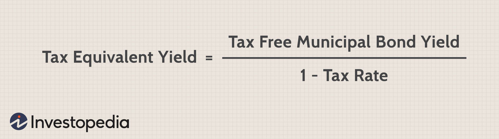

## Table of Contents

## What is tax-equivalent yield?

Tax-equivalent yield is a way to compare the returns from a tax-free investment, like a municipal bond, to a taxable investment, like a corporate bond. It helps you figure out how much a taxable bond would need to earn to match the after-tax return of a tax-free bond. This is important because the interest you earn from municipal bonds is usually not taxed by the federal government, and sometimes not by state or local governments either.

To calculate the tax-equivalent yield, you take the yield of the tax-free investment and divide it by one minus your tax rate. For example, if a municipal bond yields 3% and your tax rate is 25%, the tax-equivalent yield would be 3% divided by (1 - 0.25), which equals 4%. This means a taxable bond would need to yield 4% to give you the same after-tax return as the municipal bond. This calculation helps investors make better choices based on their own tax situation.

## Why is tax-equivalent yield important for investors?

Tax-equivalent yield is important for investors because it helps them compare different kinds of investments fairly. When you're looking at a tax-free investment like a municipal bond, it might seem like it's not earning as much money as a taxable investment like a corporate bond. But because you don't have to pay taxes on the earnings from the municipal bond, it might actually be a better deal. By using the tax-equivalent yield, investors can see how much a taxable investment would need to earn to give them the same amount of money after taxes.

This is especially helpful for people in higher tax brackets. If you pay a lot in taxes, the tax-free earnings from a municipal bond can be worth a lot more to you than the same amount of earnings from a taxable bond. Knowing the tax-equivalent yield helps you make smarter choices about where to put your money. It's like having a tool that lets you see the real value of different investments, based on how much you pay in taxes.

## How do you calculate the tax-equivalent yield?

To calculate the tax-equivalent yield, you need to know the yield of the tax-free investment and your tax rate. Let's say you have a municipal bond that yields 3%, and your tax rate is 25%. You start by taking the yield of the tax-free investment, which is 3%, and divide it by one minus your tax rate. So, you do 3% divided by (1 - 0.25). That equals 4%. This means a taxable bond would need to yield 4% to give you the same amount of money after taxes as the municipal bond.

This calculation is important because it helps you see the true value of tax-free investments. For example, if you're comparing a municipal bond to a corporate bond, the corporate bond might seem better because it has a higher yield. But after you figure out the tax-equivalent yield, you might find that the municipal bond is actually a better choice for you, especially if you're in a high tax bracket. This way, you can make smarter decisions about where to invest your money based on how much you pay in taxes.

## What is the formula for tax-equivalent yield?

The formula for tax-equivalent yield is pretty easy. You take the yield of the tax-free investment, like a municipal bond, and divide it by one minus your tax rate. For example, if a municipal bond yields 3% and your tax rate is 25%, you do 3% divided by (1 - 0.25). That equals 4%. This means a taxable bond would need to yield 4% to give you the same amount of money after taxes as the municipal bond.

This calculation is helpful because it lets you compare different kinds of investments fairly. If you're looking at a tax-free investment and a taxable one, the taxable one might seem better because it has a higher yield. But after you figure out the tax-equivalent yield, you might find that the tax-free investment is actually a better deal, especially if you pay a lot in taxes. This way, you can make smarter choices about where to put your money based on your own tax situation.

## Can you provide an example of calculating tax-equivalent yield?

Let's say you're looking at a municipal bond that yields 3%. You're in a 25% tax bracket. To find out the tax-equivalent yield, you take the 3% yield and divide it by one minus your tax rate. So, you do 3% divided by (1 - 0.25). That equals 4%. This means a taxable bond would need to yield 4% to give you the same amount of money after taxes as the municipal bond.

This calculation is really helpful because it lets you compare different kinds of investments fairly. If you're looking at a tax-free investment and a taxable one, the taxable one might seem better because it has a higher yield. But after you figure out the tax-equivalent yield, you might find that the tax-free investment is actually a better deal, especially if you pay a lot in taxes. This way, you can make smarter choices about where to put your money based on your own tax situation.

## How does tax-equivalent yield differ from taxable yield?

Tax-equivalent yield and taxable yield are two different ways to look at how much money you can make from investments. Taxable yield is the interest rate you get from an investment that you have to pay taxes on. For example, if you have a corporate bond that yields 5%, that's the taxable yield. You'll have to pay taxes on that 5%, so the actual amount of money you keep after taxes will be less.

On the other hand, tax-equivalent yield is used to figure out how much a taxable investment would need to yield to match the after-tax return of a tax-free investment, like a municipal bond. If a municipal bond yields 3% and you're in a 25% tax bracket, the tax-equivalent yield would be 4%. This means a taxable bond would need to yield 4% for you to keep the same amount of money after taxes as you would from the municipal bond. This calculation helps you compare investments more fairly by taking into account how much you pay in taxes.

## What types of investments are typically used when calculating tax-equivalent yield?

When calculating tax-equivalent yield, people usually compare municipal bonds with other types of bonds, like corporate bonds. Municipal bonds are special because the interest you earn from them is often not taxed by the federal government, and sometimes not by state or local governments either. This makes them a good choice for people who want to keep more of their investment earnings.

On the other hand, corporate bonds are taxable, which means you have to pay taxes on the interest you earn from them. To figure out if a municipal bond is a better deal than a corporate bond, you use the tax-equivalent yield. This calculation helps you see how much a corporate bond would need to earn to give you the same amount of money after taxes as the municipal bond. This way, you can make a fair comparison and choose the investment that's best for you based on your tax situation.

## How does an investor's tax bracket affect the tax-equivalent yield?

An investor's tax bracket plays a big role in figuring out the tax-equivalent yield. If you're in a higher tax bracket, you pay more taxes on the money you earn from investments like corporate bonds. This means that a tax-free investment, like a municipal bond, becomes more valuable to you because you get to keep all the earnings without paying federal taxes on them. So, when you calculate the tax-equivalent yield, a higher tax bracket will make the tax-equivalent yield higher too. This means a taxable bond would need to offer a much higher yield to match what you'd get after taxes from a municipal bond.

For example, let's say you're in a 35% tax bracket and you're looking at a municipal bond that yields 3%. When you calculate the tax-equivalent yield, you take that 3% and divide it by one minus your tax rate, which is (1 - 0.35). This comes out to about 4.62%. This means a taxable bond would need to yield 4.62% for you to end up with the same amount of money after taxes as you would from the municipal bond. If you were in a lower tax bracket, like 15%, the tax-equivalent yield would be lower, around 3.53%. So, knowing your tax bracket helps you see the real value of tax-free investments and make smarter choices about where to put your money.

## What are the limitations of using tax-equivalent yield for investment decisions?

Using tax-equivalent yield can be really helpful, but it's not perfect. One big thing to remember is that it only looks at the interest you earn from bonds. It doesn't think about other stuff that might affect your investment, like how easy it is to sell the bond if you need to, or how safe the bond is. For example, if a bond is risky and might not pay you back, the tax-equivalent yield won't tell you that. It just focuses on the taxes you'll pay, which is important but not the whole picture.

Another thing is that tax-equivalent yield assumes your tax rate stays the same, but that's not always true. Your tax situation can change over time, and that can make a big difference in how good an investment is for you. Also, this calculation doesn't think about state and local taxes, which can be important if you live in a place with high taxes. So, while tax-equivalent yield is a useful tool, it's just one piece of the puzzle when you're deciding where to invest your money.

## How can tax-equivalent yield be used to compare different investment options?

Tax-equivalent yield is a tool that helps you compare a tax-free investment, like a municipal bond, with a taxable investment, like a corporate bond. It does this by figuring out how much a taxable bond would need to earn to give you the same amount of money after taxes as the tax-free bond. For example, if a municipal bond yields 3% and your tax rate is 25%, the tax-equivalent yield would be 4%. This means a corporate bond would need to yield 4% for you to end up with the same amount of money after taxes.

This calculation is really helpful because it lets you see the true value of different investments based on your own tax situation. If you're in a high tax bracket, a tax-free investment might be a better deal for you than it would be for someone in a lower tax bracket. But remember, tax-equivalent yield only looks at the interest you earn and your federal tax rate. It doesn't think about other important stuff like how safe the investment is or if you might have to pay state or local taxes. So, while it's a useful tool, it's just one part of making smart investment choices.

## What are the tax implications of investing in securities that offer tax-equivalent yield?

When you invest in securities like municipal bonds that offer tax-equivalent yield, you don't have to pay federal taxes on the interest you earn. This can be a big deal, especially if you're in a high tax bracket. For example, if you're in a 30% tax bracket and you earn 3% from a municipal bond, you get to keep all of that 3%. If you had a corporate bond that needed to yield 4.29% to match that after taxes, you'd have to pay taxes on that 4.29%, so you'd end up with less money in your pocket.

But remember, tax-equivalent yield only looks at federal taxes. If you live in a state with high taxes, you might still have to pay state or local taxes on your municipal bond earnings, depending on where the bond is from. Also, tax-equivalent yield doesn't think about other things that might affect your investment, like how safe the bond is or how easy it is to sell. So, while it's a helpful tool to compare different investments, it's just one piece of the puzzle when you're making decisions about where to put your money.

## How do changes in tax laws impact the calculation and relevance of tax-equivalent yield?

Changes in tax laws can really shake things up when you're trying to figure out the tax-equivalent yield. If the government decides to change tax rates, it can make a big difference in how much money you keep from your investments. For example, if tax rates go up, a tax-free investment like a municipal bond becomes more valuable because you get to keep all the interest without paying federal taxes. This means the tax-equivalent yield for that bond would be higher, making it a better deal compared to a taxable investment like a corporate bond.

But it's not just about the rates. Other changes in tax laws, like new rules about what kinds of investments are tax-free or how much you can earn before you have to pay taxes, can also affect the tax-equivalent yield. These changes can make it harder to compare different investments because the rules keep shifting. That's why it's important to keep an eye on tax laws and maybe talk to a financial advisor to make sure you're making the best choices for your money based on the current rules.

## What is the understanding of bond yields?

Bond yield is a critical metric in the bond market, representing the return an investor can expect from holding a bond. It serves as an essential indicator of the income generated by bonds, reflecting both the coupon payments and any gain or loss relative to the purchase price. Bond yield is vital for investors as it helps them assess the potential profitability and risk associated with bond investments.

### Types of Bond Yields

1. **Coupon Yield**: This is the bond's annual coupon payment divided by its face value. It represents the fixed income that an investor receives annually. For example, a bond with a face value of $1,000 and a $50 annual coupon payment has a coupon yield of 5%.
$$
   \text{Coupon Yield} = \frac{\text{Annual Coupon Payment}}{\text{Face Value}}

$$

2. **Current Yield**: Current yield takes into account the bond's current market price rather than its face value. It is calculated by dividing the annual coupon payment by the bond's market price. This yield is more indicative of the bond's return if purchased at the current market price.
$$
   \text{Current Yield} = \frac{\text{Annual Coupon Payment}}{\text{Current Market Price}}

$$

3. **Yield to Maturity (YTM)**: YTM is the total return anticipated on a bond if it is held until it matures. This yield considers all future coupon payments, the face value to be received at maturity, and the current market price, providing a comprehensive measure of a bond’s profitability. YTM can be complex to calculate, often requiring iterative or numerical methods to solve.
$$
   \text{YTM} = \sum_{t=1}^{n} \frac{C}{(1 + YTM)^t} + \frac{F}{(1 + YTM)^n}

$$
   Where $C$ is the coupon payment, $F$ is the face value, $n$ is the number of periods until maturity, and $t$ is each period.

### Factors Affecting Bond Yields

Several key factors influence bond yields:

- **Interest Rates**: There is an inverse relationship between bond prices and yields. When interest rates rise, bond prices fall, leading to higher yields, and vice versa.

- **Risk Profiles**: Bonds with higher credit risk typically offer higher yields to compensate investors for the additional risk. Credit ratings from agencies like Moody’s or S&P are often used to gauge this risk.

- **Economic Conditions**: Economic indicators such as inflation, economic growth, and fiscal policies can influence bond yields. For example, high inflation often leads to rising yields as central banks might increase interest rates to combat inflation.

### Relationship with Market Fluctuations

Bond yields are sensitive to market dynamics. In times of economic uncertainty or financial market [volatility](/wiki/volatility-trading-strategies), bond yields can become more unpredictable. Investors may demand higher yields to compensate for perceived risks, impacting bond prices and their attractiveness.

### Importance for Fixed-Income Investors and Portfolio Diversification

For fixed-income investors, bond yields are a central concern. They help in evaluating the income component of bond investments and are pivotal in crafting diversified portfolios. Diversification through bonds with varying yields and maturities can help mitigate risks associated with [interest rate](/wiki/interest-rate-trading-strategies) changes and credit events, preserving capital and ensuring a stable income stream. Understanding and analyzing bond yields enable investors to make informed decisions, aligning their investment strategies with financial goals and risk tolerance.

## What is Tax-Equivalent Yield?

Tax-equivalent yield is a measure used by investors to compare the yields of taxable and tax-exempt bonds. The primary objective of tax-equivalent yield is to assess the return on a tax-exempt bond as if it were subject to taxes, enabling a direct comparison with taxable bonds. This is particularly useful for investors in higher tax brackets who may benefit more from tax-exempt bonds, such as municipal bonds, over taxable ones.

### Formula for Calculating Tax-Equivalent Yield

The tax-equivalent yield can be determined by adjusting the yield of a tax-exempt bond by the investor's marginal tax rate. The formula is presented as follows:

$$
\text{Tax-Equivalent Yield} = \frac{\text{Tax-Exempt Yield}}{1 - \text{Tax Rate}}
$$

#### Practical Example

Consider a municipal bond that offers a tax-exempt yield of 3.5%, and an investor in the 25% tax bracket. The calculation of the tax-equivalent yield is:

$$
\text{Tax-Equivalent Yield} = \frac{3.5\%}{1 - 0.25} = \frac{3.5\%}{0.75} \approx 4.67\%
$$

Thus, in order for a taxable bond to be comparable in terms of yield to this municipal bond, it must offer a yield of approximately 4.67%.

### Importance in Tax-Advantaged Investment Strategies

Understanding tax-equivalent yield is essential for constructing tax-advantaged investment strategies. It allows investors to make more informed decisions regarding which bonds may offer better after-tax returns, depending on their tax situation. For those in high tax brackets, investing in tax-exempt securities could provide a superior after-tax return compared to taxable bonds with seemingly higher yields.

### Impact of Tax Considerations on Investment Returns and Decision-Making

Tax considerations have a significant impact on investment returns. Taxes can erode a substantial portion of investment gains, especially for those in higher tax brackets. Therefore, calculating tax-equivalent yields helps investors evaluate whether the tax savings on municipal bonds or other tax-exempt securities outweigh the higher earnings potential of taxable securities. This understanding guides investors in optimizing their portfolios to enhance overall returns after accounting for taxes.

### Comparison with Other Yield Measures

While the tax-equivalent yield is invaluable when comparing the effectiveness of taxable vs. tax-exempt investments, it differs from other yield measures such as current yield, yield to maturity, or coupon yield. Unlike tax-equivalent yield, these measures do not account for tax implications and are used to evaluate different aspects of bond performance. Integrating tax-equivalent yield with these other measures ensures a comprehensive assessment of an investor's potential return profile, promoting better-informed bond selection and portfolio management decisions.

In conclusion, tax-equivalent yield serves as an essential tool for investors seeking to maximize after-tax returns by comparing taxable and tax-exempt investment options effectively. Understanding and applying this concept aids in devising robust investment strategies tailored to individual tax situations and financial objectives.

## References & Further Reading

[1]: Fabozzi, F. J., & Mann, S. V. (2012). ["The Handbook of Fixed Income Securities"](https://www.mhebooklibrary.com/doi/book/10.1036/9781260473902?contentTab=true). McGraw-Hill Education.

[2]: Kidwell, D. S., Blackwell, D. W., Whidbee, D. A., & Sias, R. W. (2016). ["Financial Institutions, Markets, and Money"](https://books.google.com/books/about/Financial_Institutions_Markets_and_Money.html?id=WaKVDQAAQBAJ). Wiley.

[3]: Lopez de Prado, M. (2018). ["Advances in Financial Machine Learning"](https://www.amazon.com/Advances-Financial-Machine-Learning-Marcos/dp/1119482089). Wiley.

[4]: Chan, E. P. (2009). ["Quantitative Trading: How to Build Your Own Algorithmic Trading Business"](https://github.com/ftvision/quant_trading_echan_book). Wiley.

[5]: Jansen, S. (2018). ["Machine Learning for Algorithmic Trading"](https://github.com/stefan-jansen/machine-learning-for-trading). Packt Publishing.