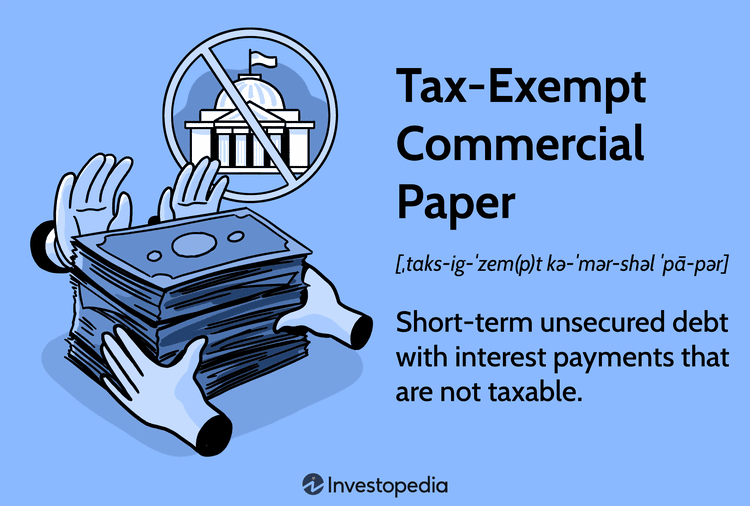

## Table of Contents

## What is tax-exempt commercial paper?

Tax-exempt commercial paper is a type of short-term debt that companies issue to raise money quickly. It's called "tax-exempt" because the interest earned by investors who buy this paper is not taxed by the government. This makes it attractive to investors because they get to keep all the interest they earn.

Companies often use tax-exempt commercial paper to finance projects that benefit the public, like building schools or hospitals. Because these projects are for the public good, the government allows the interest on the paper to be tax-free. This helps companies borrow money at a lower cost, since investors are willing to accept lower interest rates in exchange for not having to pay taxes on the interest they earn.

## How does tax-exempt commercial paper differ from regular commercial paper?

Tax-exempt commercial paper and regular commercial paper are both short-term debt instruments that companies use to borrow money quickly. The main difference between them is how the interest earned by investors is treated for tax purposes. With regular commercial paper, the interest that investors earn is taxable, meaning they have to pay taxes on it. On the other hand, with tax-exempt commercial paper, the interest earned by investors is not taxed by the government.

This tax advantage makes tax-exempt commercial paper more attractive to investors because they get to keep all the interest they earn. As a result, companies can often borrow money at a lower interest rate with tax-exempt commercial paper compared to regular commercial paper. Companies usually issue tax-exempt commercial paper to finance projects that benefit the public, like building schools or hospitals, which is why the government allows the interest to be tax-free.

## Who typically issues tax-exempt commercial paper?

Tax-exempt commercial paper is usually issued by companies or organizations that are working on projects that help the public. These can include building schools, hospitals, or other facilities that many people use. The government lets these companies borrow money without taxing the interest because the projects are good for the community.

These companies often work with special organizations called municipal bond conduits. These conduits help the companies issue the tax-exempt commercial paper. This makes it easier for the companies to get the money they need for their public projects, and it also helps investors who want to earn tax-free interest.

## What are the benefits of investing in tax-exempt commercial paper?

Investing in tax-exempt commercial paper can be a good choice for people who want to earn interest without paying taxes on it. When you buy tax-exempt commercial paper, the interest you earn is not taxed by the government. This means you get to keep all the money you make from the interest, which can be a big advantage, especially if you are in a high tax bracket.

Another benefit is that tax-exempt commercial paper is often used to fund projects that help the community, like building schools or hospitals. By investing in this type of paper, you are helping to support these important projects. Plus, because the interest is tax-free, companies can offer lower interest rates, which can make it a safer and more stable investment compared to other types of short-term debt.

## What are the risks associated with tax-exempt commercial paper?

Even though tax-exempt commercial paper has benefits, there are risks to consider. One risk is that the company issuing the paper might not be able to pay back the money they borrowed. If the company runs into financial trouble, you might not get your money back, or you might get it back late. This is called default risk, and it's something to think about before you invest.

Another risk is that tax-exempt commercial paper is not very liquid. This means it can be hard to sell the paper quickly if you need your money back fast. You might have to wait until the paper matures to get your money, which could take a few months. If you need your money sooner, this could be a problem.

Overall, while tax-exempt commercial paper can offer good returns without taxes, it's important to understand these risks. Make sure you only invest money you can afford to keep tied up for a while, and be aware that there's always a chance the company might not be able to pay you back.

## How is the interest on tax-exempt commercial paper treated for tax purposes?

The interest you earn from tax-exempt commercial paper is not taxed by the government. This means you get to keep all the money you make from the interest, without having to pay any taxes on it. This is a big advantage, especially if you are in a high tax bracket, because it lets you keep more of your earnings.

The reason the interest is tax-free is that tax-exempt commercial paper is usually used to fund projects that help the public, like building schools or hospitals. The government wants to encourage these kinds of projects, so they allow the interest to be tax-exempt. This makes the paper more attractive to investors and helps companies borrow money at a lower cost.

## What are the typical maturities for tax-exempt commercial paper?

Tax-exempt commercial paper usually has short maturities. This means it doesn't take long for the paper to reach the date when the company has to pay back the money they borrowed. Most tax-exempt commercial paper matures in a few months, often between 270 days and one year.

Because the maturities are short, tax-exempt commercial paper is a good choice for investors who want to earn some interest without tying up their money for a long time. It's a way to get a quick return on your investment while helping to fund important public projects.

## How does the credit rating affect tax-exempt commercial paper?

The credit rating of a company that issues tax-exempt commercial paper is really important. It tells investors how likely the company is to pay back the money they borrowed. If a company has a high credit rating, it means they are seen as reliable and less likely to have trouble paying back their debts. This makes investors feel safer about lending them money, so the company can offer lower interest rates on their tax-exempt commercial paper.

On the other hand, if a company has a low credit rating, it means they are seen as riskier. Investors might worry that the company won't be able to pay back the money, so they will want a higher interest rate to make up for the risk. This can make it harder for the company to borrow money because they have to pay more in interest. So, a good credit rating can help a company get better terms when they issue tax-exempt commercial paper.

## What role do dealers and brokers play in the market for tax-exempt commercial paper?

Dealers and brokers are important in the market for tax-exempt commercial paper. They help companies sell their paper to investors. When a company wants to issue tax-exempt commercial paper, they often work with dealers who buy the paper from the company and then sell it to investors. This makes it easier for the company to find people who want to buy their paper.

Brokers also help by connecting investors with the companies that issue the paper. They know a lot about the market and can help investors find good deals. Brokers can also help investors sell their tax-exempt commercial paper if they need to get their money back before the paper matures. This makes the market more active and helps both companies and investors.

## How does the issuance process of tax-exempt commercial paper work?

When a company wants to issue tax-exempt commercial paper, they start by working with a special organization called a municipal bond conduit. This conduit helps the company get ready to issue the paper. The company tells the conduit about the public project they want to fund, like building a school or a hospital. The conduit then helps the company set up the paperwork and make sure everything follows the rules for tax-exempt paper.

Once everything is ready, the company works with dealers to sell the paper. Dealers buy the paper from the company and then sell it to investors. This makes it easier for the company to find people who want to buy their paper. The dealers help set the interest rate and the maturity date, which is usually between 270 days and one year. Investors buy the paper because they want to earn tax-free interest, and the company gets the money they need to start their public project.

## What regulatory considerations must be taken into account when issuing tax-exempt commercial paper?

When a company wants to issue tax-exempt commercial paper, they have to follow certain rules set by the government. One important rule is that the money raised from the paper must be used for projects that help the public, like building schools or hospitals. The government wants to make sure the tax-exempt status is used to support these kinds of projects. The company also needs to work with a special organization called a municipal bond conduit, which helps make sure everything follows the rules.

Another key part of the regulatory process is making sure the company gives clear information to investors. They have to tell investors about the project they are funding and any risks involved. The company also has to make sure the interest they pay on the paper stays tax-exempt, which means they have to keep following the rules even after the paper is issued. If they don't follow the rules, the interest could become taxable, which would be a big problem for investors.

## How have market trends and economic conditions influenced the use of tax-exempt commercial paper in recent years?

In recent years, the use of tax-exempt commercial paper has been influenced a lot by market trends and economic conditions. When the economy is doing well, companies feel more confident about borrowing money to start new projects. This means more tax-exempt commercial paper is issued because companies want to build things like schools and hospitals. Also, when interest rates are low, it's cheaper for companies to borrow money, so they issue more tax-exempt commercial paper. Investors like this because they can earn good returns without paying taxes on the interest.

On the other hand, when the economy is not doing well, companies might be more careful about borrowing money. They might issue less tax-exempt commercial paper because they are worried about being able to pay it back. During times like these, investors might also be more cautious and look for safer places to put their money. But even in tough times, tax-exempt commercial paper can still be popular because it's a short-term investment and the interest is tax-free, which can be a big draw for investors.

## References & Further Reading

[1]: Krishnan, C. N. V., & Ritchken, P. (2008). ["On the Role of Arbitrageurs in a Tax-Exempt Market."](https://papers.ssrn.com/sol3/papers.cfm?abstract_id=970997) Journal of Financial and Quantitative Analysis, 43(6), 1287-1313.

[2]: Barclay, M. J., Hendershott, T., & McCormick, D. T. (2003). ["Competition Among Trading Venues: Information and Trading on Electronic Communications Networks."](https://www.jstor.org/stable/3648206) The Journal of Finance, 58(6), 2637-2665.

[3]: Kothari, S. P., & Lester, R. (2009). ["The Role of Investment Banks in the Market for Tax-Exempt Bonds: A Financial Perspective."](https://papers.ssrn.com/sol3/papers.cfm?abstract_id=1972354) National Bureau of Economic Research.

[4]: Narang, R. K. (2013). ["Inside the Black Box: A Simple Guide to Quantitative and High-Frequency Trading."](https://www.amazon.com/Inside-Black-Box-Quantitative-Frequency/dp/1118362411) Wiley.

[5]: Chlistalla, M., & Pasquariello, P. (2005). ["Market Transparency and the Trading Structure in Tax-Exempt Debt Markets"](https://michiganross.umich.edu/faculty-research/faculty/paolo-pasquariello) Working Paper.