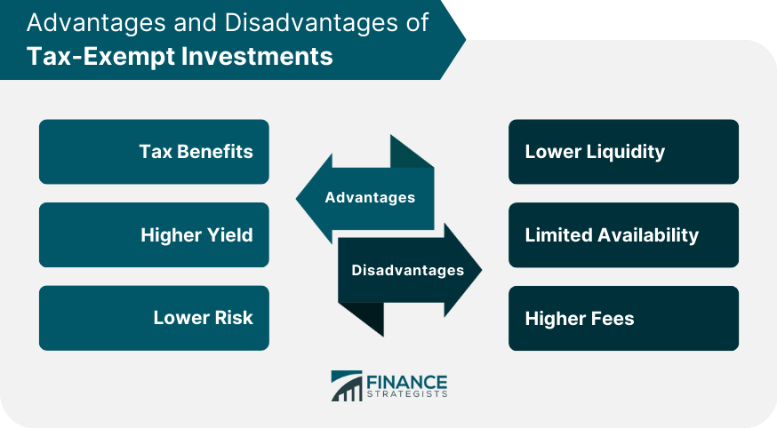

## Table of Contents

## What is the tax-exempt sector?

The tax-exempt sector includes organizations that do not have to pay certain taxes. These organizations are usually involved in activities that benefit the public, like charities, schools, and religious groups. Because they help the community, the government allows them not to pay some taxes. This can include income tax, sales tax, or property tax, depending on the rules in different places.

Being tax-exempt helps these organizations use more of their money for their main goals, like helping people or providing education. However, to stay tax-exempt, these groups must follow strict rules. They need to keep good records and show that they are really working for the public good. If they don't follow the rules, they might lose their tax-exempt status and have to start paying taxes.

## What types of organizations typically fall under the tax-exempt sector?

Organizations in the tax-exempt sector are usually those that work to help the community or serve a public purpose. This includes charities that help people in need, like food banks or shelters for the homeless. It also includes groups that focus on education, like schools and universities, which teach people and help them learn new skills. Religious organizations, such as churches, mosques, and synagogues, are also part of this sector because they provide spiritual guidance and support to their communities.

Another type of organization in the tax-exempt sector is those involved in scientific research or the arts. These groups might work on finding new medical treatments or preserving important pieces of art and culture. Nonprofit hospitals are also tax-exempt because they provide healthcare services to the public. All these organizations are allowed not to pay certain taxes because they contribute to the well-being and improvement of society.

To keep their tax-exempt status, these organizations must follow specific rules set by the government. They need to show that they are truly working for the public good and not just for private gain. This means they have to keep detailed records and report their activities regularly. If they don't follow these rules, they could lose their tax-exempt status and have to start paying taxes like other businesses.

## How does an organization qualify for tax-exempt status?

To qualify for tax-exempt status, an organization must meet certain rules set by the government. They need to show that they are working for the public good, not just for private gain. This means they should be involved in activities like helping people in need, providing education, or supporting religious practices. The organization must also follow strict rules about how they manage their money and report their activities. They need to keep good records and show that they are using their funds for their stated goals.

The process to apply for tax-exempt status involves filling out forms and sending them to the government. The organization needs to provide detailed information about what they do and how they plan to use their money. Once the government reviews the application, they decide if the organization qualifies for tax-exempt status. If approved, the organization doesn't have to pay certain taxes, like income tax or property tax, which helps them use more of their money for their main goals. If the organization doesn't follow the rules, they could lose their tax-exempt status and have to start paying taxes.

## What are the main advantages of investing in the tax-exempt sector?

Investing in the tax-exempt sector can be a smart choice because it offers some big benefits. One of the main advantages is that you don't have to pay taxes on the income you earn from these investments. This means you get to keep more of your money, which can make your investment grow faster. For example, if you invest in a tax-exempt bond, the interest you earn is not taxed, so you end up with more money in your pocket.

Another advantage is that you can feel good about where your money is going. When you invest in the tax-exempt sector, you are often supporting organizations that help the community, like schools, hospitals, or charities. This means your investment can make a positive impact on society while also potentially [earning](/wiki/earning-announcement) you a return. It's a way to do well financially while also doing good for others.

## How does tax-exempt status benefit non-profit organizations?

Tax-exempt status helps non-profit organizations a lot. When a non-profit is tax-exempt, it doesn't have to pay certain taxes like income tax or property tax. This means they can use more of their money to help people, run programs, or provide services instead of giving it to the government. For example, a charity can use the money it saves on taxes to buy more food for a food bank or pay for more teachers in a school.

Another big benefit is that tax-exempt status can make it easier for non-profits to get donations. People and businesses are often more willing to give money to organizations that are tax-exempt because they know their donations can be tax-deductible. This means donors can get some money back on their taxes, which encourages them to give more. So, tax-exempt status not only helps non-profits save money but also helps them raise more money to do their important work.

## What are the potential risks associated with investing in the tax-exempt sector?

Investing in the tax-exempt sector can have some risks. One big risk is that the investments might not make as much money as other types of investments. For example, tax-exempt bonds often pay lower interest rates than regular bonds because they don't have to pay taxes. This means you might earn less money over time. Another risk is that the organizations you invest in might lose their tax-exempt status if they don't follow the rules. If that happens, the investments could lose value or stop being tax-exempt, which could affect how much money you make.

Another risk is that the tax laws could change. The government can change the rules about what is tax-exempt, and if that happens, your investments might not be tax-exempt anymore. This could mean you have to pay taxes on the money you earn, which could be a surprise and affect your plans. It's important to keep an eye on any changes in the law and understand how they might impact your investments in the tax-exempt sector.

## How can individuals or investors contribute to tax-exempt organizations?

Individuals or investors can contribute to tax-exempt organizations in many ways. One common way is by donating money directly to these organizations. When you give money to a tax-exempt group, like a charity or a school, you can often get a tax deduction. This means you might pay less in taxes because you donated. Another way to contribute is by investing in tax-exempt bonds. These are like loans to the organization, and in return, you get interest payments that are not taxed. This can be a good way to support the organization while also earning some money.

Another way to help is by volunteering your time or skills. Many tax-exempt organizations need help with things like running events, teaching classes, or managing their finances. By volunteering, you can make a big difference without spending any money. You can also contribute by spreading the word about the organization. Telling your friends and family about the good work they do can help them get more support and donations. Every little bit helps, and there are many ways to get involved and make a positive impact.

## What are the different ways to invest in the tax-exempt sector?

One way to invest in the tax-exempt sector is by buying tax-exempt bonds. These are like loans you give to organizations like schools or hospitals. They pay you back with interest, but the special thing is that you don't have to pay taxes on that interest. This can be a good way to earn money while helping these groups do their important work. Another way is by investing in mutual funds or exchange-traded funds (ETFs) that focus on tax-exempt bonds. These funds collect money from many investors and use it to buy a bunch of different tax-exempt bonds, which can help spread out the risk.

You can also invest in the tax-exempt sector by donating money to these organizations. When you give money to a charity or a non-profit, you might be able to get a tax deduction. This means you can pay less in taxes because you donated. Some people choose to set up a donor-advised fund, which is like a special account where you can put money to give to different charities over time. This can be a smart way to manage your donations and get tax benefits. No matter how you choose to invest, it's important to do your research and understand the risks and benefits.

## How do tax-exempt bonds work and what are their benefits?

Tax-exempt bonds are like loans that you give to organizations like schools, hospitals, or local governments. When you buy a tax-exempt bond, you are lending money to these groups. They promise to pay you back the money you lent them, plus some extra money called interest. The special thing about tax-exempt bonds is that the interest you earn is not taxed by the government. This means you get to keep all the interest money, which can be a big advantage because you end up with more money in your pocket.

The main benefit of tax-exempt bonds is that they can help you save on taxes. Since the interest you earn is not taxed, you can keep more of your earnings. This can be especially helpful if you are in a high tax bracket, where you would normally have to pay a lot in taxes. Another benefit is that by investing in tax-exempt bonds, you are helping important organizations do their work. Schools can use the money to build new classrooms, hospitals can buy new equipment, and local governments can improve roads and parks. So, you can feel good about where your money is going while also getting a financial return.

## What role does the IRS play in regulating the tax-exempt sector?

The IRS, or Internal Revenue Service, is in charge of making sure that organizations in the tax-exempt sector follow the rules. When a group wants to be tax-exempt, they have to fill out forms and send them to the IRS. The IRS looks at these forms to see if the group is really working for the public good, like helping people or providing education. If everything looks good, the IRS gives the group tax-exempt status. But the IRS keeps watching to make sure these groups stay on the right path. They can check the group's records and activities at any time to make sure they are still following the rules.

If a tax-exempt group doesn't follow the rules, the IRS can take away their tax-exempt status. This means the group would have to start paying taxes like other businesses. The IRS also makes sure that the money people donate to these groups is used the right way. They want to make sure the donations are helping the community and not being used for private gain. By keeping a close eye on the tax-exempt sector, the IRS helps make sure that these organizations are doing what they're supposed to do and that they keep helping the public.

## How do changes in tax laws affect the tax-exempt sector?

When tax laws change, it can have a big impact on the tax-exempt sector. If the government decides to change what kinds of organizations can be tax-exempt, some groups might lose their special status. This means they would have to start paying taxes, which could make it harder for them to do their work. For example, if a new law says that certain types of charities can't be tax-exempt anymore, those charities might have to cut back on programs or services because they have less money.

Changes in tax laws can also affect how much money people are willing to donate to tax-exempt organizations. If the rules about tax deductions change, people might not get as much money back on their taxes for donating. This could make them less likely to give money to charities or other non-profits. When donations go down, these organizations might struggle to keep doing the important work they do for the community. So, keeping an eye on tax law changes is important for everyone involved in the tax-exempt sector.

## What advanced strategies can be used to maximize returns from tax-exempt investments?

One advanced strategy to maximize returns from tax-exempt investments is to carefully choose the right mix of tax-exempt bonds. This means looking at different bonds from various organizations, like schools, hospitals, or local governments, and [picking](/wiki/asset-class-picking) the ones that offer the best interest rates while still being safe. You can also use a strategy called laddering, where you buy bonds that mature at different times. This helps you spread out the risk and make sure you always have some money coming in. By doing this, you can keep earning interest without having to reinvest all your money at once, which can help you get a better overall return.

Another strategy is to invest in tax-exempt mutual funds or ETFs. These funds collect money from many investors and use it to buy a bunch of different tax-exempt bonds. This can help you spread out your risk because you're not putting all your money into one bond. Plus, these funds are managed by professionals who know a lot about the market, so they can help you pick the best bonds to invest in. By using these funds, you can get a good return while also making sure your money is safe. It's important to do your research and maybe talk to a financial advisor to make sure you're making the best choices for your situation.

## References & Further Reading

[1]: Bergstra, J., Bardenet, R., Bengio, Y., & Kégl, B. (2011). ["Algorithms for Hyper-Parameter Optimization."](https://papers.nips.cc/paper/4443-algorithms-for-hyper-parameter-optimization) Advances in Neural Information Processing Systems 24.

[2]: ["Advances in Financial Machine Learning"](https://www.amazon.com/Advances-Financial-Machine-Learning-Marcos/dp/1119482089) by Marcos Lopez de Prado

[3]: ["Evidence-Based Technical Analysis: Applying the Scientific Method and Statistical Inference to Trading Signals"](https://www.amazon.com/Evidence-Based-Technical-Analysis-Scientific-Statistical/dp/0470008741) by David Aronson

[4]: ["Machine Learning for Algorithmic Trading"](https://github.com/stefan-jansen/machine-learning-for-trading) by Stefan Jansen

[5]: ["Quantitative Trading: How to Build Your Own Algorithmic Trading Business"](https://www.amazon.com/Quantitative-Trading-Build-Algorithmic-Business/dp/1119800064) by Ernest P. Chan