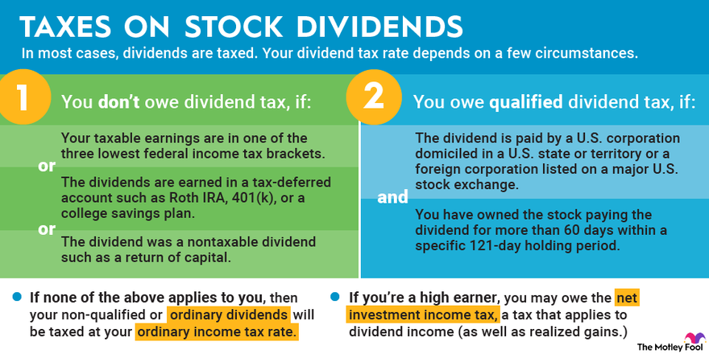

## Table of Contents

## What are dividend stocks and how do they work?

Dividend stocks are shares of companies that regularly give back some of their profits to the people who own the stocks. These payments are called dividends. Usually, companies that have been around for a long time and are making steady profits are the ones that pay dividends. When you own these stocks, you get a little bit of money every few months, which can be a nice extra income.

How dividends work is pretty simple. If you own a stock that pays dividends, the company will send you a payment based on how many shares you own. For example, if a company pays a dividend of $1 per share every quarter and you own 100 shares, you'll get $100 every three months. You can either take this money and spend it, or you can choose to reinvest it by buying more shares of the same company, which can help your investment grow over time.

## How are dividends taxed for individual investors?

When you get dividends from stocks, you have to pay taxes on them. The tax you pay depends on how much money you make in a year and what kind of dividends you get. There are two main types of dividends: qualified and non-qualified. Qualified dividends are taxed at a lower rate, similar to the tax on long-term capital gains. Non-qualified dividends are taxed at your regular income tax rate, which can be higher.

To be considered qualified, dividends must meet certain rules. They usually need to come from a U.S. company or a qualified foreign company, and you must have held the stock for a certain amount of time. If your dividends are qualified, you might pay a tax rate of 0%, 15%, or 20%, depending on your income. If they are non-qualified, they get added to your other income, and you pay tax on that total at your normal income tax rate. It's a good idea to talk to a tax professional to understand exactly how much you'll need to pay in taxes on your dividends.

## What is the difference between qualified and non-qualified dividends?

Qualified dividends and non-qualified dividends are taxed differently. Qualified dividends are taxed at a lower rate, similar to the tax on long-term capital gains. This rate can be 0%, 15%, or 20%, depending on how much money you make in a year. To be considered qualified, the dividends must come from a U.S. company or a qualified foreign company, and you must have held the stock for more than 60 days during the 121-day period that begins 60 days before the ex-dividend date.

Non-qualified dividends, on the other hand, are taxed at your regular income tax rate, which can be higher. This means they get added to your other income, and you pay tax on the total at your normal rate. The main difference between the two is how they are taxed, and this can make a big difference in how much money you get to keep after taxes. It's important to know which type of dividends you are getting so you can plan your taxes better.

## Can you explain the tax rates for qualified dividends?

The tax rates for qualified dividends depend on how much money you make in a year. There are three different rates: 0%, 15%, or 20%. If you don't make a lot of money, you might not have to pay any tax on your qualified dividends. If you make a medium amount of money, you'll pay 15%. And if you make a lot of money, you'll pay 20%.

To figure out which rate applies to you, you need to look at your taxable income. For example, if you're single and your taxable income is less than $44,625 in 2023, you won't pay any tax on your qualified dividends. If your income is between $44,626 and $492,300, you'll pay 15%. And if your income is over $492,300, you'll pay 20%. These numbers can change a bit each year, so it's good to check the latest tax rules.

## How does the holding period affect the tax treatment of dividends?

The holding period is really important when it comes to how your dividends are taxed. If you want your dividends to be taxed at the lower rate, you need to hold onto the stock for a certain amount of time. This is called the holding period. For dividends to be considered qualified, you need to own the stock for more than 60 days during the 121-day period that starts 60 days before the ex-dividend date. If you don't hold the stock for long enough, your dividends will be non-qualified and taxed at your regular income tax rate, which is usually higher.

The ex-dividend date is the day when the stock starts trading without the value of its next dividend payment. If you buy the stock on or after this date, you won't get the next dividend. So, to get the lower tax rate on your dividends, you need to buy the stock before the ex-dividend date and keep it for at least 60 days within that 121-day window. This rule helps make sure that people who are really investing in the company for the long term get the tax break, not just people who are buying and selling quickly to get the dividend.

## What are the tax implications of dividend reinvestment plans (DRIPs)?

When you use a dividend reinvestment plan (DRIP), you take the money you get from dividends and use it to buy more shares of the same company instead of getting cash. Even though you're not getting cash, you still have to pay taxes on the dividends you get. If the dividends are qualified, you'll pay the lower tax rate, which can be 0%, 15%, or 20% depending on your income. If they're non-qualified, you'll pay your regular income tax rate. So, even if you're reinvesting, you need to set aside money to pay taxes on those dividends.

The good thing about DRIPs is that they can help your investment grow over time because you're buying more shares. But remember, when you sell the shares you bought with your reinvested dividends, you might have to pay capital gains tax on any profit you make. The tax rate for capital gains depends on how long you held the shares. If you held them for more than a year, you'll pay the long-term capital gains rate, which is usually lower than your regular income tax rate. If you held them for less than a year, you'll pay the short-term capital gains rate, which is the same as your regular income tax rate.

## How do dividends impact the overall tax liability for retirees?

For retirees, dividends can be a good way to get some extra money without having to work. But they also need to think about how dividends will affect their taxes. If the dividends are qualified, they'll pay a lower tax rate on them, which can be 0%, 15%, or 20% depending on how much money they make in a year. This can be good for retirees because it might mean they don't have to pay any tax on their dividends if their income is low enough. But if the dividends are non-qualified, they'll be taxed at their regular income tax rate, which can be higher. So, it's important for retirees to know what kind of dividends they're getting.

Dividends can also affect other parts of a retiree's taxes. For example, if a retiree is getting Social Security benefits, the money from dividends might push their total income over a certain limit, which could mean they have to pay taxes on their Social Security benefits too. Also, if they're using a dividend reinvestment plan (DRIP) to buy more shares, they still have to pay taxes on the dividends they get, even if they're not getting cash. When they sell those shares later, they might have to pay capital gains tax on any profit they make. So, it's a good idea for retirees to talk to a tax professional to understand how dividends will affect their overall tax situation.

## What are the tax considerations for dividend stocks held in tax-advantaged accounts like IRAs?

When you hold dividend stocks in a tax-advantaged account like an IRA, the tax rules are different from holding them in a regular investment account. In an IRA, you don't have to pay taxes on the dividends you get each year. This means you can keep all the money from your dividends to help your investments grow without worrying about taxes right away. This can be a big advantage because it lets your money work harder for you over time.

However, you will have to pay taxes when you take money out of your IRA. If it's a traditional IRA, you'll pay regular income tax on the money you withdraw, including any dividends that were reinvested. If it's a Roth IRA, you won't have to pay any taxes on the withdrawals as long as you follow the rules, like waiting until you're 59½ years old and having the account for at least five years. So, while tax-advantaged accounts can help you save on taxes now, you need to think about what will happen when you start taking money out later.

## How can investors use tax-loss harvesting with dividend stocks?

Tax-loss harvesting is a way for investors to save on taxes by selling stocks that have lost value. If you own dividend stocks that have gone down in price, you can sell them to get a tax break. The loss you get from selling these stocks can be used to lower the taxes you owe on other income or gains. This can be really helpful if you also have dividend income or other investment gains that you need to pay taxes on.

When you use tax-loss harvesting with dividend stocks, you need to be careful about the "wash-sale" rule. This rule says you can't buy the same or a very similar stock within 30 days before or after you sell it for a loss. If you do, you can't use that loss to lower your taxes. So, if you want to keep investing in dividend stocks, you might need to wait a bit before buying back the same stock or find a different stock to invest in. This way, you can still get the tax benefits from your losses while keeping your investment strategy on track.

## What are the international tax implications of owning foreign dividend stocks?

When you own dividend stocks from companies in other countries, you need to think about taxes in two places: the country where the company is and your own country. Many countries take a little bit of tax out of the dividends before they send them to you. This is called withholding tax. The amount of withholding tax can be different depending on the country and any tax treaties between that country and your country. You might be able to get some of this tax back when you do your taxes at home, but you'll need to fill out some forms and follow the rules.

In your own country, you'll also have to pay taxes on the dividends you get from foreign stocks. The tax rate depends on whether the dividends are qualified or non-qualified, just like with U.S. stocks. If the dividends are qualified, you'll pay a lower tax rate, which can be 0%, 15%, or 20% depending on your income. If they're non-qualified, you'll pay your regular income tax rate. You might be able to use a foreign tax credit to lower your U.S. tax bill by the amount of withholding tax you paid to the other country. This can help you avoid paying taxes twice on the same money, but it can get complicated, so it's a good idea to talk to a tax professional.

## How do state taxes affect the income from dividend stocks?

When you get money from dividend stocks, you might have to pay state taxes on top of your federal taxes. Each state has its own rules about taxes, so how much you pay can be different depending on where you live. Some states don't have any income tax at all, like Florida and Texas, so you won't have to pay state taxes on your dividends if you live there. But other states do have income tax, and they might tax your dividends at the same rate as your other income.

If you live in a state that taxes income, you'll need to add up all your income, including your dividends, and then figure out how much state tax you owe. The tax rate can be different depending on how much money you make. Some states also let you use a credit for taxes you paid to other states or countries, which can help lower your state tax bill. It's a good idea to check with your state's tax department or a tax professional to understand exactly how much you'll need to pay in state taxes on your dividend income.

## What advanced strategies can investors use to minimize taxes on dividend income?

Investors can use a few smart strategies to lower the taxes they pay on dividend income. One good way is to put dividend stocks in tax-advantaged accounts like IRAs or 401(k)s. In these accounts, you don't have to pay taxes on the dividends each year. This lets your money grow without being cut down by taxes. When you take money out later, you'll pay taxes on it, but the tax rate might be lower than what you'd pay on dividends each year. Another strategy is to focus on buying stocks that pay qualified dividends. These dividends are taxed at a lower rate than non-qualified dividends, so you'll keep more of your money.

Another strategy is tax-loss harvesting. This means selling stocks that have lost value to get a tax break. You can use these losses to lower the taxes you owe on your dividend income or other gains. But you need to be careful about the wash-sale rule, which says you can't buy the same or a very similar stock within 30 days before or after you sell it for a loss. If you do, you can't use that loss to lower your taxes. So, if you want to keep investing in dividend stocks, you might need to wait a bit before buying back the same stock or find a different stock to invest in.

For investors with international dividend stocks, understanding and using foreign tax credits can also help. Many countries take a little bit of tax out of the dividends before sending them to you, but you might be able to get some of this tax back when you do your taxes at home. By claiming a foreign tax credit, you can lower your U.S. tax bill by the amount of withholding tax you paid to the other country. This can help you avoid paying taxes twice on the same money. It's a good idea to talk to a tax professional to make sure you're using all these strategies the right way and getting the most out of them.

## References & Further Reading

[1]: Kinniry, F. M., Jaconetti, C. M., DiJoseph, M. A., & Zilbering, Y. (2016). ["Tax-Efficient Equity Investing"](https://www.vanguard.co.uk/content/dam/intl/europe/documents/en/quantifying-vanguards-advisers-alpha.pdf). Vanguard Research.

[2]: Pomerleau, K. (2015). ["An Overview of Pass-Through Businesses in the United States"](https://files.taxfoundation.org/legacy/docs/TaxFoundation_SR227.pdf). Tax Foundation.

[3]: ["Investing in Dividend Stocks: Tactics & Practical Tips"](https://www.fool.com/investing/stock-market/types-of-stocks/dividend-stocks/how-to-invest-in-dividend-stocks/) by Investopedia

[4]: Damodaran, A. (2010). ["Applied Corporate Finance"](https://www.amazon.com/Applied-Corporate-Finance-Aswath-Damodaran/dp/0470384646) by Aswath Damodaran.

[5]: IRS. (2022). ["Investment Income and Expenses: Publication 550"](https://www.irs.gov/publications/p550) by Internal Revenue Service.

[6]: ["The ETF Tax Advantage"](https://www.invesco.com/us/en/insights/tax-benefits-of-etfs.html) by Francis M. Kinniry Jr., CFA Institute Financial Analysts Journal.

[7]: Ferri, R. A. (2006). ["All About Asset Allocation"](https://www.amazon.com/About-Asset-Allocation-Richard-Ferri/dp/0071429581) by Richard A. Ferri. 

[8]: ["Tax-Smart Investing: Methods and Strategies"](https://www.merrilledge.com/article/tax-smart-investment-strategies-you-should-consider) by Charles Schwab.