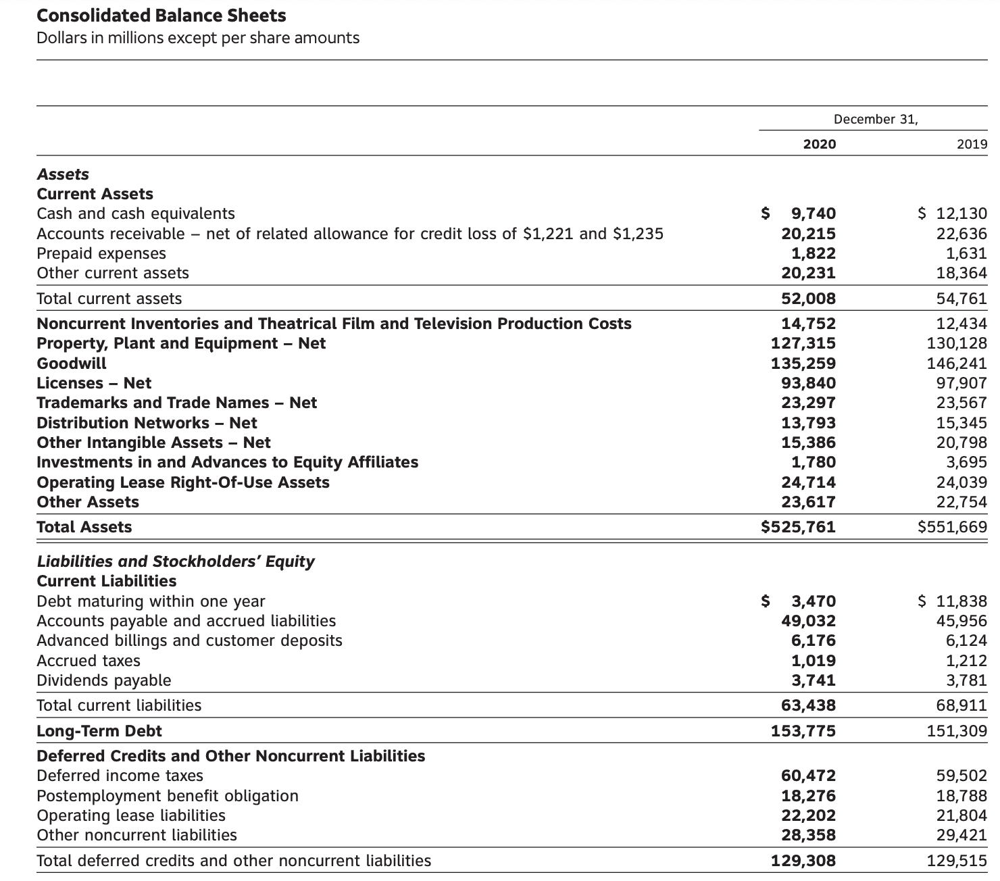

In the rapidly evolving landscape that combines finance and technology, the interplay between accounting methods, financial statements, tax liabilities, and algorithmic trading emerges as a critical area of focus. Accurate accounting methods are fundamental as they significantly influence how businesses report financial performance and obligations. Understanding these elements is not only essential for compliance but also for optimizing financial performance and strategic decision-making.

Key financial documents, such as financial statements, provide insights into a company's financial health, articulating both historical performance and current financial status. Tax liabilities, another central element, impact a company's financial standing and are directly influenced by the choice of accounting methods. These methods determine how revenue, expenses, and inventory are reported, affecting a company's tax obligations.



Moreover, the rise of algorithmic trading has introduced new dimensions to financial strategies, integrating technology with traditional accounting practices. Through algorithmic trading, firms can enhance trade execution efficiency and optimize tax outcomes. Accounting methods like FIFO (First-In, First-Out) can be coded into trading algorithms to influence capital gains reporting, thereby affecting tax liabilities. This ability to tailor accounting strategies within algorithmic frameworks highlights the potential for significant financial benefits and advanced tax efficiency.

A comprehensive understanding of these interconnected aspects allows businesses and investors to navigate complex financial landscapes effectively. By mastering the relationship between financial statements, tax strategies, and trading technologies, stakeholders can gain a strategic advantage, optimizing their financial outcomes in ever-changing market conditions.

## Table of Contents

## Understanding Financial Statements

Financial statements are essential tools in evaluating a company’s financial performance and condition. They provide structured and detailed data about a company's financial activities and are crucial for stakeholders including investors, management, and regulatory bodies. The three primary components of financial statements are the balance sheet, the income statement, and the cash flow statement. Each serves distinct functions but collectively they offer a comprehensive view of a company's financial situation.

The balance sheet is akin to a financial snapshot that captures a company's assets, liabilities, and shareholders’ equity at a specific point in time. Assets represent resources owned by the company, liabilities signify obligations, and shareholders' equity denotes the residual interest in the assets of the enterprise after deducting liabilities. The basic accounting equation that balances the balance sheet is:

$$
\text{Assets} = \text{Liabilities} + \text{Shareholders’ Equity}
$$

This equation ensures that the balance sheet is properly balanced, illustrating the fundamental financial relations within a company.

The income statement, also known as the profit and loss statement, outlines a company’s revenues, expenses, and profits over a specific reporting period. It plays a critical role in assessing a company’s operational efficiency and profitability. Key components include revenue (or sales), cost of goods sold, gross profit, operating expenses, and net income. The formula to determine net income is:

$$
\text{Net Income} = \text{Total Revenue} - \text{Total Expenses}
$$

This financial statement assists in tax assessment and is important for stakeholders interested in a company's growth potential and profit trends over time.

The cash flow statement provides insights into how a company manages its cash and [liquidity](/wiki/liquidity-risk-premium). It is divided into three main sections: operating activities, investing activities, and financing activities. This statement enables stakeholders to understand how cash is generated and used in operating the business, funding investments, and obtaining capital from investors. The cash flow statement can be expressed through the net increase or decrease in cash during a period, formulated as:

$$
\text{Net Cash Flow} = \text{Cash Flow from Operating Activities} + \text{Cash Flow from Investing Activities} + \text{Cash Flow from Financing Activities}
$$

This component is key for assessing a company's ability to generate cash, fund operations, and sustain its business model over time.

Collectively, these financial statements form an integrated framework that guides strategic financial management and reporting. They serve as a blueprint for evaluating financial health, determining valuation, and forecasting future performance, making them indispensable in informed decision-making processes for businesses and investors alike.

## Accounting for Tax Liabilities in Financial Statements

Tax liabilities are integral components of financial statements, exerting a considerable influence on a company's financial position. They are broadly categorized into deferred and current tax liabilities, each with distinct characteristics and implications.

Deferred tax liabilities originate from temporary differences between the financial reporting of income and its tax reporting. These discrepancies arise because accounting rules and tax laws recognize revenue and expenses at different times. For instance, a company may use accelerated depreciation for tax purposes but straight-line depreciation for its financial reports. Deferred tax liabilities are typically classified under long-term liabilities on the balance sheet. Their accurate assessment requires a comprehensive understanding of timing differences and applicable tax rates.

Current tax liabilities, including obligations such as sales tax and use tax, are usually classified as current liabilities on the balance sheet. These taxes influence the income statement by affecting the net income calculation. The procedure involves reflecting income before taxes, from which tax expenses are deducted to determine net income. Here's a simple illustrative formula for calculating net income:

$$
\text{Net Income} = \text{Revenue} - \text{Expenses} - \text{Taxes}
$$

The precise representation of tax liabilities in financial statements is essential for ensuring transparency and compliance with accounting standards. Under the Generally Accepted Accounting Principles (GAAP) and International Financial Reporting Standards (IFRS), organizations must disclose and explain their tax positions, including any deferred tax assets or liabilities. This disclosure is critical for stakeholders who rely on transparent reporting to assess a company's tax strategies and financial health. 

Inaccurate or inadequate representation of tax liabilities can lead to misunderstandings about a company's actual financial position and even legal repercussions for non-compliance. Therefore, meticulous tracking and reporting of these liabilities are not just best practices; they are necessary for maintaining the integrity and reliability of a company's financial reporting.

## Impact of Accounting Methods on Tax Liabilities

Different accounting methods significantly impact tax liabilities, particularly when employing inventory valuation techniques such as First-In, First-Out (FIFO) and Last-In, First-Out (LIFO). Each method varies in its approach to handling inventory costs, thus affecting taxable income and, consequently, tax liabilities.

The FIFO method assumes that the earliest goods purchased or produced are those sold first. This approach reflects current inventory at recent costs on the balance sheet, potentially leading to higher taxable income during periods of rising prices. This occurs because older, cheaper inventory costs are matched against current revenues, resulting in a higher gross profit. Suppose a company sells 100 units at a price of $20 each, with the initial purchase cost of these units being $10. Under FIFO, the cost of goods sold (COGS) would be $10 per unit, thus showing a greater profit margin and elevating tax liabilities during inflationary times.

```python
# Python example to illustrate FIFO
def fifo_cost(units_sold, purchase_costs):
    cogs = 0
    units_remaining = units_sold
    for cost in sorted(purchase_costs):
        if units_remaining <= 0:
            break
        units_to_account = min(units_remaining, purchase_costs[cost])
        cogs += units_to_account * cost
        units_remaining -= units_to_account
    return cogs

# Example Usage
purchase_costs = {10: 100}  # 100 units at $10 each
units_sold = 100
fifo_result = fifo_cost(units_sold, purchase_costs)
print(f"FIFO COGS: ${fifo_result}")  # Output: FIFO COGS: $1000
```

Conversely, the LIFO method assumes that the most recently acquired or produced inventory is sold first. In inflationary settings, this method yields higher COGS because the most recent inventory costs are often higher. LIFO can therefore decrease taxable income, leading to lower tax liabilities thanks to reduced gross margins. Using the same example, if the latest inventory cost $15 per unit, the COGS under LIFO would be $15 per unit, lowering the company's profit and tax obligations.

```python
# Python example to illustrate LIFO
def lifo_cost(units_sold, purchase_costs):
    cogs = 0
    units_remaining = units_sold
    for cost in sorted(purchase_costs, reverse=True):
        if units_remaining <= 0:
            break
        units_to_account = min(units_remaining, purchase_costs[cost])
        cogs += units_to_account * cost
        units_remaining -= units_to_account
    return cogs

# Example Usage
purchase_costs = {15: 100}  # 100 units at $15 each
units_sold = 100
lifo_result = lifo_cost(units_sold, purchase_costs)
print(f"LIFO COGS: ${lifo_result}")  # Output: LIFO COGS: $1500
```

The selection between FIFO and LIFO extends beyond tax implications, affecting overall financial metrics such as inventory turnover and net income. Businesses must assess market conditions, anticipated inflation rates, and tax policies when choosing an accounting method. Aligning inventory management with tax strategies optimizes both reporting and financial performance, enhancing a company’s strategic decision-making.

Ultimately, selecting an appropriate approach can offer strategic advantages, aligning tax obligations with corporate financial goals and successfully optimizing inventory and fiscal operations.

## Algorithmic Trading and Tax Strategies

Algorithmic trading employs automated systems to execute trades with exceptional speed and precision, presenting significant opportunities for enhancing tax efficiency. The integration of accounting methods, such as the First In, First Out (FIFO) method, into trading algorithms has a notable impact on reported capital gains and subsequent tax outcomes.

By utilizing FIFO within [algorithmic trading](/wiki/algorithmic-trading), traders can strategically manage lot selection, optimizing tax efficiency. This approach is particularly beneficial in high-frequency trading environments like [cryptocurrency](/wiki/cryptocurrency), where rapid and frequent transactions are common. FIFO assumes that the oldest inventory—or securities in this context—is sold first, which can result in variations in capital gains, thereby influencing the tax liability.

Algorithm developers have the ability to program accounting methods directly into their trading algorithms. This capability allows the algorithms to automatically adjust and adapt to evolving market conditions and changes in fiscal policies, providing traders with a flexible tool to manage their financial operations more effectively. Through this strategic integration, traders can align their trading activities with broader economic trends and tax strategies, ensuring that they are making the most informed and beneficial decisions.

Leveraging sophisticated accounting methods within algorithmic trading amplifies financial benefits while minimizing tax liabilities. For instance, by optimizing the cost of goods sold through strategic lot selection with FIFO, traders can achieve a more favorable tax position. Such advanced integration supports not only efficient trading operations but also contributes to optimal financial performance and compliance with tax regulations.

Overall, algorithmic trading, when combined with targeted accounting strategies, can significantly elevate a trader's financial outcomes, providing a competitive edge in today's fast-paced trading environments.

## Choosing Between FIFO, LIFO, and HIFO

Choosing the right accounting method for inventory or assets is a strategic decision that heavily relies on market conditions and regulatory compliance. The choice among FIFO (First-In, First-Out), LIFO (Last-In, First-Out), and HIFO (Highest-In, First-Out) can significantly impact a company’s tax liabilities and financial presentation.

LIFO, or Last-In, First-Out, is beneficial in environments where prices are rising. By assuming that the latest inventory added is sold first, LIFO increases the cost of goods sold (COGS) and consequently reduces taxable profits. This method can provide substantial tax benefits by lowering income taxes during inflationary periods. However, LIFO is prohibited under International Financial Reporting Standards (IFRS), limiting its application to jurisdictions where it is compliant, such as the United States under GAAP.

In contrast, HIFO, or Highest-In, First-Out, is particularly useful in volatile markets such as cryptocurrency trading. By focusing on the highest cost inventory, HIFO maximizes COGS, leading to higher immediate tax savings. This method requires meticulous recordkeeping as detailed transaction data is needed to accurately apply the highest cost principle for each transaction. It allows investors to decrease their tax liabilities in rapidly fluctuating markets, optimizing tax outcomes through strategic lot selection.

When choosing the appropriate accounting method, businesses and investors must evaluate their financial objectives alongside the regulatory landscape they operate within. Factors like market [volatility](/wiki/volatility-trading-strategies), price trends, and compliance with national and international accounting standards play critical roles in determining the most advantageous method. An adaptive strategy is crucial, taking into account both current and future market conditions and legislative changes.

Consultation with tax professionals is strongly recommended to tailor accounting strategies that align with specific market conditions and regulatory requirements. Professional guidance ensures compliance with tax laws while optimizing financial outcomes, providing businesses and investors with the capability to make informed and strategic decisions regarding asset management.

## Regulatory Considerations and Best Practices

Following IRS guidelines for inventory accounting methods is vital for ensuring compliance with tax laws and optimizing tax outcomes. The choice of accounting method can impact a company's financial statements and tax liabilities, so it is important to adhere to regulatory requirements.

Meticulous recordkeeping is crucial, particularly when using methods like Highest In, First Out (HIFO), which demand detailed and accurate transaction records. HIFO, often utilized in volatile markets, requires tracking inventory costs precisely to determine the highest cost inventory for tax purposes. Maintaining comprehensive documentation helps substantiate inventory costs and positions to tax authorities, ensuring transparency and compliance.

Switching between accounting methods is not merely a procedural formality; it requires formal approval from the IRS. This process involves submitting a Form 3115, Application for Change in Accounting Method, as stipulated by IRS regulations. Planning such changes strategically and ahead of time is essential to avoid potential disruptions and ensure continued compliance. Companies should assess their current and future financial situations to decide when and whether to change their accounting methods.

Professional consultation plays a key role in navigating the complexities of tax laws and effectively implementing sophisticated accounting methods. Engaging with tax professionals ensures that businesses are aware of current regulations and how they may impact their accounting strategies. Professionals can provide tailored advice on the best accounting practices that align with a company’s financial goals and regulatory obligations.

Businesses and investors must remain flexible yet compliant, adjusting strategies based on evolving tax regulations and economic conditions. Staying informed about legislative changes and economic trends enables companies to adapt their accounting practices in a timely manner. This approach helps in minimizing tax liabilities and maximizing financial performance while maintaining compliance with tax authorities.

## Conclusion

A thorough understanding of financial statements, tax liabilities, and accounting methods is essential for strategic financial management. Analyzing these financial elements enables businesses and investors to make informed decisions that affect their bottom line and regulatory compliance.

Under certain conditions, the First-In, First-Out (FIFO) inventory accounting method proves advantageous for tax efficiency. FIFO assumes that the oldest inventory is sold first, which aligns particularly well with economic environments characterized by inflation or rising prices. This method can result in a lower cost of goods sold (COGS) during inflationary periods, potentially increasing taxable income but reflecting a current inventory value closer to the market rate. By aligning inventory flows with prevailing economic conditions, FIFO can yield significant tax advantages and optimize cash flow management.

Incorporating accounting strategies into algorithmic trading can significantly enhance both tax and financial performance. Algorithmic trading platforms can be programmed to account for tax implications, integrating methods like FIFO to influence the selection of tax lots optimally. This efficiency is particularly valuable in markets with rapid trading frequencies, such as cryptocurrency, where capital gains taxes can fluctuate swiftly. Algorithms that consider these accounting methods provide traders with a precision tool to balance tax liabilities and maximize financial returns.

Continuously assessing and adapting accounting methods is crucial amidst ever-changing regulatory landscapes. By consulting professionals, businesses and investors ensure compliance and optimal financial outcomes. Professionals offer insights into complex tax codes and best practices, helping to tailor accounting strategies that meet industry-specific challenges and opportunities. Proper guidance is especially important when considering switches between methods like FIFO, Last-In, First-Out (LIFO), and Highest In, First Out (HIFO), each carrying unique tax and financial implications.

By developing proficiency in these areas, businesses and investors can effectively navigate the complexities of financial regulations and trading environments. A strategic approach to accounting methods and tax efficiency not only optimizes financial performance but also provides a competitive edge in a market increasingly driven by data and automated systems. Whether managing inventory or executing high-frequency trades, the continuous refinement of financial strategies aligns organizations with both immediate and long-term fiscal goals.

## References & Further Reading

[1]: ["Advances in Financial Machine Learning"](https://www.amazon.com/Advances-Financial-Machine-Learning-Marcos/dp/1119482089) by Marcos Lopez de Prado

[2]: ["Quantitative Trading: How to Build Your Own Algorithmic Trading Business"](https://www.amazon.com/Quantitative-Trading-Build-Algorithmic-Business/dp/1119800064) by Ernest P. Chan

[3]: Healy, P. M., & Palepu, K. G. (2001). ["Information Asymmetry, Corporate Disclosure, and the Capital Markets: A Review of the Empirical Disclosure Literature."](https://www.sciencedirect.com/science/article/pii/S0165410101000180) Journal of Accounting and Economics, 31(1-3), 405-440.

[4]: ["Evidence-Based Technical Analysis: Applying the Scientific Method and Statistical Inference to Trading Signals"](https://www.amazon.com/Evidence-Based-Technical-Analysis-Scientific-Statistical/dp/0470008741) by David Aronson

[5]: ["Machine Learning for Algorithmic Trading"](https://github.com/stefan-jansen/machine-learning-for-trading) by Stefan Jansen