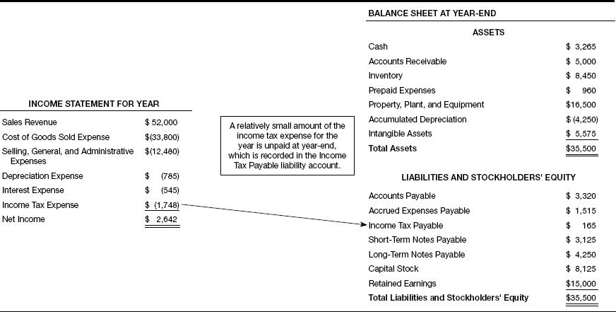

## Table of Contents

## What are tax liabilities?

Tax liabilities are the total amount of money that a person or a business owes to the government in taxes. This can include federal, state, and local taxes. When you earn money, buy things, or own property, you might have to pay taxes on those. The government uses these taxes to pay for things like roads, schools, and other public services.

If you don't pay your tax liabilities on time, you might have to pay extra money as a penalty. It's important to keep track of your taxes and pay them when they are due. You can figure out your tax liabilities by filling out tax forms or by getting help from a tax professional. They can help you understand how much you owe and make sure you pay the right amount.

## How do tax liabilities appear in financial statements?

Tax liabilities show up on a company's financial statements in a section called the balance sheet. The balance sheet is like a big picture of what the company owns and owes at a certain time. On this sheet, tax liabilities are listed under "liabilities," which means the money the company has to pay out. This could be for taxes on the money the company made, or taxes on things like property or sales.

These tax liabilities are important because they show how much money the company needs to set aside to pay its taxes. If the company doesn't set aside enough, it might have to pay extra money as a penalty. By looking at the balance sheet, people like investors or lenders can see if the company is managing its taxes well. This helps them decide if the company is a good place to put their money.

## What is the difference between current and deferred tax liabilities?

Current tax liabilities are the taxes a company has to pay soon, usually within a year. These are taxes on the money the company made this year. For example, if a company made a lot of money this year, it has to pay taxes on that money soon. These taxes are shown on the balance sheet under current liabilities because they need to be paid quickly.

Deferred tax liabilities are different. They are taxes that a company will have to pay later, not right away. This happens because of differences between how a company reports its money for taxes and how it reports it for its financial statements. For example, a company might be able to delay paying taxes on some money it made by using different rules for tax purposes. These taxes will have to be paid in the future, so they are shown on the balance sheet under long-term liabilities.

## How are tax liabilities calculated for a business?

To calculate tax liabilities for a business, you need to start by figuring out how much money the business made. This includes money from selling products or services, and any other income the business got. Then, you need to subtract the costs of running the business, like the cost of goods sold, employee salaries, rent, and other expenses. The money left after subtracting these costs is called the business's taxable income. The business then applies the tax rates from the government to this taxable income to find out how much tax it owes. This is the basic way to calculate current tax liabilities.

For deferred tax liabilities, things get a bit more complicated. These are taxes the business will have to pay in the future because of differences between how it reports its money for taxes and how it reports it for its financial statements. For example, a business might be able to delay paying taxes on some money by using different accounting rules. To calculate deferred tax liabilities, the business looks at these differences and figures out how much more tax it will have to pay later. This amount is added to the balance sheet as a long-term liability. Both current and deferred tax liabilities are important for understanding the total tax the business owes.

## What are the common types of tax liabilities a company might face?

A company might face several types of tax liabilities, including income tax, sales tax, and property tax. Income tax is what the company pays on the money it earns. This can be a big part of the company's tax bill. Sales tax is what the company collects from customers when they buy things, and the company has to send this money to the government. Property tax is what the company pays if it owns buildings or land. These taxes add up and make up the company's total tax liabilities.

Another type of tax liability is payroll tax. This is the tax the company pays on the money it gives to its employees. It includes things like Social Security and Medicare taxes. The company has to take some money out of the employees' paychecks and also pay some money itself. If a company does business in different states or countries, it might also have to pay taxes in those places. All these taxes together make up what the company owes in taxes, and they need to be paid on time to avoid penalties.

## How do changes in tax laws affect tax liabilities on financial statements?

When tax laws change, the amount of money a company has to pay in taxes can go up or down. This means the company's tax liabilities on its financial statements will change too. If the tax rates go up, the company will have to pay more taxes, so its tax liabilities will be higher. If the tax rates go down, the company will pay less, and its tax liabilities will be lower. These changes can affect how much money the company has left to spend on other things or to give to its owners.

Changes in tax laws can also affect how a company reports its taxes on its financial statements. For example, new rules might change how a company can delay paying some taxes, which affects its deferred tax liabilities. If the new rules let the company delay paying more taxes, its deferred tax liabilities will go up. If the rules make it harder to delay paying taxes, the deferred tax liabilities will go down. These changes can make the company's financial statements look different, and people who look at them, like investors, will need to understand these changes to make good decisions.

## What is the impact of tax liabilities on a company's cash flow?

Tax liabilities can have a big impact on a company's cash flow. Cash flow is the money that comes in and goes out of a company. When a company has to pay a lot in taxes, it means less money is left for other things like paying employees, buying new equipment, or expanding the business. If the company doesn't have enough money to pay its taxes, it might have to borrow money or use money that was meant for something else. This can make it harder for the company to grow and stay healthy.

Deferred tax liabilities can also affect cash flow, but in a different way. These are taxes the company will have to pay later, not right away. Even though the company doesn't have to pay these taxes now, it still needs to plan for them. The company might need to save some money each year to be ready to pay these taxes when they come due. This can mean less money to use today, but it helps the company avoid big problems in the future when the taxes need to be paid.

## How should tax liabilities be disclosed in the notes to the financial statements?

Tax liabilities should be clearly explained in the notes to the financial statements. These notes are like a detailed guide that helps people understand the numbers in the financial statements. In the notes, the company should say how much it owes in taxes right now, which is called current tax liabilities, and how much it will owe in the future, which is called deferred tax liabilities. The company should also explain why it has these tax liabilities and how it figured them out. This helps people see if the company is doing a good job of managing its taxes.

The notes should also talk about any special tax situations the company has. For example, if the company is doing business in different countries, it might have to pay taxes in those places too. The notes should explain these different taxes and how they affect the company's total tax bill. This way, people who look at the financial statements, like investors or lenders, can understand all the different taxes the company has to pay and make better decisions about the company.

## What are the accounting standards governing the reporting of tax liabilities?

The main accounting standards that govern the reporting of tax liabilities are the International Financial Reporting Standards (IFRS) and the Generally Accepted Accounting Principles (GAAP) used in the United States. IFRS uses a standard called IAS 12, which is all about how companies should report their income taxes. This standard says that companies need to show both current and deferred tax liabilities on their balance sheets. It also says that companies should explain these tax liabilities in the notes to the financial statements, so everyone can understand them better.

GAAP has its own rules for reporting tax liabilities, which are found in the Financial Accounting Standards Board (FASB) Accounting Standards Codification Topic 740. This topic talks about how companies should account for income taxes. Like IFRS, GAAP says that companies need to show current and deferred tax liabilities on their balance sheets. It also says that companies should give a lot of information about their taxes in the notes to the financial statements. This helps people who look at the financial statements understand how taxes affect the company's money.

## How do multinational companies handle tax liabilities across different jurisdictions?

Multinational companies have to deal with tax laws in many different countries. Each country has its own rules about taxes, so these companies need to figure out how much they owe in each place. They might have to pay income tax on the money they make in each country, and they might also have to pay other taxes like sales tax or property tax. To keep track of all these different taxes, multinational companies often use special software and hire tax experts who know the rules in different countries. This helps them make sure they are paying the right amount of taxes everywhere they do business.

Sometimes, multinational companies can use the differences in tax laws to pay less tax overall. For example, they might move money around to countries with lower tax rates, which is called tax planning. But they have to be careful because governments are always watching to make sure companies are not trying to avoid paying taxes they should. If a company gets caught avoiding taxes, it might have to pay big fines. So, it's important for multinational companies to follow the tax laws in each country and report their tax liabilities correctly on their financial statements.

## What are the strategies companies use to manage or minimize their tax liabilities?

Companies use different strategies to manage or minimize their tax liabilities. One common strategy is tax planning, where companies look for ways to lower their taxes by using the rules in the tax laws. For example, a company might move its money to a country with lower tax rates or use tax deductions and credits to reduce what it owes. Another strategy is to carefully time when they report their income and expenses. By doing this, they can delay paying some taxes to a later year when they might have more money or when the tax rates are lower.

Another way companies manage their tax liabilities is by keeping good records and staying up to date with changes in tax laws. This helps them make sure they are taking advantage of all the tax breaks they can. Companies also might hire tax experts or use special software to help them figure out their taxes and find ways to pay less. By doing all these things, companies can lower their tax bills and have more money left over for other important things like growing their business or paying their employees.

## How do auditors verify the accuracy of reported tax liabilities in financial statements?

Auditors check the accuracy of reported tax liabilities by looking at a lot of things. They start by looking at the company's tax returns and comparing them to the numbers in the financial statements. They make sure the tax liabilities shown on the balance sheet match what the company says it owes in taxes. Auditors also check the company's records to see if it has been keeping track of its taxes correctly. They might ask the company for more information or talk to the people who do the company's taxes to make sure everything is right.

Sometimes, auditors use special tests to see if the company's tax calculations are correct. They might look at the rules the company used to figure out its taxes and see if those rules were used the right way. If the company has deferred tax liabilities, auditors will check to make sure those numbers are right too. They look at the differences between how the company reports its money for taxes and how it reports it for its financial statements. By doing all these checks, auditors can make sure the company's tax liabilities are reported accurately and help make sure the financial statements are trustworthy.

## What is the key to understanding financial statements?

Financial statements are essential tools in evaluating a company’s financial performance and condition. They provide structured and detailed data about a company's financial activities and are crucial for stakeholders including investors, management, and regulatory bodies. The three primary components of financial statements are the balance sheet, the income statement, and the cash flow statement. Each serves distinct functions but collectively they offer a comprehensive view of a company's financial situation.

The balance sheet is akin to a financial snapshot that captures a company's assets, liabilities, and shareholders’ equity at a specific point in time. Assets represent resources owned by the company, liabilities signify obligations, and shareholders' equity denotes the residual interest in the assets of the enterprise after deducting liabilities. The basic accounting equation that balances the balance sheet is:

$$
\text{Assets} = \text{Liabilities} + \text{Shareholders’ Equity}
$$

This equation ensures that the balance sheet is properly balanced, illustrating the fundamental financial relations within a company.

The income statement, also known as the profit and loss statement, outlines a company’s revenues, expenses, and profits over a specific reporting period. It plays a critical role in assessing a company’s operational efficiency and profitability. Key components include revenue (or sales), cost of goods sold, gross profit, operating expenses, and net income. The formula to determine net income is:

$$
\text{Net Income} = \text{Total Revenue} - \text{Total Expenses}
$$

This financial statement assists in tax assessment and is important for stakeholders interested in a company's growth potential and profit trends over time.

The cash flow statement provides insights into how a company manages its cash and [liquidity](/wiki/liquidity-risk-premium). It is divided into three main sections: operating activities, investing activities, and financing activities. This statement enables stakeholders to understand how cash is generated and used in operating the business, funding investments, and obtaining capital from investors. The cash flow statement can be expressed through the net increase or decrease in cash during a period, formulated as:

$$
\text{Net Cash Flow} = \text{Cash Flow from Operating Activities} + \text{Cash Flow from Investing Activities} + \text{Cash Flow from Financing Activities}
$$

This component is key for assessing a company's ability to generate cash, fund operations, and sustain its business model over time.

Collectively, these financial statements form an integrated framework that guides strategic financial management and reporting. They serve as a blueprint for evaluating financial health, determining valuation, and forecasting future performance, making them indispensable in informed decision-making processes for businesses and investors alike.

## How should tax liabilities be accounted for in financial statements?

Tax liabilities are integral components of financial statements, exerting a considerable influence on a company's financial position. They are broadly categorized into deferred and current tax liabilities, each with distinct characteristics and implications.

Deferred tax liabilities originate from temporary differences between the financial reporting of income and its tax reporting. These discrepancies arise because accounting rules and tax laws recognize revenue and expenses at different times. For instance, a company may use accelerated depreciation for tax purposes but straight-line depreciation for its financial reports. Deferred tax liabilities are typically classified under long-term liabilities on the balance sheet. Their accurate assessment requires a comprehensive understanding of timing differences and applicable tax rates.

Current tax liabilities, including obligations such as sales tax and use tax, are usually classified as current liabilities on the balance sheet. These taxes influence the income statement by affecting the net income calculation. The procedure involves reflecting income before taxes, from which tax expenses are deducted to determine net income. Here's a simple illustrative formula for calculating net income:

$$
\text{Net Income} = \text{Revenue} - \text{Expenses} - \text{Taxes}
$$

The precise representation of tax liabilities in financial statements is essential for ensuring transparency and compliance with accounting standards. Under the Generally Accepted Accounting Principles (GAAP) and International Financial Reporting Standards (IFRS), organizations must disclose and explain their tax positions, including any deferred tax assets or liabilities. This disclosure is critical for stakeholders who rely on transparent reporting to assess a company's tax strategies and financial health. 

Inaccurate or inadequate representation of tax liabilities can lead to misunderstandings about a company's actual financial position and even legal repercussions for non-compliance. Therefore, meticulous tracking and reporting of these liabilities are not just best practices; they are necessary for maintaining the integrity and reliability of a company's financial reporting.

## References & Further Reading

[1]: ["Advances in Financial Machine Learning"](https://www.amazon.com/Advances-Financial-Machine-Learning-Marcos/dp/1119482089) by Marcos Lopez de Prado

[2]: ["Quantitative Trading: How to Build Your Own Algorithmic Trading Business"](https://www.amazon.com/Quantitative-Trading-Build-Algorithmic-Business/dp/1119800064) by Ernest P. Chan

[3]: Healy, P. M., & Palepu, K. G. (2001). ["Information Asymmetry, Corporate Disclosure, and the Capital Markets: A Review of the Empirical Disclosure Literature."](https://www.sciencedirect.com/science/article/pii/S0165410101000180) Journal of Accounting and Economics, 31(1-3), 405-440.

[4]: ["Evidence-Based Technical Analysis: Applying the Scientific Method and Statistical Inference to Trading Signals"](https://www.amazon.com/Evidence-Based-Technical-Analysis-Scientific-Statistical/dp/0470008741) by David Aronson

[5]: ["Machine Learning for Algorithmic Trading"](https://github.com/stefan-jansen/machine-learning-for-trading) by Stefan Jansen