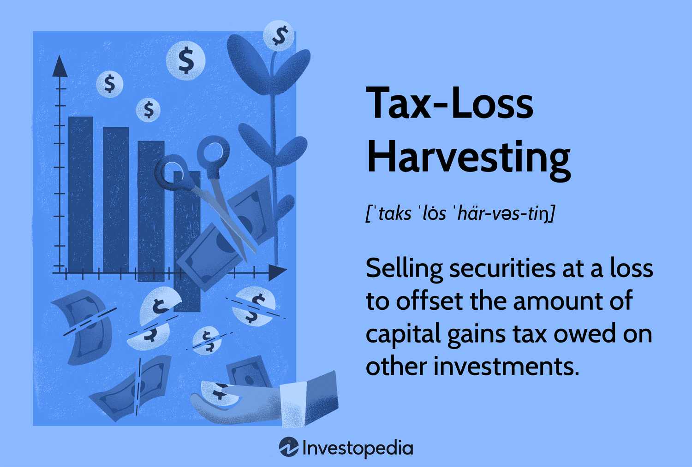

## Table of Contents

## What is tax-loss harvesting?

Tax-loss harvesting is a strategy that investors use to save money on taxes. It involves selling investments that have lost value, which creates a loss that can be used to reduce the taxes you owe on other gains or income. By doing this, you can lower your overall tax bill.

For example, if you have some stocks that have gone down in value, you can sell them and use the loss to offset any gains you made from other investments. If your losses are more than your gains, you can even use some of the loss to reduce your regular income, up to a certain limit set by the tax rules. This way, you can make the best out of a bad situation by saving on taxes.

## How does tax-loss harvesting benefit individual investors?

Tax-loss harvesting helps individual investors by lowering the amount of taxes they have to pay. When you sell an investment that has lost money, you can use that loss to reduce the taxes on your other investments that made money. This means you keep more of your earnings instead of giving it to the government in taxes. For example, if you made a profit of $5,000 from one investment but lost $3,000 on another, you can use the $3,000 loss to reduce your taxable gain to $2,000.

Another benefit is that if your losses are bigger than your gains, you can use some of that extra loss to lower your regular income taxes. The tax rules let you use up to $3,000 of extra losses each year to reduce your income. If you have more losses than that, you can save them for future years. This can be really helpful if you're in a higher tax bracket and want to reduce your tax bill. So, tax-loss harvesting not only helps in the current year but can also be useful in the future.

## What are the basic steps to implement tax-loss harvesting?

To start tax-loss harvesting, first look at your investments to see which ones have lost value. You want to find the ones that are worth less now than when you bought them. Once you find these, decide which ones to sell. It's important to think about your overall investment plan and not just sell because of the tax benefits. Make sure selling these investments fits with your long-term goals.

After you sell the investments that have lost value, you need to figure out how much you lost. This loss can be used to reduce the taxes you owe on other investments that made money. If your losses are more than your gains, you can use up to $3,000 of the extra loss to lower your regular income taxes. Any leftover losses can be saved for future years. Remember to keep good records of all your sales and losses so you can use them correctly on your tax return.

## What types of investments are suitable for tax-loss harvesting?

Any investment that has gone down in value can be used for tax-loss harvesting. This includes stocks, bonds, mutual funds, and exchange-traded funds (ETFs). If you own shares in a company and the price has dropped below what you paid for them, you can sell those shares to create a loss that you can use to reduce your taxes. The same goes for bonds or funds that have lost value since you bought them.

It's important to think about the rules that come with tax-loss harvesting. For example, if you sell a stock at a loss and then buy the same or a very similar stock within 30 days, the IRS won't let you use that loss to reduce your taxes. This is called the wash-sale rule. So, when choosing investments for tax-loss harvesting, make sure you understand these rules and plan your moves carefully to make the most of your tax savings.

## How often should an investor review their portfolio for tax-loss harvesting opportunities?

Investors should look at their portfolio for tax-loss harvesting opportunities at least once a year, usually towards the end of the year. This is because tax-loss harvesting can help lower the taxes you owe on your investments. By checking your investments before the year ends, you can make smart choices about which ones to sell to create losses that can offset your gains.

However, it can also be good to check your portfolio more often, like every few months. This way, you can catch any big drops in the value of your investments sooner. If you see a good chance to use tax-loss harvesting, you can act quickly and maybe save more on taxes. Just remember to think about your long-term investment goals and not just focus on the tax benefits.

## What are the tax implications of tax-loss harvesting?

When you use tax-loss harvesting, you sell investments that have lost value to create a loss. This loss can be used to reduce the taxes you owe on other investments that made money. For example, if you made a profit of $5,000 from one investment but lost $3,000 on another, you can use the $3,000 loss to lower your taxable gain to $2,000. This means you pay less in taxes because your overall gain is smaller.

If your losses are more than your gains, you can use up to $3,000 of the extra loss to reduce your regular income taxes each year. Any leftover losses can be saved and used in future years. This can be really helpful if you're in a higher tax bracket and want to lower your tax bill. Just remember, there are rules like the wash-sale rule that say you can't buy the same or a very similar investment within 30 days of selling it at a loss, or you won't be able to use that loss to reduce your taxes.

## Can tax-loss harvesting be used in both taxable and tax-advantaged accounts?

Tax-loss harvesting can only be used in taxable accounts, not in tax-advantaged accounts like IRAs or 401(k)s. In taxable accounts, you pay taxes on any money you make from your investments each year. When you sell an investment at a loss in these accounts, you can use that loss to lower the taxes you owe on other gains or even your regular income.

In tax-advantaged accounts, you don't pay taxes on your investments each year. Instead, you might pay taxes when you take money out, depending on the type of account. Because you don't pay annual taxes in these accounts, you can't use tax-loss harvesting to reduce your taxes while the money is still in the account. So, if you want to use tax-loss harvesting, make sure you're looking at your investments in your taxable accounts.

## What is the 'wash-sale' rule and how does it affect tax-loss harvesting?

The wash-sale rule is a rule from the IRS that says you can't use a loss to lower your taxes if you buy the same or a very similar investment within 30 days before or after you sell it at a loss. This rule is important for tax-loss harvesting because it stops you from selling an investment just to get a tax break and then buying it right back.

If you break the wash-sale rule, you won't be able to use the loss to reduce your taxes right away. Instead, the loss gets added to the cost of the new investment you bought. This means you might be able to use the loss later when you sell the new investment, but it won't help you with your taxes in the current year. So, when you're doing tax-loss harvesting, you need to be careful not to buy back the same or a similar investment too soon.

## How can tax-loss harvesting be integrated into a broader investment strategy?

Tax-loss harvesting can be a smart part of your overall investment plan. It's not just about saving on taxes; it's about making your whole investment strategy work better. When you look at your investments, think about which ones have lost value and might be good to sell. But don't just sell them for the tax break. Make sure selling fits with your long-term goals. For example, if you want to keep a balanced mix of stocks and bonds, selling some losing stocks might help you buy more bonds to keep things balanced.

Also, think about how tax-loss harvesting fits with other parts of your plan, like when you plan to retire or how much risk you want to take. If you're close to retiring, you might want to use tax-loss harvesting to lower your taxes now, so you have more money to live on. If you're younger and can take more risk, you might use it to help you buy different investments that could grow more over time. By using tax-loss harvesting wisely, you can save on taxes and still keep your investment plan on track.

## What are the potential risks and limitations of tax-loss harvesting?

Tax-loss harvesting can help you save on taxes, but it also has some risks and limits you should know about. One big risk is the wash-sale rule. If you sell an investment at a loss and buy the same or a very similar one within 30 days, you can't use that loss to lower your taxes right away. This means you need to be careful about when you buy and sell. Another risk is that you might end up selling an investment that could go back up in value later. If you sell it just for the tax break, you might miss out on future gains.

There are also some limits to how much tax-loss harvesting can help you. You can only use up to $3,000 of extra losses each year to reduce your regular income taxes. If your losses are bigger than that, you have to save the rest for future years. This means it might take a while to use all your losses. Also, tax-loss harvesting works best in taxable accounts, not in tax-advantaged accounts like IRAs or 401(k)s. So, if most of your money is in those kinds of accounts, you won't be able to use this strategy as much.

## How do automated tax-loss harvesting services work and are they beneficial?

Automated tax-loss harvesting services use computer programs to find and use tax losses in your investments. They look at your investments all the time, not just once a year, to see which ones have lost value. If they find an investment that's worth less than when you bought it, the service might sell it to create a loss. Then, they can use that loss to lower the taxes you owe on other investments that made money. This can help you save on taxes without you having to do a lot of work.

These services can be really helpful because they do the work for you and can catch tax-saving opportunities more often than if you checked your investments yourself. They also help you avoid mistakes like breaking the wash-sale rule, which can stop you from using your losses to save on taxes. But, you need to make sure the service fits with your overall investment plan and that the fees they charge don't take away too much of your tax savings.

## What advanced strategies can be used to maximize the benefits of tax-loss harvesting?

To get the most out of tax-loss harvesting, you can use a strategy called "direct indexing." This means you own the actual stocks in an index instead of just buying a fund that tracks the index. By owning the stocks directly, you can sell the ones that have lost value and keep the ones that are doing well. This gives you more chances to find tax losses and use them to lower your taxes. It's like having more tools in your toolbox to save on taxes.

Another advanced strategy is to use tax-loss harvesting to rebalance your portfolio. If some parts of your investments have grown more than others, you might want to sell some of the winners and buy more of the losers to keep your mix of investments balanced. When you sell the losers, you can use the losses to reduce your taxes. This way, you're not just saving on taxes; you're also making sure your investments stay in line with your long-term goals. Both of these strategies can help you make the most of tax-loss harvesting and keep your investment plan on track.

## References & Further Reading

[1]: Poterba, J. M., & Weisbenner, S. J. (2001). ["Capital Gains Tax Rules, Tax-Loss Trading, and Turn-of-the-Year Returns."](https://economics.mit.edu/sites/default/files/publications/Capital%20Gains%20Tax%20Rules%2C%20Tax-Loss%20Trading%2C%20and%20Tur.pdf) Journal of Finance, 56(1), 353-368.

[2]: Berkin, A. L., & Luck, C. (2010). ["Tax Management, Loss Harvesting, and HIFO Accounting: Enhancing After-Tax Returns."](https://papers.ssrn.com/sol3/papers.cfm?abstract_id=489647) Financial Analysts Journal, 66(4), 42-59.

[3]: Zhang, L., Allen, D. B., & McCauley, P. (2020). ["Algorithmic Trading and Scrutiny: The Role of Regulations in Modern Markets."](https://link.springer.com/article/10.1007/s44246-024-00165-6) Frontiers in Marine Science.

[4]: Jacob, J., & Pabon, A. M. (2017). ["Understanding the Benefits and Limits of Tax-Loss Harvesting."](https://pubmed.ncbi.nlm.nih.gov/20604870/) PERI Working Papers.

[5]: ["The Intelligent Investor: The Definitive Book on Value Investing"](https://www.amazon.com/Intelligent-Investor-Third-Definitive-Investing/dp/0063423537) by Benjamin Graham

[6]: ["Algorithmic and High-Frequency Trading"](https://assets.cambridge.org/97811070/91146/frontmatter/9781107091146_frontmatter.pdf) by Álvaro Cartea, Sebastian Jaimungal, and José Penalva

[7]: Swensen, D. F. (2009). ["Pioneering Portfolio Management: An Unconventional Approach to Institutional Investment."](https://books.google.com/books/about/Pioneering_Portfolio_Management.html?id=SbIz2gRbrF4C) Free Press.