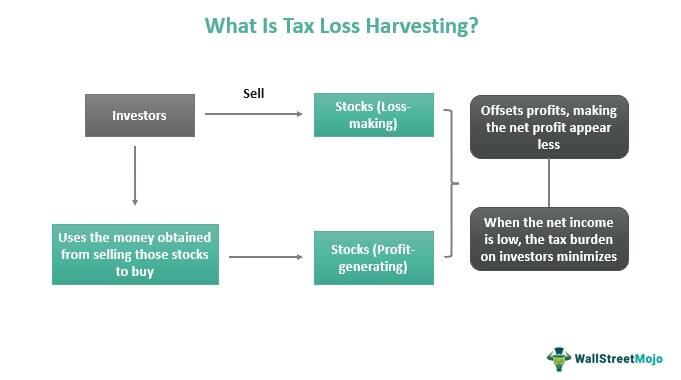

Tax-loss harvesting is an investment strategy designed to reduce an investor's tax liabilities by offsetting capital gains with capital losses within a given taxable year. This approach allows investors to decrease the amount of tax owed on investment gains by using realized losses to counterbalance them. The net gain, thus reduced, leads to a lower tax liability. 

Historically, tax-loss harvesting was a strategy primarily employed by large-scale investors and institutions, largely due to the complexity and resources required to execute it effectively. It involved careful monitoring of market positions and the ability to act swiftly to capitalize on losses when opportunities arose. However, with the advent of financial technology solutions such as robo-advisors and algorithmic trading platforms, this strategy has become increasingly accessible to average investors. These technologies automate the process, allowing for seamless execution of the strategy at a fraction of the cost and effort historically required.



This article aims to provide a comprehensive overview of tax-loss harvesting, focusing on its benefits and essential considerations for investors. Furthermore, it will explore how modern algorithmic trading solutions can optimize tax-loss harvesting, making it a practical and efficient option for average investors seeking to enhance their investment returns through careful tax management. With a deeper understanding of tax-loss harvesting and the leveraging of advanced fintech tools, investors can potentially improve their financial outcomes while minimizing tax liabilities.

## Table of Contents

## Understanding Tax-Loss Harvesting

Tax-loss harvesting is a strategic investment approach that involves selling underperforming securities to realize losses, which can be used to offset taxable gains realized from other investments. This process can effectively reduce an investor's overall tax liability in a given taxable year. By employing this strategy, the investor can potentially enhance after-tax returns through the strategic realization and subsequent recognition of investment losses.

The execution of tax-loss harvesting requires meticulous attention to timing and investment objectives to maintain portfolio integrity and balance. Balancing a portfolio post-loss is critical, as the realization of losses may disproportionately affect the asset allocation or sector exposure originally intended by the investor. To mitigate such disruptions, investors may choose to replace the sold security with a similar, yet not "substantially identical," investment, thereby maintaining market exposure while complying with regulations like the wash-sale rule.

While tax-loss harvesting offers the immediate benefit of reducing current taxable income by offsetting capital gains, it is important to note that it merely defers taxes rather than eliminating them. This limitation suggests that while an investor might enjoy short-term tax relief, any future gains from replacement investments or other portfolio assets will still incur tax liabilities upon realization. Thus, the tactical benefit lies predominantly in the time value of money — deferring taxes to potentially multiply capital in the short term can outweigh the eventual tax expense on future gains. 

In summary, tax-loss harvesting serves as a tactical approach to tax efficiency within a broader investment strategy, requiring careful execution to ensure its benefits are maximized without compromising the investor's long-term financial goals.

## Algorithmic Trading: A Modern Solution

Algorithmic trading leverages technology to execute financial transactions at high speed and frequency, thus offering significant advantages for tax-loss harvesting. By employing predefined criteria and rules, complex algorithms systematically manage investment portfolios, aiding investors in capturing losses effectively.

Central to this strategy is the automation of trade execution. Algorithms are programmed to identify securities that can be sold at a loss, which can then be used to offset taxable gains from other investments. This automated process ensures optimal timing for executing trades, reducing the potential for human error and emotional bias, factors that can detrimentally impact decision-making in volatile markets.

For tax-loss harvesting, the key lies in efficiently processing large datasets to seize advantageous trading positions. Algorithmic systems can swiftly analyze market data to pinpoint losses, continuously optimizing tax positions across investment portfolios. This adaptation allows the investor to maintain a balanced and strategically aligned portfolio while realizing tax benefits.

Consider the following simplified Python code that outlines a basic framework for implementing an algorithmic strategy aimed at tax-loss harvesting:

```python
import numpy as np
import pandas as pd

def identify_loss_positions(portfolio, market_data):
    losses = []
    for asset in portfolio:
        current_price = market_data.get_current_price(asset)
        purchase_price = portfolio[asset]['purchase_price']
        if current_price < purchase_price:
            losses.append(asset)
    return losses

def execute_sell_orders(loss_positions, market_data):
    for asset in loss_positions:
        quantity = market_data.get_quantity(asset)
        market_data.place_sell_order(asset, quantity)

portfolio = {
    'StockA': {'purchase_price': 100, 'quantity': 50},
    'StockB': {'purchase_price': 200, 'quantity': 20},
}

market_data = MarketData()
loss_positions = identify_loss_positions(portfolio, market_data)
execute_sell_orders(loss_positions, market_data)
```

In this code snippet, `identify_loss_positions` checks each asset in the portfolio to evaluate if its current market price is less than the purchase price. If true, it marks these assets as loss positions. The `execute_sell_orders` function then places sell orders for these identified loss-making investments.

By integrating such algorithmic frameworks, investors unlock the potential for continual optimization of tax positions. This mechanism not only ensures systematic and precise execution of trades within the tax-loss harvesting strategy but also aligns with broader financial goals by enhancing tax efficiency across investment activities.

However, while [algorithmic trading](/wiki/algorithmic-trading) significantly optimizes the tax-loss harvesting process, investors must remain aware of regulatory constraints, such as the wash-sale rule, which could annul these losses if similar stocks are repurchased within a 30-day window. Automated systems must incorporate these legal nuances to guarantee compliance and maintain the integrity of tax benefits obtained through such strategic trading.

## Benefits and Risks for Average Investors

Average investors have increasingly benefited from the accessibility of tax-loss harvesting strategies, largely due to technological advancements making these strategies more approachable. The incorporation of robo-advisors and algorithmic trading systems has enabled investors to efficiently implement tax-loss harvesting with minimal transaction costs and significant time savings.

The automation provided by robo-advisors ensures that portfolios are consistently monitored for potential tax-loss harvesting opportunities. This technology eliminates the need for investors to manually track market fluctuations and initiate trades, thereby simplifying portfolio management. Automation also facilitates timely execution of trades, which is crucial for optimizing tax benefits within the calendar year.

Despite these advantages, average investors should be aware of potential risks associated with tax-loss harvesting strategies. Changes in tax policy can impact the effectiveness of these strategies. Investors must remain informed about legislative updates that may affect their tax liabilities. Additionally, the wash-sale rule presents another significant risk. This rule prevents investors from claiming a tax loss on the sale of a security if they purchase a “substantially identical” security within 30 days before or after the sale. Violating this rule results in disallowed losses, undermining the intended tax benefits.

Investors must ensure that any algorithmic trading system or robo-advisor they employ is compliant with tax regulations, particularly in adhering to the wash-sale rule. Careful selection of technology providers that maintain compliance with these legal stipulations is essential to effectively managing risks.

Overall, while the use of technology facilitates greater access to tax-loss harvesting for average investors, it is important to stay cognizant of the evolving tax landscape and regulatory constraints to safeguard financial outcomes.

## Important Considerations

Tax-loss harvesting is a strategic financial tool that benefits primarily taxable investment accounts, as its advantages revolve around the offsetting of capital gains tax liabilities. Tax-deferred accounts, such as IRAs and 401(k)s, inherently shelter investments from immediate taxation, rendering tax-loss harvesting strategies largely ineffectual in these accounts. Thus, focusing tax-loss harvesting efforts on taxable accounts can optimize an investor’s overall tax efficiency.

A critical consideration in tax-loss harvesting is the distinction between the short-term and long-term impacts of capital gains. The Internal Revenue Service (IRS) characterizes short-term gains—realized when assets are held for one year or less—at the investor’s ordinary income tax rate, which can range significantly based on income levels. Long-term gains, realized after more than a year, are taxed at reduced rates, typically 0%, 15%, or 20%, depending on the investor’s total taxable income. This discrepancy in tax rates necessitates a strategic approach to which losses are harvested. For example, prioritizing short-term loss harvesting may result in immediate, more impactful tax savings due to the higher comparative tax rates on short-term gains. 

Investors must also be acutely aware of personal financial situations and investment goals when implementing tax-loss harvesting strategies. This involves an analysis of expected future income, potential changes in tax legislation, and an understanding of the investor's entire financial portfolio. Engaging a tax professional for tailored advice ensures the tax-loss harvesting strategy aligns with overall financial objectives and complies fully with IRS regulations. Tax professionals can provide insights into complex regulations and project future tax implications, offering investors a comprehensive roadmap to maximizing benefits while mitigating risks.

Furthermore, investors should be mindful of specific IRS regulations, such as the wash-sale rule, which disallows the claiming of a tax loss if a substantially identical security is purchased within a 30-day window before or after the sale. Violations of the wash-sale rule can negate the intended tax-saving effects, highlighting the necessity for careful planning and execution of tax-loss harvesting activities. By carefully considering these elements, investors can enhance their tax efficiency and bolster their after-tax returns over time.

## How to Implement a Tax-Loss Harvesting Strategy with Algo Trading

To implement a tax-loss harvesting strategy with algorithmic trading, investors can utilize robo-advisors to automate the monitoring and execution of trades aimed at capturing potential tax-loss harvesting opportunities. Robo-advisors are typically equipped with sophisticated algorithms capable of scanning an investor’s portfolio in real-time, identifying assets that have declined in value, and executing trades to realize those losses.

### Compliance with IRS Rules and the Wash-Sale Rule

When engaging in tax-loss harvesting, it is crucial to adhere to IRS regulations, particularly the wash-sale rule. The wash-sale rule prohibits claiming a tax deduction on the sale of a security if a "substantially identical" security is purchased within a 30-day window before or after the sale date. This restricts investors from selling a security at a loss and repurchasing it immediately to capture the tax benefit. To ensure compliance, algorithmic trading systems must be programmed to account for this rule, potentially by selecting different securities or alternative investments to maintain the intended asset allocation without violating the wash-sale rule.

### Selection of Algorithmic Services

When selecting algorithmic trading services for tax-loss harvesting, investors should consider their investment objectives and risk tolerance. Different services offer varying levels of customization, transaction frequencies, and asset coverage. For instance, some robo-advisors may offer broader asset class selections or more frequent trading adjustments, which may align better with more active or diverse investment strategies. It is crucial to evaluate these factors to ensure that the selected service aligns with the investor's financial goals and comfort levels regarding market [volatility](/wiki/volatility-trading-strategies).

In essence, integrating algorithmic trading into a tax-loss harvesting strategy can optimize tax efficiency by automating the identification and execution of loss realization opportunities. By selecting appropriate robo-advisory tools and ensuring compliance with regulatory constraints like the wash-sale rule, investors can effectively leverage technology to enhance tax outcomes and support portfolio growth objectives.

## Conclusion

Tax-loss harvesting can be a powerful tool for average investors, particularly when combined with algorithmic trading. This combination offers the potential for increased tax efficiency and portfolio growth. By automating the process of identifying and executing loss-generating trades, algorithmic trading enhances the precision and timing of tax-loss harvesting, reducing the manual effort required and mitigating human error. In addition, this automation can help investors systematically capture opportunities to offset capital gains with losses, effectively minimizing taxable income.

As fintech solutions continue to grow in availability and sophistication, more average investors can now leverage tax management strategies that were previously accessible only to larger, institutional investors. Robo-advisors and other automated trading platforms provide these investors with the tools necessary to optimize their tax positions, aligning trading decisions with both market conditions and individual investment goals.

Understanding the fundamentals of tax-loss harvesting and integrating technology into one's investment strategy can significantly improve financial outcomes. By using these advanced tools, investors can not only enhance the performance of their investment portfolios but also achieve greater control over their tax liabilities. As technology continues to evolve, it will likely offer even more refined solutions, further empowering investors to manage their financial interests effectively.

## References & Further Reading

[1]: Poterba, J. M., & Weisbenner, S. J. (2001). ["Capital Gains Tax Rules, Tax-Loss Trading, and Turn-of-the-Year Returns."](https://economics.mit.edu/sites/default/files/publications/Capital%20Gains%20Tax%20Rules%2C%20Tax-Loss%20Trading%2C%20and%20Tur.pdf) Journal of Finance, 56(1), 353-368.

[2]: Berkin, A. L., & Luck, C. (2010). ["Tax Management, Loss Harvesting, and HIFO Accounting: Enhancing After-Tax Returns."](https://papers.ssrn.com/sol3/papers.cfm?abstract_id=489647) Financial Analysts Journal, 66(4), 42-59.

[3]: Zhang, L., Allen, D. B., & McCauley, P. (2020). ["Algorithmic Trading and Scrutiny: The Role of Regulations in Modern Markets."](https://link.springer.com/article/10.1007/s44246-024-00165-6) Frontiers in Marine Science.

[4]: Jacob, J., & Pabon, A. M. (2017). ["Understanding the Benefits and Limits of Tax-Loss Harvesting."](https://pubmed.ncbi.nlm.nih.gov/20604870/) PERI Working Papers.

[5]: ["The Intelligent Investor: The Definitive Book on Value Investing"](https://www.amazon.com/Intelligent-Investor-Third-Definitive-Investing/dp/0063423537) by Benjamin Graham

[6]: ["Algorithmic and High-Frequency Trading"](https://assets.cambridge.org/97811070/91146/frontmatter/9781107091146_frontmatter.pdf) by Álvaro Cartea, Sebastian Jaimungal, and José Penalva

[7]: Swensen, D. F. (2009). ["Pioneering Portfolio Management: An Unconventional Approach to Institutional Investment."](https://books.google.com/books/about/Pioneering_Portfolio_Management.html?id=SbIz2gRbrF4C) Free Press.