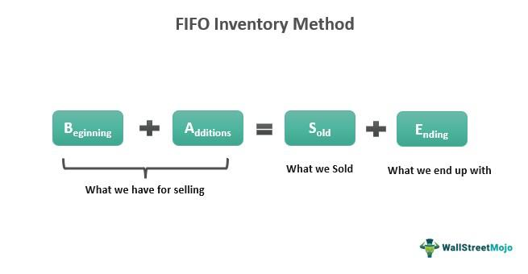

Understanding the link between accounting methods and tax minimization is crucial for businesses and individual investors. Different accounting strategies can influence the magnitude of taxable income, thus affecting the final tax liability. The FIFO (First-In, First-Out) method is an accounting strategy that can be particularly useful in achieving tax efficiency. The FIFO method assumes that the oldest inventory or assets are sold first, which can lead to significant tax advantages in certain market conditions.

This article explores how the FIFO method can help in minimizing taxes, particularly in the context of rapidly evolving financial fields such as algorithmic trading and cryptocurrency investments. Algorithmic trading, a strategy where computers execute trades at high speed and frequency, can greatly benefit from an optimized accounting method to enhance tax outcomes. Likewise, as the cryptocurrency market experiences high volatility, selecting an appropriate accounting method like FIFO can result in considerable tax savings.

We will explore the mechanics of the FIFO method and examine how it contrasts with other accounting methods such as LIFO (Last-In, First-Out) and HIFO (Highest-In, First-Out). These methods carry distinct tax implications due to their different treatment of inventory costs and sales, impacting taxable income levels.

Moreover, we will analyze how algorithmic trading strategies can be aligned with accounting methods for optimal tax outcomes. Given the precision and speed of algorithmic trading, selecting the right accounting method becomes a strategic decision that can lead to significant tax benefits.

By the end of this article, readers will gain a comprehensive understanding of FIFO's role in tax minimization and why its integration into trading strategies is essential for achieving financial efficiency.

## Table of Contents

## Understanding FIFO Method

The FIFO (First-In, First-Out) method is a widely adopted accounting strategy wherein the oldest inventory items are considered to be sold first. This method is prevalent across numerous industries for managing inventory and calculating the cost of goods sold (COGS), particularly in environments where inventory pricing and cost fluctuations are commonplace. By employing FIFO, businesses align their cost flow with physical inventory flow, ensuring that the earliest acquired items are matched with current sales.

In financial statements, FIFO impacts both the income statement and balance sheet, playing a crucial role in profit calculation. Under FIFO, ending inventory is composed of the latest purchased items, which means during periods of inflation or rising prices, FIFO results in lower COGS and consequently higher taxable income and inventory valuation. Conversely, in periods of decreasing prices, FIFO can lead to a higher COGS, reducing taxable income.

To illustrate, suppose a company purchases units at varying prices over a period:

1. 100 units at $10 each
2. 100 units at $12 each
3. 100 units at $11 each

If 150 units are sold, FIFO dictates that the cost of goods sold will include the 100 units at $10 and 50 units at $12, resulting in a COGS of $1,300 (100*$10 + 50*$12). This simple example highlights how FIFO accounts for costs, focusing on earliest purchases.

The benefits of the FIFO method become particularly apparent in scenarios of deflation or when unit prices of inventory decrease over time. Higher COGS derived from older, more expensive inventory reduces net income and tax liabilities, allowing businesses to defer taxes. While FIFO might not always be advantageous under inflationary conditions, it provides clarity and transparency in financial reporting, often preferred due to its alignment with the actual physical flow of goods.

In summary, FIFO offers several advantages in specific market conditions, such as time-efficient inventory management and potential tax minimization during price decreases. It's essential for businesses to weigh these benefits against their inventory turnover patterns and tax strategies to choose the most effective accounting method.

## FIFO Method and Tax Minimization

The FIFO (First-In, First-Out) accounting method can significantly impact tax obligations by altering the reported net income of a business. This method assumes that the oldest inventory items are sold first, which can be advantageous for tax minimization, particularly when inventory prices are downward trending.

### Downward Trending Inventory Prices

In instances where inventory prices are declining, adopting the FIFO method results in a higher cost of goods sold (COGS). When COGS increases, taxable income decreases, potentially reducing the amount of taxes owed. This occurs because under FIFO, the older, potentially more expensive inventory is accounted for in COGS first. Consider the following equation used to calculate net income before tax:

$$
\text{Net Income Before Tax} = \text{Revenue} - \text{COGS} - \text{Operating Expenses}
$$

By increasing COGS, FIFO effectively reduces the taxable income. This is beneficial in circumstances where inventories reduce in value over the financial period, allowing businesses to manage their tax liabilities more effectively.

### Volatile or Deflationary Markets

In volatile or deflationary markets, where prices can fluctuate unpredictably, FIFO proves advantageous by capturing higher historical costs in COGS, leading to reduced taxable income. When deflation affects the market, the disparity between the cost of older and newer inventory widens, thus maximizing the tax benefit under FIFO. Businesses operating in industries susceptible to price deflation may find FIFO particularly useful, as it allows them to defer income recognition and subsequent taxation into future periods when costs might normalize.

### Comparative Analysis: FIFO vs. LIFO

To illustrate the tax-saving potential of FIFO, consider the example where a company has five units of inventory purchased over time at varying costs:

- 1st unit: $10
- 2nd unit: $12
- 3rd unit: $11
- 4th unit: $9 (Recent purchase)
- 5th unit: $8 (Most recent purchase)

Assuming the company sells three units, FIFO dictates that the first three units sold are priced at $10, $12, and $11, totaling $33. Under LIFO (Last-In, First-Out), the units sold would be the last three purchased, resulting in a COGS totaling $28 ($9 + $8 + $11). 

Thus, FIFO registers a higher COGS ($33) than LIFO ($28), leading to a lower taxable income. This mechanism can translate into significant tax savings in certain economic scenarios, particularly when older inventory has higher cost bases due to previous market conditions.

In summary, the FIFO method provides a strategic advantage for tax minimization through the careful management of COGS, especially in markets characterized by price depreciation or [volatility](/wiki/volatility-trading-strategies). Utilizing FIFO can enable businesses to better manage their tax liabilities, aligning their financial strategies with economic conditions to optimize tax outcomes.

## Algorithmic Trading and Accounting Methods

Algorithmic trading refers to the use of computer algorithms to automate the process of trading financial instruments. These algorithms, capable of analyzing vast amounts of data at high speed, are employed to execute trades at optimal times and price points. The growth of [algorithmic trading](/wiki/algorithmic-trading) has been propelled by advancements in technology and increased data availability, creating opportunities for improved trading efficiencies and cost-effectiveness.

Integrating accounting methods like FIFO into trading algorithms can have significant tax implications. The FIFO method, which assumes that assets purchased first are sold first, can affect the capital gains reported, thereby influencing taxable income. In algorithmic trading, where numerous transactions happen rapidly, applying FIFO can systematically influence the selection of lots for sale, affecting tax outcomes. Algorithm developers can program their trading systems to apply the FIFO method, using it to track assets and determine which lots to liquidate for optimized tax efficiency.

Choosing the right accounting method is crucial in algorithmic trading strategies. The decision impacts not only the financial performance on paper but also the actual tax liabilities incurred by traders. For example, FIFO can be advantageous in a rising market, as it results in lower capital gains by pairing older, cheaper cost bases against current prices. Conversely, choosing LIFO might make sense if a trader expects downward price trends to persist over a longer time horizon, as it uses the cost of recent purchases, potentially higher, reducing taxable gains.

Several algorithmic trading firms have successfully leveraged the FIFO method for tax optimization. For instance, an algorithmic trading firm trading high-frequency in the [cryptocurrency](/wiki/cryptocurrency) market may use FIFO to benefit from the lower capital gains taxes when crypto prices are steadily increasing, leading to potential reductions in tax liabilities. By integrating such tax-efficient strategies into their trading algorithms, these firms can enhance their net returns by minimizing tax expenditure.

In conclusion, the intersection of algorithmic trading and accounting methods like FIFO is pivotal for tax planning and financial optimization. While the choice of method can substantially alter reported earnings and tax obligations, a well-integrated accounting strategy allows traders to adapt to market dynamics efficiently.

## Comparison with Other Methods: LIFO and HIFO

LIFO (Last-In, First-Out) and HIFO (Highest-In, First-Out) are two alternative accounting methods often contrasted with FIFO. Each method has distinct implications on tax liabilities and financial reporting, depending on the economic scenario.

### LIFO Method

Under the LIFO accounting method, the most recently acquired inventory is considered sold first. This approach can lead to different tax and profit outcomes compared to FIFO:

1. **Tax Impacts:** In times of rising prices, LIFO results in a higher cost of goods sold (COGS) because the latest, presumably more expensive, inventory is used up first. This reduces taxable income and thus can lower tax liabilities in inflationary periods.
$$
   \text{COGS}_{\text{LIFO}} = \text{Cost of latest inventory units}

$$

2. **Benefits and Drawbacks:**
   - **Benefits:** LIFO can be advantageous for companies in inflating markets because it defers tax payments by reducing current taxable income.
   - **Drawbacks:** However, LIFO may result in lower reported profits, which might adversely affect financial statements and investor perceptions.

### HIFO Method

HIFO, where the inventory with the highest cost is sold first, is often used in markets like crypto trading, where value fluctuations are more pronounced:

1. **Tax Impacts:** HIFO maximizes COGS by selling off the most expensive items, thus minimizing short-term taxable income especially in markets with high volatility.
$$
   \text{COGS}_{\text{HIFO}} = \text{Cost of highest priced inventory units}

$$

2. **Benefits and Drawbacks:**
   - **Benefits:** HIFO is beneficial for traders who aim to reduce tax burdens in the short term by selecting units with the highest purchase cost for sales.
   - **Drawbacks:** It requires meticulous record-keeping and might not align with all regulatory standards, potentially complicating audits.

### Comparison and Strategic Decision-Making

When choosing between FIFO, LIFO, and HIFO, investors must consider:

1. **Economic Conditions:** 
   - In inflationary markets, LIFO might be preferred for reducing tax liabilities, while FIFO might be less advantageous due to lower COGS.
   - In volatile markets, HIFO could be effective for tactical tax planning by quickly responding to price changes.

2. **Regulatory and Strategic Goals:** 
   - FIFO offers simplicity and is generally accepted worldwide for financial reporting.
   - LIFO may not be permitted under certain accounting standards outside of the United States, such as IFRS.
   - HIFO, while strategic in minimizing taxes, demands rigorous compliance with tax laws and regulations.

### Guide for Investors and Businesses

To determine the most suitable method:

- **Analyze Market Trends:** Consider the price trends - rising or falling - and align them with your inventory management through the appropriate method.
- **Assess Tax Strategy:** Determine whether immediate tax savings or stable financial reporting is more critical to your goals.
- **Consult Professionals:** Engage tax professionals for guidance tailored to your specific financial situation and the prevailing regulatory environment.

By strategically selecting the accounting method aligned with both market conditions and tax objectives, businesses and investors can optimize their financial outcomes effectively.

## Regulatory Considerations and Practical Tips

The regulation of accounting methods by the Internal Revenue Service (IRS) is pivotal for determining tax obligations in the context of cryptocurrency and securities investments. The IRS allows taxpayers to use various accounting methods, with FIFO (First-In, First-Out), LIFO (Last-In, First-Out), and HIFO (Highest-In, First-Out) being among the most commonly used for inventory costing and tax reporting. It's crucial to adhere to IRS guidelines to ensure compliance and optimize tax outcomes.

### IRS Guidelines for Accounting Methods

The IRS provides specific guidelines regarding the choice and application of inventory accounting methods for crypto and securities. These methods directly affect the calculation of capital gains or losses, impacting tax liabilities. Generally, the IRS mandates consistency; once a method is chosen, it must be consistently applied for all similar transactions unless a formal request is made to change it. This consistency ensures that taxpayers do not switch methods arbitrarily in a manner that might unjustly minimize tax responsibilities.

### Importance of Detailed Records

When employing sophisticated accounting methodologies such as HIFO, maintaining comprehensive records is essential. Sophisticated methods require detailed transaction histories that record the exact times, amounts, and costs of purchases and sales. This allows for precise cost basis calculation and accurate tax reporting. Effective recordkeeping is not only a legal obligation but also acts as a safeguard against potential IRS audits. Detailed records can be maintained using various digital tools and platforms specifically designed to track investments and trades.

### Legal Considerations for Switching Methods

Switching between accounting methods is not prohibited; however, it requires careful consideration and adherence to IRS procedures. Taxpayers wishing to change their accounting method must file IRS Form 3115, Application for Change in Accounting Method. This form must be filed during the applicable tax year and can involve a review process by the IRS. The process is designed to ensure that any change does not result in unwarranted tax advantages and that it reflects a true and fair view of income.

### Professional Consultation Recommendations

Given the intricacies of tax law and the potential financial impact of accounting method choices, consulting with tax professionals is highly recommended. Tax professionals can provide expert advice tailored to individual financial situations, ensuring compliance with IRS regulations and optimization of tax positions. They can assist with the preparation and submission of necessary forms, advise on strategic accounting method alignment with financial objectives, and provide guidance on maintaining records that meet legal standards.

In summary, understanding and navigating the regulatory landscape surrounding accounting methods in investments requires adherence to established IRS guidelines, meticulous recordkeeping, careful legal compliance when making changes, and consultation with knowledgeable tax professionals. This strategic approach not only enables compliance but also enhances overall tax efficiency.

## Conclusion

The FIFO (First-In, First-Out) method emerges as a valuable accounting tool for tax minimization, particularly under certain economic conditions such as decreasing inventory prices. By prioritizing the sale of older inventory, the method increases the cost of goods sold (COGS) when prices are declining, subsequently reducing the taxable income. This characteristic can be strategically beneficial for businesses and investors aiming to optimize their tax outcomes.

Aligning trading algorithms with appropriate accounting methods, like FIFO, enhances the efficiency of tax strategies in algorithmic trading. The integration of accounting methods into trading algorithms allows for systematic tax assessment alongside market execution. By leveraging such synergies, traders and businesses can better navigate taxation landscapes while capitalizing on market efficiencies.

Adaptable accounting strategies, such as transitioning between methods like FIFO, LIFO, and HIFO based on market dynamics, are crucial in volatile economic environments. These strategies allow businesses to maintain flexibility and responsiveness to shifting financial climates, preserving capital through effective tax minimization techniques.

It is crucial for investors and businesses to evaluate their current accounting methods consistently and consider professional advice for optimization. Tax laws and market conditions are ever-changing, making proactive assessment and strategic adjustments essential for optimal financial outcomes. Consulting with tax professionals aids in navigating complex regulations and implementing sophisticated techniques like FIFO effectively.

## References & Further Reading

[1]: National Bureau of Economic Research. (n.d.). ["Taxation and Corporate Use of Debt: Implications for Tax Policy."](https://www.researchgate.net/publication/260402209_Taxation_and_Corporate_Use_of_Debt_Implications_for_Tax_Policy) 

[2]: U.S. Securities and Exchange Commission. (2019). ["Algorithmic Trading: Introduction and Overview."](https://www.sec.gov/files/OCIE%202019%20Priorities.pdf) 

[3]: Penman, S. (2013). ["Financial Statement Analysis and Security Valuation."](https://archive.org/details/financialstateme0000penm_m9z7_5thed) McGraw-Hill Education.

[4]: ["Cryptocurrency and Blockchain: Accounting and Tax Considerations"](https://www2.deloitte.com/us/en/pages/tax/solutions/cryptocurrency-blockchain-taxation.html) - American Institute of CPAs (AICPA)

[5]: CFA Institute. (2020). ["Trading and Electronic Markets: What Investment Professionals Need to Know."](https://www.cfainstitute.org/sites/default/files/-/media/documents/book/rf-publication/2015/rf-v2015-n4-1-pdf.pdf)