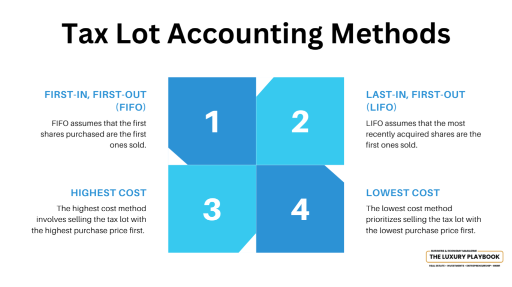

## Table of Contents

## What is the FIFO accounting method?

The FIFO accounting method, which stands for "First In, First Out," is a way of managing inventory and calculating the cost of goods sold. In this method, the first items that are added to the inventory are the first ones to be sold or used. Imagine you have a store and you buy apples. The apples you bought first are the ones you sell first. This method helps keep track of how much it costs to sell the items, especially when the prices of the items change over time.

Using FIFO can be helpful when prices are going up because it matches the older, lower costs with the sales, which can make the profit look higher. For example, if you bought apples at a lower price earlier and then the price of apples went up, selling the older apples first means you're selling them at the lower cost you paid for them. This can make your business look more profitable on paper. Many businesses use FIFO because it's easy to understand and it often reflects the actual flow of goods in many industries.

## How does the FIFO method work in inventory management?

In inventory management, the FIFO method means that the first items you put into your stock are the first ones you take out to sell or use. Imagine you run a store that sells cans of soup. If you get a shipment of soup cans in January and another in February, you would sell the January cans before you start selling the February ones. This helps keep your inventory organized and makes sure older items don't sit around too long.

Using FIFO can be helpful because it can match the cost of the items you sell with the prices you paid for them earlier. If the price of soup goes up over time, selling the older, cheaper soup first means you're recording sales at the lower cost. This can make your business look more profitable. Many businesses like to use FIFO because it's easy to understand and often matches how goods actually move through their operations.

## What are the basic principles of tax minimization?

Tax minimization means finding legal ways to pay less tax. The main idea is to use the tax rules to your advantage. This can include things like putting money into retirement accounts, claiming all the deductions you can, and looking for tax credits. It's all about understanding what the tax laws allow and using those rules to keep more of your money.

One important principle is to keep good records. This helps you know exactly what you can claim and makes sure you don't miss out on any savings. Another principle is to plan ahead. If you know what your tax situation might look like next year, you can make choices now that will help you save on taxes later. Talking to a tax professional can also be a big help because they know all the ins and outs of the tax code and can give you personalized advice.

## How can the FIFO method be used to minimize taxes?

The FIFO method can help minimize taxes because it affects how you calculate the cost of goods sold. When you use FIFO, you sell the oldest items in your inventory first. If the prices of your items have been going up, this means you're selling items at the lower prices you paid for them earlier. This can make your profit look bigger because you're subtracting lower costs from your sales. When your profit looks bigger, your taxable income goes up, but if you're in a lower tax bracket or have other ways to offset that income, you might end up paying less tax overall.

For example, let's say you run a store that sells gadgets. You bought some gadgets at $10 each in January and then the price went up to $12 in February. With FIFO, you sell the January gadgets first. If you sell them for $15 each, your profit is $5 per gadget ($15 - $10). If you used the newer, more expensive gadgets, your profit would only be $3 per gadget ($15 - $12). By using FIFO, you show a higher profit on paper, but if you can use other tax strategies to reduce your overall taxable income, you might pay less in taxes. It's all about understanding how FIFO can work with other tax planning strategies to keep more of your money.

## What are the advantages of using FIFO for tax purposes?

Using FIFO for tax purposes can help you show higher profits on paper because you're selling the older, cheaper items first. If the prices of your products have gone up over time, selling the items you bought at a lower price earlier means you're calculating your profit using those lower costs. This can make your business look more profitable because you're subtracting smaller numbers from your sales. When your profit looks bigger, it might push you into a higher tax bracket, but if you have other ways to lower your taxable income, like deductions or tax credits, you could end up paying less in taxes overall.

Another advantage of using FIFO is that it's easy to understand and matches how many businesses actually handle their inventory. This makes it simpler to keep track of your stock and calculate your taxes. By using a method that reflects the real flow of goods in your business, you can avoid confusion and make sure you're following the rules correctly. This can save you time and money on accounting and tax preparation, and it can also help you plan better for the future by knowing exactly what your inventory costs are at any given time.

## What are the potential disadvantages or limitations of using FIFO for tax minimization?

Using FIFO for tax minimization has some potential downsides. One big problem is that when prices are going up, FIFO can make your profits look bigger than they really are. This means you might end up paying more in taxes because you're showing more profit. If you don't have other ways to lower your taxable income, like deductions or tax credits, using FIFO might not help you save on taxes at all. It could even cost you more in the long run.

Another limitation is that FIFO might not always match how your business actually works. Some businesses might sell their newest items first, or they might have a different way of managing their inventory. If you use FIFO but your real inventory flow is different, it can make your financial reports less accurate. This can cause problems when you're trying to plan for the future or when you need to show your financial situation to investors or banks. It's important to make sure the method you use for taxes matches how your business really operates.

## How does FIFO compare to other inventory accounting methods like LIFO and average cost in terms of tax impact?

FIFO, LIFO, and average cost are three different ways to manage inventory and calculate the cost of goods sold, each with its own effect on taxes. FIFO, or First In, First Out, means you sell the oldest items first. When prices are going up, FIFO can make your profit look bigger because you're selling items at the lower prices you paid for them earlier. This can push you into a higher tax bracket if you don't have other ways to lower your taxable income. On the other hand, LIFO, or Last In, First Out, means you sell the newest items first. If prices are going up, LIFO can lower your taxable income because you're selling items at the higher prices you paid more recently. This can help you pay less in taxes, but LIFO is not allowed under International Financial Reporting Standards (IFRS), so it's less common outside the U.S.

The average cost method takes the average price of all the items in your inventory and uses that to calculate the cost of goods sold. This method smooths out the effects of price changes over time, so it doesn't make your profit look as big as FIFO when prices are rising, but it also doesn't lower your taxable income as much as LIFO. The average cost method can be simpler to use because you don't have to keep track of when each item was bought, but it might not reflect the actual flow of goods in your business as well as FIFO or LIFO. Choosing the right method depends on your business's specific needs and the tax rules in your country.

## Can you provide a simple example of how FIFO can reduce taxable income?

Imagine you own a small store that sells toys. You bought 100 toy cars in January for $5 each, and then the price went up, so you bought another 100 toy cars in February for $6 each. By the end of the year, you sold 150 toy cars for $10 each. If you use FIFO, you would sell the 100 toy cars from January first, and then 50 of the toy cars from February. This means you're selling the cheaper toy cars first.

Using FIFO, your cost of goods sold would be calculated like this: 100 toy cars at $5 each equals $500, and 50 toy cars at $6 each equals $300. So, your total cost of goods sold is $800. If you sold 150 toy cars at $10 each, your total sales would be $1,500. Subtracting your cost of goods sold from your sales, your profit would be $700 ($1,500 - $800). If you had used a different method like LIFO, your cost of goods sold would be higher because you'd be selling the more expensive February toy cars first, which would lower your profit and taxable income. But with FIFO, you show a higher profit, which might help if you have other ways to reduce your taxes.

## What are the legal and ethical considerations when using FIFO for tax minimization?

Using FIFO for tax minimization is legal as long as you follow the tax rules in your country. FIFO is an accepted method of inventory accounting that many businesses use. It's important to keep good records and make sure you're using FIFO correctly. If you don't follow the rules, you could get in trouble with the tax authorities. But if you do everything right, using FIFO to minimize taxes is okay.

Ethically, using FIFO can be a bit tricky. It's all about being honest and fair. If you use FIFO to make your business look more profitable when it's not, that might not be ethical. It's important to think about how your choices affect others, like your investors or employees. They might make decisions based on the profits you report. So, while using FIFO is legal, you should also think about whether it's the right thing to do in your specific situation.

## How do different tax jurisdictions treat the use of FIFO for tax purposes?

Different countries have different rules about how businesses can use FIFO for taxes. In the United States, FIFO is allowed and commonly used for tax purposes. The IRS lets businesses choose between FIFO, LIFO, and other methods, as long as they stick with the same method once they choose it. This gives businesses some flexibility to manage their taxes in a way that works best for them. However, if a business changes its method, it needs to get permission from the IRS and follow their rules.

In other countries, the rules might be different. For example, under International Financial Reporting Standards (IFRS), which many countries follow, LIFO is not allowed, but FIFO is. This means that businesses in countries that use IFRS can use FIFO but not LIFO for their financial reporting, including taxes. It's important for businesses to know the tax laws in their own country and make sure they're following them correctly. If a business operates in multiple countries, it might need to use different methods in different places to follow local rules.

## What advanced strategies can businesses employ to optimize tax minimization using FIFO?

Businesses can use FIFO to optimize tax minimization by carefully planning their inventory purchases and sales. If prices are going up, buying more inventory earlier in the year can help because you'll be selling those cheaper items first. This can make your profits look bigger, which might push you into a higher tax bracket. But if you have other ways to lower your taxable income, like deductions or tax credits, you can use FIFO to show higher profits and then offset that with other tax strategies. It's all about timing your purchases and sales to take advantage of the FIFO method.

Another strategy is to use FIFO in combination with other accounting methods for different parts of your business. For example, you might use FIFO for your main products but use a different method for other items. This can help you manage your overall tax situation better. It's also important to keep good records and work with a tax professional. They can help you understand how FIFO can work with other tax rules to save you money. By planning ahead and using FIFO smartly, you can make sure you're paying the least amount of taxes possible while still following the law.

## How can software and technology assist in implementing and managing FIFO for tax minimization?

Software and technology can make using FIFO for tax minimization a lot easier. Special inventory management software can keep track of when you buy and sell things, making sure you're always selling the oldest items first. This helps you follow the FIFO method without making mistakes. The software can also create reports that show how much you're making and spending, which is important for figuring out your taxes. Some programs even connect with your accounting software, so all your numbers are in one place and easy to understand.

Using technology can also help you plan better for taxes. You can use the software to see how buying more inventory at certain times might affect your taxes. This can help you decide when to buy things to save money. Plus, many tax software programs have tools that can help you find deductions and credits you might not know about. By using these tools, you can make sure you're using FIFO in the smartest way to minimize your taxes while following all the rules.

## How can the FIFO Method be used for Tax Minimization?

The FIFO (First-In, First-Out) accounting method can significantly impact tax obligations by altering the reported net income of a business. This method assumes that the oldest inventory items are sold first, which can be advantageous for tax minimization, particularly when inventory prices are downward trending.

### Downward Trending Inventory Prices

In instances where inventory prices are declining, adopting the FIFO method results in a higher cost of goods sold (COGS). When COGS increases, taxable income decreases, potentially reducing the amount of taxes owed. This occurs because under FIFO, the older, potentially more expensive inventory is accounted for in COGS first. Consider the following equation used to calculate net income before tax:

$$
\text{Net Income Before Tax} = \text{Revenue} - \text{COGS} - \text{Operating Expenses}
$$

By increasing COGS, FIFO effectively reduces the taxable income. This is beneficial in circumstances where inventories reduce in value over the financial period, allowing businesses to manage their tax liabilities more effectively.

### Volatile or Deflationary Markets

In volatile or deflationary markets, where prices can fluctuate unpredictably, FIFO proves advantageous by capturing higher historical costs in COGS, leading to reduced taxable income. When deflation affects the market, the disparity between the cost of older and newer inventory widens, thus maximizing the tax benefit under FIFO. Businesses operating in industries susceptible to price deflation may find FIFO particularly useful, as it allows them to defer income recognition and subsequent taxation into future periods when costs might normalize.

### Comparative Analysis: FIFO vs. LIFO

To illustrate the tax-saving potential of FIFO, consider the example where a company has five units of inventory purchased over time at varying costs:

- 1st unit: $10
- 2nd unit: $12
- 3rd unit: $11
- 4th unit: $9 (Recent purchase)
- 5th unit: $8 (Most recent purchase)

Assuming the company sells three units, FIFO dictates that the first three units sold are priced at $10, $12, and $11, totaling $33. Under LIFO (Last-In, First-Out), the units sold would be the last three purchased, resulting in a COGS totaling $28 ($9 + $8 + $11). 

Thus, FIFO registers a higher COGS ($33) than LIFO ($28), leading to a lower taxable income. This mechanism can translate into significant tax savings in certain economic scenarios, particularly when older inventory has higher cost bases due to previous market conditions.

In summary, the FIFO method provides a strategic advantage for tax minimization through the careful management of COGS, especially in markets characterized by price depreciation or [volatility](/wiki/volatility-trading-strategies). Utilizing FIFO can enable businesses to better manage their tax liabilities, aligning their financial strategies with economic conditions to optimize tax outcomes.

## How does the method compare with other methods like LIFO and HIFO?

LIFO (Last-In, First-Out) and HIFO (Highest-In, First-Out) are two alternative accounting methods often contrasted with FIFO. Each method has distinct implications on tax liabilities and financial reporting, depending on the economic scenario.

### LIFO Method

Under the LIFO accounting method, the most recently acquired inventory is considered sold first. This approach can lead to different tax and profit outcomes compared to FIFO:

1. **Tax Impacts:** In times of rising prices, LIFO results in a higher cost of goods sold (COGS) because the latest, presumably more expensive, inventory is used up first. This reduces taxable income and thus can lower tax liabilities in inflationary periods.
$$
   \text{COGS}_{\text{LIFO}} = \text{Cost of latest inventory units}

$$

2. **Benefits and Drawbacks:**
   - **Benefits:** LIFO can be advantageous for companies in inflating markets because it defers tax payments by reducing current taxable income.
   - **Drawbacks:** However, LIFO may result in lower reported profits, which might adversely affect financial statements and investor perceptions.

### HIFO Method

HIFO, where the inventory with the highest cost is sold first, is often used in markets like crypto trading, where value fluctuations are more pronounced:

1. **Tax Impacts:** HIFO maximizes COGS by selling off the most expensive items, thus minimizing short-term taxable income especially in markets with high volatility.
$$
   \text{COGS}_{\text{HIFO}} = \text{Cost of highest priced inventory units}

$$

2. **Benefits and Drawbacks:**
   - **Benefits:** HIFO is beneficial for traders who aim to reduce tax burdens in the short term by selecting units with the highest purchase cost for sales.
   - **Drawbacks:** It requires meticulous record-keeping and might not align with all regulatory standards, potentially complicating audits.

### Comparison and Strategic Decision-Making

When choosing between FIFO, LIFO, and HIFO, investors must consider:

1. **Economic Conditions:** 
   - In inflationary markets, LIFO might be preferred for reducing tax liabilities, while FIFO might be less advantageous due to lower COGS.
   - In volatile markets, HIFO could be effective for tactical tax planning by quickly responding to price changes.

2. **Regulatory and Strategic Goals:** 
   - FIFO offers simplicity and is generally accepted worldwide for financial reporting.
   - LIFO may not be permitted under certain accounting standards outside of the United States, such as IFRS.
   - HIFO, while strategic in minimizing taxes, demands rigorous compliance with tax laws and regulations.

### Guide for Investors and Businesses

To determine the most suitable method:

- **Analyze Market Trends:** Consider the price trends - rising or falling - and align them with your inventory management through the appropriate method.
- **Assess Tax Strategy:** Determine whether immediate tax savings or stable financial reporting is more critical to your goals.
- **Consult Professionals:** Engage tax professionals for guidance tailored to your specific financial situation and the prevailing regulatory environment.

By strategically selecting the accounting method aligned with both market conditions and tax objectives, businesses and investors can optimize their financial outcomes effectively.

## References & Further Reading

[1]: National Bureau of Economic Research. (n.d.). ["Taxation and Corporate Use of Debt: Implications for Tax Policy."](https://www.researchgate.net/publication/260402209_Taxation_and_Corporate_Use_of_Debt_Implications_for_Tax_Policy) 

[2]: U.S. Securities and Exchange Commission. (2019). ["Algorithmic Trading: Introduction and Overview."](https://www.sec.gov/files/OCIE%202019%20Priorities.pdf) 

[3]: Penman, S. (2013). ["Financial Statement Analysis and Security Valuation."](https://archive.org/details/financialstateme0000penm_m9z7_5thed) McGraw-Hill Education.

[4]: ["Cryptocurrency and Blockchain: Accounting and Tax Considerations"](https://www2.deloitte.com/us/en/pages/tax/solutions/cryptocurrency-blockchain-taxation.html) - American Institute of CPAs (AICPA)

[5]: CFA Institute. (2020). ["Trading and Electronic Markets: What Investment Professionals Need to Know."](https://www.cfainstitute.org/sites/default/files/-/media/documents/book/rf-publication/2015/rf-v2015-n4-1-pdf.pdf)