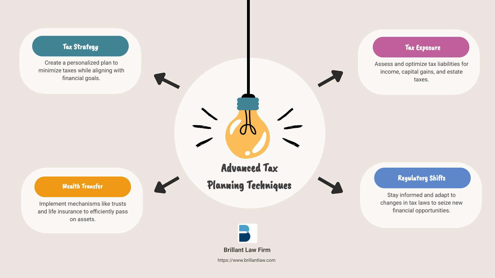

## Table of Contents

## What is tax planning and why is it important?

Tax planning is when you think about and organize your money in a way that helps you pay less tax. It's like making a plan to save money by understanding the tax rules and using them smartly. You might decide to put money into certain savings accounts, invest in specific ways, or time your income and expenses to lower your tax bill.

It's important because it can save you a lot of money. By planning, you can keep more of your earnings instead of giving it to the government in taxes. This can help you reach your financial goals faster, like saving for a house, paying for education, or retiring comfortably. Plus, good tax planning can make your financial life easier and less stressful because you know you're not paying more tax than you need to.

## What are the basic principles of tax planning?

The first principle of tax planning is understanding the tax laws. This means knowing what income is taxable, what expenses you can deduct, and what tax credits you can claim. By understanding these rules, you can make smart choices about when to earn income, when to spend money, and how to invest your money to pay less tax. For example, if you know you can deduct certain expenses, you might choose to spend more on those things to lower your taxable income.

Another important principle is timing. This means thinking about when you earn money and when you spend it. Sometimes, you can save on taxes by [earning](/wiki/earning-announcement) income in one year instead of another, or by delaying when you get paid. Also, you might want to time your big expenses or investments to get the most tax benefits. For example, if you know you'll be in a lower tax bracket next year, you might want to delay some income until then.

Lastly, diversification is key. This means spreading your money across different types of investments and savings accounts. Some investments might grow without being taxed right away, while others might give you tax breaks now. By having a mix, you can lower your overall tax bill. For example, you might put some money in a retirement account that grows tax-free until you retire, and some in a regular investment account that you can use anytime.

## How does tax planning differ from tax evasion?

Tax planning is when you use the tax laws to pay less tax in a legal way. It's like following the rules of a game to win. You might put money into special savings accounts or time when you earn money to save on taxes. It's all about making smart choices with your money to keep more of it, without breaking any laws.

Tax evasion, on the other hand, is when you break the law to avoid paying taxes. It's like cheating in a game. People who evade taxes might hide their income or lie about their expenses to pay less tax. This is illegal and can get you in big trouble, like paying fines or even going to jail. So, while tax planning is smart and legal, tax evasion is risky and wrong.

## What are common tax planning strategies for individuals?

One common tax planning strategy for individuals is to contribute to retirement accounts like a 401(k) or an IRA. When you put money into these accounts, you can often deduct it from your income, which means you pay less tax now. Plus, the money in these accounts can grow without being taxed until you take it out when you retire. This can save you a lot of money over time. Another strategy is to use tax-advantaged savings accounts like a Health Savings Account (HSA) or a 529 plan for education. These accounts let you save money for specific goals and get tax breaks along the way.

Another strategy is to time your income and expenses. For example, if you expect to be in a lower tax bracket next year, you might delay some of your income until then. Or, if you have big expenses coming up, you might want to pay for them this year if it will help you save on taxes. Also, if you have investments, you can choose ones that are taxed less, like long-term capital gains instead of regular income. By thinking about when and how you earn and spend money, you can lower your tax bill.

Lastly, taking advantage of tax credits and deductions is a smart move. Tax credits directly reduce the amount of tax you owe, and they can be very valuable. For example, the Earned Income Tax Credit or the Child Tax Credit can save you a lot of money. Deductions, on the other hand, reduce your taxable income. Common deductions include mortgage interest, student loan interest, and charitable donations. By knowing what you can claim and keeping good records, you can make sure you're not paying more tax than you need to.

## How can businesses utilize tax planning to minimize their tax liabilities?

Businesses can use tax planning to minimize their tax liabilities by taking advantage of various tax deductions and credits available to them. For example, they can deduct expenses like rent, utilities, and employee salaries from their income, which lowers their taxable income. They might also be eligible for tax credits for things like research and development, hiring certain employees, or investing in green energy. By carefully tracking and claiming these deductions and credits, businesses can significantly reduce the amount of tax they have to pay.

Another strategy is to plan the timing of income and expenses. Businesses might choose to delay income into the next year if they expect to be in a lower tax bracket, or they might accelerate expenses into the current year to get a bigger deduction. For example, if a business knows it will have a big expense coming up, like buying new equipment, it might do it at the end of the year to reduce its taxable income for that year. By thinking about when to earn and spend money, businesses can manage their tax bills more effectively.

Lastly, businesses can use different business structures to their advantage. For instance, choosing between being a sole proprietorship, a partnership, an S corporation, or a C corporation can affect how much tax a business pays. Each structure has different tax implications, and by [picking](/wiki/asset-class-picking) the right one, a business can minimize its tax liability. Additionally, businesses might consider setting up retirement plans for employees, which can provide tax benefits for both the business and the employees. By understanding and using these strategies, businesses can keep more of their earnings and use them to grow and thrive.

## What role do tax deductions and credits play in tax planning?

Tax deductions and credits are key parts of tax planning because they help you pay less tax. Deductions lower your taxable income. This means you only pay tax on what's left after you subtract your deductions. For example, if you have a business, you can deduct things like rent, utilities, and employee salaries. This makes your taxable income smaller, so you pay less tax. If you're an individual, you might deduct things like mortgage interest or student loan interest. By knowing what you can deduct and keeping good records, you can save a lot of money on taxes.

Tax credits are even better because they directly reduce the amount of tax you owe, dollar for dollar. For example, if you owe $1,000 in taxes and you get a $500 tax credit, you only have to pay $500. Some common tax credits include the Earned Income Tax Credit, the Child Tax Credit, and credits for things like education or energy-efficient home improvements. By taking advantage of these credits, you can lower your tax bill even more. Both deductions and credits are important tools in tax planning because they help you keep more of your money and reach your financial goals faster.

## How does one's filing status affect tax planning strategies?

Your filing status, like being single, married filing jointly, or head of household, can change how much tax you pay and what tax planning strategies you use. Each status has different tax rates and rules. For example, if you're married and file jointly, you might be in a lower tax bracket than if you filed separately. This means you could save money by timing your income and expenses to take advantage of these lower rates. Also, some tax credits and deductions are only available or more valuable depending on your filing status. Knowing your status helps you plan better.

For example, if you're the head of household, you get a bigger standard deduction than if you're single. This can affect whether you should itemize your deductions or take the standard one. If you're thinking about getting married, you might want to look at how it will change your taxes. Sometimes, getting married can mean you pay less tax, but other times it might mean you pay more. By understanding how your filing status affects your taxes, you can make smarter choices about when to earn money, what to spend it on, and how to save on taxes.

## What are the implications of tax planning on retirement planning?

Tax planning can have a big impact on your retirement planning. When you save for retirement, you can put money into special accounts like a 401(k) or an IRA. These accounts let you deduct the money you put in from your income, which means you pay less tax now. Plus, the money in these accounts can grow without being taxed until you take it out when you retire. By using these accounts, you can save more money for retirement because you're not losing as much to taxes along the way.

Also, tax planning can help you decide when to start taking money out of your retirement accounts. If you wait until you're in a lower tax bracket, you might pay less tax on the money you take out. You can also plan to take money out in a way that keeps you in a lower tax bracket each year. By thinking about taxes when you plan for retirement, you can make your money last longer and have a more comfortable retirement.

## How can international tax laws impact global tax planning?

International tax laws can make a big difference in how people and businesses plan their taxes around the world. When you earn money in different countries, you have to think about the tax rules in each place. Some countries have special agreements called tax treaties that help avoid paying tax twice on the same money. By understanding these rules and treaties, you can choose where to earn money and how to move it around to pay less tax overall. For example, if one country has lower taxes on certain types of income, you might decide to earn that income there.

Also, international tax laws can affect how businesses set up their operations. Companies might choose to do business in countries with lower tax rates or use special strategies like transfer pricing to move profits to places where they'll be taxed less. But, it's important to follow the rules because breaking them can lead to big fines and legal trouble. By planning carefully and working with experts who know international tax laws, businesses can save money and grow more successfully around the world.

## What advanced tax planning techniques are used by high-net-worth individuals?

High-net-worth individuals often use advanced tax planning techniques to minimize their tax liabilities. One common strategy is setting up trusts. Trusts can help protect assets and reduce estate taxes. For example, by putting money into a trust, you can pass it on to your family without them having to pay as much tax. Another technique is investing in tax-efficient ways, like using municipal bonds, which often don't get taxed at the federal level. They might also use strategies like tax-loss harvesting, where they sell investments at a loss to offset gains and lower their tax bill.

Another advanced technique is using offshore accounts and structures. Some high-net-worth individuals move money to countries with lower tax rates or more favorable tax laws. This can help them pay less tax on their income and investments. However, it's important to follow the rules and report these accounts properly to avoid legal issues. Lastly, they might use family limited partnerships (FLPs) to transfer wealth to their children or other family members at a lower tax cost. By carefully planning and using these advanced strategies, high-net-worth individuals can keep more of their money and pass it on to future generations more efficiently.

## How do changes in tax legislation influence tax planning strategies?

Changes in tax legislation can really shake up how people and businesses plan their taxes. When the government changes the tax laws, it can affect things like tax rates, deductions, and credits. For example, if the government raises tax rates, people might try to earn less money that year or find new ways to save on taxes. On the other hand, if new deductions or credits are added, people might change how they spend their money to take advantage of them. Keeping up with these changes is important because it helps you make smart choices about when to earn money, what to spend it on, and how to save on taxes.

Also, changes in tax laws can make some old tax planning strategies less useful or even useless. For instance, if a popular deduction gets taken away, people who used to rely on it need to find new ways to save on taxes. Sometimes, new laws can create new opportunities for tax savings. For example, if the government starts offering a new tax credit for green energy, people might invest in solar panels or electric cars to get that credit. By staying informed about tax law changes and working with a tax professional, you can adjust your tax planning strategies to keep saving money and reach your financial goals.

## What tools and software are available to assist with tax planning?

There are many tools and software that can help with tax planning. One popular type is tax preparation software like TurboTax or H&R Block. These programs guide you through the process of filing your taxes and help you find deductions and credits you might not know about. They also let you see how different choices, like when to take money out of your retirement account, might affect your taxes. Another useful tool is financial planning software like Quicken or Mint. These programs help you keep track of your money and plan for the future, including how to save on taxes.

Another type of tool is tax planning software specifically designed for businesses, like Avalara or TaxAct. These programs help businesses manage their taxes by tracking income and expenses, calculating taxes owed, and finding ways to save money. They can also help with things like sales tax and payroll taxes. For people who need more advanced help, there are also professional tax planning services that use specialized software to create detailed tax plans. These services can be really helpful for high-net-worth individuals or complex business situations.

## References & Further Reading

[1]: Bradshaw, J., & Watts, G. (2016). ["Tax Planning and Corporate Governance."](https://www.sciencedirect.com/science/article/abs/pii/S0165410118301125) Accounting Review, Volume 91, Issue 5.

[2]: Chan, E. P. (2009). ["Quantitative Trading: How to Build Your Own Algorithmic Trading Business."](https://github.com/ftvision/quant_trading_echan_book) Wiley.

[3]: Jansen, S. (2018). ["Machine Learning for Algorithmic Trading."](https://github.com/stefan-jansen/machine-learning-for-trading) Packt Publishing.

[4]: Lopez de Prado, M. (2018). ["Advances in Financial Machine Learning."](https://www.amazon.com/Advances-Financial-Machine-Learning-Marcos/dp/1119482089) Wiley.

[5]: Poterba, J. M., & Weisbenner, S. (2001). ["Capital Gains Tax Rules, Tax-loss Trading, and Turn-of-the-Year Returns."](https://onlinelibrary.wiley.com/doi/full/10.1111/0022-1082.00328) The Journal of Finance, Volume 56, Issue 1.