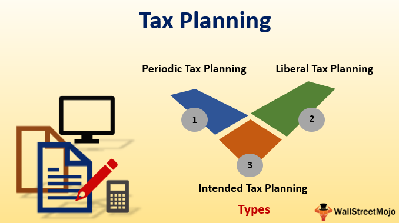

Financial planning has become increasingly essential in today’s volatile economic climate, characterized by fluctuating markets, evolving tax regulations, and unforeseen financial disruptions. Ensuring a stable financial future requires individuals and businesses to adopt comprehensive financial strategies that can weather economic uncertainties. At the heart of effective financial planning lies tax planning, a critical component that significantly influences an individual's or an entity's financial health.

Tax planning involves strategizing to minimize tax liabilities and maximize deductions within the legal framework, thereby retaining more income for savings, investments, and expenditures. It is a vital aspect of financial well-being, enabling individuals and businesses to optimize their finances while complying with tax laws. Key strategies include maximizing contributions to tax-advantaged accounts, utilizing deductible expenses, and structuring investments to benefit from preferential tax treatments. By incorporating these strategies, individuals can potentially enhance their financial outcomes and facilitate wealth accumulation.



In parallel, algorithmic trading, commonly known as algo trading, has emerged as a pivotal component of contemporary investment strategies. This approach utilizes advanced algorithms and computational power to execute trading decisions at speeds and frequencies that are impossible for human traders. By leveraging algorithmic trading, both individual and institutional investors can capitalize on market inefficiencies, optimize their trading performance, and potentially increase their returns.

This article aims to explore the intersection of tax planning, financial planning, tax strategies, and algorithmic trading. By understanding how these elements interconnect, investors and financial planners can develop robust strategies that enhance financial outcomes, reduce liabilities, and increase overall wealth. The integration of effective tax planning and algorithmic trading can provide a comprehensive approach to achieving financial stability and growth in a complex economic environment.

## Table of Contents

## Understanding Tax Planning in Financial Planning

Tax planning is a strategic approach to managing one's tax liabilities through the optimization of deductions and credits, aiming to minimize the amount owed to tax authorities. By effectively coordinating this component within comprehensive financial planning, individuals and businesses can exercise significant control over their financial futures, crafting paths that focus on efficient resource allocation and maximum retention of income.

**Key Tax Deductions and Credits**

Individuals and businesses have access to a variety of deductions and credits that play a pivotal role in reducing taxable income. Some common deductions available to individuals include mortgage interest, student loan interest, and state income taxes. For businesses, deductions such as operating expenses, depreciation, and contributions to employee retirement plans (like 401(k)s) provide significant financial relief. Tax credits, which directly reduce the amount of tax owed, include the Earned Income Tax Credit (EITC) and the Child Tax Credit, both aimed at assisting low- to moderate-income families.

**Reducing Financial Liabilities through Effective Tax Planning**

Effective tax planning involves employing strategies that legally minimize taxes. By taking advantage of both deductions and credits, taxpayers can reduce the total taxable income and, consequently, the liability owed. This process requires careful assessment and timing, such as strategically placing expenses to maximize deductibility or utilizing the "bunching of deductions" method, where deductible expenses are strategically timed to fit within a single tax year, maximizing the deduction impact.

**Impact on Long-Term Wealth Accumulation**

From a wealth accumulation perspective, every dollar saved from taxes can be reinvested for future growth. By skillfully crafting a plan, individuals can leverage tax savings to contribute more towards retirement accounts or investments that compound over time, enhancing net worth. Tax-efficient investments, like municipal bonds, which are often exempt from federal taxes, can be integral to these plans, allowing investors to retain more returns post-tax.

**Tax Planning Tips for Different Life Stages**

1. **Young Professionals**: Early in their careers, young professionals should focus on establishing tax-advantaged retirement accounts, such as a Roth IRA, which offers tax-free growth and withdrawals. Contributing to employer-sponsored retirement plans is also beneficial, especially when an employer match is available.

2. **Families**: Families can optimize their tax situation by taking advantage of Child Tax Credits and deductions for educational expenses. Additionally, contributing to Health Savings Accounts (HSAs) can reduce taxable income while saving for future medical expenditures.

3. **Retirees**: In retirement, the focus shifts to managing withdrawals from retirement accounts in a tax-efficient manner. Retirees should consider the timing of Social Security benefits and Required Minimum Distributions (RMDs) from qualified retirement accounts, balancing taxable income over time to minimize tax liabilities. Here, the strategy of converting traditional IRAs to Roth IRAs during low-income years can be advantageous, as the converted amount is taxed at a potentially lower rate.

Through a pragmatic approach to tax planning, individuals at all life stages can significantly influence their financial trajectories, promoting sustained wealth and financial security. By understanding and utilizing the array of tools and strategies available, they can build robust financial plans that align with their goals and circumstances.

## Exploring Effective Tax Strategies

Tax strategies are essential for maximizing tax deductions and minimizing liabilities, ultimately contributing to enhanced financial outcomes. Various strategies can be implemented to achieve this goal, and they can be broadly categorized into short-term and long-term approaches.

*Short-Term vs Long-Term Tax Strategies for Wealth Creation*

Short-term tax strategies often focus on immediate tax relief and cash flow improvement. These might include accelerating deductions by prepaying expenses within a taxable year or deferring income to the following year to reduce the current year's tax burden. Short-term strategies can be particularly useful for individuals seeking to manage year-to-year financial variances.

Long-term strategies, on the other hand, aim to maximize wealth accumulation over several years. They often involve investing in tax-advantaged accounts such as Individual Retirement Accounts (IRAs) and 401(k)s, which offer tax deferral on earnings until withdrawal. This allows the investments to grow without the immediate tax burden, potentially resulting in significant compound growth over time.

*Tax-Advantaged Accounts and Investments*

Tax-advantaged accounts and investment vehicles play a critical role in tax strategy. IRAs and 401(k)s are popular due to their tax-deferred nature, enabling individuals to contribute pre-tax income. The investments within these accounts grow tax-free until distributions are made, usually in retirement, at which point the distributions are typically taxed as regular income. 

Another tax-advantaged option is the Roth IRA, which allows for contributions with after-tax dollars, but the withdrawals, including earnings, are tax-free in retirement. This can be particularly advantageous if an individual anticipates being in a higher tax bracket upon retirement.

*Estate Planning for Effective Tax Management*

Estate planning is another vital component of effective tax management. It involves structuring one's estate to minimize tax liabilities upon transfer of wealth. Strategies can include utilizing gift tax exclusions, establishing trusts to manage the distribution of assets, and leveraging the estate tax exemption. These tactics can significantly reduce the tax burden on heirs and ensure a more efficient transfer of assets.

*Integrating Tax Strategies with Investment Strategy*

Integrating tax strategies with an overall investment strategy is imperative for optimal financial gains. This might involve selecting investments that offer favorable tax treatment, such as municipal bonds, which generate tax-exempt interest. A balanced portfolio should consider both the potential return on investment and the associated tax implications to ensure that net returns are maximized.

In summary, effective tax strategies involve a combination of short-term and long-term planning, utilization of tax-advantaged accounts, estate planning, and integration with investment strategies. By implementing these strategies, individuals and businesses can optimize their financial outcomes and achieve sustained wealth growth.

 to Algorithmic Trading

Algorithmic trading, or algo trading, refers to the use of computer algorithms to manage trading decisions at speeds and frequencies beyond human capacity. These systems execute predetermined instructions based on variables such as price, [volume](/wiki/volume-trading-strategy), and timing, making trades more systematic and less emotional. Algo trading can improve efficiency by executing trades more rapidly than humans and reducing transaction costs associated with hand-held trades.

Technology-driven investment strategies have surged with advancements in computational power and internet connectivity. The proliferation of high-frequency trading ([HFT](/wiki/high-frequency-trading-strategies)), which seeks to profit from very short-lived market anomalies, exemplifies the growth of technology-integrated investment approaches. Algorithms utilize complex mathematical models and formulas to decide on trade execution. 

The benefits of algo trading are significant for both individual and institutional investors. For individuals, algo trading provides an opportunity to compete in increasingly sophisticated markets without needing deep technical expertise. Institutional investors benefit from larger-scale efficiencies and risk management. Algorithms can parse massive datasets to optimize trade execution, reduce market impact, and refine order placements with precision.

Basic components of algo trading systems include strategy formulation, algorithmic code development, [backtesting](/wiki/backtesting), execution, and risk management. Strategies range from [arbitrage](/wiki/arbitrage), including [statistical arbitrage](/wiki/statistical-arbitrage), to market-making and trend-following strategies. 

Data plays a critical role, as it fuels algorithmic decision-making processes. The quality and quantity of data inform model accuracy and trade outcomes. Access to real-time market data feeds is paramount, and computational resources need to process this data at lightning speed. Superior computational power yields an edge, enabling the processing of complex calculations that add granularity and precision to trading decisions.

Overall, [algorithmic trading](/wiki/algorithmic-trading) has transformed modern finance by introducing methodology that leverages data analytics and computational power to optimize trading efficiency and performance.

## Interlinking Tax Strategies with Algo Trading

Algorithmic trading, a technology-centric investment strategy, has transformed modern financial markets by enabling rapid and data-driven trading decisions. However, the financial gains realized through algorithmic trading come with specific tax implications. Understanding these implications can significantly affect net returns and shape the overall trading strategy.

### Tax Implications of Algorithmic Trading Gains

Income generated from algorithmic trading is typically categorized based on the type of asset and the holding period. Short-term capital gains, applicable to assets held for less than a year, are taxed at ordinary income rates, which can be substantial. Conversely, long-term capital gains, applicable to assets held for more than a year, generally benefit from reduced tax rates. Thus, the strategic timing of holding and selling assets is crucial for optimizing tax outcomes.

### Tax Considerations and Algo Trading Strategies

Taxation influences several aspects of algorithmic trading strategies. For instance, traders may design algorithms that prioritize long-term positions over short-term trades to capitalize on favorable tax rates. Additionally, end-of-year trading strategies might be adjusted to leverage tax-loss harvesting, where losses are realized to offset taxable gains. The implementation of such strategies requires a careful analysis of expected price trajectories, tax regulations, and personal financial goals.

### Tools and Software for Tax Efficiency

Integrating tax efficiency in algorithmic trading involves using sophisticated tools and software. Platforms like QuantConnect or MetaTrader can be tailored to incorporate tax-aware strategies by simulating different tax scenarios and optimizing trades accordingly. Moreover, these tools can automate the transaction processes necessary for maintaining tax-efficient portfolios by keeping track of cost bases, trade history, and potential tax liabilities.

### Risk Management and Compliance

Effective risk management and compliance are integral to algorithmic trading, especially when tax strategies are involved. Regulatory requirements necessitate accurate reporting of all transactions and tax liabilities. Failure to comply can result in penalties, effectively eroding trading profits. Traders must ensure their algorithms include compliance checks and controls to mitigate these risks. For example:

```python
def calculate_tax_liability(trades):
    # Hypothetical function to calculate tax liability for trades
    tax_liability = 0
    for trade in trades:
        if trade['holding_period'] < 365:  # Short term
            tax_liability += trade['profit'] * 0.25  # Example short-term rate
        else:  # Long term
            tax_liability += trade['profit'] * 0.15  # Example long-term rate
    return tax_liability
```

### Case Studies of Successful Integration

Examining real-world examples provides insight into the effective combination of tax strategies with algo trading. A notable case involves a [hedge fund](/wiki/hedge-fund-trading-strategies) that utilized tax-loss harvesting within its algorithmic model to offset gains from highly volatile sectors like technology. By systematically realizing losses and optimizing trades for tax efficiency, the fund enhanced its after-tax returns significantly.

A similar approach was adopted by another trading firm, which integrated predictive models for tax events, such as anticipated changes in tax laws or capital gains rates, into its trading algorithms. This foresight allowed the firm to adjust its trading positions preemptively, minimizing adverse tax impacts while maximizing profit potential.

In conclusion, marrying tax strategies with algorithmic trading requires an intricate understanding of both domains. By leveraging specialized tools, maintaining rigorous compliance, and learning from successful implementations, traders can enhance their financial outcomes in a structured and informed manner.

## Maximizing Financial Outcomes: A Holistic Approach

In the pursuit of optimal financial outcomes, aligning tax planning with algorithmic trading offers substantial benefits. A holistic approach that integrates these elements can enhance financial performance by minimizing tax liabilities while maximizing investment returns. 

Aligning tax strategies with algorithmic trading can lead to significant advantages. Algorithmic trading enables rapid and data-driven decision-making processes, potentially leading to increased returns. By incorporating tax planning into this framework, investors can efficiently manage taxable events, such as capital gains, thereby reducing the net tax impact on investment gains. For example, investors can strategically time trades to take advantage of lower capital gains tax rates or employ strategies to offset gains with losses, known as tax-loss harvesting.

Personalizing strategies that incorporate both tax and trading insights is essential. Each investor has unique financial circumstances, and a tailored plan can optimize individual outcomes. This involves selecting appropriate trading algorithms that align with one’s risk profile and financial goals while simultaneously ensuring that tax considerations, such as allowable deductions and credits, are factored into the trading decisions. For instance, optimization algorithms can be developed to consider both after-tax returns and market conditions, thus offering a balanced approach to investment decisions.

Consultation with financial advisors and tax professionals is crucial for this integrated approach. These experts provide insights into both fields, helping devise strategies that adhere to regulatory requirements and avoid common pitfalls. They also offer guidance on the latest tax laws and trading regulations, ensuring that the devised strategy remains compliant and effective under changing conditions. An advisor might recommend adjustments in asset allocation within tax-advantaged accounts or suggest tax-efficient investment vehicles that complement trading strategies.

Continuous education and adaptation are essential in maintaining an effective financial strategy. The financial landscape is dynamic, with frequent changes in tax laws and technological advancements in trading systems. Investors must stay informed about these changes to continually refine their strategies. Engaging in workshops, subscribing to financial news, and participating in online courses can help investors and traders remain updated on best practices.

Looking forward, future trends in tax strategy and algo trading will heavily influence financial planning. The increasing integration of [artificial intelligence](/wiki/ai-artificial-intelligence) and [machine learning](/wiki/machine-learning) in trading algorithms holds promise for more sophisticated tax-efficient strategies, potentially automating tax considerations based on real-time market analyses. Moreover, regulatory changes, such as shifts in taxation policies on digital assets, are likely to impact how algorithms are designed and employed. Staying abreast of these trends will enable investors to anticipate changes and adapt their strategies accordingly for sustained financial success.

## Conclusion

The intersection of tax planning, financial planning, and trading strategies, particularly through algorithmic trading, presents a multifaceted approach to enhancing one's financial health. Through tax planning, individuals and businesses are empowered to manage their financial liabilities effectively and optimize wealth accumulation over time. Simultaneously, algorithmic trading brings a technological edge to investment strategies, offering the potential for higher returns and improved efficiency in the financial markets.

The integration of robust tax strategies with algorithmic trading can significantly amplify financial outcomes. By considering tax implications in trading algorithms, investors can minimize tax liabilities and maximize net returns. This holistic approach not only enhances profitability but also aligns investment activities with overall financial goals.

As the financial landscape continues to evolve, it is essential for individuals to critically evaluate their current financial strategies. Regular assessment allows one to identify areas for improvement and incorporate new strategies that match evolving personal and economic contexts. Remaining informed and proactive is crucial to navigating the complexities of financial planning successfully.

Engaging with financial professionals is highly recommended to effectively harness the benefits of these integrated strategies. Professionals can offer personalized advice, utilize advanced tools, and provide insights crucial for making informed decisions. This engagement ensures that financial goals are met with the expert guidance necessary to adapt to market changes and tax regulations effectively. 

In conclusion, the synergy between tax planning, financial planning, and algorithmic trading creates a powerful framework for achieving optimal financial outcomes. By staying informed and engaging with experts, individuals can navigate the complexities of these strategies to secure and enhance their financial future.

## References & Further Reading

[1]: Bradshaw, J., & Watts, G. (2016). ["Tax Planning and Corporate Governance."](https://www.sciencedirect.com/science/article/abs/pii/S0165410118301125) Accounting Review, Volume 91, Issue 5.

[2]: Chan, E. P. (2009). ["Quantitative Trading: How to Build Your Own Algorithmic Trading Business."](https://github.com/ftvision/quant_trading_echan_book) Wiley.

[3]: Jansen, S. (2018). ["Machine Learning for Algorithmic Trading."](https://github.com/stefan-jansen/machine-learning-for-trading) Packt Publishing.

[4]: Lopez de Prado, M. (2018). ["Advances in Financial Machine Learning."](https://www.amazon.com/Advances-Financial-Machine-Learning-Marcos/dp/1119482089) Wiley.

[5]: Poterba, J. M., & Weisbenner, S. (2001). ["Capital Gains Tax Rules, Tax-loss Trading, and Turn-of-the-Year Returns."](https://onlinelibrary.wiley.com/doi/full/10.1111/0022-1082.00328) The Journal of Finance, Volume 56, Issue 1.