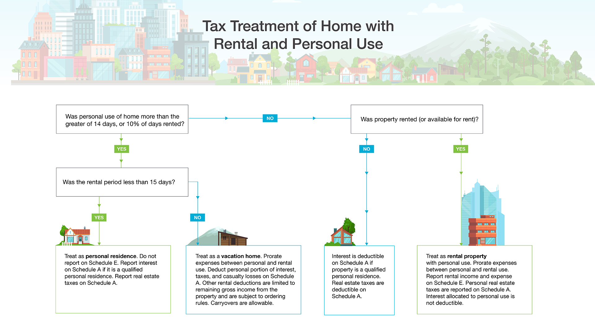

## Table of Contents

## What are the basic tax implications of renting out a personal residence?

When you rent out your personal residence, you need to consider the tax implications. The money you earn from renting out your home is considered taxable income. You must report this income on your tax return. The IRS requires you to pay taxes on this rental income, just like you would with any other type of income. However, you can also deduct certain expenses related to the rental, which can help reduce the amount of tax you owe.

Some common deductible expenses include mortgage interest, property taxes, insurance, maintenance, and repairs. You can also deduct depreciation on the portion of your home that is used for rental purposes. It's important to keep good records of all your income and expenses, as you will need to report these on your tax return. If you rent out your home for less than 15 days a year, you don't have to report the income, but you also can't deduct any expenses. Understanding these basic tax rules can help you manage your rental income more effectively and avoid any surprises come tax time.

## How do I determine if my rental income is taxable?

If you rent out your home, the money you get from it is usually taxable. This means you have to tell the government about it and pay taxes on it. The IRS says that any money you earn from renting out your home is income, just like money from a job. So, if you rent out your home for more than 14 days in a year, you need to report that money on your tax return.

But there's good news too. You can also take away some costs from your taxes. These costs can be things like part of your mortgage interest, property taxes, insurance, and money you spend to fix or maintain the home. You can also take away a bit of the value of your home over time, which is called depreciation. Just make sure to keep good records of all your money coming in and going out. This way, you can show the IRS what you earned and spent, and maybe pay less in taxes.

## What expenses can I deduct when renting out my home?

When you rent out your home, you can take away some costs from your taxes. These costs can help you pay less in taxes. Some of the costs you can take away include part of your mortgage interest and property taxes. You can also take away the cost of insurance for your home. If you spend money to fix or maintain the home, like painting or repairing a leaky roof, you can take those costs away too.

Another cost you can take away is called depreciation. This is when you take away a bit of the value of your home over time. But you can only do this for the part of your home that you rent out. So, if you rent out half of your home, you can take away depreciation for that half. It's important to keep good records of all these costs. This way, you can show the IRS what you spent and take away as much as you can from your taxes.

## What is the difference between short-term and long-term rental tax treatments?

When you rent out your home for a short time, like less than a month, it's called short-term rental. The money you get from short-term rentals is usually taxable. But if you rent out your home for less than 15 days in a year, you don't have to tell the IRS about the money. You also can't take away any costs for those rentals. If you rent it out for more than 14 days, you have to report the money and you can take away some costs like part of your mortgage interest, property taxes, insurance, and money you spend to fix or maintain the home.

Long-term rentals are when you rent out your home for a longer time, like a year or more. The money you get from long-term rentals is also taxable, and you have to report it to the IRS. But with long-term rentals, you can take away more costs. You can take away part of your mortgage interest, property taxes, insurance, and money you spend to fix or maintain the home. You can also take away depreciation, which is when you take away a bit of the value of your home over time. Just make sure to keep good records of all your money coming in and going out, so you can show the IRS what you earned and spent.

## How does the '14-day rule' affect my tax obligations?

The '14-day rule' is a special rule from the IRS that helps people who rent out their homes for a short time. If you rent out your home for 14 days or less in a year, you don't have to tell the IRS about the money you get from those rentals. This means you don't have to pay taxes on that money. It's like the IRS is giving you a break if you only rent out your home for a short time.

But, there's a catch. If you use the '14-day rule,' you can't take away any costs related to those rentals on your taxes. So, if you spend money to fix up your home or pay for insurance, you can't use those costs to lower your taxes. This rule can be helpful if you only rent out your home for a short time and don't want to deal with extra tax paperwork, but it means you can't get any tax benefits from your rental costs.

## What are the tax implications of renting out a room in my primary residence?

When you rent out a room in your primary residence, the money you earn from it is usually taxable. You need to report this income on your tax return and pay taxes on it, just like you would with any other type of income. However, there's a special rule called the '14-day rule' that can help. If you rent out the room for 14 days or less in a year, you don't have to report the income to the IRS and you don't have to pay taxes on it. This can be a big help if you only rent out the room for a short time.

But if you rent out the room for more than 14 days, you have to report the income and pay taxes on it. The good news is that you can also take away some costs from your taxes. These costs can include part of your mortgage interest, property taxes, insurance, and money you spend to fix or maintain the room. You can also take away depreciation for the part of your home that you rent out. Keeping good records of your income and expenses is important, so you can show the IRS what you earned and spent, and maybe pay less in taxes.

## How do I report rental income and expenses on my tax return?

To report rental income and expenses on your tax return, you need to use a special form called Schedule E. This form is part of your personal tax return, which is Form 1040. On Schedule E, you write down all the money you got from renting out your home. This includes the rent you received from your tenants. You also need to write down all the costs you had for the rental, like part of your mortgage interest, property taxes, insurance, and money you spent to fix or maintain the home. You can also take away depreciation, which is when you take away a bit of the value of your home over time.

If you rent out your home for more than 14 days in a year, you have to report the income and take away the costs on Schedule E. But if you rent it out for 14 days or less, you don't have to report the income or take away any costs. It's important to keep good records of all your income and expenses. This way, you can show the IRS what you earned and spent, and maybe pay less in taxes. If you're not sure how to fill out Schedule E or have a lot of rental income and expenses, it might be a good idea to talk to a tax professional who can help you.

## What are the potential tax benefits of renting out my home, such as depreciation?

When you rent out your home, one of the big tax benefits you can get is called depreciation. Depreciation lets you take away a bit of the value of your home over time on your taxes. This can help you pay less in taxes. But you can only take away depreciation for the part of your home that you rent out. So, if you rent out half of your home, you can take away depreciation for that half. It's important to keep good records of how much your home is worth and how much you take away each year.

Another tax benefit is that you can take away some of the costs of renting out your home. These costs can include part of your mortgage interest, property taxes, insurance, and money you spend to fix or maintain the home. Taking away these costs can help lower the amount of tax you owe on the money you get from renting out your home. Just make sure to keep good records of all your costs, so you can show the IRS what you spent and take away as much as you can from your taxes.

## How do local and state taxes impact my rental income?

When you rent out your home, you need to think about local and state taxes too. These taxes can be different depending on where you live. Some places have a special tax just for rental income. This means you might have to pay more taxes on the money you get from renting out your home. You need to check with your local and state tax offices to find out what rules apply to you. They can tell you if you need to pay extra taxes and how much.

Local and state taxes can also affect what costs you can take away from your taxes. Some places let you take away more costs than others. For example, you might be able to take away part of your property taxes or money you spend to fix up your home. But the rules can be different in each place. It's a good idea to keep good records of all your income and costs, so you can show the tax offices what you earned and spent. This way, you can make sure you're paying the right amount of taxes and taking away as much as you can.

## What are the tax consequences of converting a personal residence to a rental property?

When you change your home from a place where you live to a place you rent out, there are some tax things you need to know. The money you get from renting out your home is usually taxable. This means you have to tell the IRS about it and pay taxes on it, just like you would with money from a job. But there's good news too. You can take away some costs from your taxes, like part of your mortgage interest, property taxes, insurance, and money you spend to fix or maintain the home. You can also take away depreciation, which is when you take away a bit of the value of your home over time. Just make sure to keep good records of all your money coming in and going out, so you can show the IRS what you earned and spent.

Another thing to think about is the '14-day rule.' If you rent out your home for 14 days or less in a year, you don't have to report the income to the IRS and you don't have to pay taxes on it. But if you use this rule, you also can't take away any costs related to those rentals on your taxes. If you rent out your home for more than 14 days, you have to report the income and you can take away some costs. It's important to know these rules so you can manage your rental income well and avoid any surprises when it's time to do your taxes.

## How do I handle capital gains tax when selling a property that was used as a rental?

When you sell a property that you used as a rental, you might have to pay capital gains tax. This tax is on the profit you make from selling the property. The profit is the difference between what you sold the property for and what you paid for it, plus any costs you took away while you owned it. If you lived in the property before renting it out, you might be able to take away some of the profit from your taxes. This is called the primary residence exclusion, and it can help you pay less in taxes. But if you only used the property as a rental and never lived in it, you can't use this exclusion.

To figure out your capital gains tax, you need to know your cost basis. This is what you paid for the property, plus any improvements you made, minus any depreciation you took away while you rented it out. The IRS lets you take away depreciation to lower your taxes while you're renting out the property, but it also lowers your cost basis. So when you sell, you might have to pay back some of the tax benefits you got from depreciation. This is called depreciation recapture, and it's taxed at a different rate than regular capital gains. Keeping good records of what you paid for the property, what improvements you made, and what depreciation you took away can help you figure out your taxes when you sell.

## What advanced strategies can I use to minimize my tax liability from rental income?

One way to lower your tax bill from rental income is to use a strategy called cost segregation. This means you can take away the value of different parts of your rental property faster than you normally would. Instead of taking away the value of your whole home over a long time, you can take away the value of things like appliances or carpeting much quicker. This can help you pay less in taxes each year because you're taking away more costs. But cost segregation can be tricky, so it's a good idea to talk to a tax professional who knows about it.

Another strategy is to set up your rental property as a business. If you do this, you might be able to take away more costs than you would if it was just a personal rental. You can take away things like travel costs, office supplies, and even part of your home if you use it for business. Setting up your rental as a business can also help you with something called passive activity loss rules. These rules can limit how much you can take away from your taxes, but if your rental is a business, you might be able to take away more. Just make sure to keep good records and talk to a tax professional to make sure you're doing everything right.

## References & Further Reading

[1]: ["Section 280A(a) of the Internal Revenue Code"](https://www.law.cornell.edu/uscode/text/26/280A) - Legal information about the Augusta Rule.

[2]: ["Publication 527 (2021), Residential Rental Property"](https://www.irs.gov/publications/p527) - IRS guidelines on tax aspects of rental income and expenses.

[3]: ["IRS Tax Topic 415: Renting Residential and Vacation Property"](https://www.irs.gov/taxtopics/tc415) - Information from the IRS on rental property income and expenses.

[4]: ["Advances in Financial Machine Learning"](https://www.wiley.com/en-us/Advances+in+Financial+Machine+Learning-p-9781119482086) by Marcos Lopez de Prado - A book detailing machine learning applications to finance.

[5]: ["Algorithmic Trading: Winning Strategies and Their Rationale"](https://www.wiley.com/en-us/Algorithmic+Trading%3A+Winning+Strategies+and+Their+Rationale-p-9781118460146) by Ernie Chan - Insights into algorithmic trading strategies.

[6]: ["Deducting Mortgage Interest FAQs"](https://turbotax.intuit.com/tax-tips/home-ownership/deducting-mortgage-interest-faqs/L4a9KF9mI) - IRS guidelines on deducting mortgage interest.

[7]: ["Real Estate Investing For Dummies"](https://www.dummies.com/article/business-careers-money/personal-finance/investing/real-estate/real-estate-investing-for-dummies-cheat-sheet-207572/) by Eric Tyson and Robert S. Griswold - A practical guide on real estate investment strategies and tax planning.

[8]: ["Python for Finance: Analyze Big Financial Data"](https://books.google.com/books/about/Python_for_Finance.html?id=E93SBQAAQBAJ) by Yves Hilpisch - A comprehensive guide to using Python for financial analysis and algorithmic trading.

[9]: ["Property Taxes by State: A Guide and Comparison"](https://www.fool.com/research/property-tax-rates-by-state/) - Tax Foundation's report on property tax rates across the U.S.