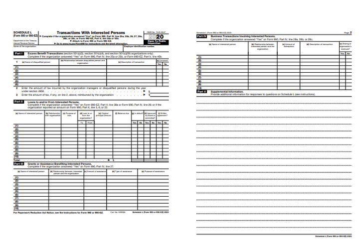

In today's complex financial world, understanding taxation is crucial for individuals and businesses alike. Taxation serves as a fundamental mechanism by which governments generate revenue to finance public services and infrastructure, impacting nearly every aspect of economic activity. This article explores various types of taxation, with a special focus on tax rolls and their implications. Tax rolls are comprehensive records listing entities or properties subject to tax within a jurisdiction, playing a critical role in the administration and collection of property taxes.

In recent years, technology has reshaped numerous sectors, including finance, where the rise of algorithmic trading has transformed how trades are executed in global markets. Algorithmic trading, often referred to as "algo trading," leverages advanced mathematical models and automation to make trading decisions at speeds and accuracies beyond human capabilities. This intersection of taxation, particularly via tax rolls, and algo trading introduces a layer of complexity as it merges legal tax obligations with innovative financial strategies.



Navigating these intertwined aspects requires not only a robust understanding of tax structures but also insight into how they can affect and be leveraged within sophisticated trading methodologies. This article aims to provide clear and concise explanations to enhance your financial literacy, particularly focusing on how tax rolls can influence investment strategies and compliance within algorithmic trading frameworks. Whether you're an average taxpayer or an active participant in financial markets, gaining proficiency in these areas is essential for achieving financial success in an ever-evolving economic landscape.

## Table of Contents

## Overview of Taxation

Taxation serves as a critical pillar of modern economies, essential for generating the revenue necessary for government operations and public service funding. Broadly, the landscape of taxation is categorized into several types, each with distinct characteristics and implications.

Firstly, income tax is a tax levied on individual or corporate earnings. It is typically progressive, meaning that the tax rate increases as the taxable amount increases. Income tax is a major source of revenue for most governments and is instrumental in funding a wide array of public services, including infrastructure, education, and healthcare.

Sales tax, on the other hand, is a consumption tax imposed on the sale of goods and services. It is considered regressive, as it constitutes a larger percentage of the income of lower-income individuals. This type of tax is generally straightforward, applied at the point of sale, and collected by retailers on behalf of the government.

Property tax, another significant form of taxation, is charged on real estate properties owned by individuals or entities. This tax is assessed based on the value of the property and is crucial for local governments, often funding schools, local law enforcement, and emergency services. The administration of property tax through tax rolls—a comprehensive record of properties and their assessed values within a jurisdiction—ensures accurate tax collection and adherence to regulations.

Capital gains tax is levied on the profit realized from the sale of non-inventory assets, such as stocks, bonds, or real estate. The tax applies when the asset is sold at a higher price than its purchase value. Capital gains can be short-term or long-term, with different tax rates applied, generally favoring long-term holdings to encourage investment.

Notably, while income and sales taxes are frequently encountered in discussions of personal finance, property tax deserves particular attention due to its administration via tax rolls. These tax rolls are vital tools for managing property tax obligations and ensuring the efficient collection of taxes, which play an essential role in supporting community services and infrastructure. Understanding how taxes are structured and administered is fundamental for effective financial management and planning.

## Understanding Tax Rolls

A tax roll is an authoritative record that enumerates all properties within a specific jurisdiction that are subject to property tax. This register serves as a foundational tool for municipalities, enabling them to efficiently calculate and collect property taxes. Typically, tax rolls encompass comprehensive data about individual properties, which may include the property's assessed value and the corresponding amount of tax owed by the property owner. This information is essential not only for ensuring accurate billing and collection of taxes but also for providing transparency and accountability in the public revenue system. By maintaining detailed and updated tax rolls, municipal governments can effectively manage public revenue, thereby funding essential services such as education, infrastructure, and public safety. This meticulous record-keeping ensures that property tax collection is both equitable and systematic, contributing to the financial health and stability of the community.

## Types of Tax Rolls

Real Estate Property Tax Rolls are critical financial documents that list all real estate properties within a specific jurisdiction. These rolls are fundamentally organized to include essential details such as the owner's information, the assessed value of the property, and the corresponding tax obligations. The information contained within these rolls is predominantly used by local governments to ensure accurate and efficient tax collection, which then supports funding for public services such as education, infrastructure, and emergency services. The assessed value of a property—determined by government assessors using various metrics—serves as a basis for calculating property taxes owed. In general terms, the property tax (P) can be calculated using the formula:

$$
P = \text{Assessed Value} \times \text{Tax Rate}
$$

This formula highlights the proportional relationship between a property's assessed value and the tax levied upon it, emphasizing the importance of accurate assessments within real estate tax rolls.

Motor Vehicle Property Tax Rolls are another form of tax roll utilized by some jurisdictions. Similar to real estate tax rolls, these records are essential for documenting property taxes levied on motor vehicles. Typically maintained by departments such as the Department of Motor Vehicles (DMV), these rolls also include vital data such as the vehicle's owner, the current market value of the vehicle, and the taxes owed. The approach to assessing vehicle value can differ from real estate, often factoring in aspects like vehicle age, make, model, and depreciation. These assessments ensure that taxes are equitably levied based on the value and usage of the vehicle.

Understanding the differentiation in tax rolls is imperative to comprehend the taxation landscape within a particular jurisdiction. Each asset type—real estate and motor vehicles—is subject to distinct assessment methods and tax implications. Consequently, property owners and stakeholders can better navigate their financial responsibilities by recognizing these differences. This facilitates informed decision-making, whether in purchasing assets, handling tax liabilities, or planning long-term financial strategies in compliance with local tax regulations.

## Special Considerations in Tax Rolls

Tax rolls are comprehensive records that include all due and delinquent taxes until they are fully paid. These records are crucial for ensuring the proper assessment and collection of property taxes by local governments [1]. A significant consideration for properties listed in tax rolls is the impact of any outstanding taxes on property sales and refinancing. 

When a property tax is unpaid, it can result in a tax lien, a legal claim against the property. This lien effectively places a hold on any property transactions, meaning that the property cannot be sold or refinanced until the outstanding taxes are settled and the lien is removed. The lien acts as a financial encumbrance, thus ensuring that the government can collect overdue taxes before the property changes hands [2].

For property owners, being aware of their tax obligations as recorded in the tax rolls is essential to avoid unnecessary legal and financial complications. The presence of a tax lien, for instance, not only affects the property's marketability but can also lead to legal proceedings if left unresolved. Unpaid property taxes and associated liens can accrue interest and penalties over time, compounding the financial burden on the property owner [3].

Thus, it is vital for property owners to regularly consult the tax rolls to understand their financial responsibilities and ensure that all taxes are paid promptly. Doing so allows for smoother property transactions and mitigates risks associated with tax-related legal issues. In essence, diligent management of property tax obligations reflects sound financial practice, safeguarding property ownership from potential encumbrances.

**References:**
1. Internal Revenue Service. "Property Tax." IRS.gov.
2. United States Department of Housing and Urban Development. "The Impact of Property Tax on Housing Affordability."
3. National Tax Lien Association. "Understanding Tax Liens."

## Role of Tax Rolls in Algo Trading

Algorithmic trading, more commonly known as algo trading, uses sophisticated algorithms to automate the execution of trading strategies in financial markets. These strategies utilize mathematical models and quantitative analysis to determine optimal trade conditions, removing the emotional and psychological barriers that can often cloud human judgment.

Algo traders must comprehend tax implications emanating from tax rolls to optimize their strategies and ensure compliance with relevant regulations. Tax rolls, which are official records detailing property subject to taxation, provide critical data points that can significantly influence trading decisions, particularly when property-related assets are part of a trader's investment portfolio.

Understanding tax liabilities linked to property investments is crucial for algorithmic models that incorporate real estate or fixed assets. For instance, the variations in property tax assessments—reflecting changes in tax rolls—can affect the profitability calculations in an algorithm. Suppose an algo trading strategy involves investing in Real Estate Investment Trusts (REITs) or other property-related securities. In that case, it's essential for the algorithm to [factor](/wiki/factor-investing) in the current tax obligations as documented in the tax rolls to provide an accurate evaluation of expected returns.

To incorporate these considerations, algorithmic traders may leverage programming languages such as Python to collect, analyze, and act on tax roll data. By integrating such data efficiently within their trading algorithms, traders can predict cash flow adjustments and evaluate the effect of potential tax liens, revealing valuable insights before executing trades. This can be implemented using Python code snippets like:

```python
import pandas as pd

# Sample function to calculate adjusted returns considering tax obligations
def adjusted_returns(initial_return, tax_liability):
    tax_adjustment = initial_return - tax_liability
    return tax_adjustment

# Load property tax data
tax_data = pd.read_csv('property_tax_roll.csv')

# Example of calculating adjusted returns for properties in a portfolio
for index, row in tax_data.iterrows():
    initial_return = row['estimated_return']
    tax_liability = row['tax_owed']
    adj_return = adjusted_returns(initial_return, tax_liability)
    print(f"Property {row['property_id']}: Adjusted Return = {adj_return}")
```

By understanding and integrating tax roll data into their algorithms, traders can not only optimize their trading strategies but also ensure adherence to tax regulations, thereby enhancing the overall efficacy and legality of their trading operations. Given how tax implications can substantially alter financial returns, the ability to effectively utilize tax roll information becomes a vital component in the domain of automated trading.

## Conclusion

The connection between taxation, tax rolls, and [algorithmic trading](/wiki/algorithmic-trading) highlights the intricate nature of contemporary financial systems. Tax rolls provide a foundational tool for municipalities to collect property taxes efficiently, ensuring a steady revenue stream for public services. At the same time, algorithmic trading has revolutionized how financial markets operate, offering traders powerful methods for executing complex strategies swiftly and efficiently.

For taxpayers, understanding their obligations as recorded in tax rolls is essential. Failing to stay informed can lead to financial penalties or hinder property transactions due to tax liens. On the other hand, traders utilizing algorithmic strategies must account for tax liabilities, including those associated with property-related investments documented in tax rolls. This understanding not only ensures compliance with regulations but also optimizes trading outcomes.

As technology and financial regulations continue to evolve, so too must our understanding of these elements. Navigating this complex landscape requires a proactive approach—remaining informed about tax obligations, understanding the nuances of tax rolls, and responsibly leveraging algorithmic trading technologies. By doing so, both taxpayers and traders can achieve greater financial success and stability in an ever-changing environment.

## References & Further Reading

[1]: ["Understanding Property Tax"](https://ray-tax.com/blog/how-property-taxes-are-calculated-breaking-down-the-process/) by U.S. Department of Energy.

[2]: McGraw, T. (2020). ["Algorithmic Trading: Winning Strategies and Their Rationale"](https://www.wiley.com/en-us/Algorithmic+Trading%3A+Winning+Strategies+and+Their+Rationale-p-9781118746912) by Ernie Chan.

[3]: Dau-Schmidt, Kenneth G. (2010). ["Federal Taxation of Corporations."](https://law.indiana.edu/about/people/bio.php?name=dau-schmidt-kenneth-g) U.S. Law Administrative and Regulatory Law Commons.

[4]: ["Automated Trading with R: Quantitative Research and Platform Development"](https://link.springer.com/book/10.1007/978-1-4842-2178-5) by Chris Conlan.

[5]: ["A Guide to Understanding Tax Lien and Tax Deed Investing"](https://www.taxsaleresources.com/blog/tax-lien-tax-deed-investing-basics) by Clint Coons.