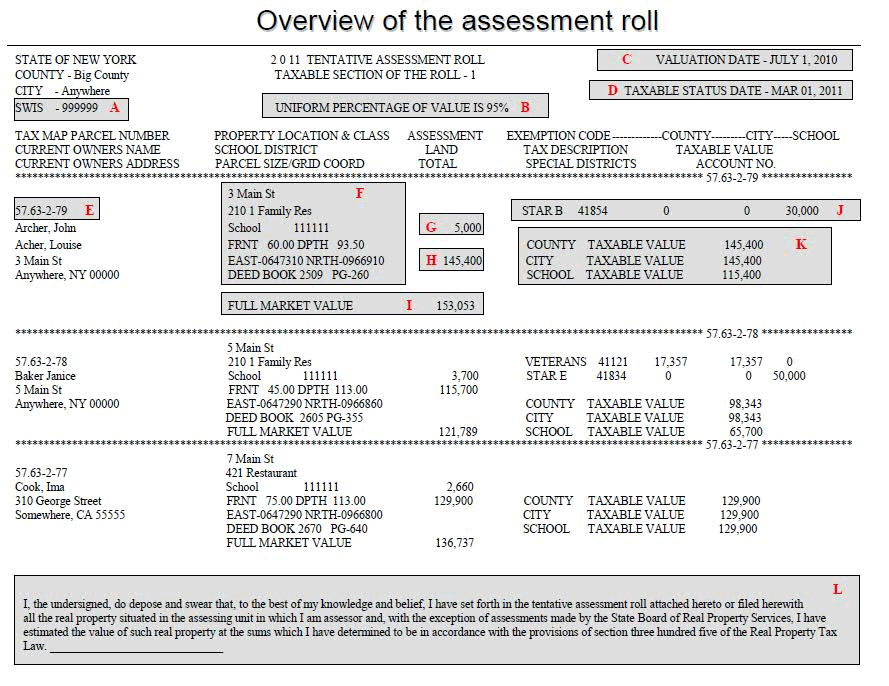

## Table of Contents

## What is a tax roll?

A tax roll is a list that shows how much property tax people need to pay. It includes details like the owner's name, the property's address, and the amount of tax owed. Governments use this list to keep track of who needs to pay taxes on their property.

The tax roll is important because it helps make sure everyone pays their fair share of taxes. It is usually put together by a local government office, like a county assessor's office. This list is updated every year to reflect changes in property values and ownership.

## Why are tax rolls important?

Tax rolls are important because they help the government know how much money they will get from property taxes. This money is used to pay for things like schools, roads, and other services that everyone in the community uses. Without tax rolls, it would be hard for the government to plan and budget for these services.

Tax rolls also make sure that everyone pays their fair share of taxes. They show who owns property and how much tax they need to pay. This helps keep things fair and stops people from avoiding taxes. By keeping track of this information, the government can make sure that the tax system works the way it should.

## Who is responsible for maintaining the tax roll?

The job of keeping the tax roll up to date usually falls to local government offices, like the county assessor's office. They make sure the list has the right information about who owns property and how much tax they owe. This is important because it helps the government know how much money they will have to spend on things like schools and roads.

The tax roll is updated every year. This is done to reflect any changes in property values or ownership. By keeping the tax roll current, the government can make sure they have the money they need to provide services to the community and that everyone pays their fair share of taxes.

## How often is the tax roll updated?

The tax roll is usually updated every year. This means that once a year, the local government office, like the county assessor's office, looks at all the properties and makes changes if needed. They check if the property values have gone up or down and if there are new owners.

Updating the tax roll every year helps the government know how much money they will get from property taxes. This money is important because it pays for things like schools, roads, and other services that everyone uses. By keeping the tax roll up to date, the government can make sure everyone pays their fair share of taxes and that they have enough money to run the community.

## What information is typically included in a tax roll?

A tax roll is a list that shows important details about properties and the taxes people need to pay. It includes the name of the property owner, the address of the property, and how much tax is owed on that property. This information helps the government keep track of who should be paying taxes.

The tax roll also shows the value of the property, which is used to figure out how much tax someone needs to pay. It might include other details like the size of the property or any special features it has. By having all this information in one place, the government can make sure everyone pays their fair share and that they have the money needed for community services.

## What are the different types of tax rolls?

There are different types of tax rolls that governments use to keep track of taxes. One type is the real property tax roll. This is a list of all the land and buildings in an area, and it shows how much tax people need to pay on their homes or other properties. Another type is the personal property tax roll, which lists things like cars, boats, and other items that people own and have to pay taxes on.

There is also the business personal property tax roll, which is used for businesses. This type of tax roll lists all the equipment and other items a business owns and how much tax they need to pay on these things. Each type of tax roll helps the government know how much money they will get from different kinds of taxes, and it makes sure everyone pays their fair share.

## How does a tax roll affect property owners?

A tax roll directly affects property owners because it tells them how much tax they need to pay on their property. The tax roll has the owner's name, the address of the property, and the amount of tax they owe. If the value of the property goes up or down, or if someone new buys the property, the tax roll will change to show the new amount of tax.

Property owners need to pay attention to the tax roll because it helps them know how much money they need to set aside for taxes. If they don't pay the taxes shown on the tax roll, they could face penalties or even lose their property. The tax roll is updated every year, so owners should check it regularly to make sure they are paying the right amount of tax.

## What is the process for challenging information on a tax roll?

If you think the information on the tax roll about your property is wrong, you can challenge it. The first step is to contact the local government office, like the county assessor's office. They are the ones who made the tax roll, and they can help you understand why your property is valued the way it is. You can ask them for the details they used to figure out your tax.

Next, you might need to fill out a form to officially challenge the tax roll. This form asks for your reasons why you think the tax roll is wrong. You can include any proof you have, like photos of your property or a report from a professional who looked at your property. After you send in the form, the assessor's office will look at your case. They might agree with you and change the tax roll, or they might disagree and keep it the same. If you still think it's wrong, you can ask for a hearing where you can explain your case to a board or a judge.

## How do tax rolls impact local government budgeting?

Tax rolls are very important for local government budgeting because they help the government know how much money they will get from property taxes. When the government knows this, they can plan how much money to spend on things like schools, roads, and other services that everyone in the community uses. If the tax rolls show that property values have gone up, the government might get more money, which means they can spend more on these services. But if property values go down, the government might have less money to spend.

The tax roll is updated every year, so the government can keep their budget up to date too. This helps them make sure they have enough money to run the community without running out of money or having too much left over. By using the tax rolls to plan their budget, the government can make sure that everyone pays their fair share of taxes and that the money is used in the best way possible for the community.

## What technologies are used in managing tax rolls?

Local governments use computers and special software to manage tax rolls. This software helps them keep track of all the properties and the taxes people need to pay. It can store a lot of information, like the owner's name, the property's address, and how much tax is owed. The software also makes it easy to update the tax roll every year, so the government can make sure they have the right information.

Some governments also use Geographic Information Systems (GIS) to help with managing tax rolls. GIS uses maps to show where properties are located and can help the government see how property values change in different areas. This can be very helpful for making sure the tax roll is accurate and up to date. By using these technologies, the government can do a better job of keeping track of taxes and planning their budget.

## How do tax rolls vary between different jurisdictions?

Tax rolls can be different in different places because each area has its own rules about how to value property and how much tax people need to pay. For example, one city might have a higher tax rate than another city, so the tax roll will show higher amounts of tax owed. Also, some places might use different ways to figure out how much a property is worth, like looking at how much similar properties sold for or using special formulas.

Another way tax rolls can vary is in the types of property they include. Some jurisdictions might have a tax roll just for homes and land, while others might also include taxes on things like cars or business equipment. The way the tax roll is updated can also be different; some places might update it every year, while others might do it less often. These differences mean that property owners need to understand the rules in their own area to know how much tax they need to pay.

## What are the future trends and potential reforms in tax roll management?

In the future, tax roll management might use more technology to make things easier and more accurate. One big trend could be using [artificial intelligence](/wiki/ai-artificial-intelligence) (AI) and [machine learning](/wiki/machine-learning) to help figure out property values. These tools can look at a lot of data quickly, like recent sales of similar properties and changes in the neighborhood, to come up with a fair value. This could make the tax roll more accurate and save time for the people who work on it. Another trend might be using online systems where property owners can see and challenge their tax roll information easily, without having to go to a government office.

There might also be reforms to make tax roll management fairer and more transparent. Some places might change the rules about how property is valued or how taxes are calculated to make sure everyone pays their fair share. For example, some governments might decide to give tax breaks to people who need help, like seniors or people with low incomes. These changes would need to be clear and easy to understand so that everyone knows how their taxes are figured out. Overall, the goal of these future trends and reforms is to make tax roll management better for both the government and the people who own property.

## What are the types of tax rolls?

Real Estate Property Tax Rolls are critical financial documents that list all real estate properties within a specific jurisdiction. These rolls are fundamentally organized to include essential details such as the owner's information, the assessed value of the property, and the corresponding tax obligations. The information contained within these rolls is predominantly used by local governments to ensure accurate and efficient tax collection, which then supports funding for public services such as education, infrastructure, and emergency services. The assessed value of a property—determined by government assessors using various metrics—serves as a basis for calculating property taxes owed. In general terms, the property tax (P) can be calculated using the formula:

$$
P = \text{Assessed Value} \times \text{Tax Rate}
$$

This formula highlights the proportional relationship between a property's assessed value and the tax levied upon it, emphasizing the importance of accurate assessments within real estate tax rolls.

Motor Vehicle Property Tax Rolls are another form of tax roll utilized by some jurisdictions. Similar to real estate tax rolls, these records are essential for documenting property taxes levied on motor vehicles. Typically maintained by departments such as the Department of Motor Vehicles (DMV), these rolls also include vital data such as the vehicle's owner, the current market value of the vehicle, and the taxes owed. The approach to assessing vehicle value can differ from real estate, often factoring in aspects like vehicle age, make, model, and depreciation. These assessments ensure that taxes are equitably levied based on the value and usage of the vehicle.

Understanding the differentiation in tax rolls is imperative to comprehend the taxation landscape within a particular jurisdiction. Each asset type—real estate and motor vehicles—is subject to distinct assessment methods and tax implications. Consequently, property owners and stakeholders can better navigate their financial responsibilities by recognizing these differences. This facilitates informed decision-making, whether in purchasing assets, handling tax liabilities, or planning long-term financial strategies in compliance with local tax regulations.

## References & Further Reading

[1]: ["Understanding Property Tax"](https://ray-tax.com/blog/how-property-taxes-are-calculated-breaking-down-the-process/) by U.S. Department of Energy.

[2]: McGraw, T. (2020). ["Algorithmic Trading: Winning Strategies and Their Rationale"](https://www.wiley.com/en-us/Algorithmic+Trading%3A+Winning+Strategies+and+Their+Rationale-p-9781118746912) by Ernie Chan.

[3]: Dau-Schmidt, Kenneth G. (2010). ["Federal Taxation of Corporations."](https://law.indiana.edu/about/people/bio.php?name=dau-schmidt-kenneth-g) U.S. Law Administrative and Regulatory Law Commons.

[4]: ["Automated Trading with R: Quantitative Research and Platform Development"](https://link.springer.com/book/10.1007/978-1-4842-2178-5) by Chris Conlan.

[5]: ["A Guide to Understanding Tax Lien and Tax Deed Investing"](https://www.taxsaleresources.com/blog/tax-lien-tax-deed-investing-basics) by Clint Coons.