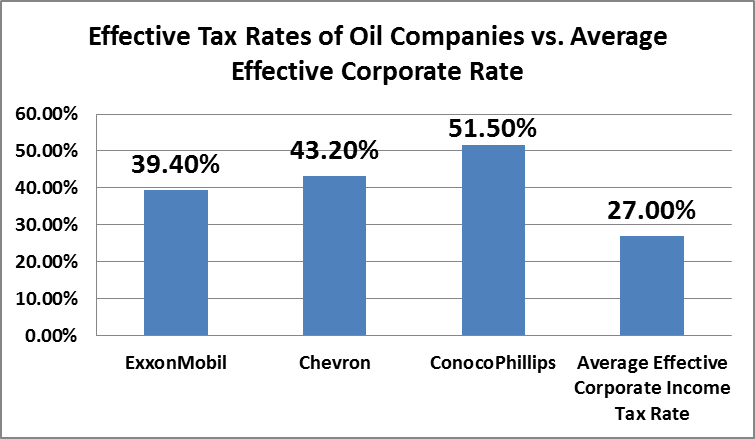

## Table of Contents

## What are the basic types of taxes that oil companies are subject to?

Oil companies, like many businesses, have to pay several types of taxes. One main type is the corporate income tax. This is a tax on the profits that the company makes. If an oil company earns a lot of money, it will have to pay a larger amount of corporate income tax. Another type of tax is the property tax, which is based on the value of the land and buildings that the company owns. If the company has a lot of valuable property, it will pay more in property taxes.

In addition to these general business taxes, oil companies also face specific taxes related to their industry. One of these is the severance tax, which is a tax on the extraction of natural resources like oil and gas. The more oil a company extracts, the more severance tax it has to pay. Another tax is the excise tax, which is often applied to the sale of petroleum products like gasoline. This tax can increase the price that consumers pay at the pump. These taxes help governments raise money and can also be used to encourage or discourage certain activities in the oil industry.

## How do oil companies use tax deductions to reduce their tax liability?

Oil companies use tax deductions to lower the amount of taxes they have to pay. One way they do this is by deducting the costs of finding and drilling for oil. This includes expenses like buying equipment, paying workers, and doing research to find new oil reserves. By subtracting these costs from their income, oil companies can reduce their taxable profits, which means they pay less in taxes.

Another way oil companies reduce their tax liability is through depreciation. This means they can spread out the cost of big items like drilling rigs over several years. Instead of paying taxes on the full cost of the equipment in one year, they can deduct a smaller amount each year. This helps them manage their cash flow better and pay less in taxes over time. By using these and other tax deductions, oil companies can significantly lower their tax bills.

## What is the difference between a tax credit and a tax deduction for oil companies?

A tax credit and a tax deduction are two different ways oil companies can lower their taxes, but they work differently. A tax deduction reduces the amount of income that is subject to tax. For example, if an oil company spends money on drilling equipment, it can subtract that cost from its total income before calculating how much tax it owes. This means the company's taxable income is lower, so it pays less tax. The more deductions an oil company has, the lower its taxable income becomes.

On the other hand, a tax credit directly reduces the amount of tax that an oil company has to pay. Instead of lowering the income that is taxed, a tax credit takes money off the final tax bill. For instance, if an oil company gets a tax credit for investing in clean energy, that credit is subtracted from the total tax it owes. This can be more valuable than a deduction because it directly reduces the tax bill dollar for dollar. So, while deductions lower the income that's taxed, credits lower the actual tax payment.

## How do oil companies benefit from depreciation of assets for tax purposes?

Oil companies benefit from depreciation of assets because it helps them lower their taxes. When they buy big things like drilling rigs or pipelines, they don't have to pay taxes on the full cost all at once. Instead, they can spread out the cost over several years. This means they can deduct a smaller amount each year from their income before calculating their taxes. By doing this, they reduce their taxable income each year, which means they pay less in taxes.

This method also helps oil companies manage their money better. Instead of spending a lot of money on taxes in one year, they can use that money for other things like investing in new projects or paying their workers. Depreciation makes it easier for oil companies to plan their finances and keep their business running smoothly. It's a smart way for them to save money and still follow the tax rules.

## What role do tax havens play in the tax strategies of oil companies?

Tax havens are countries or places where taxes are very low or almost nothing. Oil companies sometimes use these places to lower their taxes. They might set up a part of their business in a tax haven. This part of the business can then make money without paying much tax. The oil company can move money around to make it look like more of their profits are in the tax haven, so they pay less tax overall.

Using tax havens can be tricky. It's legal if done right, but it can make people upset because it seems unfair. Some people think big companies should pay more taxes to help their countries. Governments are trying to stop companies from using tax havens too much. They make new rules to make sure companies pay their fair share of taxes, no matter where they do business.

## How do international tax treaties affect the tax planning of multinational oil companies?

International tax treaties are agreements between countries that help decide how much tax multinational oil companies have to pay. These treaties can make things easier for oil companies because they stop the same income from being taxed twice in different countries. For example, if an oil company makes money in one country but sends it back to its home country, the treaty might say that the home country can't tax that money again. This helps oil companies plan their taxes better because they know what to expect and can avoid paying too much.

However, these treaties can also be complicated. Oil companies need to understand the rules in each treaty to use them the best way. Sometimes, treaties have special rules for certain industries like oil and gas. Oil companies might set up their business in different countries to take advantage of these rules and pay less tax. But they have to be careful because governments are always changing the rules to make sure companies pay their fair share of taxes.

## What are the implications of transfer pricing for oil companies' tax strategies?

Transfer pricing is when oil companies set prices for goods or services they move between different parts of their business in different countries. This can affect how much tax they pay because it changes where the company's profits are reported. If an oil company sets a high price for oil it sells from one country to another part of its business, it can make it look like more profit is made in a country with lower taxes. This way, the company can pay less tax overall.

However, using transfer pricing to lower taxes can be risky. Governments have rules to make sure companies don't use transfer pricing to avoid paying taxes. If an oil company doesn't follow these rules, it might have to pay fines or even face legal trouble. So, while transfer pricing can be a useful part of an oil company's tax strategy, it needs to be done carefully and correctly to avoid problems.

## How do oil companies utilize research and development tax incentives?

Oil companies use research and development (R&D) tax incentives to lower their taxes. These incentives let them deduct the money they spend on research from their taxable income. This means if an oil company is working on new ways to find or use oil, they can subtract those costs from their profits before calculating how much tax they owe. This makes their taxable income smaller, so they pay less tax.

Using R&D tax incentives is good for oil companies because it helps them save money and encourages them to keep looking for new ideas. Governments offer these incentives because they want companies to invest in new technology and find better ways to do things. By giving oil companies a break on their taxes for R&D, governments hope to see more innovation and progress in the oil industry.

## What are the tax implications of environmental regulations and investments for oil companies?

Environmental regulations and investments can change how much tax oil companies have to pay. When oil companies spend money to follow these rules, like cleaning up pollution or using less harmful ways to get oil, they can often deduct those costs from their taxes. This means they can subtract the money they spend on being more environmentally friendly from their income before figuring out their taxes. So, the more they spend on the environment, the less tax they might have to pay.

But it's not always simple. Some countries give special tax breaks to oil companies that invest in green technology or reduce their carbon footprint. These tax breaks can make it cheaper for oil companies to go green. However, if the rules change or if the company doesn't follow them correctly, they might have to pay more in taxes or even face fines. So, while environmental investments can help lower taxes, oil companies need to be careful and keep up with the rules.

## How do changes in oil prices influence the tax strategies of oil companies?

When oil prices go up or down, it changes how much money oil companies make. If oil prices are high, oil companies earn more profit. This means they might have to pay more in taxes because their income is bigger. To handle this, oil companies might use more tax deductions or look for ways to move their money around to pay less tax. They might also invest more in things like research and development to get tax breaks and lower their tax bill.

On the other hand, when oil prices drop, oil companies make less money. This can make it harder for them to pay taxes because their profits are smaller. To deal with this, they might cut back on spending and look for every possible tax deduction they can use. They might also try to use tax havens or change how they report their income to different countries to keep their taxes low. So, oil prices going up or down can really change how oil companies plan their taxes.

## What are the potential impacts of new tax legislation on oil companies' future strategies?

New tax laws can change how oil companies plan for the future. If the government makes taxes higher, oil companies might have to pay more money. This could make them think about moving their business to places where taxes are lower. They might also spend more money on things like research and development to get tax breaks. If the new laws give special tax breaks for being more environmentally friendly, oil companies might invest more in green technology to save money on taxes.

On the other hand, if new tax laws make it harder for oil companies to use tax deductions or move money around, they might have to change how they do business. They might need to find new ways to lower their taxes, like investing in different countries or changing how they report their income. These changes can be tricky and might cost more money at first, but they could help oil companies pay less in taxes over time.

## How do oil companies balance short-term tax savings with long-term strategic tax planning?

Oil companies need to think about both short-term tax savings and long-term tax planning. For short-term savings, they might use tax deductions for things like drilling equipment or research costs. They could also move money to places with lower taxes to save money right away. These quick ways to save on taxes help oil companies have more cash to use for their business right now.

But oil companies also need to plan for the future. They might invest in green technology to get tax breaks that last for many years. They could also set up their business in different countries to take advantage of tax treaties and lower their taxes over time. Balancing these short-term and long-term strategies is important because it helps oil companies save money now and also be ready for changes in tax laws later.

## References & Further Reading

[1]: ["Advances in Financial Machine Learning"](https://www.amazon.com/Advances-Financial-Machine-Learning-Marcos/dp/1119482089) by Marcos Lopez de Prado

[2]: Bergstra, J., Bardenet, R., Bengio, Y., & Kégl, B. (2011). ["Algorithms for Hyper-Parameter Optimization."](https://dl.acm.org/doi/10.5555/2986459.2986743) Advances in Neural Information Processing Systems 24.

[3]: ["Machine Learning for Algorithmic Trading"](https://github.com/stefan-jansen/machine-learning-for-trading) by Stefan Jansen

[4]: ["Quantitative Trading: How to Build Your Own Algorithmic Trading Business"](https://www.amazon.com/Quantitative-Trading-Build-Algorithmic-Business/dp/1119800064) by Ernest P. Chan

[5]: ["Tax Strategies for Corporations: Advanced Methods and Techniques"](https://pro.bloombergtax.com/insights/corporate-tax-planning/corporate-tax-planning/) by Baker Library

[6]: ["The Tax Cut and Jobs Act: Overview and Analysis"](https://taxfoundation.org/research/all/federal/final-tax-cuts-and-jobs-act-details-analysis/) by Alan J. Auerbach for National Bureau of Economic Research

[7]: ["The Role of Algorithmic Trading in Asset Management"](https://www.cfainstitute.org/sites/default/files/-/media/documents/book/rf-lit-review/2020/rflr-artificial-intelligence-in-asset-management.pdf) by Albert J. Menkveld and Yesha Yadav in the Annual Review of Financial Economics.