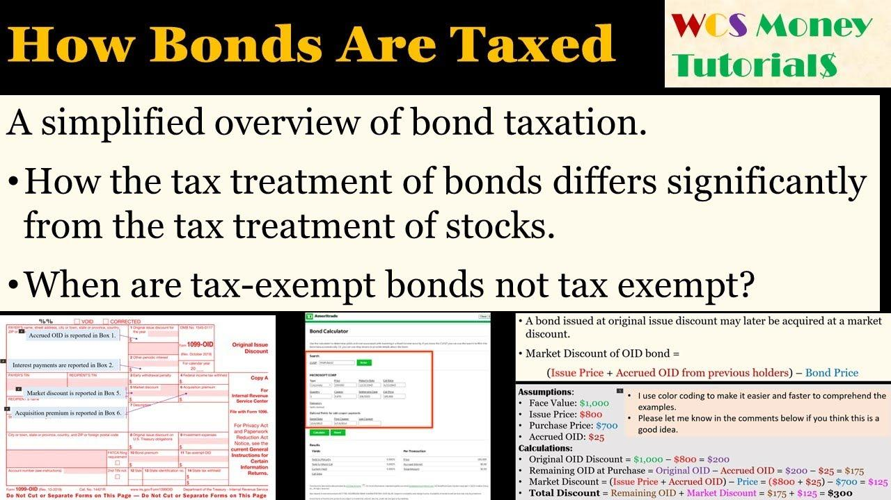

In the evolving world of finance, understanding financial instruments such as bonds is crucial for successful investing. Bonds are a form of debt instrument that obligate the issuer to pay the bondholder a specified sum of interest over a set period, with the principal returned on the bond's maturity date. Among the various types of bonds, taxable bonds stand out due to the tax consequences they present to investors. These bonds generate interest income that is taxable at federal, state, or local levels, in contrast to municipal bonds, which might be exempt from certain taxes. Taxable bonds, including most corporate and some government bonds, are vital components of many portfolios, offering distinct opportunities and challenges due to their tax-impacted returns.

The integration of algorithmic trading within the bond markets has introduced new dynamics, greatly enhancing market efficiency. Algorithmic trading involves the use of complex algorithms to automate trading processes and execute orders at high speeds, allowing traders to respond swiftly to market conditions. This technological innovation has added a layer of sophistication to bond investing, transforming traditional methods and facilitating improved liquidity and price discovery.



This article explores the landscape of taxable bonds and bond investing, alongside the influence of algorithmic trading in the financial world. It examines the nature of taxable bonds, their benefits, and challenges, and highlights how technology plays a pivotal role in contemporary bond investing. By understanding these elements, investors can navigate the complexities of the bond market and strategically optimize their portfolios for improved returns.

## Table of Contents

## Understanding Taxable Bonds

A taxable bond is a type of debt security wherein the interest income generated is subject to taxation at multiple levels—federal, state, or local. Unlike municipal bonds, which are generally exempt from taxes, the interest earned from most corporate bonds and certain government bonds is typically taxed. This taxation characteristic requires investors to carefully assess the tax implications to understand the true net returns from such investments.

Investors considering taxable bonds must weigh several factors, including their current tax bracket and overall financial objectives. For instance, an investor in a high tax bracket might find that the after-tax return on a tax-exempt municipal bond is more favorable compared to a taxable bond, despite the latter offering a potentially higher nominal yield.

Mathematically, the after-tax yield can be calculated as follows:

$$
\text{After-tax Yield} = \text{Yield} \times (1 - \text{Tax Rate})
$$

This formula helps investors assess the effective yield on taxable bonds by accounting for the impact of taxes.

The decision between investing in taxable versus tax-exempt bonds often revolves around personal financial considerations. An investor with significant non-taxable income, for instance, might prioritize taxable bonds to complement their income strategy, while another investor focused on tax efficiency may lean towards tax-exempt options.

Ultimately, the selection of bonds—taxable or otherwise—should align with an investor’s broader financial plan, tax situation, and income needs. Understanding these nuances ensures that bond investments deliver the expected benefits within the constraints of an investor's tax environment.

## Advantages and Risks of Taxable Bonds

Taxable bonds provide investors with distinctive financial opportunities and challenges, primarily due to their yield characteristics and associated risks. Typically, these bonds offer higher yields compared to tax-exempt alternatives, such as municipal bonds. This higher yield serves to compensate investors for the tax burden imposed on the interest earned. For example, if a taxable bond offers a yield of 5% and an equivalent tax-exempt bond offers 3%, the additional 2% compensates for income taxes on the interest.

One of the primary advantages of taxable bonds is their ability to generate a stable income stream, appealing to conservative investors who prioritize consistent returns over high-risk ventures. This predictability is particularly beneficial in low-interest-rate environments, where other income-generating investments might not suffice in meeting financial needs.

However, taxable bonds come with inherent risks. A significant risk is the fluctuation of interest rates. When interest rates rise, existing bond prices tend to fall, potentially resulting in losses if the bond is sold prior to its maturity. This is due to the inverse relationship between bond prices and interest rates, expressed in the bond duration formula:

$$

\text{Duration} = \frac{\sum \left( \frac{C_t}{(1+y)^t} \cdot t \right) + \frac{M}{(1+y)^n} \cdot n}{\sum \frac{C_t}{(1+y)^t} + \frac{M}{(1+y)^n} }
$$

Where:
- $C_t$ represents the coupon payment at time $t$,
- $y$ is the yield to maturity,
- $M$ is the face value of the bond, and
- $n$ is the number of periods until maturity.

Bond duration indicates sensitivity to [interest rate](/wiki/interest-rate-trading-strategies) changes, where a higher duration means greater sensitivity. Investors must understand this concept to manage interest rate risk proactively.

Furthermore, early sale of a bond can lead to capital losses if market conditions have led to a decrease in its value. This underscores the importance of aligning bond investment strategies with personal financial goals and timelines. While the income from taxable bonds is predictable, the capital value is not guaranteed unless held to maturity.

By understanding these dynamics, investors can effectively incorporate taxable bonds into their portfolios, aligning them with long-term financial objectives and risk tolerance. This involves not just a focus on yield, but also an appreciation for the potential capital fluctuations, enabling informed decision-making to achieve targeted outcomes.

## The Role of Algo Trading in Bond Markets

Algorithmic trading has significantly transformed the bond market, enhancing the speed and efficiency of transactions and notably improving [liquidity](/wiki/liquidity-risk-premium). By leveraging advanced computational power, these systems can process massive datasets rapidly, identifying complex trends and executing precise orders. This capacity allows investors to address and benefit from market inefficiencies that may not be apparent through traditional trading methods.

Algorithmic trading systems use sophisticated models and algorithms to analyze vast and diverse data sources in real time. These algorithms can detect subtle patterns and signals that human traders might miss, providing a competitive edge in terms of timely trade execution and optimal pricing. For example, a common algorithmic strategy can involve [arbitrage](/wiki/arbitrage), where discrepancies in bond pricing across different markets are exploited to generate profit.

Implementing algo trading in bond markets demands robust risk management frameworks to prevent potential disruptions. Rapid and automated transactions can lead to undesirable market impacts, especially if not aligned with proper oversight mechanisms. For instance, flash crashes caused by such systems emphasize the necessity for regulatory measures and safeguards. Consequently, developers ensure that algorithms incorporate risk mitigation strategies, such as stop-loss orders, to limit adverse outcomes.

Incorporating [algorithmic trading](/wiki/algorithmic-trading) within the bond markets also entails a continuous monitoring process to adjust strategies according to evolving market dynamics and regulatory landscapes. This adaptability helps maintain the performance and reliability of investments, safeguarding against unforeseen economic or market shifts that could otherwise impact returns. 

Ultimately, the strategic use of algorithmic trading in bond markets offers an advanced, nuanced approach to investing. When effectively employed, it enables market participants to navigate the complexities of modern financial environments and maximize the potential of their bond portfolios.

## Strategic Bond Investing in an Algorithm-Driven Market

In the modern investment landscape, leveraging algorithmic trading for strategic bond investing can offer significant advantages, provided that investors are keenly aware of the inherent risks. Algorithmic trading, or algo trading, employs computer programs to execute trades at speeds and frequencies that are humanly impossible. These algorithms can analyze large volumes of market data, discover patterns, and execute trades based on pre-established criteria, thereby offering a refined approach to bond investing.

Diversification is a key element of risk mitigation in any investment strategy, including bonds. By spreading investments across various bond types, such as corporate, government, and foreign bonds, as well as varying maturity dates, investors can reduce the impact of specific market risks on their overall portfolio. This approach helps insulate the portfolio from [volatility](/wiki/volatility-trading-strategies) in any single credit segment or interest rate environment.

Incorporating algo trading into a bond investing strategy requires constant monitoring and adjustment. Algorithms must be regularly updated to respond to evolving market conditions, which can greatly influence bond yields and prices. To this end, continuous analysis and recalibration of algorithmic strategies are essential. Investors need to ensure that their trading models are still aligned with their financial objectives and the broader market environment. The process involves integrating real-time data, [backtesting](/wiki/backtesting) algorithms against historical data, and adjusting parameters to optimize trading performance and returns.

Tax planning is another crucial aspect when investing in taxable bonds through algorithms. The goal is to maximize after-tax returns, which involves strategically selecting bonds and timing trades to reduce tax liabilities. For instance, investors might prioritize bonds with favorable tax treatments or utilize tax loss harvesting strategies to offset capital gains. The application of tax-optimized algorithms can facilitate these strategies, assessing the tax implications of trades and ensuring compliance with tax regulations.

A Python example for considering tax implications might look like this:

```python
def calculate_after_tax_yield(yield_before_tax, tax_rate):
    return yield_before_tax * (1 - tax_rate)

bond_yields = [0.05, 0.045, 0.04]  # Example yields
tax_rate = 0.3  # Example tax rate (30%)

after_tax_yields = [calculate_after_tax_yield(yield_, tax_rate) for yield_ in bond_yields]
print(after_tax_yields)
```

In this example, the function `calculate_after_tax_yield` computes the net yield of a bond after accounting for taxes, which is pivotal for making informed investment decisions. Understanding how taxes affect returns via calculations like these can inform the design of trading algorithms to prioritize high after-tax yields.

Therefore, combining algo trading with strategic bond selection and tax planning positions investors to better navigate the complexities of the bond market, aiming to achieve optimized performance and long-term financial goals.

## Conclusion

Taxable bonds are essential components of diversified investment portfolios, providing investors with a stable income stream while requiring careful consideration of tax implications. Unlike tax-exempt bonds, the interest income from taxable bonds is subject to federal, and possibly state and local taxation, which can impact the net yield an investor receives. As a result, investors must evaluate their individual tax situations and financial goals to determine the true benefit of these bonds.

The integration of algorithmic trading into bond markets has significantly enhanced the flexibility and efficiency with which investors can manage their taxable bond portfolios. Algorithmic trading allows for high-speed, precise transactions that can exploit market inefficiencies and improve liquidity. This technological advancement offers investors the potential to refine their investment strategies, align with dynamic market conditions, and achieve better returns.

To optimize bond investment strategies effectively, investors need to weigh the tax implications carefully. Algorithms can assist in calculating after-tax returns and devising strategies that maximize these returns within a given risk tolerance. Staying informed about evolving tax laws and using technology for tax planning becomes vital in maintaining an edge in taxable bond investing.

Understanding and adapting to these evolving dynamics, including both tax considerations and algorithmic trading technologies, equips investors to better achieve their financial objectives. By doing so, they can harness the full potential of taxable bonds within their investment portfolios, balancing the trade-offs between yield and tax impact for sustained financial growth.

## References & Further Reading

- Dvorak, T. (2009). 'The Tax Advantage of U.S. Treasury Bonds.' The Journal of Wealth Management. This paper outlines the fiscal benefits associated with holding U.S. Treasury Bonds, focusing on tax exemptions that make them attractive investment vehicles for certain tax brackets.

- Fabozzi, F. J. (2007). 'The Handbook of Fixed Income Securities.' McGraw-Hill Education. This comprehensive guide provides an in-depth analysis of various fixed-income securities, including bonds, and discusses their strategic roles within investment portfolios.

- Lopez de Prado, M. (2018). 'Advances in Financial Machine Learning.' Wiley. This book introduces machine learning techniques relevant to modern financial markets, with applications in algorithmic trading that are transforming approaches to bond investment.

- Chan, E. P. (2009). 'Quantitative Trading: How to Build Your Own Algorithmic Trading Business.' Wiley. This text serves as a practical guide for building and managing algorithmic trading strategies, emphasizing their utility in enhancing trading efficiencies across different markets, including bonds.