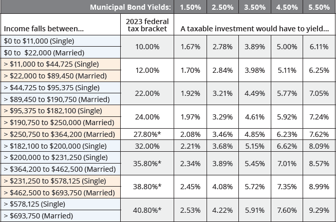

## Table of Contents

## What are taxable municipal bonds?

Taxable municipal bonds are bonds issued by local governments or their agencies that do not offer tax-exempt interest. Unlike most municipal bonds, the interest earned from these bonds is subject to federal income tax, and sometimes state and local taxes as well. These bonds are often issued to finance projects that do not qualify for tax-exempt status under federal law, such as certain types of public-private partnerships or projects that benefit private entities.

Investors might choose taxable municipal bonds for various reasons. They might be looking for higher yields than what tax-exempt bonds offer, or they might not benefit from tax exemptions due to their specific tax situation. For example, investors in lower tax brackets or those investing through tax-deferred accounts like IRAs might find taxable municipal bonds more attractive because they can focus on the bond's yield without worrying about tax implications.

## How do taxable municipal bonds differ from tax-exempt municipal bonds?

Taxable municipal bonds and tax-exempt municipal bonds are both issued by local governments or their agencies, but they have a key difference: the tax treatment of their interest. With tax-exempt municipal bonds, the interest you earn is not taxed by the federal government, and sometimes not by state and local governments either. This makes them very attractive to people in high tax brackets because they get to keep more of the interest they earn. On the other hand, the interest from taxable municipal bonds is subject to federal income tax, and possibly state and local taxes too. This means that investors have to pay taxes on the interest they earn from these bonds.

The reason for issuing taxable municipal bonds is often because the projects they finance don't qualify for tax-exempt status under federal law. These projects might involve public-private partnerships or benefit private entities in ways that don't meet the criteria for tax-exempt bonds. Because of this, taxable municipal bonds usually offer higher interest rates to attract investors, who have to consider their tax situation when deciding whether these bonds are a good investment. People in lower tax brackets or those investing through tax-deferred accounts might find taxable municipal bonds more appealing because they focus more on the higher yields rather than tax benefits.

## What are the main types of taxable municipal bonds?

Taxable municipal bonds come in different types. One common type is called Build America Bonds (BABs). These were created to help state and local governments during the 2008 financial crisis. BABs offer higher interest rates to investors because the interest is taxable. The government also gives money to the issuers to help them pay for the projects.

Another type is called taxable municipal notes. These are short-term bonds that usually last less than a year. They are used to cover temporary needs like waiting for tax money to come in or paying for short-term projects. Even though they are taxable, they can still be a good choice for investors looking for a safe place to put their money for a short time.

There are also private activity bonds that can be taxable. These bonds finance projects that mostly benefit private companies, like building a sports stadium or a hospital. Because these projects help private businesses more than the public, the interest on these bonds is taxable. Investors might choose these bonds if they are looking for higher yields and are okay with paying taxes on the interest they earn.

## What are Build America Bonds (BABs) and how do they work?

Build America Bonds, or BABs, are a type of taxable municipal bond that were created to help state and local governments during the 2008 financial crisis. They are different from most municipal bonds because the interest you earn from them is taxable by the federal government. The government made BABs to encourage more people to invest in projects like building roads, schools, and other public works. To make them attractive, BABs offer higher interest rates than regular tax-exempt municipal bonds.

When a state or local government issues a Build America Bond, they get help from the federal government. There are two types of BABs. The first type gives the issuer money directly from the federal government, which is about 35% of the interest they have to pay to investors. This helps the issuer because they don't have to pay as much out of their own pocket. The second type doesn't give direct money, but the issuer can offer a higher [interest rate](/wiki/interest-rate-trading-strategies) to investors, knowing that the bond's taxable nature will still attract people looking for higher returns.

## What are the requirements for issuing taxable municipal bonds?

To issue taxable municipal bonds, a local government or their agency needs to follow certain rules. They need to make sure the project they want to finance doesn't qualify for tax-exempt status. This can happen if the project benefits private companies more than the public, like building a sports stadium or a hospital. The issuer also needs to decide if they want to issue bonds that will pay back the money over a short time, like less than a year, or over a longer time.

The process of issuing these bonds involves working with financial experts and lawyers to make sure everything is done correctly. They need to prepare documents that explain the bond's terms, like how much interest it will pay and when the money will be paid back. After that, they sell the bonds to investors. The money from the sale goes to the project, and the issuer pays back the investors with interest over time. Because the interest is taxable, the bonds usually offer higher rates to attract people to buy them.

## Who can invest in taxable municipal bonds?

Anyone can invest in taxable municipal bonds, including individuals, banks, and other financial institutions. You don't need to be a certain type of investor to buy them. If you're interested in these bonds, you can buy them through a broker or a financial advisor who can help you find the right ones for your needs.

People in different tax situations might find taxable municipal bonds attractive. If you're in a lower tax bracket, the higher interest rates on these bonds might be more important to you than the tax benefits of tax-exempt bonds. Also, if you're investing through a tax-deferred account like an IRA, you won't have to worry about paying taxes on the interest right away, so the higher yield of taxable municipal bonds could be a good fit for you.

## What are the tax implications of investing in taxable municipal bonds?

When you invest in taxable municipal bonds, the interest you earn is not tax-free. You have to pay federal income tax on the interest you get from these bonds. Sometimes, you might also have to pay state and local taxes, depending on where you live and where the bond comes from. This is different from tax-exempt municipal bonds, where the interest is not taxed by the federal government and sometimes not by state and local governments either.

Because the interest on taxable municipal bonds is taxed, these bonds usually offer higher interest rates to make up for it. This can be good for people in lower tax brackets or those who invest through tax-deferred accounts like IRAs. In these cases, the higher interest rates might be more important than the tax benefits of tax-exempt bonds. So, when thinking about investing in taxable municipal bonds, you need to consider your own tax situation to see if they are a good choice for you.

## How do the interest rates of taxable municipal bonds compare to other bonds?

Taxable municipal bonds usually offer higher interest rates than tax-exempt municipal bonds. This is because the interest from taxable municipal bonds is not free from taxes. Investors have to pay federal income tax on the interest they earn, and sometimes state and local taxes too. To make up for this, the bonds need to offer higher rates to attract people to buy them. So, if you compare a taxable municipal bond to a tax-exempt one, you'll see that the taxable bond pays more interest.

When you look at taxable municipal bonds compared to other types of bonds like corporate bonds or Treasury bonds, the interest rates can be different. Taxable municipal bonds might offer higher rates than Treasury bonds because they can be riskier. Treasury bonds are backed by the full faith and credit of the U.S. government, which makes them very safe. Corporate bonds might offer similar or higher rates than taxable municipal bonds, depending on the creditworthiness of the company issuing them. So, the interest rate on a taxable municipal bond can be higher than a Treasury bond but might be similar to or less than a corporate bond, depending on the specific bond and the market conditions.

## What are the risks associated with investing in taxable municipal bonds?

Investing in taxable municipal bonds comes with some risks. One risk is that the issuer might not be able to pay back the money they borrowed. This can happen if the project they used the money for doesn't do well or if the local government has money problems. If the issuer can't pay, you might not get all your money back, or you might get it back late.

Another risk is that interest rates might change. If interest rates go up after you buy a bond, the value of your bond might go down. This is because new bonds will be issued with higher interest rates, making your older bond less attractive to other investors. If you need to sell your bond before it matures, you might have to sell it for less than what you paid for it.

Lastly, there's the risk of inflation. If prices go up a lot, the money you get from the bond might not be worth as much as when you first invested. This means the real value of your investment could go down over time. So, it's important to think about these risks when deciding if taxable municipal bonds are right for you.

## How can investors assess the creditworthiness of taxable municipal bonds?

Investors can assess the creditworthiness of taxable municipal bonds by looking at credit ratings from agencies like Moody's, Standard & Poor's, or Fitch. These agencies give bonds a grade, like AAA or BBB, based on how likely the issuer is to pay back the money. A higher grade means the bond is safer, while a lower grade means it's riskier. Investors can also look at the financial health of the local government or agency issuing the bond. This means checking their budget, how much money they have coming in, and how much they owe. If the issuer seems to be in good financial shape, the bond is probably safer.

Another way to assess creditworthiness is by reading the bond's official statement. This document gives detailed information about the bond, the project it's funding, and the issuer's financial situation. It can help investors understand the risks involved. Talking to a financial advisor can also be helpful. They can explain the bond's risks and rewards and help you decide if it's a good investment for you. By doing this research, investors can make a smarter choice about whether to buy a taxable municipal bond.

## What role do taxable municipal bonds play in municipal finance?

Taxable municipal bonds help cities and towns pay for big projects without using tax-exempt money. These projects might be things like building new roads, fixing up old buildings, or working with private companies on something that helps the community. Because the interest on these bonds is taxable, they can be used for projects that don't meet the rules for tax-exempt bonds. This gives cities and towns more options for how to pay for the things they need.

These bonds are important because they bring in money from people who want to invest in them. The city or town gets the money upfront to start their project, and then they pay back the investors over time with interest. Even though the interest is taxable, the bonds can still be a good choice for investors who are looking for higher returns or who don't need tax benefits. This way, taxable municipal bonds help keep the wheels of municipal finance turning by giving cities and towns another tool to manage their money and fund important projects.

## How have recent legislative changes affected the issuance and attractiveness of taxable municipal bonds?

Recent legislative changes have had a big impact on taxable municipal bonds. One big change was the Tax Cuts and Jobs Act of 2017. This law made it harder for cities and towns to issue tax-exempt bonds for certain projects. Because of this, more cities and towns started using taxable municipal bonds instead. The law also changed how much interest people could deduct on their taxes, which made taxable bonds more attractive to some investors who were looking for higher returns.

Another change that affected taxable municipal bonds was the American Rescue Plan Act of 2021. This law gave a lot of money to cities and towns to help them during the COVID-19 crisis. With this extra money, some places didn't need to issue as many bonds, including taxable ones. But the law also made it easier for cities and towns to use taxable bonds for certain projects, like those that help the environment. So, while the need for taxable bonds went down in some ways, they became more useful for specific kinds of projects.

## What are Taxable Municipal Bonds and How are They Explained?

Taxable municipal bonds are a distinct subset of municipal securities that do not enjoy the tax-exempt status traditionally associated with municipal bonds. These bonds are issued primarily to finance projects that do not qualify for federal tax exemption, often those that are private in nature or that fail to meet the public purpose criteria necessary for tax-exempt status. This could include ventures like sports stadiums or other projects with substantial private benefits.

There are specific types of taxable municipal bonds, including Build America Bonds (BABs), which were introduced under the American Recovery and Reinvestment Act of 2009. These bonds provided a subsidy to issuers to offset the higher interest rates typically demanded by investors for taxable municipal issues. Other types may include bonds issued for projects where the financing does not comply with Internal Revenue Service (IRS) rules for tax-exempt status, such as certain industrial development projects.

Investors in taxable municipal bonds are subject to federal income tax on the interest earned, contrasting with tax-exempt municipal bonds that offer federal, and sometimes state, tax exemptions. However, the trade-off is often seen in potentially higher yields to compensate for the taxable income feature. The interest rates on taxable bonds are generally higher, reflecting this tax burden. To evaluate investment opportunities, investors must consider the yield after accounting for taxes, which can be expressed with the following formula:

$$
\text{After-tax yield} = \text{Pre-tax yield} \times (1 - \text{tax rate})
$$

Understanding the yields and tax implications associated with taxable municipal bonds is crucial for making informed investment decisions, particularly for those in lower tax brackets who might find their after-tax yield more favorable when compared to what they'd receive from tax-exempt municipal bonds.

## How do taxable bonds and municipal bonds compare in trading strategies?

Both municipal and taxable bonds provide distinct trading opportunities, which can be further optimized through the use of [algorithmic trading](/wiki/algorithmic-trading) strategies. The primary difference between these two bond types lies in their tax treatment. Municipal bonds, often tax-exempt at the federal level and sometimes at state and local levels, can provide after-tax yield advantages for investors in higher tax brackets. Taxable bonds, conversely, do not enjoy such tax benefits, but they often offer higher nominal yields to compensate for the tax burden.

**Yield Prospects**:
Municipal bonds typically offer lower nominal yields compared to taxable bonds due to their tax-exempt status. The after-tax equivalent yield of a municipal bond can be calculated using the formula:

$$
\text{After-tax yield} = \frac{\text{Nominal yield}}{1 - \text{Tax rate}}
$$

For instance, an investor in a 30% tax bracket considering a municipal bond with a 3% nominal yield faces an equivalent taxable yield of approximately 4.29%. This comparison allows investors to evaluate municipal bonds on an equal footing with their taxable counterparts.

**Regulatory Factors**:
Regulatory considerations also differentiate municipal from taxable bonds, influencing trading strategies. Municipal bonds are subject to various state and local regulations, which can impact their [liquidity](/wiki/liquidity-risk-premium) and marketability. Taxable bonds, particularly corporate bonds, might have fewer regional restrictions but are affected by federal regulations such as those imposed by the Securities and Exchange Commission (SEC). Understanding these regulatory environments is crucial for developing effective trading strategies.

**Algorithmic Trading Optimization**:
Algorithmic trading can significantly enhance trading efficiency and performance for both municipal and taxable bonds by utilizing data-driven strategies. Algorithms can cater to the liquidity challenges of municipal bonds by efficiently matching buy and sell orders, thereby reducing transaction costs and improving execution speed.

Python, as a popular tool for developing trading algorithms, can be employed to simulate and back-test different strategies. A simple example of a bond trading algorithm might involve moving averages for identifying trading signals:

```python
import numpy as np

def calculate_moving_average(prices, window):
    return np.convolve(prices, np.ones(window)/window, mode='valid')

# Example usage for bond prices
bond_prices = np.array([...])  # Placeholder for bond price data
short_window = 5
long_window = 20

short_ma = calculate_moving_average(bond_prices, short_window)
long_ma = calculate_moving_average(bond_prices, long_window)
```

In this example, moving averages help signal potential buy or sell points based on short-term and long-term trends in bond price data.

Algorithmic trading systems also need to incorporate risk management and regulatory compliance checks, especially for municipal bonds, which may face distinct reporting and disclosure requirements. By customizing algorithms to account for these variables, traders can enhance strategic decision-making and adapt to the characteristics of each bond type.

Overall, leveraging algorithmic trading tools allows investors to navigate the different yield prospects and regulatory landscapes of municipal and taxable bonds more effectively. This adaptability is crucial for optimizing trading outcomes and achieving desired investment results.

## References & Further Reading

[1]: Antczak, Zbigniew. (2016). ["Algorithmic Trading: Study on a Predictive Model"](https://www.researchgate.net/publication/378548435_Algorithmic_Trading_and_AI_A_Review_of_Strategies_and_Market_Impact). Procedia Computer Science, 51.

[2]: Fabozzi, Frank J., Modigliani, Franco, & Jones, Frank J. (2010). ["Foundations of Financial Markets and Institutions."](https://www.amazon.com/Foundations-Financial-Markets-Institutions-International/dp/1292021772) Pearson.

[3]: Luby, Michael (2012). ["Municipal Bonds Basics"](https://efile.fara.gov/docs/3492-Informational-Materials-20220121-105.pdf) by Michael Luby

[4]: Kahn, R. (2014). ["The Handbook of Municipal Bonds."](https://onlinelibrary.wiley.com/doi/book/10.1002/9781119198093) by Sylvan G. Feldstein & Frank J. Fabozzi

[5]: Cumming, Douglas J. (2016). ["Handbook of Research on Stock Market Globalization."](https://business.fau.edu/faculty-research/faculty-profiles/profile/cummingd.php) Edward Elgar Publishing.