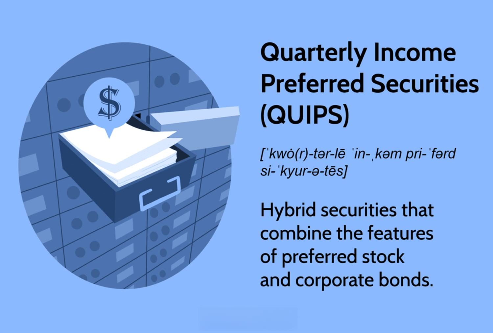

The world of investing offers a multitude of options, each presenting unique benefits and risks. Within this landscape, preferred securities and taxable securities are notable for their distinct characteristics. Preferred securities, often viewed as a hybrid between stocks and bonds, provide investors with fixed dividends, typically at higher yields than common stock dividends, while maintaining certain protections afforded to creditors. Their appeal lies in combining elements of equity and debt, which can offer lower volatility compared to common stocks.

Taxable securities, on the other hand, encompass investments whose income, such as interest or dividends, is subject to taxation. This category includes various bonds, preferred stocks, and fixed-income instruments, where the higher income potential must be weighed against the corresponding tax liabilities. These securities require careful tax planning to optimize the investor's net returns.



The advent of algorithmic trading has significantly reshaped investment strategies. By employing computer algorithms that execute trades based on predefined criteria, algo trading enhances the speed and efficiency of transactions. In the context of preferred and taxable securities, algorithmic trading can optimize strategies by quickly analyzing market data, identifying arbitrage opportunities, and minimizing transaction costs. Although this approach offers substantial benefits, it also introduces risks such as technical failures and market disruptions, necessitating robust risk management frameworks.

This article aims to provide a comprehensive understanding of these investment types and explore how algorithmic trading can enhance investment strategies involving preferred and taxable securities. By examining their unique characteristics and benefits, and considering the transformative influence of technology on trading practices, investors will be better equipped to make informed decisions, aligning their investment portfolios with their financial objectives for long-term success.

## Table of Contents

## Understanding Preferred Securities

Preferred securities are investment instruments that exhibit both equity and debt characteristics. This hybrid nature makes them an attractive option for investors looking for a balance between the relative safety of bonds and the growth potential of stocks. 

One of the defining features of preferred securities is their fixed dividend payments. These dividends are scheduled and paid out before any dividends are distributed to common stockholders, making them a more stable income source than common stock dividends. However, they are subordinate to bond interest payments, meaning that in the event of financial distress, bondholders are paid before preferred shareholders.

Another important characteristic of preferred securities is that they are often callable. This means the issuer retains the right to redeem the securities at a predetermined call price after a specific date. While this presents the issuer with flexibility to reacquire the securities at favorable terms, it adds complexity for the investor, as it can impact the investment's duration and potential returns.

Investors are drawn to preferred securities primarily due to their higher yields compared to regular common stocks. This feature is advantageous for those seeking steady income streams. Additionally, the price [volatility](/wiki/volatility-trading-strategies) of preferred securities is generally lower than that of common stocks, providing a more predictable investment experience.

In summary, preferred securities provide a unique blend of regular income and moderate price stability, catering to specific investor needs that neither pure equities nor bonds might fully satisfy.

## Taxable Securities Explained

Taxable securities are financial instruments whose income is subject to taxation at various governmental levels, including federal, state, and local. This category encompasses a variety of bonds, preferred stocks, and other fixed-income investments. Unlike tax-exempt securities, which offer the advantage of income not being included in the taxable income, the interest or dividends generated from taxable securities must be included in an investor's taxable income, thereby impacting net returns.

When evaluating taxable securities, investors are often attracted to their potential for higher yields compared to their tax-exempt counterparts. This yield difference can be attributed to the requirement of taxable securities to compensate investors for the tax they must pay on the interest or dividends received. However, this higher yield must be carefully balanced against the tax liabilities that arise from such investments.

Investors must consider the after-tax return when comparing different investment opportunities. For instance, the after-tax yield $r_a$ on a taxable security can be calculated using the formula:

$$
r_a = r_t \times (1 - t)
$$

where $r_t$ is the taxable yield and $t$ represents the investor's marginal tax rate. This formula helps in determining the real earning potential once taxes have been accounted for.

For those in higher tax brackets, the tax impact on income from these securities can be substantial, potentially making tax-exempt options more attractive despite their typically lower yields. Therefore, a thorough analysis incorporating one's tax situation is crucial when making investment decisions. Balancing the immediate advantage of higher yields against the long-term tax implications is essential to achieve an optimized investment strategy.

## The Role of Algorithmic Trading in Securities Investment

Algorithmic trading, often referred to as algo trading, leverages computer algorithms to execute trades based on predefined criteria at speeds and volumes that exceed human capability. In the domain of securities investment, including preferred and taxable securities, [algorithmic trading](/wiki/algorithmic-trading) can significantly enhance trading strategies by processing and analyzing vast amounts of market data efficiently. This ability to quickly identify patterns and trends allows algos to capitalize on [arbitrage](/wiki/arbitrage) opportunities, evaluate market [liquidity](/wiki/liquidity-risk-premium), and optimize transaction costs.

Arbitrage opportunities in securities markets arise when there is a price discrepancy for the same asset in different markets or forms, allowing traders to buy low and sell high simultaneously. Algorithmic trading systems are well-suited to exploit these opportunities due to their capacity to monitor multiple markets and execute trades at lightning speed. For instance, consider a preferred security trading at different prices across two exchanges. An algorithmic trading system could automatically purchase the security from the lower-priced exchange and sell it on the higher-priced one, securing a profit in fractions of a second.

Additionally, algorithmic trading enhances liquidity analysis by continuously tracking changes in market depth and order flows. This continuous analysis helps traders make informed decisions when entering or exiting positions, ensuring minimal impact on the market price and lowering transaction costs. For example, algorithms can implement strategies like VWAP (Volume Weighted Average Price) or TWAP (Time Weighted Average Price) to execute large orders incrementally over time, thus minimizing market impact and reducing cost.

Despite its advantages, algorithmic trading introduces potential risks requiring investors to employ solid risk management strategies. Algorithms can malfunction due to coding errors, leading to unintended trades or losses. Market disruptions, such as flash crashes, may be exacerbated by high-frequency trading systems if not properly managed. Therefore, implementing robust risk controls, including circuit breakers and real-time monitoring systems, is essential to mitigate these risks. Furthermore, diversifying algorithmic strategies and conducting thorough [backtesting](/wiki/backtesting) ensures systems behave as expected under various market conditions.

In summary, algorithmic trading serves as a powerful tool in securities investment, optimizing strategies for preferred and taxable securities. Yet, investors must remain vigilant, aware of the inherent risks, and maintain comprehensive risk management practices to safeguard their investments.

## Tax Considerations for Preferred and Taxable Securities

The tax treatment of preferred securities can significantly influence investment decisions. Preferred securities encompass a mix of equity and debt characteristics, which affects their taxation. Some preferred securities offer tax advantages as qualified dividend income (QDI), meaning that the dividends received are taxed at the reduced rate applicable to long-term capital gains. This lower tax rate can make these securities more appealing to investors seeking to maximize after-tax income.

Conversely, taxable preferred securities do not benefit from the QDI tax reduction. As a result, the income generated from these securities is subject to the investor’s ordinary income tax rate, which is typically higher. This difference can lead to increased overall tax liability, thus reducing the effective return on investment.

Investors should carefully assess the tax implications of incorporating preferred and taxable securities into their portfolios. For instance, while the nominal yield might be attractive, the post-tax yield could be less favorable once taxes are applied. To effectively optimize post-tax returns, investors should adopt strategic approaches. This could involve tax-loss harvesting, where an investor offsets gains with losses to reduce taxable income, or by strategically allocating tax-advantaged securities within tax-deferred accounts such as IRAs.

Given the complexity of tax regulations, it is crucial for investors to maintain a strong understanding of the relevant IRS regulations. Engaging with a professional tax advisor can also provide tailored advice, ensuring that investment strategies align with current tax laws and the investor's financial goals.

The following Python snippet demonstrates how investors might calculate the post-tax yield of an investment, highlighting the importance of accurate tax calculations:

```python
def calculate_post_tax_yield(pre_tax_yield, tax_rate):
    return pre_tax_yield * (1 - tax_rate)

# Example usage
pre_tax_yield = 0.05  # 5% pre-tax yield
tax_rate = 0.25  # 25% tax rate
post_tax_yield = calculate_post_tax_yield(pre_tax_yield, tax_rate)
print("Post-tax yield:", post_tax_yield)
```

Ultimately, understanding the tax considerations of preferred and taxable securities can provide investors with a clearer picture of their investment landscape, enabling more informed and strategic financial decisions.

## Advantages and Risks

Preferred and taxable securities offer a consistent income stream, making them attractive to investors who prioritize regular earnings. Preferred securities, in particular, provide potential for capital appreciation. This is especially true if they are convertible into common stock, as investors might gain from both dividend income and growth in equity value.

However, these securities present certain risks. Interest rate fluctuations are a primary concern. As interest rates rise, the fixed dividends from preferred securities become less attractive compared to newly issued instruments, potentially decreasing their market value. Furthermore, credit risk is inherent in preferred and taxable securities, as issuer default could jeopardize both regular income and capital return.

Callable securities introduce additional complexities. Issuers can redeem them before maturity, typically when interest rates fall, forcing investors to reinvest at lower yields. This call risk can lead to reinvestment at periods of unfavorable interest rates, impacting income stability.

Algorithmic trading, which uses advanced computer algorithms for executing trades, presents benefits and risks when applied to these securities. It allows for rapid analysis and execution, potentially optimizing trading strategies and improving trade efficiency. Nonetheless, it also introduces risks such as technical failures and market disruptions. These may arise from algorithmic errors or unexpected market movements and require robust risk management measures to mitigate.

Investors using algorithmic strategies must implement effective monitoring systems to detect anomalies and respond swiftly. Strategies should be in place to handle potential volatility and ensure that their investments align with their financial goals while maximizing returns.

## Conclusion

Investors have a multitude of opportunities available when considering preferred and taxable securities. Each of these investment options carries distinct attributes and requires thorough examination to make informed decisions. Preferred securities, with their hybrid nature between stocks and bonds, offer investors a mix of fixed-income benefits and equity potential. These securities generally provide higher yields with lower volatility compared to common stocks, making them an attractive option for income-focused investors. However, their unique features, such as callability, necessitate a careful assessment of [interest rate](/wiki/interest-rate-trading-strategies) risks and issuer creditworthiness.

Taxable securities, including a range of fixed-income instruments, present another layer of complexity due to their tax implications. The income generated from these investments is subject to various tax levels—federal, state, and local. As a result, investors must balance the allure of higher yields with the liabilities of increased tax obligations. Understanding these tax considerations is crucial in optimizing portfolio returns on an after-tax basis.

Algorithmic trading has revolutionized how investments in preferred and taxable securities can be managed. By leveraging advanced computational power and data analysis, algorithms can execute trades swiftly, capitalizing on market inefficiencies and minimizing transaction costs. Yet, this approach comes with its own set of challenges. Successful implementation of algorithmic strategies demands an intricate understanding of market behaviors and technological prowess. Risks such as technical glitches or market anomalies must be accounted for and mitigated through robust risk management frameworks.

Ultimately, the decision to invest in these securities should align with individual investment goals and risk tolerance levels. A comprehensive evaluation of associated risks, tax consequences, and strategic alignment with financial objectives is paramount. As investors familiarize themselves with these dynamics and strategically apply them, they position their portfolios for enhanced performance and long-term financial prosperity. By continuously staying informed and adapting to market developments, investors can effectively navigate the complexities of preferred and taxable securities, unlocking potential gains and achieving sustained success.

## References & Further Reading

[1]: ["The Handbook of Fixed Income Securities"](https://www.amazon.com/Handbook-Fixed-Income-Securities-Ninth/dp/1260473899) by Frank J. Fabozzi

[2]: ["Preferred Stock Investing"](https://www.kiplinger.com/investing/602804/preferred-stock-should-i-buy-it) by Doug K. Le Duc

[3]: ["Fixed Income Securities: Tools for Today's Markets"](https://www.amazon.com/Fixed-Income-Securities-Markets-Finance/dp/1119835550) by Bruce Tuckman and Angel Serrat

[4]: Hasbrouck, J. (2007). ["Empirical Market Microstructure: The Institutions, Economics, and Econometrics of Securities Trading"](https://academic.oup.com/book/52241). Oxford University Press.

[5]: Mitra, G., & Yu, X. (Eds.). (2013). ["High Frequency Trading and Limit Order Book Dynamics"](https://www.taylorfrancis.com/books/edit/10.4324/9781315737676/high-frequency-trading-limit-order-book-dynamics-ingmar-nolte-mark-salmon-chris-adcock). Springer.

[6]: Madhavan, A. (2000). ["Market Microstructure: A Survey."](https://www.sciencedirect.com/science/article/pii/S1386418100000070) The Journal of Financial Markets.