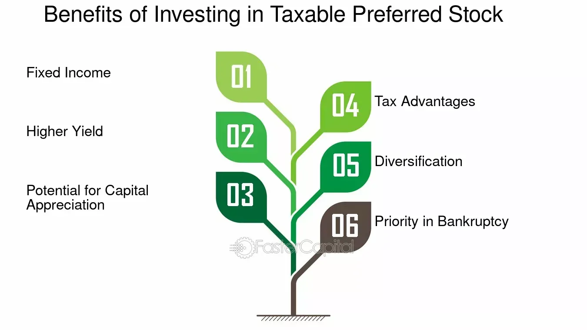

## Table of Contents

## What are Taxable Preferred Securities?

Taxable Preferred Securities are a type of investment that companies issue to raise money. They are called "preferred" because they have some advantages over regular stocks. People who buy these securities get paid before the company pays its common stockholders. This makes them a bit safer than regular stocks. But, unlike some other investments, the money you get from these securities is taxable, which means you have to pay taxes on it.

These securities usually pay a fixed amount of money regularly, kind of like interest on a loan. This can be good for people who want a steady income. But, the value of these securities can go up and down, so they are not completely safe. They are often used by companies that want to borrow money without taking on more debt. Because the payments are taxable, they are different from other types of preferred securities where the payments might not be taxed.

## How do Taxable Preferred Securities differ from other types of preferred securities?

Taxable Preferred Securities are different from other types of preferred securities mainly because of how they are taxed. When you get money from Taxable Preferred Securities, you have to pay taxes on it. This is different from other preferred securities, like municipal preferred securities, where the payments might not be taxed. So, if you're looking to avoid taxes, Taxable Preferred Securities might not be the best choice for you.

Another difference is how companies use them. Companies issue Taxable Preferred Securities to raise money without adding to their debt. This can be good for the company because it doesn't have to pay back a loan. Other types of preferred securities might have different rules about how the company can use the money or how it has to pay it back. So, Taxable Preferred Securities give companies more flexibility, but the investors have to pay taxes on the income they get.

## What are the typical characteristics of Taxable Preferred Securities?

Taxable Preferred Securities are a type of investment that companies use to raise money. They are called "preferred" because they have some benefits over regular stocks. When a company does well, it pays the people who own these securities before it pays its common stockholders. This makes them a bit safer than regular stocks. But, the money you get from these securities is taxable, which means you have to pay taxes on it. They usually pay a fixed amount of money regularly, kind of like interest on a loan. This can be good for people who want a steady income.

The value of these securities can go up and down, so they are not completely safe. They are often used by companies that want to borrow money without taking on more debt. Because the payments are taxable, they are different from other types of preferred securities where the payments might not be taxed. So, if you're looking to avoid taxes, Taxable Preferred Securities might not be the best choice for you. But, they can be a good option if you want a steady income and are okay with paying taxes on it.

## Who are the primary issuers of Taxable Preferred Securities?

The main companies that issue Taxable Preferred Securities are usually big businesses that need to raise money. These can be companies in industries like banking, insurance, or utilities. They use these securities to get money without having to take out more loans. This helps them keep their debt levels low, which can be good for their financial health.

These companies choose to issue Taxable Preferred Securities because they can offer a steady income to investors. This is attractive to people who want to earn money regularly, like retirees. The companies benefit because they don't have to pay back the money like a loan, and they can use the money they raise for different projects or to grow their business.

## What are the tax implications for investors holding Taxable Preferred Securities?

When you invest in Taxable Preferred Securities, the money you get from them is considered taxable income. This means you have to pay taxes on it, just like you would on your regular job income. The tax rate you pay depends on your overall income and the tax laws in your country. So, if you're in a high tax bracket, you might end up paying more in taxes on the money you earn from these securities.

The tax implications can affect how much money you actually keep from your investment. For example, if you get $1,000 from your Taxable Preferred Securities, and you have to pay 30% in taxes, you'll only keep $700. This is something to think about when you're deciding if these securities are a good investment for you. If you're looking to avoid taxes, you might want to consider other types of investments where the income might not be taxed, like municipal bonds.

## How do Taxable Preferred Securities fit into an investment portfolio?

Taxable Preferred Securities can be a good part of an investment portfolio if you want a steady income. They pay you a fixed amount of money regularly, which can be helpful if you need money coming in every month. This makes them a good choice for people like retirees who want to make sure they have enough money to live on. But, because the money you get from these securities is taxable, you have to think about how much you'll have to pay in taxes. This might mean you keep less money than you expect.

These securities can also help balance out risk in your portfolio. They are safer than regular stocks because the company pays you before it pays its common stockholders. But, they are not as safe as some other investments like government bonds. The value of Taxable Preferred Securities can go up and down, so they are not completely safe. Adding them to your portfolio can help you get a mix of safety and income, but you need to think about how they fit with your other investments and your overall plan for managing risk and taxes.

## What are the risks associated with investing in Taxable Preferred Securities?

When you invest in Taxable Preferred Securities, there are some risks you should know about. One big risk is that the value of these securities can go up and down. Even though they are safer than regular stocks because the company pays you before common stockholders, they can still lose value if the company runs into trouble. If the company goes bankrupt, you might not get all your money back. This means you could lose some or all of what you invested.

Another risk is that the money you get from these securities is taxable. This means you have to pay taxes on the income you earn, which can lower how much money you actually keep. If you're in a high tax bracket, this can be a big deal. Also, interest rates can affect the value of Taxable Preferred Securities. If interest rates go up, the value of these securities might go down because new securities might offer better returns. So, it's important to think about these risks when deciding if Taxable Preferred Securities are right for your investment goals.

## How are Taxable Preferred Securities rated, and what do these ratings signify?

Taxable Preferred Securities are rated by credit rating agencies like Moody's, Standard & Poor's, and Fitch. These agencies look at how likely it is that the company issuing the securities will be able to pay you back. They give the securities a rating, like AAA, AA, A, BBB, and so on. A higher rating, like AAA, means the securities are safer because the company is more likely to pay you back. A lower rating, like BB or below, means the securities are riskier because there's a bigger chance the company might not be able to pay you back.

These ratings are important because they help you understand the risk of investing in Taxable Preferred Securities. If you see a high rating, it means the securities are safer, but you might get a lower return. If you see a lower rating, it means the securities are riskier, but you might get a higher return to make up for that risk. So, when you're thinking about investing in these securities, the rating can help you decide if they fit with how much risk you're willing to take and what kind of return you're looking for.

## What are the historical performance trends of Taxable Preferred Securities?

Historically, Taxable Preferred Securities have offered investors a steady income because they pay a fixed amount of money regularly. This has made them popular with people who want to earn money every month, like retirees. Over the years, these securities have generally done well when the economy is stable. But, they can be affected by changes in interest rates. When interest rates go up, the value of Taxable Preferred Securities can go down because new securities might offer better returns. So, their performance can be up and down depending on what's happening with interest rates.

During times of economic trouble, like a recession, Taxable Preferred Securities can be riskier. If a company runs into financial problems, it might not be able to pay you back. This means you could lose some or all of your investment. But, because these securities are paid before common stocks, they are still safer than regular stocks. Over the long term, Taxable Preferred Securities have provided a good balance of income and safety for many investors, but it's important to look at the specific company and the economic conditions when thinking about their performance.

## How do regulatory changes affect the market for Taxable Preferred Securities?

Regulatory changes can have a big impact on the market for Taxable Preferred Securities. When the government changes the rules about how companies can issue these securities or how they are taxed, it can change how many companies want to issue them and how many investors want to buy them. For example, if the government makes the tax rules tougher, investors might not want to buy these securities because they'll have to pay more in taxes. This can make the market for Taxable Preferred Securities smaller and less active.

On the other hand, if the government makes the rules easier or offers tax breaks, more companies might issue these securities, and more investors might want to buy them. This can make the market bigger and more active. Also, changes in regulations about how much money companies have to keep on hand or how they can use the money they raise can affect how many Taxable Preferred Securities are issued. So, keeping an eye on regulatory changes is important for anyone thinking about investing in these securities.

## What strategies can be used to optimize returns from Taxable Preferred Securities?

One strategy to optimize returns from Taxable Preferred Securities is to focus on the credit ratings of the securities. Look for securities with high ratings, like AAA or AA, because they are safer and more likely to pay you back. But, remember that safer securities might offer lower returns. So, you might need to balance safety with the amount of return you want. Another part of this strategy is to keep an eye on interest rates. When interest rates go up, the value of your securities might go down. So, you could try to buy these securities when interest rates are low and sell them before rates go up too much.

Another strategy is to diversify your investments. Don't put all your money into Taxable Preferred Securities. Instead, mix them with other types of investments, like stocks or bonds. This can help you manage risk and keep your income steady. Also, think about the tax impact. Since the income from these securities is taxable, you might want to hold them in a tax-advantaged account, like an IRA, if you can. This can help you keep more of your money instead of losing it to taxes.

## How do global economic factors influence the valuation of Taxable Preferred Securities?

Global economic factors can have a big impact on the valuation of Taxable Preferred Securities. When the world economy is doing well, companies are more likely to make money and pay back their investors. This makes Taxable Preferred Securities more valuable because people feel safer investing in them. But, if the global economy is struggling, like during a recession, companies might have a harder time making money. This can make investors worried about getting their money back, so the value of these securities can go down.

Interest rates around the world also play a big role. When interest rates go up in many countries, the value of Taxable Preferred Securities can go down. This is because new securities might offer higher returns, making the older ones less attractive. On the other hand, if interest rates are low globally, the value of these securities can go up because they offer a good income compared to other investments. So, keeping an eye on what's happening with the world economy and interest rates can help you understand how Taxable Preferred Securities might do.

## What are Taxable Securities Explained?

Taxable securities are financial instruments whose income is subject to taxation at various governmental levels, including federal, state, and local. This category encompasses a variety of bonds, preferred stocks, and other fixed-income investments. Unlike tax-exempt securities, which offer the advantage of income not being included in the taxable income, the interest or dividends generated from taxable securities must be included in an investor's taxable income, thereby impacting net returns.

When evaluating taxable securities, investors are often attracted to their potential for higher yields compared to their tax-exempt counterparts. This yield difference can be attributed to the requirement of taxable securities to compensate investors for the tax they must pay on the interest or dividends received. However, this higher yield must be carefully balanced against the tax liabilities that arise from such investments.

Investors must consider the after-tax return when comparing different investment opportunities. For instance, the after-tax yield $r_a$ on a taxable security can be calculated using the formula:

$$
r_a = r_t \times (1 - t)
$$

where $r_t$ is the taxable yield and $t$ represents the investor's marginal tax rate. This formula helps in determining the real earning potential once taxes have been accounted for.

For those in higher tax brackets, the tax impact on income from these securities can be substantial, potentially making tax-exempt options more attractive despite their typically lower yields. Therefore, a thorough analysis incorporating one's tax situation is crucial when making investment decisions. Balancing the immediate advantage of higher yields against the long-term tax implications is essential to achieve an optimized investment strategy.

## References & Further Reading

[1]: ["The Handbook of Fixed Income Securities"](https://www.amazon.com/Handbook-Fixed-Income-Securities-Ninth/dp/1260473899) by Frank J. Fabozzi

[2]: ["Preferred Stock Investing"](https://www.kiplinger.com/investing/602804/preferred-stock-should-i-buy-it) by Doug K. Le Duc

[3]: ["Fixed Income Securities: Tools for Today's Markets"](https://www.amazon.com/Fixed-Income-Securities-Markets-Finance/dp/1119835550) by Bruce Tuckman and Angel Serrat

[4]: Hasbrouck, J. (2007). ["Empirical Market Microstructure: The Institutions, Economics, and Econometrics of Securities Trading"](https://academic.oup.com/book/52241). Oxford University Press.

[5]: Mitra, G., & Yu, X. (Eds.). (2013). ["High Frequency Trading and Limit Order Book Dynamics"](https://www.taylorfrancis.com/books/edit/10.4324/9781315737676/high-frequency-trading-limit-order-book-dynamics-ingmar-nolte-mark-salmon-chris-adcock). Springer.

[6]: Madhavan, A. (2000). ["Market Microstructure: A Survey."](https://www.sciencedirect.com/science/article/pii/S1386418100000070) The Journal of Financial Markets.