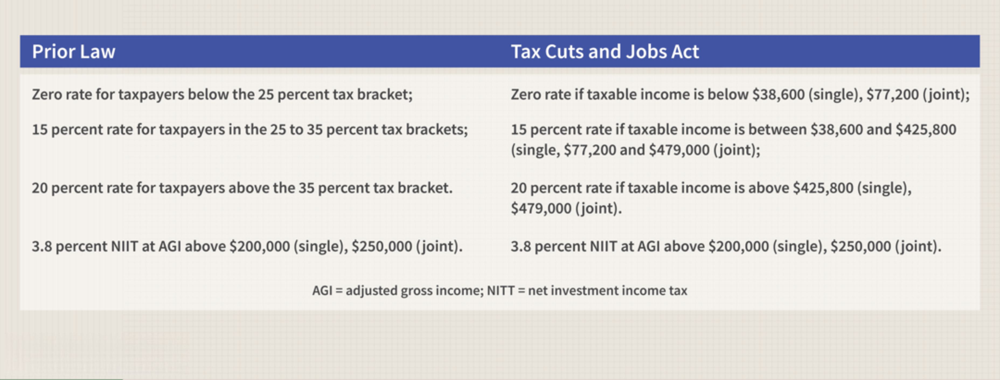

In today's investment landscape, understanding the nuances of taxation and its interaction with various investment strategies is crucial for maximizing returns. As investors seek to enhance their portfolio performance, the differentiation between dividends and capital gains becomes pertinent. Dividends, often perceived as a reliable income stream, are subjected to taxation based on their nature - categorically divided into qualified and nonqualified dividends. Capital gains, on the other hand, signify the profit from selling an asset for more than its purchase price, with tax obligations differing based on whether the asset was held short-term or long-term.

Algorithmic trading, with its precision and efficiency, stands as a significant component within modern investment portfolios. By utilizing sophisticated software to automate trades, investors can swiftly respond to market dynamics without the influence of emotional biases. However, these rapid transactions often classify resulting gains as short-term, attracting higher tax rates. This emphasizes the need for strategic planning to optimize tax outcomes, ensuring that investors retain substantial portions of their profits.



The goal of this article is to equip investors with the knowledge necessary to navigate the complex intersection of investment taxation and algorithmic trading. By comprehending the tax implications tied to different income types and adopting tactical trading practices, investors can enhance their net returns. Furthermore, exploring algorithmic trading's role in modern portfolios will shed light on its potential for improving tax efficiency alongside investment growth.

## Table of Contents

## Understanding Dividend and Capital Gains Taxation

Dividends and capital gains represent two distinct types of income for investors, each carrying unique tax implications that significantly influence investment strategies. 

Dividends are periodic payments distributed by corporations from their earnings to shareholders. They are primarily classified as either qualified or nonqualified (ordinary) dividends. Qualified dividends meet specific criteria outlined by the tax code—such as being paid by a U.S. corporation or a qualified foreign entity—and are taxed at long-term capital gains rates, which are lower than ordinary income tax rates. In contrast, nonqualified dividends do not meet these criteria and are subject to taxation at the individual's ordinary income tax rates.

Capital gains, on the other hand, arise from the appreciation of an asset when it is sold for more than its cost basis, which is its purchase price plus any expenses related to the acquisition. The taxation of capital gains is contingent on the holding period of the asset. Assets held for a year or less before sale generate short-term capital gains, taxed at ordinary income tax rates similar to nonqualified dividends. Conversely, assets held for more than a year produce long-term capital gains, which enjoy favorable tax treatment with lower rates, often aligning with qualified dividend rates.

Understanding the nuanced tax treatment of dividends and capital gains is crucial for investors as it directly informs their portfolio strategies. Investment decisions, such as the timing of asset sales or the selection between dividend-paying stocks, have implications on the taxable income of investors. For instance, selecting investments that yield qualified dividends or holding onto appreciating assets to achieve long-term capital gains are strategies that can optimize tax efficiency. Analyzing these tax categories helps investors strategically manage their investments to align with laws and regulations, thus maximizing after-tax returns.

## The Role of Algorithmic Trading

Algorithmic trading utilizes advanced software systems to perform trading activities, significantly enhancing the speed and precision with which trades are executed. These systems are designed to operate based on pre-defined criteria, ideally removing human emotional biases from the decision-making process. The execution of trades is typically based on an algorithm, a well-defined set of instructions that can process massive volumes of data and execute stock market orders automatically.

One of the primary advantages of [algorithmic trading](/wiki/algorithmic-trading) is its ability to execute trades at high speeds and with high precision. Algorithms can process complex calculations and analyze market data in fractions of a second, which enables traders to access market opportunities out of reach for human speed. For example, they can exploit minute price discrepancies in milliseconds, a feat unattainable through manual trading. 

Furthermore, algorithmic trading strategies are diverse and cater to different market scenarios. Common strategies include:

1. **Trend-Following:** This strategy involves identifying medium to long-term market trends and executing trades based on the direction of these trends. It often entails using moving averages and channel breakouts as indicators.

2. **Arbitrage:** Algorithmic systems excel at identifying and capitalizing on arbitrage opportunities, which arise when an asset can be bought and sold simultaneously in different markets at different prices. This strategy relies heavily on speed, taking advantage of price inefficiencies before they disappear.

3. **Mean Reversion:** This strategy is predicated on the idea that asset prices and returns eventually return to their long-term average or mean value. It involves identifying overbought or oversold conditions and trading on the reversal back towards the average.

Despite its benefits, algorithmic trading presents several challenges. **Technical failures** are a significant concern, as reliance on technology can lead to catastrophic errors when systems malfunction. These failures can be caused by software bugs, network issues, or hardware malfunctions. As the systems automatically execute high-[volume](/wiki/volume-trading-strategy) trades, a technical glitch could result in substantial financial losses.

Additionally, algorithmic trading must comply with complex regulatory standards. Regulatory compliance necessitates detailed record-keeping of trades, strategies, and the rationale behind executing specific trades, often requiring sophisticated reporting systems. Regulatory bodies worldwide maintain guidelines to prevent market manipulation that can be a side effect of algorithmic trading, such as "spoofing" or "layering," where deceptive orders are placed to mislead other traders.

In conclusion, algorithmic trading enhances the efficiency of trading operations and opens the door for sophisticated strategies. However, traders must address technical vulnerabilities and comply with regulatory standards to leverage these benefits effectively. Thus, while algorithms can dramatically improve trading precision and speed, they must be meticulously designed and consistently monitored to ensure optimal operation.

## Tax Implications for Algorithmic Traders

Frequent trading within algorithmic systems typically generates short-term capital gains, which are subject to taxation at ordinary income tax rates, generally higher than those applied to long-term capital gains. This presents a unique challenge and opportunity for algorithmic traders to strategically manage their trades to mitigate tax liabilities and enhance after-tax returns.

One effective strategy for algorithmic traders involves the precise timing of trades, particularly as they relate to the holding period of assets. By extending the holding period, if possible, traders can transition some trades from short-term to long-term capital gains, thus benefiting from lower long-term capital gains tax rates. This requires a careful balance between market opportunities and tax considerations.

Utilizing tax-advantaged accounts, such as Individual Retirement Accounts (IRAs) or 401(k) plans, can be another strategy to reduce immediate tax burdens. Trades within these accounts are not immediately subject to capital gains taxes, allowing for tax-deferred growth. Investors must consider the rules governing these accounts, such as contribution limits and potential early withdrawal penalties, when integrating them into their strategy.

Furthermore, understanding the wash sale rule is vital for algorithmic traders, particularly those employing tax-loss harvesting strategies. The wash sale rule disallows the claiming of a tax loss on the sale of a security if a substantially identical security is purchased within 30 days before or after the sale. Compliance with this rule requires attention to the timing and nature of trades.

Algorithmic traders can leverage software tools to efficiently monitor and identify potential wash sale violations. These tools can be programmed to recognize patterns and generate alerts when trades approach the bounds of wash sale parameters. Maintaining compliance with tax regulations through such automated systems helps preserve intended tax benefits and optimize tax outcomes. Here is a simple Python snippet for a potential tool to track wash sales:

```python
import pandas as pd
from datetime import timedelta

def identify_wash_sales(trades):
    trades['Date'] = pd.to_datetime(trades['Date'])
    trades.sort_values(by='Date', inplace=True)
    wash_sales = []

    for i, trade in trades.iterrows():
        purchase_date = trade['Date']
        for j, subsequent_trade in trades[i+1:].iterrows():
            if (subsequent_trade['Date'] - purchase_date).days <= 30 and trade['Ticker'] == subsequent_trade['Ticker']:
                wash_sales.append((trade['Date'], subsequent_trade['Date'], trade['Ticker']))
                break

    return wash_sales

# Sample data
trade_data = pd.DataFrame({'Date': ['2023-05-01', '2023-05-15', '2023-06-10'], 'Ticker': ['AAPL', 'AAPL', 'AAPL']})
wash_sales = identify_wash_sales(trade_data)
print("Potential wash sales:", wash_sales)
```

Through strategic trade timing, leveraging tax-advantaged accounts, and adhering to wash sale regulations, algorithmic traders can significantly enhance their tax efficiency, enabling them to focus on maximizing overall investment returns.

## Strategies for Tax Efficiency

Diversifying trading strategies between short-term and long-term holds offers significant tax advantages by leveraging the favorable tax treatment of long-term gains. Long-term capital gains are typically taxed at lower rates than short-term gains, which are subject to ordinary income tax rates. By strategically holding certain investments for more than one year, investors can benefit from these lower rates, consequently reducing their overall tax burden and enhancing net returns.

Tax-loss harvesting is another potent strategy for improving tax efficiency. This involves selling securities at a loss to offset gains realized from other investments. By aligning capital losses with gains, investors can effectively reduce their taxable income, thereby decreasing their tax liability. For example, if an investor realizes a capital gain of $10,000 and a capital loss of $4,000 in the same tax year, only $6,000 is subject to capital gains tax. It's important to be aware of the Internal Revenue Service (IRS) wash sale rule, which disallows the deduction of a loss on a sale if a substantially identical security is purchased within 30 days before or after the sale.

Moreover, conducting algorithmic trading within tax-advantaged retirement accounts, such as 401(k)s or IRAs, allows for tax deferral, which can be instrumental in maximizing compound growth over time. Since trades within these accounts do not trigger taxable events, gains can proliferate without immediate tax consequences. This benefit continues to compound until distributions are taken, typically at retirement, when a potentially lower tax rate applies.

In a constantly changing tax landscape, it is crucial for investors to frequently review and adjust their strategies in accordance with new tax laws and market conditions. Regular assessment ensures that the investment approach remains aligned with the most current tax regulations and maximizes tax efficiency. Collaborating with tax professionals can be beneficial in remaining informed about these changes and implementing effective tax strategies.

By employing these strategies, investors can enhance their tax efficiency, ultimately optimizing their portfolio's after-tax returns and contributing to long-term wealth accumulation.

## Balancing Profitability and Compliance

Balancing profitability and compliance in investment strategies, particularly within the context of algorithmic trading, requires a nuanced approach that leverages both advanced technological tools and an understanding of tax regulations. High-frequency trading ([HFT](/wiki/high-frequency-trading-strategies)) presents significant opportunities for profit, but the associated tax obligations can erode these gains if not managed strategically. 

Sophisticated algorithms can be constructed to optimize for tax outcomes. For instance, prioritizing trades that result in long-term capital gains over short-term ones can be a viable strategy, as long-term gains are typically taxed at lower rates. This involves designing algorithms that consider the holding period of assets and dynamically adjust the trading strategy to maximize the likelihood of benefiting from favorable tax treatment. An example Python function might look like this:

```python
def prioritize_long_term_gains(trades):
    for trade in trades:
        if trade.holding_period >= 365:
            # Execute the trade to benefit from long-term capital gains rate
            execute_trade(trade)
```

Engaging with tax professionals is crucial to stay compliant while exploring tax optimization strategies. They can provide insights into current tax laws, identify potential risks, and offer guidance on structuring trades in a way that aligns with regulatory requirements. This collaboration ensures that the trading strategies are not only profitable but also compliant with legal standards, minimizing the risk of audits or penalties.

Achieving optimal portfolio growth entails integrating tax strategies with trading activities. This integration involves continuously monitoring the trading environment and tax landscape, allowing for adjustments in response to changes in either domain. Investors can use advanced modeling and data analysis to simulate various scenarios, assessing the potential tax liabilities associated with different trading strategies. This proactive approach enables investors to make informed decisions that maximize after-tax returns.

Ultimately, a balanced strategy that harmonizes high-frequency trading with tax compliance requires an iterative process of planning, execution, and review. By aligning technological innovation with sound tax practices, investors can enhance the profitability of their algorithmic trading activities while maintaining compliance with prevailing tax regulations. This balance not only optimizes returns but also supports sustainable investment practices in an evolving financial ecosystem.

## Conclusion

Investment taxation and algorithmic trading offer both opportunities and challenges for investors today. Understanding how different types of income—such as dividends and capital gains—are taxed can be vital in maximizing net returns. Different tax treatments for short-term and long-term capital gains, for example, impact decision-making strategies significantly. By employing strategic trading practices, investors can optimize their portfolios to benefit from favorable tax conditions.

Continuous education and collaboration with tax professionals and financial advisors ensure investors can adapt to ever-changing tax regulations and technological advancements in trading. This adaptability is crucial, as regulatory landscapes frequently shift, affecting how trading activities are conducted and taxed. A strong grasp on current tax statutes and emerging trends in algorithmic trading technology is essential for sustained success.

Effectively managing these components requires a balanced approach that integrates both tax-efficient strategies and innovative trading activities. Investors can optimize their outcomes by aligning trading strategies with tax goals. For instance, Python algorithms can be utilized to simulate various trading scenarios and assess potential tax liabilities, helping investors make informed decisions. Through disciplined management of these elements, complemented by expert guidance, investors can achieve a harmonious balance, optimizing both their tax obligations and investment returns.

## References & Further Reading

[1]: ["The Intelligent Investor: The Definitive Book on Value Investing. A Book of Practical Counsel."](https://www.amazon.com/Intelligent-Investor-3rd-Ed/dp/0063356724) by Benjamin Graham

[2]: ["Algorithmic Trading: Winning Strategies and Their Rationale"](https://www.wiley.com/en-us/Algorithmic+Trading%3A+Winning+Strategies+and+Their+Rationale-p-9781118460146) by Ernie Chan

[3]: ["A Guide to Algorithmic Trading"](https://www.amazon.com/Algorithmic-Trading-Practitioners-Jeffrey-Bacidore/dp/0578715236) by Richard R. Lindsey and Richard S. Rudd, CFA Institute

[4]: ["The Taxation of Income from Capital: A Comparative Study of the United States, the United Kingdom, Sweden, and West Germany"](https://press.uchicago.edu/ucp/books/book/chicago/T/bo5956831.html) by Mervyn A. King and Don Fullerton

[5]: ["Tax Strategies for the Small Business Owner: Reduce Your Taxes and Fatten Your Profits"](https://link.springer.com/book/10.1007/978-1-4302-4843-9) by Russell Fox