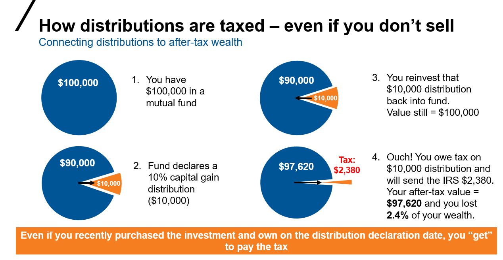

Understanding the intricacies of taxation is essential for maximizing investment returns. Taxation on capital gains poses distinct challenges and opportunities, particularly regarding mutual funds and algorithmic trading. This article examines the specific aspects of capital gains tax in relation to mutual fund investments and algorithmic trading strategies. We will assess how these elements interact and offer guidance on navigating their complexities to achieve optimal tax efficiency. Furthermore, the article will explore how different mutual fund types and trading strategies relate to tax obligations, helping investors make informed decisions on managing their investments.

## Table of Contents

## Understanding Mutual Funds and Capital Gains Tax

Mutual funds aggregate investments from multiple investors to purchase a diversified portfolio of stocks, bonds, or other securities. This structure allows investors to gain exposure to a broad range of assets with typically lower risk than investing in individual securities. However, mutual funds present unique tax implications, particularly concerning capital gains tax, which investors must understand to optimize their returns.

Capital gains tax on mutual funds arises when the fund realizes a profit from purchasing and selling securities within the fund's portfolio. These gains are often categorized into two types: short-term and long-term, depending on the holding period of the securities. Short-term capital gains apply to securities held for one year or less and are taxed at the investor's ordinary income tax rate. In contrast, long-term capital gains apply to securities held for more than one year and are generally taxed at a lower rate, depending on the investor's income level and tax status.

Investors face tax implications when fund managers distribute these gains, even if the investors themselves do not sell their mutual fund shares. Distributions are typically made to satisfy the fund's income requirements as dictated by tax regulations, and they can include dividends, interest, and capital gains. When mutual funds distribute capital gains to investors, the investors must report these as part of their taxable income, which adds a layer of complexity in managing investment earnings.

Understanding how mutual fund distributions are taxed is crucial for investors. When a mutual fund sells an asset, the resultant gain is either short-term or long-term, based on how long the fund held the asset. For example, if a mutual fund realizes a $10,000 gain on a stock held for over a year, this gain is classified as a long-term capital gain and might be taxed at a rate of 0%, 15%, or 20%, depending on the investor’s tax bracket. Conversely, if the gain were from an asset held for six months, the gain would be classified as a short-term capital gain, taxed at the same rate as the investor's ordinary income.

The impact of mutual fund distributions on investor earnings is significant because these distributions reduce the net asset value (NAV) of the fund but increase the investor's share of the taxable income. For instance, if a mutual fund pays a distribution of $2 per share and an investor owns 100 shares, the total distribution would be $200. This amount is taxable and must be reported on the investor's tax return, affecting their overall tax liability.

In summary, the tax structure surrounding mutual funds requires a detailed understanding of how capital gains are realized and distributed. By recognizing the distinctions between short-term and long-term capital gains and the tax consequences of distributions, investors can manage their mutual fund investments more strategically to minimize tax liabilities and maximize net returns.

## Tax Implications in Algorithmic Trading

Algorithmic trading is characterized by the use of computer algorithms to execute trades at high frequencies, capitalizing on minute price discrepancies in the market. This approach can lead to significant short-term capital gains, typically taxed at the ordinary income tax rate, which is generally higher than the long-term capital gains rate. Consequently, traders engaged in algorithmic activities must prudently manage their trades to mitigate the tax burden associated with frequent transactions.

The [high frequency](/wiki/high-frequency-trading) of transactions inherent in [algorithmic trading](/wiki/algorithmic-trading) often results in a higher tax liability due to the short-term nature of the gains. In many jurisdictions, short-term capital gains are taxed at an individual's ordinary income tax rate, which can be considerably higher than the long-term capital gains rate. For example, in the United States, short-term gains are subject to federal income tax rates ranging from 10% to 37%, whereas long-term gains are taxed at a maximum federal rate of 20%[1]. This discrepancy makes it crucial for algorithmic traders to employ strategies that can optimize their tax positions.

One effective strategy for managing tax liabilities is the careful timing of trades to qualify for long-term capital gains treatment. By holding certain positions for more than a year, traders can transition some of their gains to a more favorable tax rate. However, this approach must be balanced with the inherent need for high transaction frequency in algorithmic strategies.

Traders might also consider structuring their trading operations within tax-advantaged accounts, such as individual retirement accounts (IRAs) or 401(k)s, where applicable. These accounts can defer or, in some cases, avoid taxes altogether on trading gains until funds are withdrawn, typically at retirement when the individual might be in a lower tax bracket.

In addition to tax deferral vehicles, some traders utilize legal structures such as partnerships or limited liability companies (LLCs) to optimize taxation. These entities can offer flexibility in how income is divided and taxed among partners or members, providing additional avenues for tax planning.

Furthermore, implementing loss-harvesting strategies can be beneficial. This involves selling securities at a loss to offset taxable gains and potentially reduce overall tax liability. The losses can be used to offset other trading gains or, if losses exceed gains, can be carried forward to offset future profits.

Awareness of tax implications in algorithmic trading is essential for avoiding excessive tax burdens. Traders must remain vigilant about changes in tax legislation and ensure compliance with current laws. Engaging with tax professionals or investing in sophisticated tax software can further assist in efficient tax planning and filing.

In conclusion, the intersection of high-frequency algorithmic trading and taxation presents unique challenges that necessitate an informed and proactive approach. By understanding and applying strategic tax planning, traders can enhance their after-tax returns and achieve greater financial efficiency.

[1] "Tax Rates for Long-Term Capital Gains 2023", IRS, www.irs.gov.

## Comparing Tax Strategies: Mutual Funds and Algo Trading

Tax strategies can differ significantly between mutual fund investments and algorithmic trading activities. For mutual funds, tax efficiency often involves selecting funds that align with advantageous tax treatments and managing distributions effectively. Choosing funds that are tax-efficient, such as index funds or tax-managed funds, can continue to play a critical role in minimizing tax liabilities. These funds typically generate fewer taxable events due to lower portfolio turnover and strategic tax management practices, such as tax-loss harvesting.

Furthermore, the decision on when to sell mutual fund shares can impact the applicable capital gains tax rate. Holding shares for more than one year can shift gains from the short-term capital gains rate, which can be as high as 37% in the United States, to the long-term rate, capped at 20% as of 2021. This significant difference can substantially affect net investment returns.

In algorithmic trading, optimizing tax outcomes requires a strategic approach to trade execution and a careful consideration of the legal structure of trading entities. Algorithmic trading often results in a high frequency of trades, generating short-term capital gains that are taxed at higher rates. Traders can mitigate this by employing strategies such as delaying the execution of profitable trades to qualify for long-term capital gains rates or engaging in tax-loss harvesting to offset gains with losses.

Additionally, choosing an optimal legal structure for trading operations can influence tax obligations. Structures such as limited liability companies (LLCs) or S corporations can offer flexibility in how income is treated and taxed, potentially allowing for deductions and credits that are not available to individual traders. The choice of trading vehicle can significantly impact the trader's overall tax liability.

Another way investors can minimize tax burdens is by utilizing tax-advantaged accounts like Individual Retirement Accounts (IRAs) and 401(k)s. Contributions to these accounts can be made on a pre-tax basis, reducing taxable income for the year the contribution is made. Additionally, investments within these accounts grow tax-deferred, allowing compound interest to accumulate without the immediate impact of taxes. Roth IRAs, while funded with post-tax dollars, offer tax-free growth and withdrawals, adding another layer of tax efficiency.

By understanding these strategies, investors can better align their investment approach with their tax planning, ensuring that tax considerations are an integral part of the portfolio management process. This proactive approach can lead to substantial tax savings, maximizing overall investment returns while maintaining compliance with tax regulations.

## Conclusion

In the contemporary landscape of investment management, understanding the interplay between mutual funds, algorithmic trading, and capital gains tax is crucial for optimizing financial outcomes. Investors must maintain an up-to-date knowledge of tax regulations and implement tax-efficient strategies to maximize their investment returns. Effective tax planning is essential, whether the focus is on mutual fund investments or algorithmic trading activities, as it directly influences the financial returns and decision-making process.

By providing a structured approach to these aspects, this article serves as a guide for investors aiming to enhance their investment strategies with improved tax awareness. It is important to approach investment management with both strategic foresight and a comprehensive understanding of tax obligations. Sound tax strategies not only improve immediate financial returns; they also contribute significantly to achieving long-term financial success. Thus, being proactive and informed about tax implications remains a cornerstone of effective investment strategy, enabling investors to navigate complex financial environments with greater confidence and efficiency.

## References & Further Reading

[1]: ["Tax Rates for Long-Term Capital Gains 2023"](https://www.forbes.com/advisor/taxes/capital-gains-tax/) by the IRS

[2]: Bergstra, J., Bardenet, R., Bengio, Y., & Kégl, B. (2011). ["Algorithms for Hyper-Parameter Optimization."](https://dl.acm.org/doi/10.5555/2986459.2986743) Advances in Neural Information Processing Systems 24.

[3]: ["Advances in Financial Machine Learning"](https://www.amazon.com/Advances-Financial-Machine-Learning-Marcos/dp/1119482089) by Marcos Lopez de Prado

[4]: ["Evidence-Based Technical Analysis: Applying the Scientific Method and Statistical Inference to Trading Signals"](https://onlinelibrary.wiley.com/doi/book/10.1002/9781118268315) by David Aronson

[5]: ["Machine Learning for Algorithmic Trading"](https://www.amazon.com/Machine-Learning-Algorithmic-Trading-alternative/dp/1839217715) by Stefan Jansen

[6]: ["Quantitative Trading: How to Build Your Own Algorithmic Trading Business"](https://github.com/LucindaYa/quant-resources/blob/master/Quantitative%20Trading%20How%20to%20Build%20Your%20Own%20Algorithmic%20Trading%20Business.pdf) by Ernest P. Chan