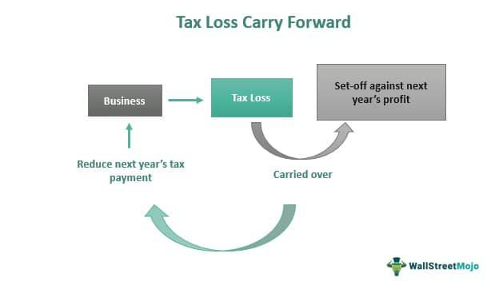

In the world of financial derivatives trading, understanding taxation is an essential component for optimizing profitability and ensuring compliance with regulations. The complex nature of derivatives, such as options, futures, and algorithmic trading strategies, introduces unique tax challenges that require careful consideration and planning.

Options and futures represent two primary categories of derivatives that traders utilize to hedge risks or speculate on price movements. Options trading involves a contract granting the right, but not the obligation, to buy or sell an asset at a predetermined price and date, while futures contracts entail an obligation to buy or sell an asset at a future date. Algorithmic trading, on the other hand, employs automated systems to execute trades based on pre-set criteria, significantly increasing the volume and frequency of transactions.



Tax regulations concerning derivatives are intricate and vary across jurisdictions. In the United States, for example, options and futures trading are governed by distinct tax rules. Options may be subject to provisions such as the wash-sale rule, which disallows the deduction of lost gains if a similar security is purchased within 30 days. Futures are often taxed more favorably under Section 1256 of the Internal Revenue Code, which stipulates that gains and losses be treated as 60% long-term and 40% short-term capital gains, irrespective of the holding period. 

Algorithmic trading presents its own set of challenges, particularly in record-keeping and tax reporting due to the high-frequency nature of transactions. The Internal Revenue Service (IRS) does not currently provide specific guidelines for algorithmic traders, making it imperative for practitioners to adapt existing regulations to their activities. 

The complexities of these tax regulations necessitate a strategic approach to maximize the financial benefits while minimizing legal risks. Effective tax management can significantly influence the profitability of trading activities, and a comprehensive understanding of these nuances is vital for success. As such, traders are encouraged to continuously update their knowledge and seek professional consultation to navigate this dynamic landscape efficiently.

## Table of Contents

## Tax Treatment of Options

Trading options involves unique tax implications that distinguish it from other financial instruments. An option gives the holder the right, but not the obligation, to buy or sell an underlying asset at a specified price on or before a certain date. The taxation of options can vary based on whether you hold a long (buy) or short (sell) position.

### Long vs. Short Options Taxation

**Long Options**: When you purchase an option, you have a long position. The premium paid for the option represents your initial investment. If you hold an option to expiration and it expires worthless, this premium is considered a capital loss. If the option is exercised, its cost basis is adjusted to the purchase price of the asset, plus the premium paid. Thus, gains or losses are realized when the underlying asset is subsequently sold.

**Short Options**: For sellers of options (i.e., short position), the premium received is initially a capital gain. If the option expires worthless, the seller retains the premium as a short-term capital gain. However, if the option is exercised, the premium is added to the sale price of the underlying asset, impacting the calculation of capital gains or losses for tax purposes.

### Wash-Sale and Straddle Rules

Options traders must be particularly mindful of specific tax rules, such as the wash-sale and straddle rules, which affect how gains and losses are reported.

**Wash-Sale Rule**: This rule disallows the deduction of a loss from the sale of a security if a substantially identical security is purchased within 30 days before or after the sale. If an investor sells an option at a loss and buys a similar option within the wash-sale period, the loss is not immediately recognized for tax purposes. Instead, it is added to the cost basis of the new position, deferring the loss recognition.

**Straddle Rule**: The straddle rule applies when an investor holds offsetting positions in personal property, such as options. A straddle involves entering into transactions that are expected to offset potential gains on one investment with potential losses on another. Under the straddle rules, losses on one leg of the straddle are only deductible up to the amount of gains on offsetting positions. Remaining losses are deferred and carried forward to offset future gains. This rule is designed to prevent tax manipulation through timing differences in the recognition of gains and losses.

Understanding these rules and their implications is crucial for traders to ensure compliance and to optimize post-tax returns. Misunderstanding or ignoring these aspects can result in unforeseen tax liabilities and penalties. Proper record-keeping and strategy are essential for managing these complex tax treatments.

## Tax Treatment of Futures

Futures contracts are subject to specific tax treatment under Section 1256 of the Internal Revenue Code (IRC), which provides traders with favorable tax benefits. These benefits are primarily due to the unique categorization of capital gains derived from futures trading.

Under Section 1256, futures contracts are taxed using the 60/40 rule. This rule stipulates that 60% of the gains or losses from futures contracts are treated as long-term capital gains, while the remaining 40% are treated as short-term capital gains, regardless of how long the position was held. This allocation is beneficial because long-term capital gains are typically taxed at a lower rate compared to short-term capital gains. Here is a simple conceptual formula reflecting the allocation:

$$
\text{Total Tax Liability} = (0.6 \times \text{Long-term Capital Gain Rate} \times \text{Gain/Loss}) + (0.4 \times \text{Short-term Capital Gain Rate} \times \text{Gain/Loss})
$$

The long-term capital gains rate varies, generally between 0% to 20% depending on the trader's income level, while short-term gains are taxed as ordinary income, which can be as high as 37%.

Additionally, futures contracts traded in the United States are subject to the mark-to-market (MTM) accounting requirement at the end of each tax year. This requirement mandates that all open futures positions be treated as if they were sold at fair market value on the last business day of the year. This "deemed sale" results in traders recognizing gains or losses on their positions annually, ensuring that taxes are paid on accrual rather than realization. The MTM accounting requirement increases transparency and aligns tax reporting more closely with actual market performance. Here’s how the MTM mechanism works in a simple example:

```python
def calculate_mark_to_market(gain, end_of_year_price, opening_price):
    # Calculate the notional gain or loss due to mark-to-market
    gain_loss = end_of_year_price - opening_price
    return gain_loss

# Example usage:
end_of_year_price = 1050    # Fair market price on December 31
opening_price = 1000        # Price at which the position was opened
gain_loss = calculate_mark_to_market(0, end_of_year_price, opening_price)
print(f'Mark-to-market gain/loss: ${gain_loss}')
```

This mark-to-market process allows traders to adjust their strategy and tax planning continually. Compliance with this requirement is crucial for accurate tax reporting and to avoid potential penalties. Consequently, understanding these tax provisions is essential for traders engaged in futures markets, providing opportunities to enhance profitability through strategic tax planning.

## Algorithmic Trading and Taxation

Algorithmic trading involves using computer algorithms to execute trades at speeds and frequencies that are beyond the capability of human traders. In the derivatives market, these algorithms analyze a variety of inputs and market conditions to determine optimal trading strategies, often executing trades in options and futures. The use of [algorithmic trading](/wiki/algorithmic-trading) has grown significantly, as it allows traders to capitalize on small price discrepancies and implement complex trading strategies.

When it comes to taxation, algorithmic trading presents unique considerations. Generally, the tax treatment of trades executed via algorithms follows the same principles as those executed manually, focusing on the nature of the derivatives—whether they are options or futures—and the holding period to distinguish between short-term and long-term gains. However, the [high frequency](/wiki/high-frequency-trading) and [volume](/wiki/volume-trading-strategy) of trades inherent in algorithmic trading may lead to increased scrutiny by tax authorities.

Algorithmic traders need to be cognizant of specific regulations that may apply to their trading activities. For instance, frequent trading might trigger the pattern day trader rule if equity derivatives are involved, impacting the type of account needed and the capital reserve requirements. Although this rule is more specific to stock trading, its principles might influence similar frameworks in derivatives markets.

An important aspect of algorithmic trading is precise record-keeping. High-frequency trading generates a large volume of transactions, making thorough documentation essential for accurate tax reporting. Each trade's details, including timestamps, transaction costs, and settled amounts, must be meticulously recorded. This requirement can pose significant challenges, as errors in documentation can lead to discrepancies between actual trading performance and reported figures.

Algorithmic traders often rely on sophisticated software to manage their operations. These platforms can streamline the process of collecting and organizing trading data. Below is an example of how Python can be utilized to automate the extraction and storage of trade data:

```python
import csv
from datetime import datetime

# Function to save trade data into a CSV file
def record_trade(trade_id, symbol, volume, price, trade_time):
    with open('trade_records.csv', mode='a') as file:
        writer = csv.writer(file)
        writer.writerow([trade_id, symbol, volume, price, trade_time])

# Example trade data
trade_id = 1
symbol = 'ES'
volume = 10
price = 3500.00
trade_time = datetime.now().strftime("%Y-%m-%d %H:%M:%S")

record_trade(trade_id, symbol, volume, price, trade_time)
```

The effective management and automation of data storage can ease compliance with tax reporting requirements and mitigate the risks associated with voluminous trading activity.

In conclusion, while algorithmic trading does not inherently invoke special tax considerations different from manual trading of the same instruments, the operational complexity and volume of trades necessitate exceptional diligence in record-keeping and compliance. Traders engaged in algorithmic trading are advised to maintain stringent documentation practices and consult with tax professionals to ensure accurate tax reporting and compliance with applicable regulations.

## Complex Strategies and Special Rules

Complex trading strategies, including straddles and spreads, require careful consideration of tax implications, as these can significantly affect the profitability and reporting of trading activities. 

Straddles involve taking a position in both a call and a put option on the same asset with identical strike prices and expiration dates. This strategy allows traders to profit from substantial price movements in either direction. However, tax regulations regarding straddles are intricate, primarily due to the potential for offsetting positions. According to the Internal Revenue Code (IRC), specific rules ensure that losses from one leg of the straddle are not prematurely recognized for tax purposes while gains go unreported. The "loss deferral rule" mandates that losses may be deferred until the offsetting position is sold, thereby preventing immediate deduction that could unduly benefit a trader's tax position.

Spreads, on the other hand, involve simultaneous buying and selling of options or futures contracts with differing strike prices or expiration dates. Spreads seek to gain from price differentials. Tax regulations require careful adherence to the wash-sale rule, which prohibits claiming a loss on a security sold in a wash (near-identical) transaction within 30 days. In the case of spreads, the identification of a substantially similar security can lead to complexities in determining the actual gain or loss for taxation purposes.

The application of the wash-sale and straddle rules influences reported gains and losses. Investors must judiciously track and account for these transactions due to the associated complexity and potential severe penalties for non-compliance. For instance, non-compliance may result in unexpected tax liabilities if losses are disallowed or deferred.

To illustrate further with an example in Python, consider a simple scenario calculating the potential deferred loss in a straddle strategy:

```python
def calculate_deferred_loss(cost_basis_bought_leg, sales_proceeds_sold_leg, offset_gain):
    # Calculate the initial loss.
    initial_loss = sales_proceeds_sold_leg - cost_basis_bought_leg
    # Determine deferred loss due to offsetting gain in the other leg of the straddle.
    deferred_loss = min(0, initial_loss + offset_gain)
    return deferred_loss

# Example: Bought a call at $500, sold a put at $300, gain on offsetting leg is $100.
deferred_loss = calculate_deferred_loss(500, 300, 100)
print(f"Deferred Loss: ${deferred_loss}")
```

In this code, the deferred loss function accounts for potential tax treatment, advising traders on the implications of their straddle decisions.

Ultimately, adherence to these specific tax rules is vital for accurate reporting of gains and losses, thereby ensuring compliance and optimizing trading profitability. Understanding these complexities empowers traders to develop strategies that align both economically and tax-efficiently with their trading objectives.

## Implications of Taxation on Trading Profits

Taxation plays a crucial role in shaping trading strategies and evaluating the profitability of financial derivatives. The tax treatment of trading profits can significantly influence a trader's decisions regarding when to enter and [exit](/wiki/exit-strategy) positions, the duration of holding positions, and the overall strategy employed. Understanding the different tax treatments applicable to short-term and long-term trading strategies is essential in optimizing trading outcomes.

### Impact on Short-term vs. Long-term Strategies

One of the key considerations for traders is whether their gains will be subjected to ordinary income tax rates or capital gains tax rates. Generally, short-term trading gains, which are defined as profits from assets held for one year or less, are taxed at ordinary income tax rates. These rates are typically higher than long-term capital gains tax rates, which apply to assets held for more than a year.

The higher tax rates on short-term trades can erode profits, prompting traders to consider holding positions for longer periods to benefit from favorable long-term capital gains rates. For instance, if an individual is in the highest tax bracket of 37% for ordinary income, transitioning to a strategy that allows for 20% long-term capital gains tax can offer significant tax savings. Consequently, traders may adjust their strategies, potentially reducing the frequency of trades or altering their holding periods to exploit these differentials in tax rates.

### Importance of Tax Planning

Effective tax planning involves a thorough understanding of the different tax treatments applied to various types of trades and devising strategies to minimize tax liabilities. This requires traders to engage in meticulous planning, including timing the realization of gains and losses, strategically managing the holding periods of investments, and leveraging losses to offset gains.

For example, traders might implement tax-loss harvesting strategies, selling losing positions to offset the gains from winning trades, thus reducing the overall taxable income. This requires careful monitoring of trade activities and maintaining detailed records of purchase and sale dates, costs, and proceeds. The integration of sophisticated software tools can aid in tracking these metrics and identifying opportunities for optimizing after-tax returns.

Moreover, traders should consider the use of tax-advantaged accounts, such as IRAs or 401(k)s, where investment growth is either tax-deferred or tax-free. By placing trades within these accounts, traders can potentially avoid immediate taxation on gains, allowing capital to compound more efficiently over time.

### Conclusion

Incorporating tax planning into trading strategies can substantially enhance profitability. Traders who neglect the tax implications of their trades may incur unexpected liabilities that diminish returns. Conversely, those who adeptly navigate the complexity of tax regulations, utilizing strategies to optimize their tax positions, can improve their net profits. Continuous learning about changes in tax laws, along with consulting tax professionals, can ensure that traders are well-equipped to manage their tax burdens effectively, thereby optimizing their overall trading strategies.

## Consultation with Tax Professionals

Navigating the intricacies of tax regulations in trading financial derivatives, such as options, futures, and algorithmic trading, is a challenging task. Given the complexity of these rules, it is essential for traders to seek professional advice. Proper tax planning can significantly influence trading strategy and profitability, while misunderstanding tax obligations can lead to severe financial penalties and missed opportunities for tax optimization.

Misinterpretation of tax laws can result in inaccurately reported income, overpayment, or underpayment of taxes, each carrying its own set of risks. Inaccurate reporting may trigger audits, leading to potential penalties and interest on unpaid taxes. For example, options and futures trading involve specific regulations like wash-sale rules and Section 1256 tax treatment, which must be meticulously followed to avoid adverse consequences.

Traders should consider consulting tax professionals who specialize in financial derivatives. These experts can provide tailored advice that aligns with the trader's specific activities and goals. They can guide traders through the complex landscape of tax regulations, help them understand how different rules apply to their trades, and optimize their tax strategies.

Moreover, a variety of resources are available for traders seeking assistance. Professional organizations, like the National Association of Tax Professionals (NATP) and the American Institute of CPAs (AICPA), offer directories to find accredited tax consultants with expertise in trading activities. Additionally, online platforms and financial advisory firms often provide access to specialized tax consultants who understand the nuances of derivatives trading.

In conclusion, consulting with tax professionals is not merely a prudent choice but a fundamental aspect of effective trading in financial derivatives markets. Understanding tax obligations thoroughly ensures compliance and enhances the potential for maximizing trading gains through strategic tax planning. As tax laws and market conditions evolve, ongoing engagement with knowledgeable professionals is essential for maintaining optimal financial health in trading activities.

## Conclusion

Options and futures taxation involves navigating complex rules and regulations that significantly affect trading outcomes and profitability. For options, it's essential to comprehend that long and short positions [carry](/wiki/carry-trading) distinct tax implications influenced by regulations like wash-sale and straddle rules. Futures trading, on the other hand, benefits from favorable tax treatment under Section 1256 of the Internal Revenue Code, with a unique 60/40 rule on capital gains that offers potential tax advantages. Both instruments are subject to mark-to-market accounting, which affects how profits and losses are reported annually.

A fundamental understanding of these tax laws is crucial for traders to ensure compliance and avoid costly mistakes. Tax violations can lead to penalties and interest charges, directly impacting a trader's net returns. Therefore, being knowledgeable about these issues and keeping abreast of any regulatory changes can lead to more informed and effective trading strategies.

Given the complexities involved, continuous learning and consultation with tax professionals are recommended for traders. Tax professionals can provide essential guidance, help in optimizing tax positions, and ensure compliance with current regulations. As taxation laws evolve, staying informed and seeking expert advice can protect and potentially enhance trading profitability. This proactive approach is not just prudent but necessary for successful and sustainable trading practices in financial derivatives.

## References & Further Reading

[1]: Hull, J.C. (2017). ["Options, Futures, and Other Derivatives"](https://www.amazon.com/Options-Futures-Other-Derivatives-10th/dp/013447208X). Pearson Education.

[2]: Fabozzi, F.J., Gupta, A., & Kolm, P.N. (2010). ["Trading and Exchanges"](https://onlinelibrary.wiley.com/doi/book/10.1002/9781119202172) by Larry Harris. Financial Markets and Portfolio Management.

[3]: Campbell, J.Y., Lo, A.W., & MacKinlay, A.C. (1997). ["The Econometrics of Financial Markets"](https://www.researchgate.net/publication/23775223_The_Econometrics_of_Financial_Market). Princeton University Press.

[4]: Sundaram, R.K. & Das, S.R. (2016). ["Derivatives: Principles and Practice"](https://www.researchgate.net/profile/Sanjiv-Das/publication/267418669_Derivatives_Principles_and_Practice/links/549020870cf225bf66a81999/Derivatives-Principles-and-Practice.pdf). McGraw-Hill Education.

[5]: Henkel, S.J., & Hoffmann, P. (2019). ["Algorithmic Trading and High-Frequency Trading"](https://link.springer.com/article/10.1007/s11408-019-00331-6). Decisions in Economics and Finance.

[6]: Shreve, S.E. (2004). ["Stochastic Calculus for Finance I & II"](https://github.com/yiwen-ww/Stochastic-calculus-for-finance/blob/main/Shreve%20Stochastic%20Calculus%20for%20Finance%20I%20%26%20II%20(2004).pdf). Springer.