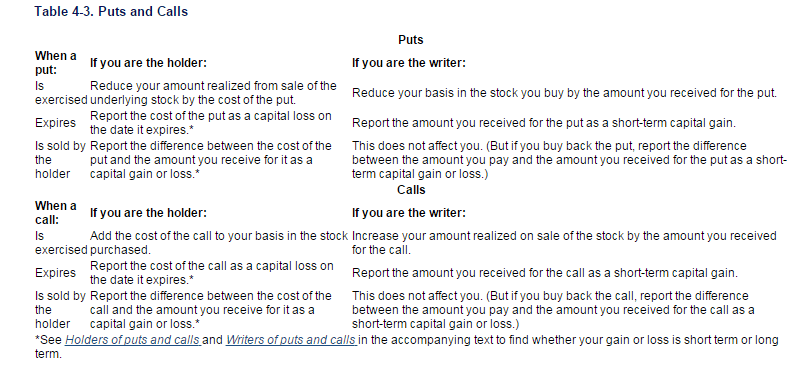

## Table of Contents

## What are futures and options in the context of financial markets?

Futures and options are types of financial contracts that people use to buy or sell assets at a set price in the future. Futures are agreements to buy or sell something, like a stock or commodity, at a specific price on a specific date. They are used by investors to hedge against price changes or to speculate on future price movements. For example, a farmer might use a futures contract to lock in a price for their crops, protecting against a drop in prices by the time they harvest.

Options, on the other hand, give the buyer the right, but not the obligation, to buy or sell an asset at a set price before a certain date. There are two types of options: calls and puts. A call option allows you to buy an asset, while a put option allows you to sell it. Options are often used for speculation or to hedge investments. For instance, if you think a stock's price will go up, you might buy a call option to purchase the stock at today's lower price, hoping to profit from the increase.

Both futures and options can be complex and carry risks, but they are important tools in financial markets. They allow investors to manage risk and potentially increase their returns. Understanding how they work and using them wisely can be beneficial for anyone involved in trading or investing.

## How are futures and options taxed differently from other financial instruments?

Futures and options are taxed differently from other financial instruments like stocks or bonds. When you make money from futures, it's usually taxed at a special rate called the 60/40 rule. This means 60% of your gains are taxed as long-term capital gains, and 40% are taxed as short-term capital gains. This can be a good deal because long-term capital gains rates are usually lower than short-term rates. On the other hand, if you lose money on futures, you can use those losses to reduce your taxes, but there are limits on how much you can deduct each year.

Options are a bit more complicated. If you buy an option and then sell it, any profit you make is taxed as a short-term capital gain, no matter how long you held the option. But if you exercise an option and then sell the underlying asset, the tax treatment depends on how long you held that asset. If you held it for more than a year, it's taxed as a long-term capital gain. If you held it for less than a year, it's a short-term capital gain. Also, if you write (sell) options, the tax treatment can vary based on whether the option is exercised or expires worthless. It's important to keep good records and maybe talk to a tax professional to make sure you're doing everything right.

## What is the difference between short-term and long-term capital gains in relation to futures and options?

Short-term and long-term capital gains are important when you're dealing with futures and options because they affect how much tax you pay. Short-term capital gains are profits from investments that you held for one year or less. If you make money from futures or options and it's considered a short-term gain, you'll pay taxes on that money at your regular income tax rate, which can be pretty high depending on your income. For options, if you buy an option and sell it for a profit within a year, that profit is a short-term capital gain. 

Long-term capital gains, on the other hand, are profits from investments you held for more than a year. These gains usually get a lower tax rate, which can save you money. For futures, the 60/40 rule comes into play, where 60% of your profit is taxed as a long-term capital gain, even if you held the futures for less than a year. With options, if you exercise an option and then sell the underlying asset after holding it for more than a year, the profit from selling that asset is taxed as a long-term capital gain. Understanding these differences can help you plan your investments and manage your taxes better.

## Are there any specific tax forms required for reporting gains or losses from futures and options?

When you make money or lose money from futures and options, you need to report it on your taxes. The main form you'll use is Form 1040, which is the standard form for your personal income tax. If you have gains or losses from futures, you'll report them on Form 6781, which is specifically for contracts like futures. This form helps you figure out your gains and losses using the 60/40 rule, where 60% of your gains are treated as long-term and 40% as short-term.

For options, it gets a bit more complicated. If you buy and sell options, you'll report those gains or losses on Schedule D of Form 1040, which is where you list all your capital gains and losses. If you exercise an option and then sell the underlying asset, you'll also use Schedule D to report those gains or losses, depending on how long you held the asset. Keeping good records of all your transactions is really important so you can fill out these forms correctly and make sure you're paying the right amount of taxes.

## How does the wash sale rule apply to futures and options trading?

The wash sale rule is something that usually applies to stocks and securities, but it doesn't apply to futures and options in the same way. For stocks, if you sell a stock at a loss and buy the same or a very similar stock within 30 days before or after the sale, you can't claim that loss on your taxes right away. But with futures and options, you don't have to worry about this rule. You can sell a futures contract or an option at a loss and buy a similar one right away without any tax problems.

This difference is important because it gives traders more flexibility when they're dealing with futures and options. If you're trading stocks, you might have to wait 30 days before buying back into a position if you want to claim a loss. But with futures and options, you can keep trading without worrying about the wash sale rule messing up your tax situation. Just remember, even though the wash sale rule doesn't apply, you still need to report all your gains and losses correctly on your tax forms.

## What are the tax implications of trading futures and options within an IRA or other retirement accounts?

When you trade futures and options inside an IRA or other retirement account, the tax rules are different from trading them in a regular account. In an IRA, you don't have to pay taxes on your gains each year. This means you can buy and sell futures and options without worrying about paying taxes on your profits right away. However, you need to be careful because not all IRAs allow you to trade futures and options. Some types of IRAs, like a traditional IRA or a Roth IRA, might have rules against trading these kinds of investments.

If your IRA does allow you to trade futures and options, you won't pay taxes on your gains until you take money out of the IRA. When you withdraw money, it will be taxed as regular income if it's a traditional IRA, or it might be tax-free if it's a Roth IRA. But remember, if you break the rules and trade futures and options in an IRA that doesn't allow it, you could face penalties and have to pay taxes on your gains right away. So, it's important to check with your IRA provider to make sure you're following their rules.

## How do tax laws treat losses from futures and options, and what are the limits on deducting these losses?

When you lose money trading futures and options, you can use those losses to reduce your taxes. For futures, you report your losses on Form 6781. You can use these losses to offset any gains you made from futures trading. If your losses are more than your gains, you can deduct up to $3,000 of the extra loss from your regular income each year. If you still have losses left over after that, you can [carry](/wiki/carry-trading) them forward to future years to use against future gains or income.

For options, you report your losses on Schedule D of your tax return. Just like with futures, you can use these losses to offset any gains you made from trading options. If your losses are more than your gains, you can also deduct up to $3,000 of the extra loss from your regular income each year. Any remaining losses can be carried forward to future years. It's important to keep good records of all your trades so you can accurately report your gains and losses and take advantage of these tax benefits.

## Can trading futures and options be considered a business for tax purposes, and what are the implications?

If you trade futures and options a lot and it's your main way of making money, the IRS might see it as a business. This means you can report your trading on Schedule C of your tax return, just like any other business. When you do this, you can deduct all kinds of business expenses, like the cost of trading software, data fees, or even part of your home office if you use it for trading. But, you have to show that you're trying to make money and not just gambling. The IRS looks at things like how often you trade, how much time you spend on it, and if you keep good records.

If the IRS agrees that your trading is a business, you'll pay self-employment tax on your profits. This is different from just reporting capital gains, where you don't pay self-employment tax. Also, if you have a loss from your trading business, you can deduct it from your other income, but there are limits. You can only deduct up to the amount of your other income, and any extra loss can be carried forward to future years. It's a good idea to talk to a tax professional to make sure you're doing everything right and taking advantage of all the tax benefits you can.

## What are the international tax considerations for non-residents trading futures and options in the U.S. market?

If you're not a U.S. resident and you trade futures and options in the U.S. market, you need to think about how it will affect your taxes. The U.S. has rules that say non-residents have to pay taxes on certain kinds of income from the U.S., like interest, dividends, and capital gains. But, there's a special rule for futures trading. If you trade futures through a U.S. broker, you don't have to pay U.S. taxes on your gains from futures. This is because futures are seen as a special kind of contract that's not taxed the same way as other investments. However, you might still have to report this income in your home country and pay taxes there, depending on their rules.

For options trading, things can be a bit different. If you make money from options, you might have to pay U.S. taxes on those gains, depending on how the IRS sees your trading activity. If the IRS thinks you're running a trading business, you might have to file a U.S. tax return and pay taxes on your profits. But, if you're just trading as an investor, you might not have to pay U.S. taxes on your options gains. It's really important to check the tax treaty between your country and the U.S. because it can change how you're taxed. Also, you should talk to a tax professional who knows about international tax rules to make sure you're doing everything right and not paying more taxes than you need to.

## How do state taxes affect the taxation of futures and options, and are there variations by state?

When you trade futures and options, you need to think about state taxes too. Not all states tax futures and options the same way. Some states follow the federal tax rules, which means they use the 60/40 rule for futures and treat options gains as capital gains. But other states might have their own rules. For example, some states don't tax capital gains at all, while others might tax them at a different rate than the federal government. It's important to know the rules in your state so you don't get surprised by a big tax bill.

There are also states that don't have an income tax at all, like Florida, Texas, and Washington. If you live in one of these states, you won't have to worry about state taxes on your futures and options trading. But if you live in a state with an income tax, you'll need to report your gains and losses on your state tax return. The rules can be different from state to state, so it's a good idea to check with a tax professional who knows about your state's tax laws. They can help you figure out how much you owe and make sure you're following all the rules.

## What recent changes have been made to the tax laws affecting futures and options, and how might they impact traders?

There haven't been many big changes to the tax laws for futures and options recently, but there are always small updates and clarifications that can affect how you do your taxes. One thing to keep an eye on is the Tax Cuts and Jobs Act from 2017, which changed some rules about how you can deduct losses. For example, if you lose money trading futures and options, you can still deduct up to $3,000 of those losses from your regular income each year, but any extra losses can only be used to offset future gains or income. This means you need to keep good records and plan your trading carefully to make the most of your tax situation.

Another thing to think about is how the IRS looks at whether your trading is a business or just a hobby. If the IRS decides you're running a trading business, you can deduct more expenses, but you'll also have to pay self-employment tax on your profits. This can be a big deal because self-employment tax is higher than the tax on capital gains. So, if you trade a lot and it's your main way of making money, you might want to talk to a tax professional to make sure you're doing everything right and taking advantage of all the tax benefits you can.

## How can advanced tax strategies be utilized to minimize tax liabilities from futures and options trading?

One way to minimize your tax bill from trading futures and options is by using tax loss harvesting. This means selling investments that have lost value to offset the gains from your winning trades. If you have more losses than gains, you can deduct up to $3,000 of those losses from your regular income each year. Any extra losses can be carried forward to future years to help reduce your taxes then. By doing this, you can lower the amount of taxes you owe and keep more money in your pocket.

Another strategy is to use retirement accounts like an IRA to trade futures and options. If your IRA allows it, you won't have to pay taxes on your gains each year. Instead, you'll only pay taxes when you take money out of the IRA, and if it's a Roth IRA, you might not have to pay any taxes at all. But, you need to make sure your IRA allows you to trade futures and options because not all of them do. If you break the rules, you could face penalties and have to pay taxes on your gains right away. Talking to a tax professional can help you figure out the best way to use these strategies and make sure you're following all the rules.

## What is the Tax Treatment of Futures?

Futures contracts are subject to specific tax treatment under Section 1256 of the Internal Revenue Code (IRC), which provides traders with favorable tax benefits. These benefits are primarily due to the unique categorization of capital gains derived from futures trading.

Under Section 1256, futures contracts are taxed using the 60/40 rule. This rule stipulates that 60% of the gains or losses from futures contracts are treated as long-term capital gains, while the remaining 40% are treated as short-term capital gains, regardless of how long the position was held. This allocation is beneficial because long-term capital gains are typically taxed at a lower rate compared to short-term capital gains. Here is a simple conceptual formula reflecting the allocation:

$$
\text{Total Tax Liability} = (0.6 \times \text{Long-term Capital Gain Rate} \times \text{Gain/Loss}) + (0.4 \times \text{Short-term Capital Gain Rate} \times \text{Gain/Loss})
$$

The long-term capital gains rate varies, generally between 0% to 20% depending on the trader's income level, while short-term gains are taxed as ordinary income, which can be as high as 37%.

Additionally, futures contracts traded in the United States are subject to the mark-to-market (MTM) accounting requirement at the end of each tax year. This requirement mandates that all open futures positions be treated as if they were sold at fair market value on the last business day of the year. This "deemed sale" results in traders recognizing gains or losses on their positions annually, ensuring that taxes are paid on accrual rather than realization. The MTM accounting requirement increases transparency and aligns tax reporting more closely with actual market performance. Here’s how the MTM mechanism works in a simple example:

```python
def calculate_mark_to_market(gain, end_of_year_price, opening_price):
    # Calculate the notional gain or loss due to mark-to-market
    gain_loss = end_of_year_price - opening_price
    return gain_loss

# Example usage:
end_of_year_price = 1050    # Fair market price on December 31
opening_price = 1000        # Price at which the position was opened
gain_loss = calculate_mark_to_market(0, end_of_year_price, opening_price)
print(f'Mark-to-market gain/loss: ${gain_loss}')
```

This mark-to-market process allows traders to adjust their strategy and tax planning continually. Compliance with this requirement is crucial for accurate tax reporting and to avoid potential penalties. Consequently, understanding these tax provisions is essential for traders engaged in futures markets, providing opportunities to enhance profitability through strategic tax planning.

## References & Further Reading

[1]: Hull, J.C. (2017). ["Options, Futures, and Other Derivatives"](https://www.amazon.com/Options-Futures-Other-Derivatives-10th/dp/013447208X). Pearson Education.

[2]: Fabozzi, F.J., Gupta, A., & Kolm, P.N. (2010). ["Trading and Exchanges"](https://onlinelibrary.wiley.com/doi/book/10.1002/9781119202172) by Larry Harris. Financial Markets and Portfolio Management.

[3]: Campbell, J.Y., Lo, A.W., & MacKinlay, A.C. (1997). ["The Econometrics of Financial Markets"](https://www.researchgate.net/publication/23775223_The_Econometrics_of_Financial_Market). Princeton University Press.

[4]: Sundaram, R.K. & Das, S.R. (2016). ["Derivatives: Principles and Practice"](https://www.researchgate.net/profile/Sanjiv-Das/publication/267418669_Derivatives_Principles_and_Practice/links/549020870cf225bf66a81999/Derivatives-Principles-and-Practice.pdf). McGraw-Hill Education.

[5]: Henkel, S.J., & Hoffmann, P. (2019). ["Algorithmic Trading and High-Frequency Trading"](https://link.springer.com/article/10.1007/s11408-019-00331-6). Decisions in Economics and Finance.

[6]: Shreve, S.E. (2004). ["Stochastic Calculus for Finance I & II"](https://github.com/yiwen-ww/Stochastic-calculus-for-finance/blob/main/Shreve%20Stochastic%20Calculus%20for%20Finance%20I%20%26%20II%20(2004).pdf). Springer.