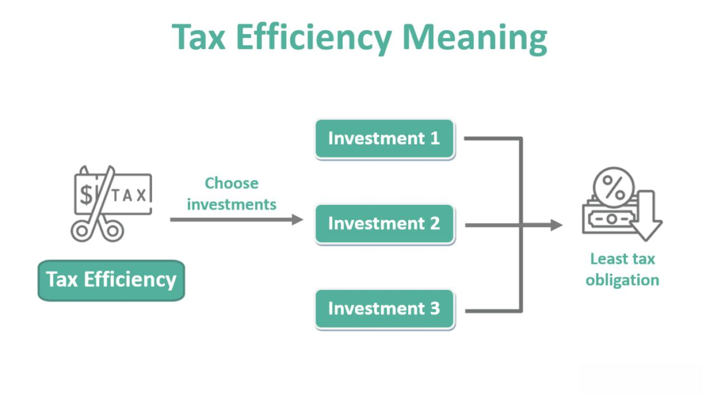

Investing in mutual funds offers a straightforward and diversified approach to generating dividend income, appealing to both novice and seasoned investors. Mutual funds pool resources from numerous investors to purchase a varied portfolio of stocks, bonds, or other securities, allowing individuals to access a range of investments without requiring comprehensive market knowledge or substantial capital. A key component of deriving benefits from mutual funds is understanding the tax implications attached to the dividends they generate. Different types of dividends—ordinary, qualified, and capital gains distributions—are subject to a variety of tax treatments, which can significantly impact an investor's net returns.

The structure of mutual fund dividends and their taxation plays a crucial role in the overall profitability of investments. Taxation policies can affect when and how much income an investor ultimately receives from their dividend-paying mutual funds. For instance, ordinary dividends are taxed at standard income tax rates, while qualified dividends may benefit from the lower, capital gains tax rates, depending on holding periods and types of funds involved. Investors must navigate these different tax treatment categories to optimize their after-tax returns.



Moreover, the integration of algorithmic trading into dividend investment strategies is becoming increasingly prominent. Algorithmic trading employs complex algorithms and computational power to make trading decisions, potentially enhancing returns by predicting market trends and executing trades at optimal times. This technology-driven approach can augment traditional dividend investing by providing insights and efficiencies that human traders might overlook.

Thus, understanding the multifaceted dimensions of mutual fund dividend taxation, combined with insights from algorithmic trading, equips investors with the knowledge needed to refine their investment strategies and reduce their tax burdens. As tax laws and investment technologies evolve, staying informed enables investors to make educated decisions and adapt their portfolios for maximum tax efficiency and financial gain.

## Table of Contents

## Understanding Dividend Taxes on Mutual Funds

Mutual funds are required by law to distribute nearly all their net income and realized capital gains to their shareholders annually. This results in distributions that can take the form of dividends, which carry specific tax implications for investors. Dividends from mutual funds often cause confusion during the tax season due to their distinct classifications and the way they are reported to the Internal Revenue Service (IRS).

The IRS categorizes mutual fund dividends into ordinary dividends, qualified dividends, and capital gains distributions, each subject to different tax treatments. Ordinary dividends are typically taxed at an individual's ordinary income tax rate. Qualified dividends, on the other hand, may be eligible for lower capital gains tax rates if specific criteria are met, such as the holding period requirement. Capital gains distributions from mutual funds pertain to the net gains realized from the sale of securities within the fund, influencing the shareholder's overall tax liability.

To aid investors in the tax filing process, mutual funds issue a Form 1099-DIV. This form details the various types of income distributed throughout the tax year, including the aforementioned categories of dividends and capital gains. Investors must accurately report these amounts on their tax returns to ensure compliance and proper tax treatment.

Understanding the distinctions among ordinary dividends, qualified dividends, and capital gains distributions is essential for accurate tax planning. This understanding allows investors to assess their tax liabilities effectively and optimize their investment strategies to potentially reduce tax obligations. It is advisable for investors to stay informed of their specific tax obligations and consult tax professionals if clarification or guidance is needed in interpreting the tax implications of mutual fund dividends.

## Types of Dividends and Their Tax Implications

Mutual fund dividends can generally be classified into two primary types: ordinary dividends and qualified dividends. Each has distinct tax implications that investors must understand for effective tax planning.

Ordinary dividends are the most common type of dividend. These are typically derived from a mutual fund's earnings and profits and are taxed at ordinary income tax rates. This means that the income an investor receives from ordinary dividends is added to their taxable income for the year and taxed according to their applicable tax bracket. For example, if an investor is in the 24% tax bracket, their ordinary dividends will be taxed at this rate. Since these dividends do not benefit from any special tax treatment, investors must account for them in their overall tax planning to effectively manage their tax burden.

Qualified dividends, on the other hand, are subject to more favorable tax treatment. To be classified as a qualified dividend, it must meet specific criteria set by the IRS, including the holding period requirement. Typically, these dividends are taxed at the lower long-term capital gains tax rates, which are 0%, 15%, or 20%, depending on the investor's taxable income and filing status. The lower tax rates on qualified dividends make them an attractive income source for investors seeking tax efficiency. Understanding the distinction between ordinary and qualified dividends is crucial, as it enables investors to anticipate their tax liabilities and plan accordingly.

Additionally, mutual funds that invest in municipal bonds may offer tax-free dividends, commonly referred to as tax-exempt interest dividends. These dividends are generally exempt from federal income tax, and if the municipal bonds are issued within the investor's state of residence, they may also be exempt from state and local taxes. However, the tax-exemption applies only if the dividends are derived from obligations that are free from federal income tax. The exemption makes municipal bond funds particularly attractive for investors in higher tax brackets who seek to minimize federal and potentially state tax liabilities.

Properly understanding these different types of dividends and their tax treatments enables investors to optimize their portfolios with a focus on tax efficiency. Knowing when dividends are taxed as ordinary income and when they can benefit from reduced tax rates allows for informed decision-making regarding investment strategies and tax planning.

## Capital Gains Taxes and Mutual Funds

Capital gains taxes are a significant consideration when selling mutual fund shares for profit. The Internal Revenue Service (IRS) distinguishes between short-term and long-term capital gains, each with distinct tax implications. 

### Long-term vs. Short-term Capital Gains

- **Long-term capital gains** are profits from the sale of mutual fund shares held for more than one year. These gains are taxed at preferential rates, which are generally lower than ordinary income tax rates. As of 2023, the long-term capital gains tax rates in the United States are 0%, 15%, or 20%, depending on one's taxable income.

- **Short-term capital gains**, on the other hand, apply to shares held for one year or less. These gains are subject to taxation at ordinary income tax rates, which can be significantly higher than the rates for long-term gains. The current income tax brackets range from 10% to 37%.

### Timing the Sale of Shares

The timing of selling mutual fund shares can significantly affect the taxes owed. For instance, by holding shares for more than a year, investors may benefit from the lower long-term capital gains tax rates. This strategy can lead to substantial tax savings compared to incurring short-term capital gains tax.

### Capital Gains Distributions from Mutual Funds

Mutual funds often report capital gains distributions, which occur when the fund manager sells assets within the fund at a profit. These distributions are passed on to shareholders and can impact an investor's overall tax liability. Even if an investor does not sell shares, receiving capital gains distributions from the mutual fund can result in a tax obligation. These distributions are typically reported on Form 1099-DIV and should be carefully factored into an investor's tax planning strategy.

### Example Calculation

Assume an investor sells mutual fund shares for a profit of $10,000. If these shares were held for over a year, and the investor falls into the 15% long-term capital gains tax bracket, the tax owed would be computed as:

$$
\text{Tax Owed} = 10,000 \times 0.15 = 1,500
$$

However, if the same gains were classified as short-term, and the investor's income falls into the 24% ordinary income tax bracket, the tax would be:

$$
\text{Tax Owed} = 10,000 \times 0.24 = 2,400
$$

This example demonstrates the importance of understanding and utilizing the varying tax rates for capital gains to optimize tax outcomes effectively.

## Algorithmic Trading and Dividend Investment

Algorithmic trading, a method that employs computer algorithms to execute investment strategies, has become an essential tool in optimizing dividend investments. By leveraging algorithms, investors can predict market movements, thus making more informed decisions on when to buy or sell mutual fund shares. This predictive power is particularly useful given the [volatility](/wiki/volatility-trading-strategies) and complexity of financial markets.

One of the key benefits of [algorithmic trading](/wiki/algorithmic-trading) in the context of dividend investing is its ability to process vast amounts of data quickly to identify patterns and trends. For instance, algorithms can analyze historical price movements, trading volumes, and economic indicators to forecast future market behaviors. This capability allows for more precise timing in executing trades, which is crucial for capturing dividends efficiently and maximizing returns.

Moreover, algorithmic trading helps in minimizing transaction costs and reducing emotional biases in investment decisions. By setting predefined criteria for transactions, algorithms can execute trades based on objective data, eliminating impulsive decision-making that may result from market fluctuations or investor sentiment.

For example, consider a simple Python-based trading algorithm designed to identify optimal dividend stocks. The algorithm may use historical data to compute metrics like the dividend yield and payout ratio and combine them with technical indicators such as moving averages. Here’s a conceptual snippet of such an algorithm using Python:

```python
import numpy as np
import pandas as pd

# Load historical stock data
data = pd.read_csv('stock_data.csv')

# Calculate 50-day and 200-day moving averages
data['MA50'] = data['Close'].rolling(window=50).mean()
data['MA200'] = data['Close'].rolling(window=200).mean()

# Define buy condition: when 50-day MA crosses above 200-day MA
buy_signals = (data['MA50'] > data['MA200']) & (data['MA50'].shift(1) <= data['MA200'].shift(1))

# Identify buy points
data['Buy_Signal'] = np.where(buy_signals, data['Close'], np.nan)

# Output buy signals for optimal dividend stocks
buy_points = data.dropna(subset=['Buy_Signal'])
print(buy_points[['Date', 'Buy_Signal']])
```

This code illustrates a simple moving average crossover strategy to identify potential buy points for dividend stocks. By finding stocks where short-term moving averages exceed long-term ones, investors might pinpoint shares likely to perform well in terms of dividend yield.

Understanding the integration of algorithmic trading within dividend investment enables passive investors to harness technology for better returns while potentially mitigating risks. These advancements offer a more systematic approach to investment, allowing investors to focus on long-term financial goals without the need for constant market monitoring. However, it is essential to remain aware of algorithm limitations, such as overfitting and data quality issues, and to continuously adjust strategies as market conditions evolve.

## Practical Tips for Minimizing Dividend Taxation

To minimize dividend taxation effectively, investors can utilize several strategies aimed at reducing their overall tax burden. One of the primary methods involves using tax-advantaged accounts such as Individual Retirement Accounts (IRAs). These accounts allow for the sheltering of dividend income from immediate taxation. In a traditional IRA, contributions may be tax-deductible, and taxes on dividends and other earnings are deferred until withdrawals begin during retirement. Roth IRAs, on the other hand, use after-tax contributions but allow for tax-free withdrawals, including dividends, provided certain conditions are met.

Reinvesting dividends is another strategy that can defer taxation. In taxable accounts, dividends are typically taxed in the year they are received. However, if these dividends are automatically reinvested, the investor may benefit from compounding growth, although they are still liable for taxes on the dividends in the year they are credited. When reinvesting within tax-advantaged accounts, dividends might grow without generating an immediate tax liability, thus potentially enhancing long-term growth.

Utilizing tax software or consulting a tax professional is crucial for optimizing one's tax strategy. Tax software can help track investments, calculate tax implications, and determine the most tax-efficient strategies for managing dividend income. Professional tax advisors provide personalized insights and strategies, especially in complex situations, ensuring compliance with current IRS rules while minimizing tax liability.

Lastly, comprehending state and local taxes on dividends is vital. State and local tax regulations can vary significantly, affecting the net income from dividends. Some states may impose additional taxes on dividends, whereas others might offer favorable reductions or exemptions. Having a clear understanding of one's specific tax environment allows for more accurate tax planning and decision-making.

In summary, by leveraging tax-advantaged accounts, reinvesting dividends strategically, utilizing expert resources, and being cognizant of local tax laws, investors can effectively minimize their tax liabilities on dividend income while maximizing their investment potential.

## Conclusion

Taxation on mutual fund dividends presents a multifaceted landscape, but with a comprehensive understanding, it becomes manageable. By mastering the distinctions between ordinary and qualified dividends, investors can exploit favorable tax treatments to limit their financial obligations. Additionally, the strategic application of algorithmic trading offers leverage in timing investments and optimizing portfolio returns, further helping to minimize tax liabilities. 

Staying informed about current tax regulations and recognizing the importance of timely updates are crucial for investors seeking to manage their tax exposures effectively. Consultation with tax professionals or leveraging advanced tax software can provide the needed insights to navigate the complexities of tax legislation.

Ultimately, informed decision-making is the cornerstone of successful investment and tax strategies. By combining knowledge of dividend classifications with strategic trading practices, investors can not only enhance their returns but also ensure their investment activities remain tax-efficient. This dual focus on understanding and strategy empowers investors to optimize their financial outcomes in the world of mutual fund dividends.

## References & Further Reading

[1]: ["Mutual Fund Taxation: Investment Strategies and Analysis"](https://www.investopedia.com/articles/investing/091715/basics-income-tax-mutual-funds.asp) by Investopedia

[2]: ["IRS Publication 550: Investment Income and Expenses"](https://www.irs.gov/publications/p550) by the Internal Revenue Service

[3]: ["A Random Walk Down Wall Street: The Time-Tested Strategy for Successful Investing"](https://yourknowledgedigest.org/wp-content/uploads/2020/04/a-random-walk-down-wall-street.pdf) by Burton G. Malkiel

[4]: ["Algorithmic Trading: Winning Strategies and Their Rationale"](https://www.wiley.com/en-us/Algorithmic+Trading%3A+Winning+Strategies+and+Their+Rationale-p-9781118460146) by Ernie Chan

[5]: ["Taxation of Mutual Funds: Detailed Analysis and Insights"](https://www.investopedia.com/articles/investing/091715/basics-income-tax-mutual-funds.asp) by Morningstar

[6]: ["The Intelligent Investor: The Definitive Book on Value Investing"](https://www.amazon.com/Intelligent-Investor-Third-Definitive-Investing/dp/0063423537) by Benjamin Graham