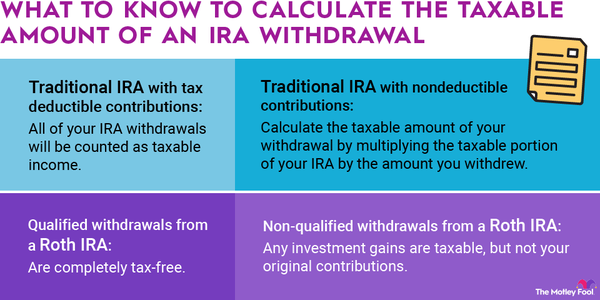

## Table of Contents

## What is a mutual fund?

A mutual fund is a type of investment where many people pool their money together to buy a variety of stocks, bonds, or other assets. It's managed by a professional who makes decisions about what to buy and sell. This makes it easier for people who don't have a lot of money or time to invest in a diverse range of assets on their own.

When you invest in a mutual fund, you buy shares of the fund, and the value of your investment goes up or down based on how well the assets in the fund perform. Mutual funds can be a good way to spread out risk because they invest in many different things. This means if one investment does poorly, it might be balanced out by others that do well.

## What is an IRA?

An IRA, or Individual Retirement Account, is a special type of savings account that helps you save for retirement. You can put money into an IRA and it might grow over time because of investments like stocks or bonds. There are different kinds of IRAs, but the main idea is that they offer tax benefits to help you save more for when you stop working.

One type of IRA is called a Traditional IRA. With this kind, you might be able to take a tax deduction on the money you put in, which means you pay less tax now. But when you take the money out later, you'll have to pay taxes on it. Another type is a Roth IRA. With a Roth IRA, you don't get a tax break when you put money in, but if you follow the rules, you won't have to pay taxes on the money when you take it out in retirement. Both types help you save for the future, but they work a bit differently with taxes.

## How are mutual funds typically taxed outside of an IRA?

When you invest in mutual funds outside of an IRA, you need to think about taxes. If the mutual fund makes money from dividends or interest, you'll have to pay taxes on that income every year. Dividends are when the companies the fund owns give out some of their profits to shareholders. Interest is what the fund earns from bonds or other investments. The tax rate you pay on this income depends on your income level and the type of income, like if it's qualified dividends or ordinary income.

Another thing to consider is capital gains. If the mutual fund sells investments for more than it paid for them, it makes a capital gain. The fund might pass these gains on to you, and you'll have to pay taxes on them. These are usually taxed at a lower rate than regular income, but it depends on how long the fund held the investment. Short-term capital gains, from investments held for less than a year, are taxed as ordinary income. Long-term capital gains, from investments held for more than a year, have a lower tax rate. When you sell your shares in the mutual fund, you might also have to pay capital gains tax on any profit you made.

## What are the tax benefits of holding mutual funds within an IRA?

Holding mutual funds inside an IRA can help you save on taxes. With a Traditional IRA, the money you put into the mutual fund can be taken off your taxes right away. This means you pay less tax now because you can deduct the amount you contribute from your income. When you take the money out later, you'll have to pay taxes on it, but by then, you might be in a lower tax bracket because you're retired.

With a Roth IRA, you don't get a tax break when you put money into the mutual fund, but if you follow the rules, you won't have to pay any taxes on the money when you take it out in retirement. This can be really helpful because all the growth of your mutual fund over the years can be yours to keep without owing any taxes. Both types of IRAs let you avoid paying taxes on the dividends and capital gains the mutual fund earns each year, which can help your investment grow faster.

## Are there any circumstances under which selling mutual funds in an IRA could trigger taxes?

Selling mutual funds in an IRA usually doesn't trigger taxes right away, but there are some situations where you might have to pay taxes. If you have a Traditional IRA, you'll have to pay taxes when you take money out of the account. This includes any gains from selling mutual funds. If you take money out before you're 59½ years old, you might also have to pay a 10% penalty on top of the taxes.

With a Roth IRA, you won't have to pay taxes on the money you take out if you follow the rules. You need to have had the account for at least five years and be at least 59½ years old. If you take money out before meeting these rules, you might have to pay taxes and a penalty on the earnings part of your withdrawal, but not on the money you originally put in. So, while selling mutual funds in an IRA doesn't usually trigger taxes right away, taking money out of the IRA can lead to taxes depending on the type of IRA and when you take the money out.

## What is the difference between traditional and Roth IRAs in terms of taxation on mutual fund sales?

In a Traditional IRA, when you sell mutual funds, you don't have to pay taxes right away. The money stays in your account and can grow without being taxed each year. But when you take money out of a Traditional IRA, you have to pay taxes on it. This includes any money you made from selling mutual funds. If you take money out before you're 59½ years old, you might also have to pay a 10% penalty on top of the taxes.

In a Roth IRA, selling mutual funds also doesn't trigger taxes right away. The big difference is that if you follow the rules, you won't have to pay any taxes when you take money out in retirement. The rules say you need to have had the Roth IRA for at least five years and be at least 59½ years old. If you take money out before meeting these rules, you might have to pay taxes and a penalty on the earnings part of your withdrawal, but not on the money you originally put in. So, with a Roth IRA, all the growth from your mutual funds can be yours to keep without owing any taxes if you follow the rules.

## How does the Required Minimum Distribution (RMD) affect the taxation of mutual funds in a traditional IRA?

When you have a traditional IRA, you need to start taking money out of it when you turn 72. This is called a Required Minimum Distribution, or RMD. The RMD is the smallest amount you have to take out each year. When you take this money out, you have to pay taxes on it. This includes any money you made from selling mutual funds in your IRA. So, even if you don't sell any mutual funds that year, you still have to take out the RMD and pay taxes on it.

The RMD can affect how much tax you pay because it forces you to take money out of your IRA, even if you don't need it. This can push you into a higher tax bracket if you have a lot of other income. It's important to plan for RMDs because they can change how much tax you owe each year. If you don't take out the RMD, you might have to pay a big penalty, which is 50% of the amount you were supposed to take out but didn't.

## Can the sale of mutual funds within an IRA result in capital gains tax?

Selling mutual funds inside an IRA does not make you pay capital gains tax right away. When you sell mutual funds in a Traditional IRA, the money stays in your account and grows without being taxed each year. You only have to pay taxes when you take money out of the IRA. If you take money out before you're 59½ years old, you might also have to pay a 10% penalty on top of the taxes.

In a Roth IRA, selling mutual funds also doesn't trigger taxes right away. If you follow the rules, you won't have to pay any taxes when you take money out in retirement. The rules say you need to have had the Roth IRA for at least five years and be at least 59½ years old. If you take money out before meeting these rules, you might have to pay taxes and a penalty on the earnings part of your withdrawal, but not on the money you originally put in. So, with a Roth IRA, all the growth from your mutual funds can be yours to keep without owing any taxes if you follow the rules.

## What are the tax implications of converting a traditional IRA with mutual funds to a Roth IRA?

When you convert a traditional IRA with mutual funds to a Roth IRA, you have to pay taxes on the amount you convert. This is because the money in a traditional IRA hasn't been taxed yet. So, if you convert $10,000, you'll have to add that $10,000 to your income for the year and pay taxes on it. The tax rate you pay depends on your income and how much you convert. It's a good idea to think about how this might affect your taxes before you decide to convert.

After you've paid the taxes on the conversion, the money in your Roth IRA can grow without being taxed. This means any money you make from selling mutual funds in your Roth IRA won't be taxed as long as you follow the rules. You need to have had the Roth IRA for at least five years and be at least 59½ years old when you take money out. If you take money out before meeting these rules, you might have to pay taxes and a penalty on the earnings part of your withdrawal, but not on the money you originally put in. So, converting to a Roth IRA can be a good way to save on taxes in the long run, but you have to pay taxes upfront.

## How do tax laws treat the dividends and interest earned from mutual funds within an IRA?

When you have mutual funds in an IRA, the dividends and interest they earn are not taxed right away. This is true for both Traditional and Roth IRAs. So, if your mutual funds get money from dividends or interest, you don't have to pay taxes on that money each year. This helps your investment grow faster because you're not losing money to taxes.

In a Traditional IRA, you only pay taxes when you take money out of the account. This means you'll pay taxes on the dividends and interest when you withdraw the money, along with any other gains. In a Roth IRA, if you follow the rules, you won't have to pay any taxes on the dividends and interest when you take the money out in retirement. The rules say you need to have had the Roth IRA for at least five years and be at least 59½ years old. So, holding mutual funds in an IRA can be a smart way to save on taxes over time.

## What are the potential tax consequences of early withdrawal from an IRA containing mutual funds?

If you take money out of your IRA before you're 59½ years old, you might have to pay taxes and a penalty. For a Traditional IRA, you'll have to pay taxes on the money you take out, including any money you made from selling mutual funds. On top of that, you might have to pay a 10% penalty on the amount you withdraw. This means if you take out $10,000, you could owe taxes on that $10,000 plus another $1,000 as a penalty.

For a Roth IRA, the rules are a bit different. If you take out the money you originally put in, you won't have to pay taxes or a penalty on that part. But if you take out any earnings from your mutual funds before you're 59½ and before you've had the Roth IRA for at least five years, you might have to pay taxes and a 10% penalty on those earnings. So, it's important to think about these rules before you decide to take money out of your IRA early.

## How might changes in tax legislation impact the taxation of mutual fund sales within an IRA?

Changes in tax laws can affect how much tax you pay when you sell mutual funds in an IRA. If the government changes the tax rates or rules about IRAs, it could mean you pay more or less tax when you take money out. For example, if tax rates go up, you might pay more tax on the money you take out of a Traditional IRA. Or, if the rules about Roth IRAs change, you might have to pay taxes on money you thought would be tax-free.

It's also possible that new laws could change how much you can put into an IRA each year or when you have to start taking money out. If the rules about Required Minimum Distributions (RMDs) change, it could affect how much tax you pay each year after you turn 72. Keeping up with tax law changes is important because they can impact your retirement savings and how you plan to use your IRA.

## References & Further Reading

[1]: Slott, E. (2014). ["The Retirement