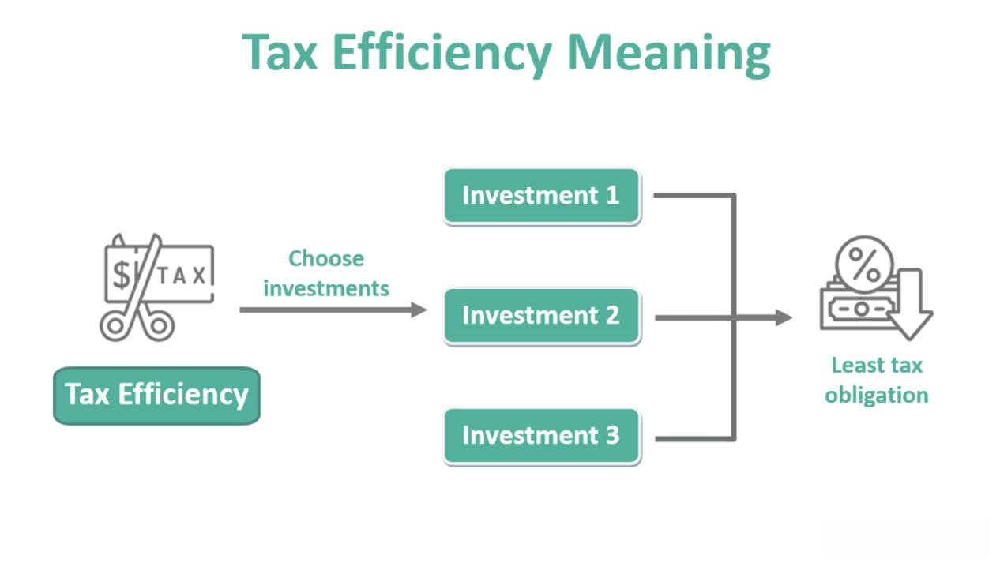

The interplay between taxes, investments, mutual funds, and algorithmic trading represents a critical confluence in modern finance, shaping the landscape of financial decision-making and portfolio management. These areas intersect in ways that can significantly influence both individual and institutional financial strategies. Understanding their interactions allows investors to optimize their portfolios for enhanced returns while managing tax liabilities effectively.

Mutual funds, a staple investment vehicle, offer diversification and professional management but come with tax implications that can impact net returns. Distributions from mutual funds, for instance, can be classified as ordinary income or capital gains, leading to different tax treatments. Investors are increasingly aware of how these tax liabilities can diminish their overall investment returns, prompting a need for strategies that mitigate such impacts.



Algorithmic trading, characterized by the use of computer algorithms to execute trades at high speeds and volumes, brings a new dimension to investment management. It offers the potential for enhanced efficiency and precision in executing trades and can be harnessed to achieve tax efficiencies. For example, algorithmic trading can be programmed to engage in tax-loss harvesting automatically, selling securities at a loss to offset gains, thereby reducing overall taxable income.

As these financial domains converge, several important questions arise: What are the specific tax implications for mutual fund investments? How can investors employ algorithmic trading to enhance their portfolio's tax efficiency? What are the best practices for developing a tax-efficient investment strategy while leveraging the technological advancements in trading?

Addressing these questions involves examining the foundational aspects of taxation on mutual funds, the strategic approaches to minimizing tax liabilities, and the cutting-edge use of technology in trading. As the financial world evolves, the importance of informed decision-making in these areas is growing, making it paramount for investors to stay abreast of trends and advancements. This article seeks to unravel the complexities at this juncture of finance, offering insights into optimizing investment strategies in a landscape where taxes, mutual funds, and algorithmic trading increasingly play a defining role.

## Table of Contents

## Understanding Taxes on Mutual Funds

Mutual fund distributions are a critical aspect of investment returns and are subject to taxation, an essential consideration for investors. Mutual fund distributions typically fall into two categories: ordinary income and capital gains. Ordinary income distributions comprise interest and dividends from securities within the fund. These are taxed at the investor’s marginal tax rate, which can vary based on their total taxable income. On the other hand, capital gains distributions occur when fund managers sell securities at a profit. These are either short-term or long-term, with the classification depending on how long the fund held the asset.

The holding duration significantly impacts the tax rates applied to capital gains distributions. Short-term capital gains, from assets held for one year or less, are taxed at ordinary income tax rates. In contrast, long-term capital gains, from assets held for more than one year, benefit from reduced tax rates. For instance, in the United States, long-term capital gains rates typically range from 0% to 20% depending on the investor’s tax bracket.

Calculating taxes for mutual fund investments involves determining the cost basis, which is the original value of the investment. The cost basis can be calculated using either the specific-share identification method, where investors select which shares to sell, or the average basis method, which computes an average cost for all shares. The formula for average basis is:

$$
\text{Average Basis per Share} = \frac{\text{Total Cost of Shares}}{\text{Number of Shares}}
$$

For accurate tax reporting, investors must understand relevant IRS forms, such as Form 1099-DIV. This form reports dividends and capital gains distributed to the investor over the year. Mutual funds provide this form annually, and it's crucial for completing tax returns. Investors need to report ordinary dividends in Box 1a and total capital gain distributions in Box 2a of the 1099-DIV. By understanding these taxation principles and related forms, investors can more effectively manage their portfolios and align their investment strategies with their tax obligations.

## Investment Strategies for Tax Efficiency

Minimizing tax liabilities through investments is a critical component of optimizing financial portfolios. One widely used strategy is tax-loss harvesting, which involves selling securities at a loss to offset capital gains taxes. This method can be particularly effective for mutual funds, as investors might encounter fluctuating asset values. Essentially, if the capital losses exceed the capital gains, investors can offset up to $3,000 of ordinary income ($1,500 if married filing separately) and [carry](/wiki/carry-trading) forward any unused losses to subsequent years. 

Another crucial aspect is investing in tax-efficient funds. These funds are designed to minimize taxes by reducing turnover and distributing lower dividends, thus maintaining more of the fund's earnings within the portfolio itself. Understanding fund distributions is vital, as distributions can shift an investor into a higher tax bracket, affecting their overall tax liability. 

Selecting the right mutual funds involves analyzing several factors:

1. **Turnover Rate**: Funds with lower turnover rates tend to be more tax-efficient, as they incur fewer capital gains distributions.

2. **Dividend Payouts**: Opt for funds that distribute qualified dividends, which are taxed at the capital gains rate rather than ordinary income rates.

3. **Tax Bracket Considerations**: Tailor investments according to the investor's tax bracket, which might involve holding certain funds in tax-advantaged accounts like IRAs or 401(k)s to defer taxes.

Furthermore, integrating funds like index funds and Exchange-Traded Funds (ETFs) can contribute to a tax-efficient strategy due to their passive nature and structural advantages in managing capital gains. By considering these factors, investors can strategically manage their portfolios to maximize their after-tax returns.

## The Role of Algorithmic Trading in Modern Investing

Algorithmic trading refers to the use of computer algorithms to execute trading orders systematically in financial markets. This automated trading strategy employs mathematical models and high-speed data analysis to make decisions and execute trades faster and more efficiently than human traders. The growing prevalence of [algorithmic trading](/wiki/algorithmic-trading) in financial markets has significantly transformed the landscape of investing. It is estimated that algorithmic trading accounts for a substantial portion of trading activity in major financial markets due to its efficiency and potential for profitability.

Algorithmic trading influences mutual fund performance and tax outcomes in several ways. By enabling rapid execution, it allows mutual funds to capitalize on short-lived financial opportunities, potentially improving returns. Moreover, algorithmic trading can enhance the tax efficiency of mutual funds by optimizing the timing of trades to manage tax liabilities. For example, algorithms can be programmed to sell losing positions at the end of a tax year to realize losses, which can then offset gains, a technique known as tax-loss harvesting.

Advanced strategies utilizing algorithmic trading aim to achieve tax-efficient goals by considering various tax implications when executing transactions. These algorithms can be constructed to [factor](/wiki/factor-investing) in capital gains tax rates and holding periods, optimizing trading actions to align with an investor's tax situation. For instance, an algorithm might delay the sale of a profitable position to qualify for long-term capital gains treatment, which is taxed at a lower rate than short-term gains.

There are several benefits of using algorithmic trading in mutual fund investments. Efficiency and speed are primary advantages, as they allow for the swift capture of trading opportunities and the minimization of human error. Algorithmic strategies can also analyze vast datasets, providing mutual funds with insights that are difficult to obtain manually. However, there are also risks associated with relying on algorithmic trading. High-frequency trading strategies can lead to market [volatility](/wiki/volatility-trading-strategies), and system failures or incorrect algorithms can result in significant financial losses. Additionally, the competitive nature of algorithmic trading requires continuous updates and improvements to maintain an edge, which can be resource-intensive.

In conclusion, the role of algorithmic trading in modern investing is multifaceted. It offers potential improvements in mutual fund performance and tax efficiency but also requires careful implementation and monitoring to mitigate inherent risks. As technology continues to evolve, algorithmic trading is likely to play an increasingly important role in shaping investment strategies and financial markets.

## Balancing Taxes and Returns: Mutual Funds and Algo Trading

Investors often face the challenge of balancing tax minimization with the pursuit of high returns. This balancing act is particularly relevant in the investment landscape involving mutual funds and algorithmic trading. The effective management of tax implications has become a pivotal aspect of financial decision-making, and mutual fund managers are increasingly turning to algorithmic trading tools to enhance both tax efficiency and overall fund performance.

### Leveraging Algorithmic Trading for Tax Efficiency

Mutual fund managers utilize algorithmic trading to make data-driven decisions that can optimize both return and tax outcomes. Algorithmic trading involves using computer algorithms to execute trades based on predetermined criteria. These algorithms can process large volumes of data at high speeds, allowing for timely and precise trade execution. This capability is advantageous for identifying tax-efficient trading opportunities, such as tax-loss harvesting, where algorithms can rapidly identify underperforming securities that can be sold to offset capital gains in a portfolio.

Python Example:
```python
import pandas as pd

# Example DataFrame with stock performance
portfolio = pd.DataFrame({
    'ticker': ['AAPL', 'MSFT', 'GOOGL', 'AMZN'],
    'purchase_price': [150, 200, 950, 3200],
    'current_price': [140, 250, 920, 3300],
    'shares': [10, 5, 2, 1]
})

# Function to calculate tax-loss harvesting opportunities
def tax_loss_harvest(portfolio, threshold=-0.05):
    portfolio['performance'] = (portfolio['current_price'] - portfolio['purchase_price']) / portfolio['purchase_price']
    losses = portfolio[portfolio['performance'] < threshold]
    return losses

# Identifying opportunities
opportunities = tax_loss_harvest(portfolio)
print(opportunities)
```

### Real-World Examples and Outcomes

Several mutual funds have successfully integrated algorithmic trading to manage tax implications effectively. For instance, funds that specialize in strategic tax-loss harvesting have achieved significant tax savings for their investors. These funds employ advanced algorithms to continually assess the performance of securities within the portfolio, executing trades that optimize the fund’s tax position without significantly impacting the desired asset allocation or risk level.

### Expert Opinions on the Future of Algorithmic Trading

Experts in the financial industry acknowledge the transformative impact of algorithmic trading on investment strategies. As algorithms become more sophisticated, their ability to handle complex tax scenarios improves, thus providing investors with more refined tools for maximizing after-tax returns. Industry professionals predict that the integration of [machine learning](/wiki/machine-learning) and [artificial intelligence](/wiki/ai-artificial-intelligence) into algorithmic trading will further enhance the precision and efficiency of tax management strategies, allowing for the automation of increasingly granular and customized investment decisions.

The future of algorithmic trading in mutual fund management is likely to focus on developing even greater capabilities for real-time data processing and decision-making, enabling fund managers to respond swiftly to market conditions and regulatory changes. This adaptability is crucial for maintaining tax efficiency amidst evolving tax laws that affect investment vehicles and individual investors alike.

Overall, the marriage of algorithmic trading and mutual fund management presents promising opportunities for achieving a balance between tax efficiency and return maximization. Investors and fund managers who effectively harness these tools are well-positioned to navigate the complexities of the financial markets while optimizing both their tax and investment outcomes.

## Conclusion

In this article, we have examined the intricate relationships between taxes, mutual funds, and algorithmic trading, underscoring their significance in contemporary financial decision-making. The taxation of mutual funds involves understanding the difference between ordinary income and capital gains, with holding durations influencing the applicable tax rates. Investment strategies focused on tax efficiency highlight the importance of mechanisms like tax-loss harvesting and the careful selection of tax-efficient funds. Together, these strategies play a crucial role in minimizing tax liabilities while maintaining robust investment returns.

Algorithmic trading has transformed investment landscapes with its ability to process vast amounts of data swiftly, executing trades that optimize for both performance and tax implications. The adoption of algorithmic strategies by mutual fund managers showcases an evolution toward enhancing tax efficiency and managing complex trading scenarios.

Informed decision-making is paramount amidst these complexities. Investors and fund managers must keep abreast of ever-evolving tax regulations and sophisticated trading strategies to optimize investment outcomes. Emerging trends, such as the integration of machine learning in algorithmic trading, promise novel opportunities but require vigilance and adaptability in strategy formulation.

Continuing education and professional financial advice are critical to mastering the convergence of taxes, investments, mutual funds, and algorithmic trading. Through continuous learning and strategic consultations, investors can craft investment portfolios that adeptly balance tax efficiency with the maximization of returns, ensuring informed pathways to financial goals.

## References & Further Reading

[1]: ["Mutual Fund Tax Guide 2023"](https://www.bairdassetmanagement.com/siteassets/pdfs/taxes/2023-tax-guide-baird.pdf) by Kiplinger

[2]: ["Tax-Efficient Strategies for Mutual Funds"](https://www.morningstar.com/funds/25-top-picks-tax-efficient-etfs-mutual-funds) by Investopedia

[3]: ["Algorithmic Trading"](https://www.investopedia.com/articles/active-trading/101014/basics-algorithmic-trading-concepts-and-examples.asp) by CFA Institute

[4]: ["Tax-Efficient Investing: The Essential Guide"](https://www.fidelity.com/bin-public/060_www_fidelity_com/documents/tax-efficient-investing-guide.pdf) by Morningstar

[5]: ["Handbook of High-Frequency Trading"](https://www.sciencedirect.com/book/9780128022054/handbook-of-high-frequency-trading) by Greg N. Gregoriou

[6]: ["The Structure, Regulation, and Performance of Pension Funds in Nine Industrial Countries"](https://documents.worldbank.org/en/publication/documents-reports/documentdetail/856081468767067608/the-structure-regulation-and-performance-of-pension-funds-in-nine-industrial-countries) edited by David Blake and Roger Ferguson