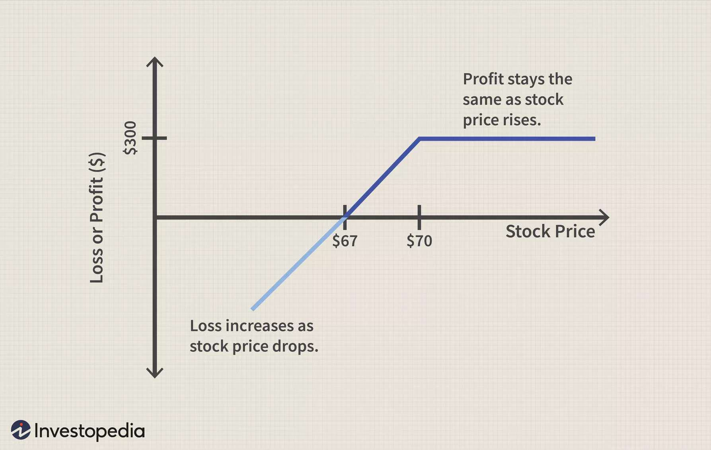

Options trading is an attractive investment strategy due to its potential to generate significant profits through various financial instruments, primarily call and put options. Call options provide the holder with the right to purchase an underlying asset at a predetermined price, while put options confer the right to sell. Despite their lucrative potential, a keen understanding of the tax implications associated with options trading is essential for traders aiming to maximize after-tax returns and maintain regulatory compliance.

This guide examines the complexities of options taxation, focusing on how call and put options are treated under tax law and assessing the impact of algorithmic trading on taxes. We aim to break down the various tax treatments applicable to options trading, highlighting strategies that can help minimize the tax burden on traders. Adherence to essential compliance tips provided in this article will also ensure that traders uphold the standards required by tax authorities.

For both novices and seasoned traders, navigating the intricate landscape of options taxation is crucial for optimizing trading profitability. The tax treatment of financial instruments like options can vary significantly depending on the holding period, the execution of trades, and specific trading activities. Understanding these distinctions can lead to strategic tax planning, which is imperative for maximizing returns.

Furthermore, in today's automated and fast-paced financial markets, algorithmic trading plays an increasing role. This high-frequency trading approach can lead to frequent taxable events, presenting unique challenges for traders in terms of tax compliance. Addressing these challenges through proper strategies is critical for adhering to tax laws while taking advantage of trading opportunities.

In conclusion, this article provides a comprehensive overview of options trading taxation designed to equip traders with essential knowledge and tools. Staying informed on tax regulations and leveraging strategic planning can significantly impact traders' overall profitability in the options market.

## Table of Contents

## Understanding Call and Put Options

Call and put options are fundamental components of the options trading landscape, offering traders the flexibility to capitalize on market movements without directly owning the underlying asset. Both types of options are derivative instruments, meaning their value is derived from an underlying asset, such as stocks, indices, or commodities.

### Call Options

A call option provides the holder with the right, but not the obligation, to purchase the underlying asset at a predetermined price, known as the strike price, within a specified time frame before the option expires. Traders typically buy call options when they anticipate that the price of the underlying asset will increase. The purchase of a call option allows them to lock in a purchase price, hoping the market price will rise above this level, resulting in a profit.

Mathematically, the profit from exercising a call option can be represented as:

$$
\text{Profit} = (\text{Market Price} - \text{Strike Price} - \text{Premium Paid}) \times \text{Number of Contracts}
$$

### Put Options

Conversely, a put option grants the holder the right, but not the obligation, to sell the underlying asset at the strike price, on or before the expiration date. Put options are acquired when traders speculate a decline in the asset's market price. By owning a put option, traders secure the ability to sell at the strike price, potentially selling above market value if prices fall.

The profit from exercising a put option is calculated by the formula:

$$
\text{Profit} = (\text{Strike Price} - \text{Market Price} - \text{Premium Paid}) \times \text{Number of Contracts}
$$

### Options as Derivatives

Options serve as derivatives because they derive their value from underlying assets. They allow traders to leverage movements in these assets without the need for full ownership, providing a capital-efficient means to express bullish or bearish market views. This derivation makes options a vital part of advanced trading strategies, offering hedging opportunities against market [volatility](/wiki/volatility-trading-strategies).

### Portfolio Diversification

In addition to speculation, call and put options are integral for portfolio diversification. They enable traders to mitigate risk through hedging strategies, which can protect against adverse price movements. For example, owning a put option can offset potential losses in a stock portfolio if market prices decline, acting as a form of insurance.

### Strategic Utilization

The effective use of call and put options hinges on strategic deployment. Key strategies include:

1. **Covered Call** - Selling call options on owned assets to generate income through premiums.

2. **Protective Put** - Buying put options to safeguard against downside risk in a portfolio.

3. **Straddle and Strangle** - Utilizing both call and put options to benefit from anticipated volatility, regardless of price direction.

Implementing these strategies requires careful analysis of market conditions, asset volatility, and trader expectations. By understanding and leveraging the unique features of call and put options, traders can enhance their opportunities for profit while managing risk effectively.

## Tax Treatment for Call Options

Call options are financial instruments that provide the holder the right but not the obligation to purchase an underlying asset at a predetermined price before expiration. The tax treatment of call options can vary significantly based on factors such as the holding period and whether the options are exercised or sold.

### Short-term vs. Long-term Gains

The classification of gains from call options into short-term or long-term has crucial tax implications. Generally, if a call option is held for less than a year, any resulting profit is considered a short-term capital gain, taxed at ordinary income rates. Conversely, if the option is held for more than a year, the gain is classified as a long-term capital gain, benefiting from lower tax rates.

### Calculation of Cost Basis and Capital Gains

The cost basis and capital gains for exercised call options require precise calculations. When a call option is exercised, the cost basis of the acquired stock becomes the sum of the option's strike price and the premium paid for the option. For example, if an investor purchases a call option for a premium of $200, with a strike price of $5,000, and exercises it, the cost basis of the underlying asset becomes:

$$
\text{Cost Basis} = \text{Strike Price} + \text{Premium} = 5000 + 200 = 5200 
$$

Capital gains are then determined by subtracting this cost basis from the sale price when the stock is eventually sold.

### Scenarios for Tax Implications

The tax implications depend on whether the option is exercised or sold. If the call option is sold before expiration, the profits are taxed as capital gains based on the holding period. On exercising the option, the holding period for the underlying asset then becomes crucial for determining the tax implications on future sales of stock.

For instance, if a call option held for 10 months is sold for a profit, the gain is taxed as a short-term capital gain. Alternatively, if the option is exercised and the stock is held longer than a year before sale, the gains from the eventual sale are treated as long-term.

### IRS Regulations and Income Tax Liabilities

Holders of call options must stay informed of IRS regulations, which provide specific guidelines for reporting and tax liabilities associated with options trading. The IRS requires that taxpayers accurately report these transactions, accounting for premiums paid, exercise actions, and resultant stock holdings. Inaccuracies or omissions can lead to penalties and additional tax liabilities.

It's critical for traders to document all option-related activities carefully. Maintaining detailed records assists in accurate tax reporting, ensuring compliance with IRS regulations. Consulting with tax professionals can further aid in aligning option strategies with an individual's tax situation, optimizing the overall tax outcome. Understanding these complex rules helps avoid unintended tax consequences and maximize the profitability of call option trading activities.

## Tax Treatment for Put Options

Put options are financial instruments that grant the holder the right, but not the obligation, to sell an underlying asset at a specified price within a given timeframe. They are essential tools for traders seeking to hedge risk or speculate on price movements. The taxation of put options is an intricate matter that requires careful consideration and understanding, particularly in comparison to call options.

### Comparison with Call Options

Put options and call options are taxed differently due to their opposite nature—while calls relate to buying, puts concern selling. Tax implications for both types can vary significantly depending on the specific actions taken, such as exercising the option or selling it before expiration. It is essential for traders to comprehend these differences as it affects the overall financial outcome and tax liabilities.

### Premiums and Commissions

When a put option is purchased, the premium paid contributes to the cost basis for tax purposes. This cost basis is crucial in determining capital gains or losses upon the option's sale or expiry. Commissions paid during the transaction also add to the overall cost basis. For example, if a put option's premium is $200 and the commission paid is $10, the total cost basis becomes $210.

### Scenarios for Put Option Taxation

1. **Option Sold Before Expiration**: If a put option is sold before its expiration date, any profit is typically considered a capital gain. The holding period—short-term or long-term—is determined by the length of time between the option's acquisition and its sale. A holding period of less than a year results in short-term capital gains, taxed at the ordinary income rate. Conversely, a holding period exceeding one year qualifies for long-term capital gains, subject to lower tax rates.

2. **Option Exercised**: Exercising a put option involves selling the underlying asset at the predetermined strike price. The difference between the strike price and the market price of the asset becomes the capital gain or loss. The premium paid for the option affects the overall gain or loss. For instance, if an underlying asset is sold for $100 (strike price) and its market price is $90, the investor experiences a gain. Adjustments must account for the initial premium to ascertain the taxable gain.

3. **Option Expired Worthless**: If a put option expires worthless, the premium paid is considered a capital loss, usable against capital gains from other transactions. If total capital losses exceed gains for the year, up to $3,000 (or $1,500 if married filing separately) of these losses can offset other income, with excess losses carried forward.

### Myths and Record-Keeping

A common misconception is that the treatment of put options automatically mirrors that of equities or that they are exempt from comprehensive reporting. However, the IRS requires meticulous documentation of all transactions involving derivatives, including put options. Keeping detailed records of transaction dates, premiums paid, commissions, and related expenses is paramount to avoid errors in tax reporting and potential penalties. Employing accounting software or consulting tax professionals can facilitate compliance and ensure precision in documentation.

In conclusion, understanding the taxation of put options is critical for traders aiming to maximize after-tax returns. By recognizing the nuances in tax treatment, considering the impact of premiums and commissions, exploring various scenarios, and maintaining accurate records, traders can navigate the complexities of put option taxation effectively.

## Algorithmic Trading and Taxation

Algorithmic trading, often referred to as algo trading, involves using algorithms to automate trading strategies. These algorithms, designed to execute a variety of trading strategies with speed and precision, have significantly increased their presence in the options market. Algorithmic trading enables traders to process large volumes of data and execute orders at speeds unattainable by humans. This high-speed trading environment can lead to frequent taxable events due to the sheer [volume](/wiki/volume-trading-strategy) of trades executed, each potentially resulting in short-term or long-term capital gains or losses.

In [algorithmic trading](/wiki/algorithmic-trading), the automated process can trigger numerous taxable events. For example, each buy or sell transaction of an option can lead to a reportable event for tax purposes. With the [high frequency](/wiki/high-frequency-trading) of trades that algorithmic systems can accomplish, traders may find themselves facing a complex array of taxable events and necessary documentation. Each trade's tax implications depend on factors such as the holding period, whether the trade is in qualified accounts, and the specific execution outcome.

High-frequency trading ([HFT](/wiki/high-frequency-trading-strategies)), a subset of algorithmic trading, presents unique tax challenges. This technique involves executing a large number of orders at extremely high speeds to capitalize on minute price discrepancies. Due to the frequency and volume of trades, record-keeping becomes critical. Traders using HFT strategies must ensure meticulous documentation to comply with IRS regulations. Moreover, HFT might result in predominantly short-term gains, taxed at a higher rate than long-term gains, thereby impacting the trader's net profit if not properly managed.

To minimize taxes in algorithmic trading, traders can employ several strategies. Utilizing tax-advantaged accounts, like IRAs, can shield algorithm-driven profits from immediate taxation, although constraints regarding withdrawals apply. Another method is tax-loss harvesting, which involves selling securities at a loss to offset the gains, thus reducing taxable income. Strategic timing of trades can also optimize the treatment of gains as long-term rather than short-term, benefitting from potentially lower tax rates. Additionally, traders should stay informed about wash sale rules that might disallow certain loss deductions if replacement positions are taken too soon.

Compliance with tax laws is crucial for algorithmic traders to avoid penalties and ensure efficient tax outcomes. This necessitates a keen understanding of tax regulations and proactive management of tax impacts throughout the trading year. Consulting with tax professionals who specialize in trading can provide invaluable assistance in navigating these complexities, ensuring that traders can focus on their strategies while maintaining compliance with tax obligations.

## Strategies for Minimizing Tax on Options Trading

Options traders often seek strategies to minimize the tax impact on their trading profits. Leveraging specific approaches can help optimize after-tax returns, providing financial advantages while maintaining compliance with tax regulations.

### Utilization of Tax-Advantaged Accounts

Tax-advantaged accounts, such as Individual Retirement Accounts (IRAs), present a viable option for minimizing tax liabilities. Trading options within these accounts can offer significant tax benefits. The primary advantage is the deferral or elimination of capital gains taxes until the time of withdrawal, which typically occurs at retirement. This deferral allows for the growth of investments without the immediate reduction of gains due to taxation, potentially leading to compounding benefits over time.

However, utilizing IRAs for options trading also has drawbacks. Contributions to these accounts are capped annually, limiting the amount of capital that can benefit from tax deferral. Additionally, the withdrawal of funds from these accounts before reaching retirement age can incur penalties, reducing overall profits. Thus, traders must consider the balance between immediate trading flexibility and long-term tax advantages.

### Tax-Loss Harvesting and Strategic Timing

Tax-loss harvesting is another effective strategy for minimizing taxes in options trading. This technique involves selling options at a loss to offset taxable gains within the same tax year. By deliberately realizing losses, traders can reduce their overall tax liability while maintaining an investment position by simultaneously repurchasing similar options. It's essential to adhere to the IRS wash-sale rule, which prohibits claiming a loss if a similar security is bought within 30 days before or after the sale.

Strategic timing of options trades also plays a key role in tax optimization. By carefully timing the sale or exercise of options, traders can control the holding period and potentially qualify for more favorable long-term capital gains tax rates.

### Professional Consultation

Consulting with tax professionals is highly recommended to develop tailored strategies that align with individual trading styles and objectives. Tax professionals can provide valuable insights into the nuances of the tax code and help ensure compliance with regulations. They can assist in identifying opportunities for tax optimization that may not be immediately apparent to the trader, particularly when navigating complex scenarios involving multiple trades and varying holding periods.

In conclusion, while options trading provides opportunities for profit, effectively minimizing tax liabilities requires a strategic approach. By utilizing tax-advantaged accounts, employing tax-loss harvesting, timing trades for optimal tax treatment, and seeking professional guidance, traders can enhance their after-tax profitability.

## Common Tax Mistakes and How to Avoid Them

Options trading, while potentially lucrative, poses numerous tax challenges that traders must navigate carefully to avoid common pitfalls. These mistakes can lead to substantial financial implications and possibly hinder the overall success of one's trading activities. Below, we outline prevalent errors made by traders and provide guidance on how to avoid them.

One significant mistake among options traders involves the wash sale rule. A wash sale occurs when an investor sells a security at a loss and repurchases the same or a substantially identical security within 30 days before or after the sale. Violating this rule prevents traders from realizing the capital loss for tax purposes, which can diminish the ability to offset gains. It's crucial for traders to maintain accurate records of purchase and sale dates for every security. To comply with the wash sale rule, consider staggering the purchase of similar securities or waiting beyond the 30-day window before repurchasing the same asset.

Proper documentation is another vital element in managing tax reporting. Traders frequently overlook the importance of maintaining detailed records of all transactions, including dates, prices, and associated fees. This comprehensive documentation streamlines the filing process and ensures that deductions and gains are accurately reported. Modern trading platforms often provide tools and statements that can aid in meticulous record-keeping.

Understanding IRS guidelines is essential in preventing unnecessary penalties. The IRS has specific guidelines regarding the tax treatment of options trading, and ignorance of these rules can lead to costly errors. For example, gains from call and put options are typically considered capital gains, but the characterization of these gains can vary based on holding periods and specific option strategies. Familiarizing oneself with these details, perhaps through IRS publications such as Publication 550, can be invaluable.

Education and awareness are paramount in mitigating tax-related risks. Staying informed about changes in tax law, especially those affecting options trading, can prevent misunderstandings and non-compliance. Consider attending workshops, engaging with educational resources, or consulting with tax professionals who specialize in options trading. These strategies not only prepare traders for current tax scenarios but can also provide insights into optimizing future transactions for favorable tax outcomes.

By recognizing and addressing these common tax mistakes, options traders can significantly enhance their after-tax returns and ensure compliance with tax regulations, thereby safeguarding the profitability of their trading activities.

## Conclusion

Understanding the tax implications of options trading is fundamental for traders striving to maximize after-tax returns. Effective strategic tax planning is not merely beneficial but essential. Options trading, while potentially lucrative, presents complex tax challenges that can significantly influence overall profitability. By regularly updating their knowledge of tax regulations, traders can better anticipate and respond to changes that may affect their strategies.

Tax regulations surrounding options trading are complex and ever-evolving. This complexity underscores the necessity for traders to remain informed about current tax laws and regulations. Staying abreast of these developments enables traders to adapt their strategies accordingly, ensuring compliance and reducing the risk of inadvertently incurring penalties.

Moreover, while the potential gains from options trading are attractive, the impact of taxation can be substantial. Strategic planning to address tax obligations is crucial to optimizing net returns. This includes considering the tax treatment of various trading activities and exploring strategies like tax-loss harvesting, strategic timing of trades, and the use of tax-advantaged accounts.

Given the intricacy of tax regulations and the potential for substantial financial implications, seeking expert advice is advisable. Tax professionals can provide valuable insights tailored to individual trading styles and financial goals. Their expertise can help traders navigate the complexities of options taxation, ensuring both compliance and optimization of trading outcomes. Overall, the careful consideration of tax matters is a vital component of a successful options trading strategy.

## References & Further Reading

[1]: Cleary, J. (2020). ["Understanding Taxation of Derivatives and Legal Compliance."](https://www.researchgate.net/publication/364351431_Using_behavioural_economics_to_understand_tax_compliance) Investopedia.

[2]: Fabozzi, F. J., & Modigliani, F. (2009). ["Capital Markets: Institutions and Instruments."](https://www.amazon.com/Capital-Markets-Institutions-Instruments-Management/dp/0262029480) Prentice Hall.

[3]: Hull, J. C. (2017). ["Options, Futures, and Other Derivatives."](https://www.semanticscholar.org/paper/Options%2C-Futures%2C-and-Other-Derivatives-Hull/89bdee500c8623864fc9eb7a471546aa713acc44) Pearson.

[4]: IRS. (2021). ["Publication 550: Investment Income and Expenses."](https://www.irs.gov/publications/p550) Internal Revenue Service.

[5]: Lucas, G. E., & Hazelbaker, A. D. (2019). ["Taxation of Financial Derivatives: Impact of the Tax Cuts and Jobs Act."](https://www.sciencedirect.com/science/article/pii/S1094202521000600) New York State Bar Association.

[6]: "Taxation of Securities Transactions and Strategies." (2022). In ["Guidebook to Corporate Securities Laws."](https://papers.ssrn.com/sol3/papers.cfm?abstract_id=3790804) Practising Law Institute.