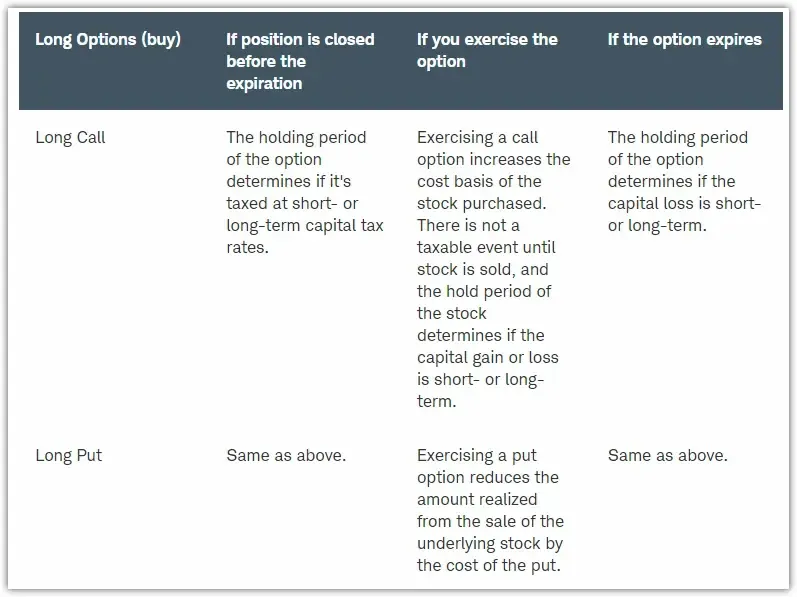

## Table of Contents

## What are call and put options?

A call option is a financial contract that gives you the right, but not the obligation, to buy a specific stock at a set price within a certain time. Imagine you think a stock's price will go up. You can buy a call option to purchase that stock at today's price. If the stock price does go up, you can buy it at the lower price you locked in with the option, and then sell it at the higher market price to make a profit.

A put option is the opposite of a call option. It gives you the right, but not the obligation, to sell a specific stock at a set price within a certain time. If you think a stock's price will go down, you can buy a put option. This allows you to sell the stock at a higher price than the market price if it does drop. This way, you can make money from the falling stock price or protect other investments you own from losing too much value.

## How do call and put options work in the stock market?

When you buy a call option, you're betting that the price of a stock will go up. You pay a fee, called a premium, to get the right to buy the stock at a certain price, called the strike price, before a specific date. If the stock's price goes above the strike price, you can buy the stock at the lower strike price and then sell it at the higher market price to make a profit. If the stock's price doesn't go up, you don't have to buy it, and you only lose the premium you paid for the option.

On the other hand, when you buy a put option, you're betting that the price of a stock will go down. You also pay a premium to get the right to sell the stock at the strike price before the expiration date. If the stock's price falls below the strike price, you can buy the stock at the lower market price and then sell it at the higher strike price to make a profit. If the stock's price doesn't drop, you don't have to sell it, and you only lose the premium you paid for the option. Both call and put options give you flexibility and can be used to make money or protect other investments.

## What is the basic tax treatment of call and put options?

When you make money from call and put options, you have to pay taxes on your profits. The tax rules can be a bit complicated, but basically, if you hold the option for less than a year before selling it, any profit you make is considered a short-term capital gain. Short-term capital gains are taxed at the same rate as your regular income, which could be anywhere from 10% to 37% depending on how much money you make.

If you hold the option for more than a year before selling it, the profit is considered a long-term capital gain. Long-term capital gains are usually taxed at a lower rate than short-term gains, typically 0%, 15%, or 20%, depending on your income. Remember, you can also use losses from options to offset gains, which can help reduce your tax bill. It's always a good idea to talk to a tax professional to understand how these rules apply to your specific situation.

## How are gains and losses from options classified for tax purposes?

When you make money or lose money from trading options, the tax rules depend on how long you hold them. If you buy an option and sell it within a year, any profit you make is called a short-term capital gain. This is taxed at the same rate as your regular income, which can be anywhere from 10% to 37% depending on how much money you earn. If you lose money on the option, it's a short-term capital loss, which you can use to reduce your taxes by offsetting other gains or up to $3,000 of your regular income each year.

If you hold an option for more than a year before selling it, any profit you make is called a long-term capital gain. Long-term capital gains are usually taxed at a lower rate than short-term gains, typically at 0%, 15%, or 20%, depending on your income. If you have a loss on an option you held for more than a year, it's a long-term capital loss. You can use this loss to offset long-term gains first, and then short-term gains, and if there's still a loss left, you can use up to $3,000 of it to reduce your regular income each year.

## What is the difference between short-term and long-term capital gains on options?

When you make money from options, the tax you pay depends on how long you hold them. If you buy an option and sell it within a year, any profit you make is called a short-term capital gain. This is taxed at the same rate as your regular income, which can be anywhere from 10% to 37% depending on how much money you earn. So, if you're in a higher tax bracket, you'll pay more tax on these gains.

If you hold an option for more than a year before selling it, any profit you make is called a long-term capital gain. Long-term capital gains are usually taxed at a lower rate than short-term gains, typically at 0%, 15%, or 20%, depending on your income. This means if you can hold onto your options for over a year, you might pay less in taxes on your profits.

## How does the wash sale rule apply to options trading?

The wash sale rule is something you need to know if you trade options. It says that if you sell an option at a loss and buy a similar option within 30 days before or after the sale, you can't use that loss to lower your taxes right away. The idea is to stop people from selling at a loss just to get a tax break and then quickly buying the same thing back.

Instead, the loss from the sale gets added to the cost of the new option you bought. This means you'll have a higher cost basis for the new option, which could affect how much tax you pay when you eventually sell it. It's important to keep track of your trades and know the rules so you don't get surprised at tax time.

## What are the tax implications of exercising an option?

When you exercise an option, you need to think about taxes. If you exercise a call option, you buy the stock at the strike price. The difference between the strike price and the market price of the stock at the time you exercise is considered a capital gain. If you've held the option for less than a year, this gain is a short-term capital gain and is taxed at your regular income tax rate, which can be from 10% to 37%. If you've held the option for more than a year, it's a long-term capital gain, taxed at a lower rate of 0%, 15%, or 20%, depending on your income.

Exercising a put option works a bit differently. When you exercise a put option, you sell the stock at the strike price. If the market price is lower than the strike price, the difference is a capital gain. Just like with call options, if you've held the put option for less than a year, the gain is taxed as a short-term capital gain at your regular income tax rate. If you've held it for more than a year, it's a long-term capital gain with a lower tax rate. Remember, the tax rules can be tricky, so it's a good idea to talk to a tax professional to make sure you're doing everything right.

## How does the tax treatment differ for options held in an IRA versus a taxable account?

When you trade options in a taxable account, you have to pay taxes on any profits you make. If you hold an option for less than a year and then sell it or exercise it for a profit, that profit is a short-term capital gain and gets taxed at your regular income tax rate, which can be from 10% to 37%. If you hold the option for more than a year, the profit is a long-term capital gain, which is usually taxed at a lower rate of 0%, 15%, or 20%, depending on your income. You also have to report any losses and follow rules like the wash sale rule, which can affect how much tax you owe.

In an IRA, things are different. You don't have to pay taxes on any profits you make from options while they're in the IRA. This means you can buy and sell options, and any gains or losses won't affect your taxes right away. However, when you take money out of the IRA, you'll have to pay taxes on it as regular income, no matter how long you held the options. This can be a big advantage if you think your tax rate will be lower in the future, but it's important to think about your overall retirement plan and talk to a financial advisor to make the best choice for you.

## What are the tax consequences of writing options?

When you write an option, you're the one selling it to someone else. If you write a call option and the buyer decides to exercise it, you have to sell the stock at the strike price. If the stock's market price is higher than the strike price, you'll make a profit, but you'll have to pay taxes on that profit. If the stock's price is lower than the strike price, you'll have a loss, which you can use to reduce your taxes. The tax you pay depends on how long you held the stock before writing the option. If it was less than a year, any profit or loss is a short-term capital gain or loss, taxed at your regular income tax rate. If it was more than a year, it's a long-term capital gain or loss, taxed at a lower rate.

Writing a put option means you're promising to buy the stock at the strike price if the buyer exercises the option. If the stock's market price is lower than the strike price when the option is exercised, you'll have a loss because you're buying the stock at a higher price than it's worth. If the stock's price is higher than the strike price, you'll make a profit. Just like with call options, the tax you pay depends on how long you held the option. Short-term gains or losses are taxed at your regular income tax rate, and long-term gains or losses are taxed at a lower rate. Remember, any premiums you get from writing options are also considered income and are taxed at your regular income tax rate.

## How do straddles and other complex options strategies affect taxation?

When you use complex options strategies like straddles, the tax rules can get a bit tricky. A straddle is when you buy a call option and a put option on the same stock at the same time. The idea is to make money whether the stock's price goes up or down. But for tax purposes, the IRS has special rules for straddles. If you have a loss on one part of the straddle, you can't use that loss to lower your taxes right away. Instead, you have to wait until you close out the whole straddle, or until the end of the year, to see if you can use the loss.

Other complex options strategies, like spreads or collars, also have special tax rules. A spread involves buying and selling options of the same type but with different strike prices or expiration dates. A collar is when you buy a put option and sell a call option on the same stock to limit your risk. With these strategies, you need to keep track of all the different parts because the tax treatment can depend on how you put the strategy together and how long you hold each part. It's a good idea to talk to a tax professional to make sure you're following all the rules and taking advantage of any tax benefits you can.

## What are the reporting requirements for options trading on tax returns?

When you trade options, you need to report your gains and losses on your tax return. You do this on Schedule D, which is part of your Form 1040. On Schedule D, you list all your capital gains and losses, separating them into short-term and long-term categories. Short-term gains and losses are from options you held for less than a year, and long-term are from options you held for more than a year. You also need to fill out Form 8949, which gives more details about each transaction, like the date you bought and sold the option, the cost, and the sale price.

The IRS requires you to keep good records of all your options trades. This includes the date you bought and sold each option, the strike price, the premium you paid or received, and any other costs like commissions. If you write options, you need to report the premiums you received as income on your tax return. If you have losses, you might need to deal with the wash sale rule, which can affect when you can use those losses to lower your taxes. It's a good idea to keep all your trade confirmations and statements, and maybe even use tax software or a tax professional to help you report everything correctly.

## How can tax strategies be optimized for active options traders?

Active options traders can optimize their tax strategies by paying attention to how long they hold their options. If you can hold an option for more than a year before selling it, any profit you make is considered a long-term capital gain. These gains are taxed at a lower rate than short-term gains, which are taxed at your regular income tax rate. So, if you think you can wait a bit longer before selling, you might save on taxes. Another strategy is to use losses to offset gains. If you have a loss on one trade, you can use it to lower the taxes you owe on other gains. Just be careful about the wash sale rule, which says you can't use a loss if you buy a similar option within 30 days before or after selling at a loss.

Another way to optimize your tax strategy is to keep good records of all your trades. This helps you report everything correctly on your tax return and can make it easier to find losses to offset gains. You might also consider using tax software or working with a tax professional who knows about options trading. They can help you make the most of the tax rules and find ways to save money. For example, if you write options, the premiums you receive are taxed as income, so you might want to think about how that fits into your overall tax plan.

## What are Call and Put Options and How Do They Work?

Call and put options are fundamental components of the options trading landscape, offering traders the flexibility to capitalize on market movements without directly owning the underlying asset. Both types of options are derivative instruments, meaning their value is derived from an underlying asset, such as stocks, indices, or commodities.

### Call Options

A call option provides the holder with the right, but not the obligation, to purchase the underlying asset at a predetermined price, known as the strike price, within a specified time frame before the option expires. Traders typically buy call options when they anticipate that the price of the underlying asset will increase. The purchase of a call option allows them to lock in a purchase price, hoping the market price will rise above this level, resulting in a profit.

Mathematically, the profit from exercising a call option can be represented as:

$$
\text{Profit} = (\text{Market Price} - \text{Strike Price} - \text{Premium Paid}) \times \text{Number of Contracts}
$$

### Put Options

Conversely, a put option grants the holder the right, but not the obligation, to sell the underlying asset at the strike price, on or before the expiration date. Put options are acquired when traders speculate a decline in the asset's market price. By owning a put option, traders secure the ability to sell at the strike price, potentially selling above market value if prices fall.

The profit from exercising a put option is calculated by the formula:

$$
\text{Profit} = (\text{Strike Price} - \text{Market Price} - \text{Premium Paid}) \times \text{Number of Contracts}
$$

### Options as Derivatives

Options serve as derivatives because they derive their value from underlying assets. They allow traders to leverage movements in these assets without the need for full ownership, providing a capital-efficient means to express bullish or bearish market views. This derivation makes options a vital part of advanced trading strategies, offering hedging opportunities against market [volatility](/wiki/volatility-trading-strategies).

### Portfolio Diversification

In addition to speculation, call and put options are integral for portfolio diversification. They enable traders to mitigate risk through hedging strategies, which can protect against adverse price movements. For example, owning a put option can offset potential losses in a stock portfolio if market prices decline, acting as a form of insurance.

### Strategic Utilization

The effective use of call and put options hinges on strategic deployment. Key strategies include:

1. **Covered Call** - Selling call options on owned assets to generate income through premiums.

2. **Protective Put** - Buying put options to safeguard against downside risk in a portfolio.

3. **Straddle and Strangle** - Utilizing both call and put options to benefit from anticipated volatility, regardless of price direction.

Implementing these strategies requires careful analysis of market conditions, asset volatility, and trader expectations. By understanding and leveraging the unique features of call and put options, traders can enhance their opportunities for profit while managing risk effectively.

## What is the Tax Treatment for Call Options?

Call options are financial instruments that provide the holder the right but not the obligation to purchase an underlying asset at a predetermined price before expiration. The tax treatment of call options can vary significantly based on factors such as the holding period and whether the options are exercised or sold.

### Short-term vs. Long-term Gains

The classification of gains from call options into short-term or long-term has crucial tax implications. Generally, if a call option is held for less than a year, any resulting profit is considered a short-term capital gain, taxed at ordinary income rates. Conversely, if the option is held for more than a year, the gain is classified as a long-term capital gain, benefiting from lower tax rates.

### Calculation of Cost Basis and Capital Gains

The cost basis and capital gains for exercised call options require precise calculations. When a call option is exercised, the cost basis of the acquired stock becomes the sum of the option's strike price and the premium paid for the option. For example, if an investor purchases a call option for a premium of $200, with a strike price of $5,000, and exercises it, the cost basis of the underlying asset becomes:

$$
\text{Cost Basis} = \text{Strike Price} + \text{Premium} = 5000 + 200 = 5200 
$$

Capital gains are then determined by subtracting this cost basis from the sale price when the stock is eventually sold.

### Scenarios for Tax Implications

The tax implications depend on whether the option is exercised or sold. If the call option is sold before expiration, the profits are taxed as capital gains based on the holding period. On exercising the option, the holding period for the underlying asset then becomes crucial for determining the tax implications on future sales of stock.

For instance, if a call option held for 10 months is sold for a profit, the gain is taxed as a short-term capital gain. Alternatively, if the option is exercised and the stock is held longer than a year before sale, the gains from the eventual sale are treated as long-term.

### IRS Regulations and Income Tax Liabilities

Holders of call options must stay informed of IRS regulations, which provide specific guidelines for reporting and tax liabilities associated with options trading. The IRS requires that taxpayers accurately report these transactions, accounting for premiums paid, exercise actions, and resultant stock holdings. Inaccuracies or omissions can lead to penalties and additional tax liabilities.

It's critical for traders to document all option-related activities carefully. Maintaining detailed records assists in accurate tax reporting, ensuring compliance with IRS regulations. Consulting with tax professionals can further aid in aligning option strategies with an individual's tax situation, optimizing the overall tax outcome. Understanding these complex rules helps avoid unintended tax consequences and maximize the profitability of call option trading activities.

## References & Further Reading

[1]: Cleary, J. (2020). ["Understanding Taxation of Derivatives and Legal Compliance."](https://www.researchgate.net/publication/364351431_Using_behavioural_economics_to_understand_tax_compliance) Investopedia.

[2]: Fabozzi, F. J., & Modigliani, F. (2009). ["Capital Markets: Institutions and Instruments."](https://www.amazon.com/Capital-Markets-Institutions-Instruments-Management/dp/0262029480) Prentice Hall.

[3]: Hull, J. C. (2017). ["Options, Futures, and Other Derivatives."](https://www.semanticscholar.org/paper/Options%2C-Futures%2C-and-Other-Derivatives-Hull/89bdee500c8623864fc9eb7a471546aa713acc44) Pearson.

[4]: IRS. (2021). ["Publication 550: Investment Income and Expenses."](https://www.irs.gov/publications/p550) Internal Revenue Service.

[5]: Lucas, G. E., & Hazelbaker, A. D. (2019). ["Taxation of Financial Derivatives: Impact of the Tax Cuts and Jobs Act."](https://www.sciencedirect.com/science/article/pii/S1094202521000600) New York State Bar Association.

[6]: "Taxation of Securities Transactions and Strategies." (2022). In ["Guidebook to Corporate Securities Laws."](https://papers.ssrn.com/sol3/papers.cfm?abstract_id=3790804) Practising Law Institute.