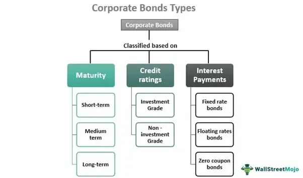

Corporate bond investments represent a fundamental component of the global financial market, serving as a pivotal mechanism for enterprises seeking to raise capital. At its core, a corporate bond is a debt instrument issued by a company to investors, offering a fixed rate of interest over a specified period. This contractual obligation allows companies to secure the necessary funding for growth, expansion, and operational needs, while providing investors with a relatively predictable stream of income.

Corporate bonds play a crucial role in a diversified investment portfolio. They typically offer higher yields than government securities, reflecting the increased risk associated with corporate creditworthiness. By integrating corporate bonds, investors can achieve a balance between risk and return, enhancing the stability of their portfolios when juxtaposed with equities or more volatile asset classes.



A fundamental aspect of corporate bond investments is understanding bond taxation. Bondholders are typically subject to taxation on interest income, as well as potential capital gains or losses resulting from the bond's sale. Moreover, original issue discounts may create additional tax considerations, influencing the overall investment yield. The tax implications of holding corporate bonds, therefore, hold significant sway over the investor's net returns and require meticulous planning to optimize the after-tax yield.

Moreover, the emergence of algorithmic trading (often referred to as algo trading) has transformed the landscape of bond markets. This method utilizes computer algorithms to execute trades based on pre-defined criteria, enabling rapid and efficient trade execution. In the context of the bond market, algorithmic trading can enhance liquidity and price discovery, offering investors potential advantages in terms of timing and execution costs.

Recognizing the significance of taxes in bond investments is essential for maximizing returns. Strategies that focus on tax-efficient bond selection and trading can lead to substantial improvements in net investment outcomes. Algorithmic trading, coupled with tax-efficient strategies, can potentially streamline decision-making processes, optimize trade execution, and curtail transaction costs, thereby heightening the attractiveness of corporate bonds as an investment vehicle.

## Table of Contents

## What Are Corporate Bonds?

Corporate bonds are debt securities issued by corporations to raise capital for various purposes, such as expanding operations, refinancing existing debt, or funding new projects. Unlike equity securities, which provide ownership in a company, corporate bonds represent a loan made by an investor to a corporation. The corporation agrees to pay back the principal amount on a specified maturity date and to provide periodic interest payments, known as coupon payments, to the bondholder.

The characteristics of corporate bonds include their maturity, credit quality, and [interest rate](/wiki/interest-rate-trading-strategies) structure. Maturity refers to the date on which the bond's principal amount is due to be repaid. Maturities can vary significantly, typically ranging from short-term bonds with maturities of less than five years to long-term bonds with maturities exceeding ten years. Credit quality is assessed by rating agencies, such as Moody’s and Standard & Poor’s, which evaluate the issuer's ability to meet its debt obligations. Ratings range from investment-grade (low risk of default) to junk bonds (higher default risk). The interest rate on a corporate bond can be fixed, floating, or variable, reflecting either a consistent payment, adjustments at specified intervals, or a link to financial benchmarks.

Corporate bonds stand out among other bond types, such as government and municipal bonds, due to their higher yield potential and higher risk. Government bonds, like U.S. Treasury bonds, are considered low-risk and are often used as a benchmark for measuring other investments' risk-return tradeoffs. Municipal bonds, issued by local governments, typically offer tax advantages that corporate bonds do not. However, corporate bonds usually offer higher yields to compensate for increased credit risk compared to government-issued bonds.

In corporate finance, corporate bonds play a crucial role in providing access to essential capital outside of traditional equity raising mechanisms. They allow businesses to secure large sums of money by borrowing from a broad pool of investors, enabling firms to implement growth and expansion strategies without diluting existing shareholders’ equity. Companies use this form of debt to optimize their capital structure, balancing debt and equity finances to minimize the overall cost of capital and maximize firm value.

Nevertheless, investing in corporate bonds involves specific risk factors that investors must consider. Credit risk is a primary concern, as the financial health of the issuing corporation impacts its ability to meet coupon payments and repay the principal. A bondholder risks losing part or all of the invested capital if the issuer defaults. Interest rate risk also affects corporate bonds—rising interest rates can lead to falling bond prices, reducing the value of an investment before maturity. Additionally, [liquidity](/wiki/liquidity-risk-premium) risk can be significant, as corporate bonds sometimes trade less frequently than government securities, potentially affecting the ease with which investors can buy or sell the bonds.

Corporate bonds offer higher potential returns than many other types of fixed-income investments. However, they require careful analysis of associated risks, including issuers' creditworthiness and broader market conditions.

## Taxation of Corporate Bonds

Corporate bonds are subject to several types of taxation, which can significantly affect their overall investment yield. Investors should be aware of these tax implications to manage their portfolios effectively.

### Explanation of How Corporate Bonds Are Taxed

1. **Interest Income Taxation**: The interest earned on corporate bonds is typically subject to federal and state income taxes. This contrasts with municipal bonds, where the interest income is often exempt from federal taxes and sometimes state taxes if the investor resides in the issuing state. The interest income from corporate bonds is added to the investor’s ordinary income and taxed at their respective income tax rate.

2. **Capital Gains Taxation**: If an investor sells a corporate bond before it matures, any profit (or loss) realized is subject to capital gains taxes. If the bond was held for more than a year, the gains are considered long-term and taxed at a reduced rate compared to short-term gains, which are taxed at the ordinary income rate. The formula for capital gain is:
$$
   \text{Capital Gain} = \text{Selling Price} - \text{Purchase Price}

$$

3. **Original Issue Discount (OID) Taxation**: Some bonds are issued at a discount to their face value. The difference between the discounted purchase price and the face value is known as the Original Issue Discount. The Internal Revenue Service (IRS) treats this discount as taxable interest income, which accrues annually. Investors must report and pay taxes on this imputed interest each year, even if no cash is received, under the accrual taxation method.

### Comparing Tax Implications with Other Types of Bonds

Corporate bonds generally bear higher tax burdens compared to other bonds like municipal and Treasury bonds, primarily due to the taxability of interest income. Municipal bonds offer significant tax advantages, as their interest is often exempt from federal and possibly state taxes. Treasury bonds, while subject to federal taxes, are exempt from state and local taxes. This provides Treasury bonds with a tax benefit over corporate bonds, particularly for investors in states with high income tax rates.

### Impact of Bond Taxation on Investment Yield

The taxation of corporate bonds has a direct impact on their net yield, which can be calculated using the formula:

$$
\text{Net Yield} = \text{Gross Yield} \times (1 - \text{Tax Rate})
$$

Where the gross yield is the annual return on the bond before taxes are considered. For instance, if a corporate bond offers a gross yield of 5% and the investor is in a 25% tax bracket, the net yield would be:

$$
\text{Net Yield} = 5\% \times (1 - 0.25) = 3.75\%
$$

This reduced yield highlights the importance of considering tax efficiency in bond investing. Effective tax management strategies, such as holding bonds in tax-advantaged accounts or utilizing tax-loss harvesting, can help investors mitigate the negative impact of taxes and preserve investment returns.

## Corporate Bonds vs. Other Bonds

Corporate bonds are a significant component of the bond market, offering different tax implications compared to municipal and treasury bonds. Understanding these distinctions is crucial for investors aiming to optimize their portfolios.

### Tax Advantages and Disadvantages

**Corporate Bonds:** Interest earned from corporate bonds is subject to federal taxation and may also be taxed at the state and local levels. This lack of tax-exempt status distinguishes them from some other bond types but can offer higher yields to compensate for the tax burden.

**Municipal Bonds:** Generally offer tax-exempt interest at the federal level, and often at the state and local levels if the investor resides in the state where the bond is issued. This tax-exempt status can significantly enhance the after-tax yield for investors, particularly those in higher tax brackets.

**Treasury Bonds:** Issued by the federal government, these are subject to federal taxes but are exempt from state and local taxes. This attribute can make them attractive to investors in states with high income taxes.

### Implications of State and Federal Taxes

State and federal taxes play a critical role in determining the true return on bond investments. For instance, an investor in a high-tax state may find municipal bonds more favorable due to their state tax exemptions. Conversely, the lack of state tax on treasury bonds can be a selling point in high-tax environments.

For corporate bonds, the absence of tax exemptions means investors need to carefully calculate the after-tax yield to understand their net returns. Using a simple formula, the after-tax yield is calculated as:

$$
\text{After-tax Yield} = \text{Yield} \times (1 - \text{Tax Rate})
$$

### Yield Comparisons and Default Risks

**Yield Comparison:** Corporate bonds typically offer higher yields compared to municipal and treasury bonds. This is largely a reflection of the higher risk associated with lending to corporations. Treasury bonds generally offer the lowest yields due to their virtually zero default risk, while municipal bonds fall somewhere in between depending on the issuing municipality’s credit rating.

**Default Risks:** 

- **Corporate Bonds:** Carry a default risk associated with the issuing company’s financial health. Investors demand higher yields as compensation for this risk. Companies with lower credit ratings (junk bonds) offer even higher yields but come with significantly higher default risks.

- **Municipal Bonds:** Generally considered lower risk than corporate bonds but higher than treasury bonds. The default risk varies with the financial stability of the issuing municipality.

- **Treasury Bonds:** Widely regarded as the safest investment with minimal default risk, especially in countries like the United States where government backing is strong.

Understanding these factors allows investors to tailor their bond investments according to their risk tolerance and tax situation, ensuring a more strategic approach to portfolio diversification.

## Algorithmic Trading in Corporate Bonds

Algorithmic trading refers to the use of computer algorithms to manage the trading process, allowing for the execution of trades with speed and efficiency that is unattainable through traditional manual trading. In bond markets, [algorithmic trading](/wiki/algorithmic-trading) is gaining [momentum](/wiki/momentum) as it provides a systematic approach to trading based on pre-defined criteria, data analysis, and automated execution.

### Overview of Algorithmic Trading in Bond Markets

Algorithmic trading in corporate bonds involves using algorithms to automate the trading process, determine optimal trading strategies, and execute trades at the best possible prices. It leverages vast amounts of data to make quick decisions, benefiting from real-time market information and historical data analysis. This implementation has become increasingly important as the bond market grows in complexity and [volume](/wiki/volume-trading-strategy), necessitating advanced approaches to manage liquidity, pricing, and risk.

### Improvements in Investment Strategies and Efficiency

Algorithmic trading can significantly enhance investment strategies by providing improved price discovery, liquidity management, and reduced execution costs. Computational algorithms analyze massive datasets to predict market trends and identify trading opportunities faster than a human could. With algorithmic trading, investment managers can execute large volumes of trades without causing significant market impact, thereby preserving intended investment strategies and returns. Furthermore, enhancements in efficiency lead to narrow bid-ask spreads and lower transaction costs, increasing net returns for investors.

### Challenges and Opportunities

Despite its advantages, algorithmic trading in bond markets presents several challenges. Bonds are often less liquid than stocks, and the market has high fragmentation, which can complicate the algorithm's efficiency. Additionally, developing effective algorithms requires significant expertise and investment in technology infrastructure. Ensuring regulatory compliance and managing operational risks also add to the complexity of implementing algorithmic trading systems.

However, these challenges come with opportunities. Advances in [artificial intelligence](/wiki/ai-artificial-intelligence) and [machine learning](/wiki/machine-learning) present new possibilities for developing sophisticated algorithms that can learn and adapt to changing market conditions. Furthermore, the continuous evolution of electronic trading platforms expands access to data and analytical tools, empowering traders to devise more refined and adaptive trading strategies.

### Impact of Technological Advancements

Technological advancements play a crucial role in the ongoing development of algorithmic trading in corporate bonds. Innovations such as high-frequency trading ([HFT](/wiki/high-frequency-trading-strategies)), peer-to-peer (P2P) trading platforms, and blockchain technology are transforming how trades are conducted and settled. High-frequency trading enables traders to capitalize on minute price discrepancies across markets, while blockchain technology introduces greater transparency and security into transactions.

Moreover, cloud computing and big data analytics facilitate the management and analysis of large datasets required for algorithmic trading. As data volumes grow, these technologies provide scalability and processing power necessary for developing and executing complex trading algorithms. Enhanced data storage and processing capabilities enable traders to refine algorithms continuously, thus optimizing trading performance in the bond market.

In summary, algorithmic trading has become an integral component of modern bond markets, offering enhancements in strategy and efficiency while presenting challenges and opportunities tied closely to technological progress.

## Tax Efficient Strategies for Bond Investments

Optimizing the tax implications of corporate bond investments requires strategic planning and an understanding of available opportunities within the tax code. Corporate bonds are often subject to various forms of taxation, such as interest income tax and capital gains tax, which can significantly impact the overall yield. However, investors can utilize several strategies to mitigate these tax liabilities and enhance after-tax returns.

One effective strategy is to explore tax deferral opportunities. Investors can delay paying taxes on capital gains by holding bonds until maturity, thus deferring the tax event. This approach allows interest to compound over time without the immediate burden of capital gains taxes, potentially resulting in a higher overall yield.

Investors might also consider tax-exempt bonds. While corporate bonds do not inherently offer tax exemptions, they can be strategically combined with other tax-exempt investments, such as municipal bonds, to create a more tax-efficient portfolio. Municipal bonds often offer tax-free interest at both the federal and state levels, depending on the investor's residence, which can complement the taxable income from corporate bonds.

Algorithmic trading offers another avenue to enhance tax efficiency in bond investments. By incorporating automated trading strategies, investors can optimize the timing of trades to manage tax liabilities. For instance, algorithmic trading systems can be programmed to execute tax-loss harvesting—a strategy that involves selling securities at a loss to offset capital gains. This approach can be particularly beneficial in volatile markets, where algorithms can swiftly identify and act on loss-making positions to reduce an investor's tax burden.

In addition, algorithmic trading can improve efficiency by continuously monitoring market conditions and adjusting holdings to align with tax-efficient strategies. Algorithms can evaluate vast amounts of data in real-time, allowing for precise execution of trades that minimize tax implications. For example, an algorithm might automatically rebalance a portfolio by selling overvalued bonds and purchasing undervalued ones, while simultaneously considering the tax implications of such trades.

Python, with its robust financial libraries such as NumPy and pandas, can be utilized to develop algorithmic trading strategies focused on tax efficiency. Here's a simple example of how Python could be used to implement a tax-loss harvesting strategy:

```python
import pandas as pd

# Sample bond data
data = {'Bond_Name': ['Bond_A', 'Bond_B', 'Bond_C'],
        'Purchase_Price': [100, 105, 110],
        'Current_Price': [95, 108, 107]}  # Current market prices
portfolio = pd.DataFrame(data)

# Calculate potential losses
portfolio['Potential_Loss'] = portfolio['Purchase_Price'] - portfolio['Current_Price']

# Identify bonds with losses for potential tax-loss harvesting
bonds_to_sell = portfolio[portfolio['Potential_Loss'] > 0]

print("Bonds with potential tax-loss harvesting opportunities:")
print(bonds_to_sell[['Bond_Name', 'Potential_Loss']])
```

The script calculates potential losses for bonds in a portfolio and identifies those with losses. Such a tool could automate decisions regarding which bonds to sell to offset capital gains taxes, thus enhancing the tax efficiency of a bond investment strategy.

By strategically employing tax deferral, exploring tax-exempt bond options, and leveraging the power of algorithmic trading, investors can optimize the tax implications of their corporate bond investments, leading to potentially higher after-tax yields and improved portfolio performance.

## Conclusion

Understanding bond taxation is crucial for investors aiming to optimize their corporate bond portfolios. The taxation of bonds can significantly impact net investment returns, influencing decisions on which bonds to incorporate into a diversified portfolio. Taxes affect interest income, capital gains, and, in some cases, the original issue discounts (OID). Investors must therefore be well-versed in the tax implications to effectively navigate the complex bond market landscape.

Looking to the future, corporate bond investments and algorithmic trading are poised for growth, driven by technological advancements and evolving market conditions. Algorithmic trading is increasingly being adopted in bond markets, offering enhanced efficiency through sophisticated trading strategies that can rapidly analyze vast datasets and execute trades. This technological evolution supports improved liquidity and price discovery in the bond market. As machine learning and artificial intelligence technologies advance, they are anticipated to further refine algorithmic trading models, providing investors with new tools to navigate market [volatility](/wiki/volatility-trading-strategies) and optimize returns.

For investors, maximizing returns while managing tax implications requires a strategic approach. Tax-efficient investment strategies should involve selecting bonds with favorable tax treatments or leveraging opportunities for tax deferral. For instance, tax-loss harvesting can be utilized to offset gains with losses, potentially lowering taxable income. Moreover, integrating algorithmic trading into investment strategies could enhance tax efficiency by facilitating timely trade execution and exploiting short-term market opportunities without significant manual intervention.

In conclusion, a comprehensive understanding of bond taxation and the strategic integration of algorithmic trading into bond portfolios can provide a competitive edge. As the corporate bond market continues to evolve, staying informed about tax regulations and technological innovations will be critical for investors aiming to maximize returns and achieve financial goals.

## References & Further Reading

[1]: Fabozzi, F. J., & Mann, S. V. (2005). [The Handbook of Fixed Income Securities](https://www.amazon.com/Handbook-Fixed-Income-Securities-Ninth/dp/1260473899). McGraw-Hill Education.

[2]: Hull, J. C. (2018). [Options, Futures, and Other Derivatives](https://www.semanticscholar.org/paper/Options%2C-Futures%2C-and-Other-Derivatives-Hull/89bdee500c8623864fc9eb7a471546aa713acc44). Pearson.

[3]: Johnson, T. (2010). ["Algorithmic Trading and DMA: An Introduction to Direct Access Trading Strategies"](https://archive.org/details/algorithmictradi0000john). 4Myeloma Press.

[4]: Fabozzi, F. J., Modigliani, F., Ferri, M. G., & Jones, F. J. (2002). [Foundations of Financial Markets and Institutions](https://www.amazon.com/Foundations-Financial-Markets-Institutions-International/dp/1292021772). Prentice Hall.

[5]: Benninga, S. (2014). [Financial Modeling](https://mitpress.mit.edu/9780262046428/financial-modeling/). The MIT Press.

[6]: Mauboussin, M. J. (2012). [The Success Equation: Untangling Skill and Luck in Business, Sports, and Investing](https://hbsp.harvard.edu/product/10957-PDF-ENG). Harvard Business Review Press.
