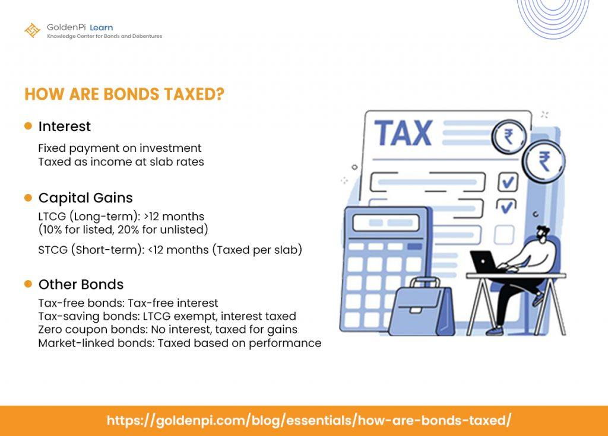

## Table of Contents

## What are corporate bonds?

Corporate bonds are a type of loan that companies take from investors. When a company needs money to grow or pay for things, it can sell bonds to people or other organizations. In return, the company promises to pay back the money it borrowed, plus interest, over a certain period of time. This interest is like a reward for the investors for lending their money.

These bonds are different from stocks because bondholders do not own part of the company. Instead, they are creditors. If the company does well, bondholders get their interest payments as promised. But if the company runs into trouble, bondholders are paid before stockholders. This makes corporate bonds generally safer than stocks, but they usually offer lower returns as a result.

## How are corporate bonds taxed for individual investors?

When you invest in corporate bonds, the interest you earn is usually taxed as regular income. This means it's added to your other income, like your salary, and you pay tax on the total at your normal income tax rate. The tax rate can be different depending on how much money you make overall.

Sometimes, if you buy a corporate bond for more than its face value, you might have to pay taxes on something called "capital gains" when you sell it or it matures. If you bought the bond for less than its face value, you might get a "capital loss," which can sometimes help reduce the taxes you owe on other gains. It's a good idea to talk to a tax professional to understand exactly how your corporate bond investments will be taxed.

## What is the difference between tax-exempt and taxable corporate bonds?

Tax-exempt corporate bonds are special because the interest you earn from them doesn't get taxed by the federal government. Sometimes, they might also be free from state and local taxes, but this depends on where you live and where the bond was issued. These bonds are usually issued by companies that work on things like building hospitals or schools, and the government gives them a tax break to help with these projects. Because the interest isn't taxed, these bonds often pay a lower [interest rate](/wiki/interest-rate-trading-strategies) than taxable bonds.

Taxable corporate bonds, on the other hand, are the more common type of corporate bonds. The interest you earn from these bonds is added to your income and taxed at your normal income tax rate. These bonds are issued by companies for all sorts of reasons, like expanding their business or paying off debts. Because the interest is taxed, these bonds usually offer a higher interest rate to make up for the taxes you'll have to pay.

## How does the interest income from corporate bonds get taxed?

When you earn interest from corporate bonds, it's usually taxed as regular income. This means the money you get from the interest is added to your other income, like your salary. You then pay tax on the total at your normal income tax rate. The tax rate depends on how much money you make overall. So, if you're in a higher tax bracket, you'll pay more tax on the interest from your corporate bonds.

Sometimes, if you buy a corporate bond for more than its face value and then sell it or it matures, you might have to pay taxes on something called "capital gains." This happens if you make a profit from selling the bond. On the other hand, if you bought the bond for less than its face value and sell it at a loss, you might get a "capital loss," which can sometimes help reduce the taxes you owe on other gains. It's a good idea to talk to a tax professional to understand exactly how your corporate bond investments will be taxed.

## What are the tax implications of selling corporate bonds before maturity?

When you sell a corporate bond before it matures, you might have to pay taxes on the profit you make. This profit is called a capital gain. If you sell the bond for more than what you paid for it, the difference is your capital gain, and you'll need to pay taxes on it. The tax rate on capital gains can be different from your regular income tax rate. It depends on how long you held the bond. If you held it for more than a year, it's a long-term capital gain, which usually has a lower tax rate than short-term gains, which apply if you held the bond for a year or less.

If you sell the bond for less than what you paid for it, you'll have a capital loss. You can use this loss to reduce the taxes you owe on other income or gains. This can help lower your overall tax bill. It's important to keep track of how much you paid for the bond and how much you sold it for, so you can figure out if you have a gain or a loss. Talking to a tax professional can help you understand exactly how selling your corporate bonds before they mature will affect your taxes.

## How do capital gains taxes apply to corporate bonds?

When you sell a corporate bond for more money than you paid for it, you have to pay a tax on the extra money you made. This extra money is called a capital gain. The tax you pay on this gain depends on how long you owned the bond. If you owned it for more than a year before selling, it's called a long-term capital gain. The tax on long-term gains is usually less than what you pay on your regular income. If you owned the bond for a year or less, it's a short-term capital gain, and you pay tax on it at your normal income tax rate, which can be higher.

If you sell the bond for less money than you paid for it, you have a capital loss. You can use this loss to lower the taxes you owe on other money you made. This can help reduce your overall tax bill. It's important to keep good records of how much you paid for the bond and how much you sold it for, so you know if you made a gain or a loss. Talking to a tax professional can help you figure out exactly how selling your corporate bonds will affect your taxes.

## What is the impact of holding periods on the taxation of corporate bonds?

When you sell a corporate bond, how long you held it before selling it changes how you get taxed. If you held the bond for more than a year, any profit you make is called a long-term capital gain. The tax on long-term capital gains is usually lower than the tax on your regular income. This means if you make money selling the bond after holding it for over a year, you pay less tax on that money compared to if it was part of your regular income.

If you held the bond for a year or less before selling it, any profit you make is called a short-term capital gain. Short-term capital gains are taxed at the same rate as your regular income. This means if you sell the bond and make a profit within a year of buying it, you'll pay more tax on that profit than if you had waited longer. Knowing how long you've held your bond can help you plan when to sell it to possibly pay less in taxes.

## How can investors use tax loss harvesting with corporate bonds?

Tax loss harvesting is a way for investors to save money on taxes by selling a corporate bond at a loss. If you buy a bond and then its value goes down, you can sell it for less than you paid. This loss can help lower the taxes you owe on other money you made, like other investments that went up in value. By using this loss, you can reduce your overall tax bill. It's like using one part of your investments to help another part, making your total taxes lower.

To do tax loss harvesting with corporate bonds, you need to keep track of how much you paid for the bond and how much you sell it for. If you sell it for less, you have a capital loss. You can then use this loss on your taxes to offset any capital gains you made from other investments. This can be especially helpful if you have other investments that made a lot of money, because the loss from the bond can reduce the taxes on those gains. Just remember, you need to be careful not to buy back the same or a very similar bond right away, because of something called the "wash sale rule," which can mess up your tax savings.

## What are the tax considerations for foreign investors in U.S. corporate bonds?

Foreign investors in U.S. corporate bonds have to think about different taxes. The main tax they need to know about is the one on the interest they earn from the bonds. The U.S. government usually takes 30% of this interest as a tax, but this can change depending on the country the investor is from. Some countries have special agreements with the U.S. that can lower this tax rate. It's important for foreign investors to check if their country has such an agreement to see if they can pay less tax.

Another thing foreign investors need to consider is if they sell their U.S. corporate bonds and make a profit. This profit is called a capital gain, and the U.S. doesn't usually tax foreign investors on these gains unless they are in the U.S. a lot or have a business here. But, if they do owe taxes on these gains, the rate depends on how long they held the bond. If they held it for more than a year, it's a long-term gain and might be taxed less than if they held it for a year or less. It's a good idea for foreign investors to talk to a tax expert to understand all the rules and how they apply to their situation.

## How do state and local taxes affect the taxation of corporate bonds?

When you earn interest from corporate bonds, you usually have to pay federal taxes on that interest. But, you might also have to pay state and local taxes, depending on where you live. Not all states have an income tax, so if you live in a state without one, you won't have to worry about state taxes on your bond interest. But if your state does have an income tax, the interest from your corporate bonds will be added to your other income, and you'll pay state taxes on it at your state's tax rate.

Some states and cities also have their own rules about taxing interest from bonds. For example, some places might not tax interest from bonds if they were issued by companies in that state or city. This can make a big difference in how much tax you pay. It's a good idea to check the rules in your area to see how they affect the taxes you owe on your corporate bonds. Talking to a tax professional can help you figure out exactly how much you'll need to pay in state and local taxes.

## What are the tax implications of investing in corporate bond funds versus individual bonds?

When you invest in a corporate bond fund, you're putting your money into a pool that holds many different corporate bonds. The interest you earn from this fund is usually taxed as regular income, just like interest from individual corporate bonds. But there's a difference: bond funds often buy and sell bonds, which can lead to capital gains or losses. These gains or losses are passed on to you, the investor, and you'll have to pay taxes on them. If the fund sells bonds at a profit, you'll have to pay capital gains tax. If it sells at a loss, you might be able to use that loss to reduce your taxes.

On the other hand, when you buy individual corporate bonds, you know exactly which bonds you own and when they'll mature. You'll pay taxes on the interest you earn each year. If you sell an individual bond before it matures, you might have to pay capital gains tax if you make a profit, or you might get a capital loss if you sell it for less than you paid. The big difference is that with individual bonds, you control when you buy and sell, so you can plan your taxes better. With bond funds, the fund manager makes these decisions, and you might end up with unexpected tax bills because of the fund's trading activity.

## How do changes in tax laws affect the taxation strategy for corporate bond investments?

When tax laws change, it can really shake up how you plan your taxes for corporate bond investments. If the government decides to raise the tax rate on interest income, the money you make from your bonds could be taxed more. This might make you think about moving your money into different kinds of investments that get taxed less. On the other hand, if tax laws change to give you a break on certain types of bonds, like making some interest tax-free, you might want to put more money into those bonds to save on taxes.

Changes in tax laws can also affect how you handle selling your bonds. If the rules about capital gains change, it might be smarter to hold onto your bonds longer or sell them sooner, depending on whether the new rates are higher or lower. Keeping an eye on tax law changes and maybe talking to a tax expert can help you adjust your strategy so you don't end up paying more taxes than you need to.

## How are corporate bonds taxed?

Corporate bonds are subject to several types of taxation, which can significantly affect their overall investment yield. Investors should be aware of these tax implications to manage their portfolios effectively.

### Explanation of How Corporate Bonds Are Taxed

1. **Interest Income Taxation**: The interest earned on corporate bonds is typically subject to federal and state income taxes. This contrasts with municipal bonds, where the interest income is often exempt from federal taxes and sometimes state taxes if the investor resides in the issuing state. The interest income from corporate bonds is added to the investor’s ordinary income and taxed at their respective income tax rate.

2. **Capital Gains Taxation**: If an investor sells a corporate bond before it matures, any profit (or loss) realized is subject to capital gains taxes. If the bond was held for more than a year, the gains are considered long-term and taxed at a reduced rate compared to short-term gains, which are taxed at the ordinary income rate. The formula for capital gain is:
$$
   \text{Capital Gain} = \text{Selling Price} - \text{Purchase Price}

$$

3. **Original Issue Discount (OID) Taxation**: Some bonds are issued at a discount to their face value. The difference between the discounted purchase price and the face value is known as the Original Issue Discount. The Internal Revenue Service (IRS) treats this discount as taxable interest income, which accrues annually. Investors must report and pay taxes on this imputed interest each year, even if no cash is received, under the accrual taxation method.

### Comparing Tax Implications with Other Types of Bonds

Corporate bonds generally bear higher tax burdens compared to other bonds like municipal and Treasury bonds, primarily due to the taxability of interest income. Municipal bonds offer significant tax advantages, as their interest is often exempt from federal and possibly state taxes. Treasury bonds, while subject to federal taxes, are exempt from state and local taxes. This provides Treasury bonds with a tax benefit over corporate bonds, particularly for investors in states with high income tax rates.

### Impact of Bond Taxation on Investment Yield

The taxation of corporate bonds has a direct impact on their net yield, which can be calculated using the formula:

$$
\text{Net Yield} = \text{Gross Yield} \times (1 - \text{Tax Rate})
$$

Where the gross yield is the annual return on the bond before taxes are considered. For instance, if a corporate bond offers a gross yield of 5% and the investor is in a 25% tax bracket, the net yield would be:

$$
\text{Net Yield} = 5\% \times (1 - 0.25) = 3.75\%
$$

This reduced yield highlights the importance of considering tax efficiency in bond investing. Effective tax management strategies, such as holding bonds in tax-advantaged accounts or utilizing tax-loss harvesting, can help investors mitigate the negative impact of taxes and preserve investment returns.

## What are the differences between Corporate Bonds and Other Bonds?

Corporate bonds are a significant component of the bond market, offering different tax implications compared to municipal and treasury bonds. Understanding these distinctions is crucial for investors aiming to optimize their portfolios.

### Tax Advantages and Disadvantages

**Corporate Bonds:** Interest earned from corporate bonds is subject to federal taxation and may also be taxed at the state and local levels. This lack of tax-exempt status distinguishes them from some other bond types but can offer higher yields to compensate for the tax burden.

**Municipal Bonds:** Generally offer tax-exempt interest at the federal level, and often at the state and local levels if the investor resides in the state where the bond is issued. This tax-exempt status can significantly enhance the after-tax yield for investors, particularly those in higher tax brackets.

**Treasury Bonds:** Issued by the federal government, these are subject to federal taxes but are exempt from state and local taxes. This attribute can make them attractive to investors in states with high income taxes.

### Implications of State and Federal Taxes

State and federal taxes play a critical role in determining the true return on bond investments. For instance, an investor in a high-tax state may find municipal bonds more favorable due to their state tax exemptions. Conversely, the lack of state tax on treasury bonds can be a selling point in high-tax environments.

For corporate bonds, the absence of tax exemptions means investors need to carefully calculate the after-tax yield to understand their net returns. Using a simple formula, the after-tax yield is calculated as:

$$
\text{After-tax Yield} = \text{Yield} \times (1 - \text{Tax Rate})
$$

### Yield Comparisons and Default Risks

**Yield Comparison:** Corporate bonds typically offer higher yields compared to municipal and treasury bonds. This is largely a reflection of the higher risk associated with lending to corporations. Treasury bonds generally offer the lowest yields due to their virtually zero default risk, while municipal bonds fall somewhere in between depending on the issuing municipality’s credit rating.

**Default Risks:** 

- **Corporate Bonds:** Carry a default risk associated with the issuing company’s financial health. Investors demand higher yields as compensation for this risk. Companies with lower credit ratings (junk bonds) offer even higher yields but come with significantly higher default risks.

- **Municipal Bonds:** Generally considered lower risk than corporate bonds but higher than treasury bonds. The default risk varies with the financial stability of the issuing municipality.

- **Treasury Bonds:** Widely regarded as the safest investment with minimal default risk, especially in countries like the United States where government backing is strong.

Understanding these factors allows investors to tailor their bond investments according to their risk tolerance and tax situation, ensuring a more strategic approach to portfolio diversification.

## References & Further Reading

[1]: Fabozzi, F. J., & Mann, S. V. (2005). [The Handbook of Fixed Income Securities](https://www.amazon.com/Handbook-Fixed-Income-Securities-Ninth/dp/1260473899). McGraw-Hill Education.

[2]: Hull, J. C. (2018). [Options, Futures, and Other Derivatives](https://www.semanticscholar.org/paper/Options%2C-Futures%2C-and-Other-Derivatives-Hull/89bdee500c8623864fc9eb7a471546aa713acc44). Pearson.

[3]: Johnson, T. (2010). ["Algorithmic Trading and DMA: An Introduction to Direct Access Trading Strategies"](https://archive.org/details/algorithmictradi0000john). 4Myeloma Press.

[4]: Fabozzi, F. J., Modigliani, F., Ferri, M. G., & Jones, F. J. (2002). [Foundations of Financial Markets and Institutions](https://www.amazon.com/Foundations-Financial-Markets-Institutions-International/dp/1292021772). Prentice Hall.

[5]: Benninga, S. (2014). [Financial Modeling](https://mitpress.mit.edu/9780262046428/financial-modeling/). The MIT Press.

[6]: Mauboussin, M. J. (2012). [The Success Equation: Untangling Skill and Luck in Business, Sports, and Investing](https://hbsp.harvard.edu/product/10957-PDF-ENG). Harvard Business Review Press.
