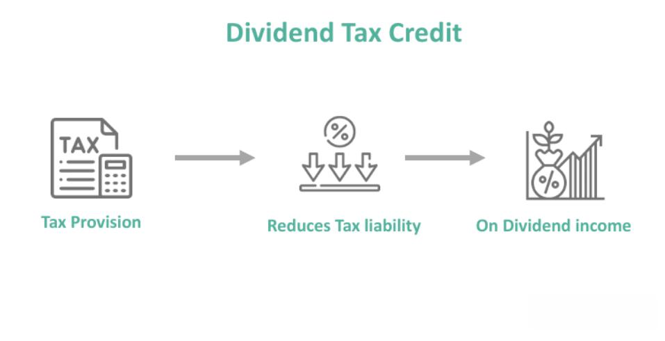

## Table of Contents

## What is dividend income?

Dividend income is money that you get from owning shares in a company. When a company makes a profit, it can choose to share some of that profit with its shareholders. This sharing of profit is called a dividend. You get dividend income when the company pays out these dividends to you, based on how many shares you own.

For example, if you own 100 shares in a company and the company decides to pay a dividend of $1 per share, you will receive $100 as dividend income. This income can be paid out to you in different ways, like cash directly into your bank account or as additional shares in the company. Many people like dividend income because it can provide a steady stream of money, which can be especially helpful if you are retired or looking for regular income.

## How is dividend income taxed for individual investors?

Dividend income is taxed differently depending on where you live and the type of dividend you get. In many places, like the United States, dividends are split into two types: qualified and non-qualified. Qualified dividends are taxed at a lower rate, similar to the rates for long-term capital gains. These rates can be 0%, 15%, or 20%, depending on your total income. Non-qualified dividends, on the other hand, are taxed at your regular income tax rate, which can be much higher.

To be considered qualified, dividends must meet certain rules. They usually need to come from a U.S. company or a qualified foreign company, and you must have held the stock for a certain period of time, usually more than 60 days during the 121-day period that begins 60 days before the ex-dividend date. If your dividends don't meet these rules, they are non-qualified and taxed at your normal income tax rate. It's a good idea to keep track of your dividends and talk to a tax professional to make sure you're paying the right amount of tax on your dividend income.

## Are there different tax rates for qualified versus ordinary dividends?

Yes, there are different tax rates for qualified and ordinary dividends. Qualified dividends are taxed at a lower rate, similar to the rates for long-term capital gains. These rates can be 0%, 15%, or 20%, depending on your total income. This means if you earn a lot of money, you might pay 20% tax on your qualified dividends, but if you earn less, you might not pay any tax at all on them.

Ordinary dividends, also called non-qualified dividends, are taxed at your regular income tax rate. This rate can be much higher than the rate for qualified dividends. For example, if your income puts you in a high tax bracket, you might pay up to 37% tax on your ordinary dividends. Knowing the difference between these two types of dividends can help you plan better and maybe save on taxes.

## What is the difference between qualified and ordinary dividends?

Qualified dividends and ordinary dividends are two types of dividends that companies can pay to their shareholders. The main difference between them is how they are taxed. Qualified dividends are taxed at a lower rate, similar to the rates for long-term capital gains. These rates can be 0%, 15%, or 20%, depending on how much money you make overall. This means if you earn a lot, you might pay 20% tax on your qualified dividends, but if you earn less, you might not pay any tax on them at all.

Ordinary dividends, also called non-qualified dividends, are taxed at your regular income tax rate. This rate can be much higher than the rate for qualified dividends. For example, if your income puts you in a high tax bracket, you might pay up to 37% tax on your ordinary dividends. To be considered qualified, dividends must meet certain rules, like coming from a U.S. company or a qualified foreign company, and you must have held the stock for a certain period of time. Knowing the difference between these two types of dividends can help you plan better and maybe save on taxes.

## How do tax laws affect dividend income for corporations?

When a corporation gets dividend income from another company, it usually doesn't have to pay tax on it right away. This is because of something called the "dividends received deduction" (DRD). The DRD lets a company take a big deduction on the dividends it gets from other companies. How much of a deduction the company can take depends on how much it owns of the other company. If the company owns a lot of the other company, it might not have to pay any tax on those dividends.

But there are some rules the company needs to follow to get this deduction. For example, the company has to hold onto the stock that pays the dividends for a certain amount of time. If the company sells the stock too soon, it might lose the right to the deduction. Also, the company needs to report the dividends it gets on its tax return, even if it's not paying tax on them right away. This can make things a bit more complicated for the company's tax planning, but it can save a lot of money in the long run.

## Can dividend income be taxed at both the corporate and individual level?

Yes, dividend income can be taxed at both the corporate and individual level. This is called double taxation. When a company makes a profit, it first pays corporate income tax on that profit. After paying the corporate tax, if the company decides to pay out some of the remaining profit as dividends to its shareholders, those dividends are then taxed again as income for the individuals who receive them.

This means the same money is taxed twice: once at the corporate level and again at the individual level. However, there are ways to reduce this double taxation. For example, corporations can use the dividends received deduction to lower their tax on dividends they get from other companies. Also, individuals might pay a lower tax rate on qualified dividends than on their regular income. Even with these ways to reduce taxes, double taxation can still affect how much money shareholders get to keep from their dividends.

## What are the tax implications of receiving dividends from foreign companies?

When you get dividends from foreign companies, the tax rules can be a bit different from getting dividends from companies in your own country. Many countries, including the United States, have something called a withholding tax on dividends paid to foreign investors. This means the foreign company will take out a certain percentage of the dividend before paying it to you, usually between 15% to 30%, depending on the country and any tax treaties in place. You might be able to get some of this tax back by claiming a foreign tax credit on your tax return, but you'll need to check the specific rules and treaties between your country and the country where the company is based.

In the U.S., for example, if you receive dividends from a foreign company, you might be able to claim these dividends as qualified dividends, which are taxed at a lower rate, but only if the foreign company is in a country that has a tax treaty with the U.S. and the dividends meet certain other rules. If they don't qualify, they'll be taxed at your regular income tax rate. It's a good idea to talk to a tax professional because the rules can be complicated, and they can help you make sure you're paying the right amount of tax and getting any credits you're eligible for.

## How can investors use tax-advantaged accounts to minimize taxes on dividend income?

Investors can use tax-advantaged accounts like Individual Retirement Accounts (IRAs) and 401(k)s to minimize taxes on dividend income. These accounts let you put off paying taxes on the money you earn, including dividends, until you take the money out. This can be a big help because it means you don't have to pay taxes on your dividends every year. Instead, you can let your investments grow without losing a chunk to taxes right away. For example, if you put dividend-paying stocks in a Roth IRA, you won't have to pay any taxes on the dividends you earn, as long as you follow the rules for taking money out.

Another option is to use a Health Savings Account (HSA) if you're eligible. HSAs are meant for medical expenses, but you can also invest the money in them. Like IRAs and 401(k)s, HSAs let you put off paying taxes on your earnings, including dividends. If you use the money for qualified medical expenses, you won't have to pay taxes on it at all. By using these types of accounts, investors can keep more of their dividend income and let it grow over time without the drag of annual taxes.

## What are the reporting requirements for dividend income on tax returns?

When you get dividend income, you need to report it on your tax return. In the U.S., companies that pay dividends will send you a form called a 1099-DIV. This form shows how much money you got in dividends and if any of it is qualified or ordinary. You'll need to include this information on your tax return, usually on Schedule B if you have more than $1,500 in dividends or if you need to list each dividend separately. You'll also need to report any foreign dividends and might need to fill out additional forms like the 1099-DIV or Form 8938 if you have a lot of foreign assets.

If you have dividend income in a tax-advantaged account like an IRA or 401(k), you don't need to report it on your tax return right away. The dividends will grow without being taxed until you take the money out of the account. When you do take the money out, you'll report it as income on your tax return. It's a good idea to keep good records of all your dividend income and any forms you get, so you can fill out your tax return correctly and not miss any deductions or credits you might be able to claim.

## How have recent tax reforms changed the taxation of dividend income?

Recent tax reforms, like the Tax Cuts and Jobs Act (TCJA) in the U.S., have changed how dividend income is taxed. Before the TCJA, the top tax rate for qualified dividends was 20%. But after the TCJA, the top rate stayed at 20% for most people, but it went up to 23.8% for some high-income earners because of a new net investment income tax. The TCJA also changed the tax brackets, which might mean some people pay a different rate on their qualified dividends than they did before.

For ordinary dividends, the TCJA also affected the tax rates. These dividends are taxed at your regular income tax rate, and the TCJA lowered these rates for many people. But because the tax brackets changed, some people might end up paying more or less on their ordinary dividends depending on how much money they make. It's a good idea to talk to a tax professional to understand how these changes affect your specific situation and to make sure you're paying the right amount of tax on your dividend income.

## What strategies can investors employ to optimize their tax situation regarding dividend income?

Investors can use a few smart strategies to make their tax situation better when it comes to dividend income. One good idea is to put dividend-paying stocks in tax-advantaged accounts like IRAs or 401(k)s. This way, you don't have to pay taxes on the dividends every year. Instead, you can let your money grow without losing some of it to taxes right away. If you use a Roth IRA, you won't have to pay any taxes on the dividends you earn, as long as you follow the rules for taking money out. This can help you keep more of your dividend income and let it grow over time.

Another strategy is to pay attention to whether your dividends are qualified or ordinary. Qualified dividends are taxed at a lower rate, so if you can, try to invest in stocks that pay qualified dividends. You can also look into tax-efficient funds that focus on qualified dividends. Also, if you get dividends from foreign companies, you might be able to claim a foreign tax credit to reduce your tax bill. Keeping good records and talking to a tax professional can help you make the most of these strategies and make sure you're paying the right amount of tax on your dividend income.

## How do international tax treaties impact the taxation of dividend income for cross-border investors?

International tax treaties can help cross-border investors by reducing the amount of tax they have to pay on dividend income. These treaties are agreements between countries that set rules on how much tax one country can take from dividends paid to investors from another country. For example, if you live in the U.S. and get dividends from a company in Germany, the tax treaty between the U.S. and Germany might say that Germany can only take out 15% of your dividends as tax, instead of the usual 25% or 30%. This can save you a lot of money.

To take advantage of these treaties, you usually need to fill out some forms and follow certain rules. For instance, you might need to claim a foreign tax credit on your tax return to get back some of the tax that was taken out by the foreign country. This can make things a bit more complicated, but it's worth it because it can lower your overall tax bill. Talking to a tax professional can help you understand how to use these treaties to your advantage and make sure you're paying the right amount of tax on your dividend income.

## What is the relationship between Algorithmic Trading and Dividend Income?

Algorithmic trading, a sophisticated investment strategy using computer algorithms, has gained significant traction in financial markets due to its efficiency and precision. Its capability to analyze vast amounts of data quickly enables traders to capitalize on short-term opportunities that might be imperceptible to human traders. At its core, [algorithmic trading](/wiki/algorithmic-trading) leverages pre-defined criteria to automate trading actions, thereby increasing speed and reducing human error.

In the context of dividend-paying stocks, algorithms offer distinct advantages. By monitoring market conditions and stock performance continuously, algorithms can strategically track and execute trades around dividend events. This ability is particularly useful for dividend capture strategies, where investors seek to purchase stocks just before the ex-dividend date and sell them shortly afterward to collect the dividend payout without holding the stock long-term. The ex-dividend date is the cutoff point where the stock trades without the value of its next dividend payment. Such trades can be precisely timed using algorithmic strategies to optimize the dividends received relative to the investment period.

An essential factor considered in algorithmic trading strategies involving dividends is the dividend yield, which is the ratio of a company's annual dividend compared to its share price. Mathematically, this is expressed as:

$$
\text{Dividend Yield} (\%) = \left( \frac{\text{Annual Dividend per Share}}{\text{Price per Share}} \right) \times 100
$$

A significant yield can indicate a lucrative opportunity for income-focused trading strategies. Algorithms can screen for stocks with attractive yields and align this information with broader market data to decide which stocks to include in a trading strategy.

Algorithmic trading also influences dividend tax strategy and outcomes. Tax considerations can be integrated into algorithmic systems, helping investors optimize their tax positions. For instance, algorithms might adjust holding periods or transaction timings to benefit from preferential tax rates on qualified dividends, which are typically taxed lower than ordinary income. In the United States, qualified dividends are taxed at the long-term capital gains rates, which range from 0% to 20% depending on the investor's taxable income, compared to the higher rates for short-term capital gains or non-qualified dividends.

By incorporating tax rules into trading models, algorithms enable more refined control over investment outcomes, allowing investors to potentially minimize tax liabilities while maximizing returns. This seamless integration of trading and tax strategy is key for investors looking to optimize their investment performance in dividend-paying stocks. Algorithmic trading systems increase the potential for efficiency and profitability, especially when compared to traditional, manual trading methods.

## References & Further Reading

[1]: ["Understanding Taxation of Dividends."](https://www.fool.com/investing/stock-market/types-of-stocks/dividend-stocks/how-dividends-taxed/) Investopedia

[2]: ["Qualified vs. Non-Qualified Dividends."](https://smartasset.com/investing/qualified-vs-non-qualified-dividends) Fidelity Investments

[3]: ["Algorithmic Trading: Winning Strategies and Their Rationale"](https://www.wiley.com/en-us/Algorithmic+Trading%3A+Winning+Strategies+and+Their+Rationale-p-9781118460146) by Ernie Chan

[4]: ["The Taxation of Algorithmic Trading"](https://www.investopedia.com/articles/active-trading/101014/basics-algorithmic-trading-concepts-and-examples.asp) by Jason McClure

[5]: ["IRS Tax Guide for Individuals: Publication 17."](https://www.irs.gov/publications/p17) Internal Revenue Service

[6]: ["Advances in Financial Machine Learning"](https://www.amazon.com/Advances-Financial-Machine-Learning-Marcos/dp/1119482089) by Marcos Lopez de Prado

[7]: ["The Little Book of Common Sense Investing: The Only Way to Guarantee Your Fair Share of Stock Market Returns"](https://www.amazon.com/Little-Book-Common-Sense-Investing/dp/1119404509) by John C. Bogle

[8]: ["Machine Learning for Asset Managers"](https://books.google.com/books/about/Machine_Learning_for_Asset_Managers.html?id=0D8LEAAAQBAJ) by Marcos Lopez de Prado

[9]: ["Quantitative Trading: How to Build Your Own Algorithmic Trading Business"](https://books.google.com/books/about/Quantitative_Trading.html?id=j70yEAAAQBAJ) by Ernest P. Chan