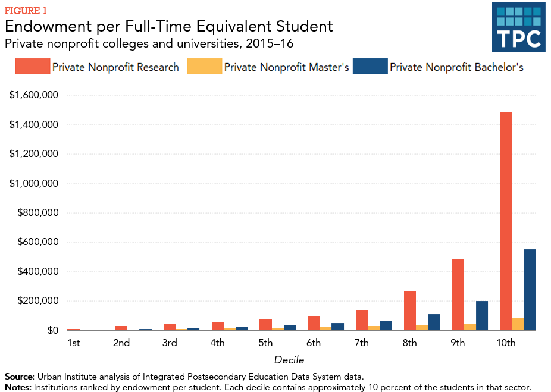

The intersection of endowments, taxation, charitable organizations, and algorithmic trading has increasingly become a focal point for financial management within the nonprofit sector. Endowments serve as a vital source of income for non-profit entities, providing them with the financial stability necessary to fulfill their missions. By investing these funds strategically, organizations can generate returns that support their activities while preserving the principal for long-term sustainability. 

Taxation plays a crucial role in the management of endowment income. The tax status of these funds influences financial planning and compliance for charitable institutions. It is essential for these organizations to understand the relevant tax regulations to optimize their investment strategies and avoid potential liabilities.



Algorithmic trading offers new possibilities for managing investment portfolios by automating trading strategies based on predefined criteria. It can enhance the returns on endowment funds by leveraging advanced analytical models and real-time data. However, this approach also introduces complexities, as it requires sophisticated risk management and governance to mitigate potential errors and ensure ethical standards.

This article will explore the intricacies of endowment management within this multifaceted environment, focusing on the interplay between funding, taxation, and the evolving role of algorithmic trading in enhancing financial performance for charitable organizations. By grasping these elements, non-profits can better navigate the complexities of modern financial landscapes, ensuring their endowments continue to provide valuable support for their missions.

## Table of Contents

## Understanding Endowments and Their Role in Charitable Organizations

An endowment is a financial asset typically donated to a non-profit organization with the intention of providing continuous financial support over the long term. These funds are strategically invested, with the profits generated being used to further the organization's mission, thereby ensuring that the principal endowment amount remains intact. Such financial arrangements form a sustainable financial backbone for many non-profits, including universities, museums, and research institutions, allowing them to plan far into the future without relying solely on immediate sources of income.

Endowment funds serve critical roles in the financial health and operational stability of these organizations. They allow for financial independence, facilitating various programs, scholarships, and community services that might otherwise lack sufficient funding. The stability provided by these funds often attracts further donations, as donors are reassured that their contributions will have a lasting impact.

The effective management and growth of endowment funds necessitate sophisticated investment strategies. Endowment managers must navigate complex financial markets to balance risk and return adequately. To do this, they diversify portfolios, investing in a mix of asset classes such as equities, bonds, real estate, and alternative investments, including private equity and hedge funds.

Compliance with relevant tax laws is another critical aspect of managing endowment funds. Understanding regulations such as applicable tax exemptions, unrelated business income tax, and charitable contributions deductions is essential to ensure the endowment's growth does not inadvertently trigger liabilities that could reduce the fund's value or its contributions to the organization.

In recent years, [algorithmic trading](/wiki/algorithmic-trading) has become an increasingly prevalent tool among endowment managers aiming to enhance investment returns and manage risks more effectively. This form of trading leverages computer algorithms to execute trading strategies, offering advantages like increased trading efficiency, error reduction, and the ability to process large volumes of transactions quickly. 

Algorithmic trading employs complex mathematical models and vast datasets, allowing managers to optimize their trading processes. For instance, they can swiftly identify market trends and price discrepancies, enabling timely and strategic investment decisions. Despite the potential for improved efficiency and enhanced returns, algorithmic trading also introduces certain risks, particularly those associated with market [volatility](/wiki/volatility-trading-strategies) and rapid technological changes. Proper implementation requires robust governance to mitigate these risks and ensure that endowment funds are managed prudently. 

Endowment fund managers are thus increasingly tasked with integrating traditional financial expertise with modern technological tools to optimize their portfolios. By balancing these components effectively, they can help ensure that endowment funds continue to support the valuable missions of non-profit organizations sustainably and efficiently.

## Tax Implications of Endowment Income

Endowment income, which typically includes dividends, interest, and capital gains, is often exempt from federal income taxation when managed by tax-exempt organizations, such as charitable entities. This tax-exempt status, as defined by the Internal Revenue Service (IRS), allows such organizations to accumulate earnings without being subjected to federal income tax, provided they adhere to specific regulations [IRS Publication 598, 2023].

Contributions made to endowment funds are generally tax-deductible for donors, incentivizing philanthropy by reducing the donor's taxable income. This deduction ensures that individuals and corporations are motivated to support charitable organizations financially, bolstering the organization's revenue streams and long-term sustainability [IRS Publication 526, 2023].

However, certain complexities can arise when endowment income needs to be distributed to individuals or when an organization loses its tax-exempt status. In these scenarios, the tax implications can change significantly, potentially subjecting the income to standard taxation rules. Endowment managers must be vigilant in maintaining the organization's tax-exempt status to prevent adverse tax liabilities.

A critical tax consideration for endowment managers is the Unrelated Business Income Tax (UBIT). UBIT applies to income generated from activities unrelated to the organization's primary exempt purpose. For instance, if an endowment engages in commercial activities distinct from its charitable mission, the revenue from these activities could be taxable under UBIT regulations. Managing UBIT requires careful planning and a comprehensive understanding of the applicable tax laws to avoid unexpected financial obligations [IRS Publication 598, 2023].

Overall, navigating the tax implications of endowment income demands a nuanced understanding of IRS regulations and strategic financial management to capitalize on available exemptions while mitigating potential liabilities.

## Algorithmic Trading in Endowment Management

Algorithmic trading, commonly known as algo trading, is a method of executing orders using automated and pre-programmed trading instructions. These algorithms take into account variables such as timing, price, and [volume](/wiki/volume-trading-strategy) to execute trades with minimal human intervention. This approach offers significant advantages for managing endowment funds.

One major benefit of algorithmic trading is the increase in trading efficiency. By automating the process, trades can be executed at a much faster rate compared to traditional methods. This rapid execution is critical in volatile markets where timely transactions can significantly impact returns. Additionally, algorithmic trading reduces human error, removing the emotional and psychological biases that can adversely affect investment decisions.

Algo trading platforms can handle vast volumes of transactions swiftly, which is particularly useful for large endowments managing extensive portfolios. These systems utilize sophisticated statistical models and real-time market data to optimize investment decisions, aiming to maximize returns. A typical strategy might include mean reversion, where algorithms exploit the tendency of stocks to return to their average price over time, or [momentum](/wiki/momentum) strategies, where they capitalize on stocks that are trending upwards or downwards.

However, algorithmic trading isn't without risks. The complexity of these systems means they can occasionally malfunction or produce unintended outcomes, leading to large-scale errors. For instance, a poorly designed algorithm might initiate trades based on faulty data or incorrect assumptions, potentially leading to substantial financial losses. Furthermore, the interconnectedness of markets means isolated errors can lead to widespread systemic issues.

To mitigate these risks, robust governance and oversight are crucial. Effective integration of algorithmic trading into endowment management necessitates a comprehensive framework for monitoring and controlling trading activities. This includes regular audits of algorithm performance, implementing real-time error detection systems, and ensuring compliance with regulatory standards.

Python is often the preferred language for developing trading algorithms due to its simplicity and the extensive availability of libraries for data analysis and [machine learning](/wiki/machine-learning). Here's a sample snippet of a basic momentum trading algorithm using Python:

```python
import pandas as pd
import numpy as np

# Load historical price data
data = pd.read_csv('price_data.csv')

# Calculate the short-term and long-term moving averages
short_window = 40
long_window = 100

signals = pd.DataFrame(index=data.index)
signals['price'] = data['price']
signals['short_mavg'] = data['price'].rolling(window=short_window, min_periods=1, center=False).mean()
signals['long_mavg'] = data['price'].rolling(window=long_window, min_periods=1, center=False).mean()

# Generate trading signals
signals['signal'] = 0.0
signals['signal'][short_window:] = np.where(signals['short_mavg'][short_window:] > signals['long_mavg'][short_window:], 1.0, 0.0)   
signals['positions'] = signals['signal'].diff()

# Print the signals
print(signals)
```

This code calculates short-term and long-term moving averages of a stock price and generates buy signals (when the short-term average exceeds the long-term average), demonstrating how algorithmic strategies can be encoded effectively. Proper understanding and application of such algorithms can significantly enhance the financial performance and risk management of endowment funds.

## Challenges and Opportunities

The integration of algorithmic trading within endowment management introduces several challenges, particularly concerning compliance, ethical investment, and transparency. The complexity of algorithmic systems requires charitable organizations to rigorously balance the pursuit of higher returns against the inherent risks these systems pose. One primary challenge is ensuring that algorithmic strategies adhere to existing regulatory frameworks. Regulatory bodies, such as the Securities and Exchange Commission (SEC), mandate specific compliance standards for trading activities, which must be meticulously followed to prevent unintended breaches and subsequent penalties.

Another significant challenge is the ethical dimension of algorithmic trading. As automated systems operate without direct human intervention, ensuring that investment practices align with the ethical values of the charitable organization is crucial. This alignment might include avoiding investments in industries that conflict with the organization’s mission or adhering to socially responsible investing (SRI) guidelines.

The fast-paced nature of technological advancements and market dynamics necessitates continuous monitoring and an adaptive approach towards managing endowment funds. The volatility of financial markets, coupled with rapid technological change, demands that endowment managers remain vigilant and continually update their strategies. This requirement underscores the importance of ongoing education and training for investment teams to effectively manage these sophisticated trading systems.

Looking ahead, the potential for innovative trading strategies and technological advancements presents opportunities to further enhance the performance of endowment portfolios. Advances in [artificial intelligence](/wiki/ai-artificial-intelligence) and machine learning could lead to the development of highly sophisticated algorithms capable of optimizing investment returns while mitigating risks. However, the successful implementation of these technologies will depend on robust oversight mechanisms and the ability to adapt strategies to evolving market conditions.

To illustrate the balance between rewards and risks, consider a hypothetical Python-based algorithm designed for optimizing investment returns:

```python
import numpy as np

def algo_trading_strategy(prices, window_size):
    """
    Simple moving average trading strategy.

    :param prices: List or np.array of stock prices
    :param window_size: The number of periods to calculate the moving average
    :return: Trading signals (1 for buy, -1 for sell, 0 for hold)
    """
    moving_average = np.convolve(prices, np.ones(window_size), 'valid') / window_size
    signals = np.zeros(len(prices))

    for i in range(window_size, len(prices)):
        # Simple strategy: buy if price is above moving average, sell if below
        if prices[i] > moving_average[i-window_size]:
            signals[i] = 1  # buy
        elif prices[i] < moving_average[i-window_size]:
            signals[i] = -1  # sell

    return signals

# Example usage
prices = [100, 102, 105, 103, 98, 97, 95]
signals = algo_trading_strategy(prices, window_size=3)
print(signals)
```

This code snippet demonstrates a basic moving average trading strategy, offering a framework that can be expanded into more complex models incorporating real-time data analysis and adaptive learning features. Ultimately, strategic planning and responsible execution will be essential for charitable organizations to leverage algorithmic systems effectively, ensuring endowments continue to fulfill their mission of providing lasting financial support.

## Conclusion

Endowments form a cornerstone in the financial structure of charitable organizations, providing a sustainable source of revenue that supports long-term missions and projects. Through strategic financial management, these funds can grow and generate income without depleting their principal amount, ensuring ongoing support for their causes. A key aspect of managing endowment funds effectively lies in understanding the nuanced taxation rules associated with them. For example, the tax-exempt status granted to many of these funds can shield them from taxes on accrued earnings and allow contributions to be tax-deductible. However, maintaining this exempt status requires ongoing compliance with relevant tax laws, such as understanding the implications of the Unrelated Business Income Tax (UBIT) to avoid potential liabilities.

Furthermore, the integration of algorithmic trading in endowment management has emerged as a significant development. This approach utilizes sophisticated algorithms and market data to maximize investment returns and manage risks effectively. While algorithmic trading offers substantial benefits in terms of efficiency and error reduction, it also necessitates robust governance frameworks to mitigate associated risks, such as systemic complexities and the potential for rapid errors.

Organizations must stay vigilant regarding regulatory changes and technological advancements. This vigilance is crucial not only for leveraging new opportunities responsibly but also for ensuring compliance with legal and ethical standards. Careful planning, continuous monitoring, and strategic implementation are essential to balance the goals of maximizing returns on investment and adhering to required regulatory frameworks. By maintaining this balance, endowments can continue to flourish and support meaningful impacts in their respective missions, thus ensuring the sustainability of the charitable organizations they underpin.

## References & Further Reading

[1]: ["Internal Revenue Service: IRS Publication 598 (2023) - Tax on Unrelated Business Income of Exempt Organizations."](https://www.irs.gov/forms-pubs/about-publication-598)

[2]: ["Internal Revenue Service: IRS Publication 526 (2023) - Charitable Contributions."](https://www.irs.gov/publications/p526)

[3]: ["Advances in Financial Machine Learning"](https://www.amazon.com/Advances-Financial-Machine-Learning-Marcos/dp/1119482089) by Marcos Lopez de Prado

[4]: ["Machine Learning for Asset Managers"](https://github.com/emoen/Machine-Learning-for-Asset-Managers) by Marcos Lopez de Prado

[5]: ["Evidence-Based Technical Analysis: Applying the Scientific Method and Statistical Inference to Trading Signals"](https://www.amazon.com/Evidence-Based-Technical-Analysis-Scientific-Statistical/dp/0470008741) by David Aronson

[6]: ["Quantitative Trading: How to Build Your Own Algorithmic Trading Business"](https://www.amazon.com/Quantitative-Trading-Build-Algorithmic-Business/dp/1119800064) by Ernest P. Chan