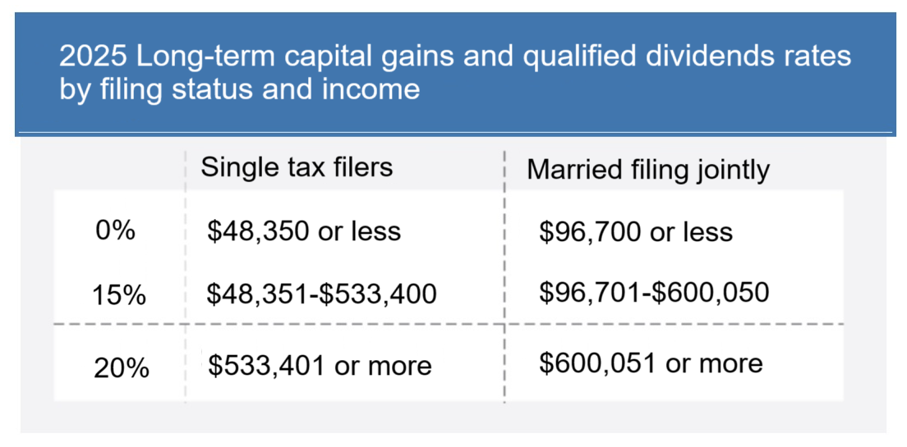

## Table of Contents

## What is an ETF and how does it generate dividends?

An ETF, or Exchange-Traded Fund, is like a basket that holds a bunch of different investments, like stocks or bonds. You can buy and sell shares of an ETF on a stock exchange, just like you would with a single stock. ETFs are popular because they let you invest in a whole bunch of things at once, which can help spread out your risk.

ETFs can generate dividends in a few ways. If the ETF holds stocks that pay dividends, the ETF will collect those dividends and then pass them on to its shareholders. This usually happens on a regular schedule, like every quarter. Some ETFs might also invest in bonds, which pay interest, and that interest can be distributed to shareholders as dividends too. So, the dividends you get from an ETF come from the income that the ETF earns from its investments.

## How are dividends from ETFs taxed for individual investors?

Dividends from ETFs are taxed based on how the ETF makes its money. If the ETF earns dividends from stocks it holds, those dividends are usually taxed as "qualified dividends" if they meet certain rules. Qualified dividends are taxed at a lower rate, like 0%, 15%, or 20%, depending on your income. But if the dividends don't meet those rules, they are taxed as "ordinary dividends" at your regular income tax rate, which can be higher.

If the [ETF](/wiki/etf-trading-strategies) earns money from bonds or other interest-bearing investments, the dividends it pays out are usually taxed as ordinary income. This means they are taxed at the same rate as your wages or other regular income. Sometimes, ETFs can also make money from selling investments at a profit, which is called capital gains. If the ETF distributes these gains to you, they are taxed as capital gains, either short-term or long-term, depending on how long the ETF held the investments.

It's important to know that tax rules can change, and your specific situation might affect how your dividends are taxed. Always check with a tax professional to make sure you're doing things right and taking advantage of any tax benefits you might be eligible for.

## What is the difference between qualified and non-qualified dividends from ETFs?

Qualified dividends from ETFs are taxed at a lower rate than non-qualified dividends. To be considered qualified, the dividends must come from stocks that the ETF holds, and those stocks need to meet certain rules set by the IRS. If they do, the dividends are taxed at the same rates as long-term capital gains, which can be 0%, 15%, or 20%, depending on your income. This can save you a lot of money compared to paying the regular income tax rate.

Non-qualified dividends, on the other hand, are taxed at your regular income tax rate, which can be much higher. These dividends can come from any type of investment the ETF holds, like bonds or other interest-bearing assets. So, if an ETF earns money from these sources and passes it on to you, you'll pay taxes on those dividends at the same rate as your wages or other income. Knowing the difference between these two types of dividends can help you plan your investments and taxes better.

## Can ETF dividends be reinvested, and what are the tax implications of doing so?

Yes, ETF dividends can be reinvested. This means instead of getting the dividend money in your pocket, you use it to buy more shares of the ETF. Many investors like to do this because it can help their investment grow over time without them having to add more money. It's like letting your money make more money.

The tax implications of reinvesting ETF dividends are the same as if you had taken the dividends as cash. You still have to pay taxes on the dividends, even if you use them to buy more shares. If the dividends are qualified, you'll pay the lower tax rate on them. If they're non-qualified, you'll pay your regular income tax rate. So, even though you're not getting the money right away, you still need to report it on your taxes and pay what you owe.

## How does the holding period affect the taxation of ETF dividends?

The holding period of the stocks inside an ETF can affect whether the dividends you get are taxed as qualified or non-qualified. For dividends to be qualified, the ETF needs to hold the stocks for a certain amount of time. Usually, this means the ETF must have held the stock for more than 60 days during the 121-day period that starts 60 days before the stock's ex-dividend date. If the ETF meets this rule, the dividends it pays out can be taxed at the lower qualified dividend rate.

If the ETF doesn't hold the stocks long enough, the dividends become non-qualified. This means you'll pay your regular income tax rate on those dividends, which can be higher than the rate for qualified dividends. So, the length of time the ETF holds its stocks can make a big difference in how much tax you pay on the dividends you receive.

## What are the tax rates for qualified versus non-qualified ETF dividends?

Qualified ETF dividends are taxed at a lower rate than non-qualified dividends. The tax rate for qualified dividends depends on your income. If you're in the lowest tax bracket, you might not pay any tax on them at all. If you're in a middle tax bracket, you'll pay 15%. And if you're in the highest tax bracket, you'll pay 20%. These rates are the same as the rates for long-term capital gains, which are profits from selling investments you've held for more than a year.

Non-qualified ETF dividends, on the other hand, are taxed at your regular income tax rate. This rate can be a lot higher than the rate for qualified dividends. Depending on your income, your regular tax rate could be anywhere from 10% to 37%. So, if your ETF dividends are non-qualified, you could end up paying a lot more in taxes than if they were qualified.

## How do ETFs that invest in foreign securities impact dividend taxation?

ETFs that invest in foreign securities can make things a bit trickier when it comes to taxes. If an ETF holds stocks from other countries, the dividends you get from those stocks might be taxed differently. Some countries take a little bit of tax off the top before sending the dividends to the ETF. This is called withholding tax. The amount of withholding tax depends on the country and any tax treaties between that country and the U.S. You might be able to claim a credit for this tax on your U.S. tax return, but it can make your taxes more complicated.

The dividends from foreign stocks in an ETF can still be qualified or non-qualified, just like dividends from U.S. stocks. If they're qualified, you'll pay the lower tax rate on them. But you need to check if the foreign stocks meet the same rules as U.S. stocks for the dividends to be qualified. If they don't, the dividends will be non-qualified and taxed at your regular income tax rate. So, investing in ETFs with foreign securities can give you a chance to spread your investments around the world, but it's good to understand how it might affect your taxes.

## What are the tax considerations for ETFs held in tax-advantaged accounts like IRAs?

When you hold ETFs in tax-advantaged accounts like IRAs, the tax rules are different from holding them in regular investment accounts. In an IRA, you don't have to worry about paying taxes on the dividends you get from the ETFs each year. This means you can keep all the money the ETFs earn, and it can grow without being reduced by taxes. This is one of the big benefits of using an IRA for your investments.

However, you'll need to think about taxes when you take money out of the IRA. If it's a traditional IRA, you'll pay taxes on the money you withdraw, including any dividends the ETFs earned over the years. If it's a Roth IRA, you won't pay taxes on the withdrawals as long as you follow the rules, like waiting until you're 59½ and having the account for at least five years. So, while holding ETFs in an IRA can help you avoid taxes on dividends while you're investing, you need to plan for taxes when you start taking money out.

## How does the tax treatment of ETF dividends compare to mutual fund dividends?

The tax treatment of ETF dividends and mutual fund dividends is pretty similar, but there are some small differences. Both ETFs and mutual funds can pay out qualified and non-qualified dividends. Qualified dividends from both are taxed at the lower rates of 0%, 15%, or 20%, depending on your income. Non-qualified dividends from both are taxed at your regular income tax rate, which can be higher. So, when it comes to the basic tax rates, ETFs and mutual funds are treated the same way.

However, ETFs often have a tax advantage over mutual funds because of how they're structured. When a mutual fund sells investments to pay out dividends or to give money back to investors, it can create capital gains. Those gains are then passed on to the investors and taxed, even if the investors didn't sell any of their own shares. ETFs, on the other hand, usually don't have to sell their investments to pay dividends. Instead, they can use a process called "in-kind" redemptions, which can help them avoid passing on those capital gains to investors. So, while the tax rates on dividends might be the same, ETFs might help you avoid some extra taxes from capital gains that you might get with mutual funds.

## What are the reporting requirements for ETF dividends on tax returns?

When you get dividends from ETFs, you need to report them on your tax return. The company that manages the ETF will send you a form called a 1099-DIV by the end of January. This form tells you how much you got in dividends and whether they are qualified or non-qualified. You'll use the information from this form to fill out your tax return. On your tax return, you'll report the dividends on Schedule B, which is where you list all your interest and dividend income. If you have qualified dividends, you'll also need to fill out the Qualified Dividends and Capital Gain Tax Worksheet to figure out your tax.

If you hold ETFs in a tax-advantaged account like an IRA, you don't need to report the dividends on your tax return each year. The dividends will grow tax-free inside the account. But when you take money out of the IRA, you'll need to report that on your tax return. For a traditional IRA, you'll pay taxes on the withdrawals, including any dividends the ETFs earned. For a Roth IRA, you won't pay taxes on the withdrawals if you follow the rules. So, while you don't report ETF dividends from an IRA each year, you need to think about taxes when you take money out.

## How can investors use tax-loss harvesting strategies with ETFs to manage dividend taxation?

Investors can use tax-loss harvesting with ETFs to help manage their taxes, including the taxes on dividends. Tax-loss harvesting means selling an investment that has gone down in value to get a tax break. If you sell an ETF at a loss, you can use that loss to reduce your taxes. You might use the loss to offset any gains you made from other investments, or even some of your regular income. This can help lower the amount of tax you pay on the dividends you get from your other ETFs.

The key to using tax-loss harvesting with ETFs is to be smart about when you sell. You want to sell the ETF that's down in value before the end of the year, so you can use the loss on that year's taxes. But you also need to be careful about the "wash-sale" rule. This rule says you can't buy back the same or a very similar ETF within 30 days before or after the sale. If you do, you can't use the loss to lower your taxes. So, if you want to keep investing in the same kind of ETF, you'll need to find a different one that's not too similar to the one you sold.

## What advanced strategies can be employed to minimize taxes on ETF dividends for high-income investors?

High-income investors can use several smart strategies to lower their taxes on ETF dividends. One way is to put their ETFs in tax-advantaged accounts like IRAs or 401(k)s. In these accounts, dividends grow without being taxed each year. This can be a big help for high-income investors because they usually pay higher taxes on their dividends. If they use a Roth IRA, they won't have to pay taxes on the dividends when they take the money out later, as long as they follow the rules. This can save them a lot of money in the long run.

Another strategy is to focus on ETFs that pay qualified dividends. These dividends are taxed at a lower rate than non-qualified dividends, which can make a big difference for high-income investors. They can also use tax-loss harvesting to sell ETFs that have gone down in value and use those losses to offset the taxes on their dividends. By being smart about when they sell and buy back ETFs, they can save on taxes. High-income investors should work with a tax professional to make sure they're using these strategies in the best way possible.

## How can ETFs and algorithmic trading be incorporated into a tax-efficient strategy?

To optimize ETF dividend investments, integrating tax-efficient strategies with [algorithmic trading](/wiki/algorithmic-trading) can substantially enhance returns. Key strategies include tax loss harvesting, strategic fund placement, and precise trade timing. Algorithmic trading systems can be leveraged to automate these strategies, improving consistency and efficiency.

### Tax Loss Harvesting and Strategic Fund Placement

Tax loss harvesting involves selling securities at a loss to offset capital gains, thus reducing taxable income. Implementing this strategy within an algorithmic framework allows for real-time analysis and execution of trades, ensuring losses are efficiently utilized. Consider the following Python snippet for automating tax loss harvesting:

```python
import pandas as pd

def tax_loss_harvest(portfolio, current_prices):
    tax_loss_opportunities = []
    for security, purchase_price in portfolio.items():
        current_price = current_prices[security]
        if current_price < purchase_price:
            loss = purchase_price - current_price
            tax_loss_opportunities.append((security, loss))
    return tax_loss_opportunities

portfolio = {'ETF_A': 100, 'ETF_B': 150}  # purchase prices
current_prices = {'ETF_A': 90, 'ETF_B': 155}  # current market prices
loss_opportunities = tax_loss_harvest(portfolio, current_prices)
print("Tax loss opportunities:", loss_opportunities)
```

Strategic fund placement refers to the allocation of funds between taxable and tax-advantaged accounts. Holding high-dividend ETFs in tax-deferred accounts like IRAs can minimize current tax liabilities, allowing dividends to grow tax-free until withdrawal.

### Timing of Trades and Algorithmic Automation

Effective timing of trades can significantly impact tax outcomes, especially when considering dividend capture strategies. Algorithmic systems can model various scenarios to determine optimal entry and [exit](/wiki/exit-strategy) points. This not only aids in capturing dividends efficiently but also in managing short-term capital gains, which are typically taxed at higher rates than long-term gains.

Matrix-based calculations can be employed to simulate trade outcomes under various market conditions:

$$
\text{Optimal\_Trades} = \arg \max \left\{\text{Expected\_Return} - \text{Tax\_Liability}\right\}
$$

Here, maximizing the trade outcome involves estimating future returns and corresponding tax obligations, factoring in potential market conditions.

### Monitoring, Adjustment, and Professional Guidance

Given the dynamic nature of tax laws and financial markets, continuous monitoring and adjustment of strategies are essential. Automated systems should be programmed to adapt to these changes, updating algorithms in response to legislative developments and market shifts. 

Additionally, involving financial advisors or professional trade management services can offer bespoke solutions tailored to investor profiles. These professionals often have insights into market trends and possess advanced tools for managing complex portfolios, ensuring strategies remain aligned with investor objectives and regulatory requirements.

In summary, by strategically combining tax-efficient practices with algorithmic trading, investors can optimize their ETF dividend investments for maximum post-tax returns. Employing automated systems enables real-time responsiveness, consistency, and precision, significantly enhancing portfolio management efficiency.

## References & Further Reading

[1]: ["The ETF Book: All You Need to Know About Exchange-Traded Funds"](https://www.amazon.com/ETF-Book-About-Exchange-Traded-Funds/dp/0470537469) by Richard A. Ferri

[2]: ["Advances in Financial Machine Learning"](https://www.amazon.com/Advances-Financial-Machine-Learning-Marcos/dp/1119482089) by Marcos Lopez de Prado

[3]: ["Quantitative Trading: How to Build Your Own Algorithmic Trading Business"](https://www.amazon.com/Quantitative-Trading-Build-Algorithmic-Business/dp/1119800064) by Ernest P. Chan

[4]: ["Algorithmic Trading: Winning Strategies and Their Rationale"](https://play.google.com/store/books/details/Algorithmic_Trading_Winning_Strategies_and_Their_R?id=CIwCTVqEj4oC&hl=en-US) by Ernest P. Chan

[5]: U.S. Internal Revenue Service. ["Investment Income and Expenses (Including Capital Gains and Losses) Publication 550."](https://www.irs.gov/publications/p550)

[6]: ["ETFs for the Long Run: What They Are, How They Work, and Simple Strategies for Successful Long-Term Investing"](https://www.wiley.com/en-us/ETFs+for+the+Long+Run%3A+What+They+Are%2C+How+They+Work%2C+and+Simple+Strategies+for+Successful+Long+Term+Investing+-p-9780470138946) by Lawrence Carrel

[7]: ["Python for Finance: Mastering Data-Driven Finance"](https://github.com/yhilpisch/py4fi2nd) by Yves Hilpisch

[8]: ["Machine Learning for Algorithmic Trading"](https://github.com/stefan-jansen/machine-learning-for-trading) by Stefan Jansen