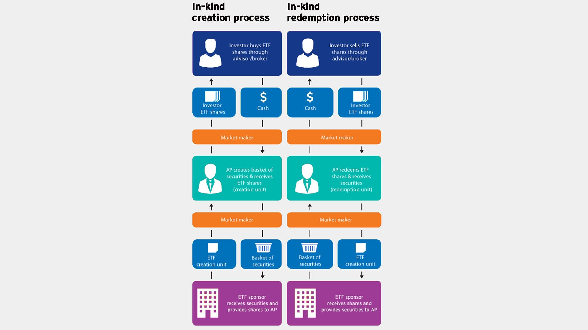

Exchange-Traded Funds (ETFs) have garnered significant attention among investors due to their innovative structure that offers both liquidity and diversification. As investment instruments, ETFs trade on stock exchanges much like individual stocks, but they encompass a diversified array of assets, including stocks, bonds, commodities, or other securities. This combination allows ETFs to provide the flexibility of individual stocks with the risk diversification typically found in mutual funds, making them a popular choice among both retail and institutional investors.

Understanding the taxation of ETFs is crucial for investors aiming to maximize their after-tax returns. ETFs often enjoy favorable tax treatment through mechanisms such as in-kind transfers, which can mitigate the taxable events typically experienced by mutual funds. A thorough grasp of these tax structures, including the nuances of capital gains taxes—short-term versus long-term—and relevant regulations, such as the wash sale rule, can result in more strategic investment decisions.



Algorithmic trading, which involves using automated systems to execute trades based on pre-set rules and algorithms, intersects with ETF investment strategies in interesting ways. This advanced trading tactic can enhance the tax efficiency of an ETF portfolio by optimizing the timing and execution of trades. Investors can leverage algorithmic trading to better comply with tax laws while maximizing their returns, although this requires a solid understanding of how such systems interact with tax regulations.

The growing popularity of ETFs can be attributed to a combination of tax efficiency, flexibility, and broad market exposure. As such, investors who wish to fully harness the benefits of ETFs must remain informed about their specific tax implications and the role of algorithmic trading in modern investment strategies. With a strategic approach, rooted in a comprehensive understanding of both ETFs and tax laws, investors can significantly optimize their portfolio's performance.

## Table of Contents

## Understanding ETFs and Tax Implications

Exchange-Traded Funds (ETFs) are a type of investment vehicle that are traded on stock exchanges much like individual stocks. These funds provide investors with a way to gain exposure to a diversified portfolio without having to individually purchase each asset within the fund. This blend of diversification and liquidity makes ETFs an attractive option for a wide range of investors.

One of the chief advantages of ETFs over other investment vehicles, such as mutual funds, is their favorable tax treatment. This tax efficiency is primarily due to the ETF's unique structure and mechanism for creating and redeeming shares. Unlike mutual funds, which might have to sell securities to meet investor redemptions, ETFs typically make use of in-kind transfers. This process involves exchanging assets directly, without triggering a taxable event. Such in-kind transactions help to minimize the distribution of capital gains to the ETF holders, thus reducing the immediate tax liabilities investors might face.

When examining the tax implications of [ETF](/wiki/etf-trading-strategies) sales, it is important to distinguish between short-term and long-term capital gains. Short-term capital gains, which arise from selling ETF shares held for one year or less, are typically taxed at the investor’s ordinary income tax rate. Meanwhile, long-term capital gains apply to ETFs held for more than one year and are taxed at a lower rate, thus providing a better after-tax return to the investor. This difference in taxation rates incentivizes investors to adopt longer-term holding strategies to maximize their tax efficiency.

Another important tax consideration when investing in ETFs is the wash sale rule. This rule prohibits investors from claiming a tax deduction for a security sold at a loss if a similar security is purchased within a 30-day window before or after the sale. This regulation is designed to prevent investors from creating tax losses without altering the economic position of their portfolios. With respect to ETFs, the wash sale rule can affect strategies like tax-loss harvesting. Investors need to carefully manage the timing of their trades to comply with this rule and avoid disallowed losses that could negate the tax advantages they seek.

Overall, while ETFs offer several tax benefits, investors must be mindful of specific tax regulations and implications. Through strategic planning and awareness of relevant tax rules, investors can effectively manage their ETF portfolios to enhance their net returns and maintain tax efficiency.

## Tax Advantages of ETFs over Mutual Funds

Exchange-Traded Funds (ETFs) offer substantial tax advantages over mutual funds primarily due to their unique structure and the creation/redemption mechanism. Unlike mutual funds, which must sell assets and distribute capital gains to investors when redemptions occur, ETFs generally use an in-kind exchange process. This process allows ETFs to minimize taxable events by swapping securities for ETF shares rather than selling them on the open market. Consequently, capital gains are deferred until investors decide to sell their ETF shares, enhancing tax efficiency.

Several studies corroborate the tax efficiency of ETFs. A noted study by the Investment Company Institute (ICI) highlighted that equity ETFs distributed just 0.01% of their net asset value as capital gains compared to 3.2% for equity mutual funds over a ten-year period ending in 2020. This disparity is largely attributed to the in-kind creation/redemption process that ETFs use, which significantly reduces capital gains distributions.

When comparing the tax burden of ETFs to mutual funds across different asset classes, ETFs tend to retain their advantage irrespective of the asset class. For instance, in taxable bond funds, ETFs often generate fewer taxable distributions than mutual funds, which are subject to more frequent buying and selling within the fund. This efficiency arises from lower reported turnover rates for ETFs. Turnover rate, indicating how frequently assets within a fund are bought and sold, directly influences taxable events. Typically, mutual funds have higher turnover rates due to their active management style, leading to more frequent capital gains events.

The turnover rate also plays a critical role in the tax efficiency of both ETFs and mutual funds. High turnover rates in mutual funds can result in more frequent taxable events as assets are regularly exchanged, leading to realized capital gains. In contrast, ETFs often experience lower turnover rates, primarily due to their passive management style and the advantage of in-kind transactions that further mitigate the tax impact on investors.

The structural intricacies and operational efficiencies of ETFs provide them a distinctive edge in tax treatment compared to mutual funds. This tax efficiency is a compelling reason why high-net-worth individuals and tax-savvy investors are increasingly inclined towards ETFs as part of their investment strategy.

## Tax Strategies with ETFs

When investing in Exchange-Traded Funds (ETFs), optimizing tax efficiency is crucial for maximizing returns. Various strategies can help investors mitigate tax liabilities and enhance after-tax performance.

Tax-loss harvesting is a popular method used by investors to offset capital gains with capital losses. This strategy involves selling ETFs that have experienced a decline in value to realize a loss, which can then be used to offset taxable gains from other investments. This practice can be particularly advantageous during volatile market conditions, where price swings may provide opportunities to realize losses and balance out gains.

Another strategy involves selling ETFs at a loss before the anniversary date. This approach allows investors to take advantage of short-term capital losses, which can be more beneficial than long-term losses because they can offset short-term capital gains that are typically taxed at a higher rate. It's important to note that such timing needs to be carefully planned to avoid falling within the purview of the wash sale rule.

Switching between similar ETFs is another tactic that maintains market exposure while realizing a loss for tax purposes. This practice is often called "tax-loss swapping" and involves selling an ETF that has declined in value and replacing it with a similar one. By doing so, investors retain their market position yet also recognize a loss to offset other gains. It's crucial to ensure that the replacement ETF is not substantially identical to the one sold to comply with IRS regulations.

Insights from financial professionals highlight the importance of a systematic approach to managing ETF investments for tax efficiency. For effective tax management, advisors often recommend:

- Regularly reviewing portfolio performance and market conditions to identify tax-loss harvesting opportunities.
- Ensuring trades execute swiftly to capture intended tax advantages, which can be facilitated by algorithmic trading systems.
- Understanding current and potential tax legislation to align strategies with the most recent tax laws.

Professional advice and algorithmic tools can help investors navigate complex tax landscapes, ensuring compliance while optimizing potential tax benefits from ETF strategies. Engaging a tax advisor or financial planner can significantly enhance the understanding and application of these strategies, leading to improved investment outcomes.

## Algorithmic Trading and ETF Investments

Algorithmic trading refers to the use of computer algorithms to automate the process of buying and selling securities, including Exchange-Traded Funds (ETFs). These algorithms systematically execute trades based on pre-defined criteria such as price movements, [volume](/wiki/volume-trading-strategy), or other market signals. In the context of ETF investments, [algorithmic trading](/wiki/algorithmic-trading) facilitates efficient portfolio management by executing trades quickly and minimizing transaction costs.

The impact of algorithmic trading on tax-efficient investment strategies is significant. Algorithmic systems can help investors optimize capital gains by strategically executing trades with precision timing, thereby enhancing after-tax returns. For instance, an algorithm may be programmed to perform tax-loss harvesting automatically, selling ETFs at a loss to offset capital gains elsewhere in the portfolio, thus reducing the overall taxable income.

Automated trading systems interact with ETF tax treatments in several ways. Since ETFs inherently have a mechanism to minimize capital gains distributions through in-kind transfers, when coupled with algorithmic trading, this ability is amplified. Algorithms can maximize the efficiency of these in-kind transfers by identifying the most tax-advantageous ETF shares to redeem.

One of the benefits of algorithmic trading in the optimization of capital gains strategies is its ability to promptly respond to market opportunities. This responsiveness is critical for executing strategies like short-term trades for locking in losses or gains at optimal rates. By doing so, such systems can improve after-tax returns by taking advantage of short-term market inefficiencies and favorable tax rules governing short-term versus long-term capital gains.

Algorithms also play an essential role in maintaining compliance with complex tax laws while trading at high speed. They can be programmed to adhere to constraints such as the wash sale rule, which prevents traders from claiming tax benefits from securities sold at a loss and repurchased within 30 days. An algorithm can be designed to track holding periods and automatically defer trades that might violate this rule, thus ensuring legal compliance without sacrificing the speed and efficiency of execution. For instance, an algorithm could be structured as follows:

```python
def check_wash_sale(sell_date, repurchase_date):
    # Calculate the number of days between the sale and repurchase
    days_between = (repurchase_date - sell_date).days

    # Determine compliance with the wash sale rule
    if days_between < 30:
        return "Do not repurchase: Wash sale detected"
    else:
        return "Repurchase allowed: No wash sale"

# Example usage
from datetime import datetime

sell_date = datetime(2023, 10, 1)
repurchase_date = datetime(2023, 10, 25)

print(check_wash_sale(sell_date, repurchase_date))
```

In sum, the integration of algorithmic trading with ETF investments offers substantial opportunities for improving tax efficiency, but requires careful strategy and compliance to fully leverage these benefits.

## Challenges of ETF Taxation

Exchange-Traded Funds (ETFs), while known for their tax efficiency, also face specific challenges and limitations that can affect their tax treatment. Investors aiming to leverage the tax benefits of ETFs must be aware of these issues to effectively manage their portfolios.

One primary challenge is the complex regulatory environment surrounding ETFs. Regulatory changes can influence ETF operations and their associated tax treatments. For instance, tax policies governing the classification of income and capital gains can directly impact the after-tax performance of ETF investments. Additionally, legislative changes on both national and international levels can introduce new compliance requirements that might affect the [liquidity](/wiki/liquidity-risk-premium) and management strategies of ETFs.

Another significant consideration involves the implications of "substantially identical" securities, particularly concerning the wash sale rules. The wash sale rule states that a tax deduction for a security sold at a loss is disallowed if a substantially identical security is purchased within a 30-day window before or after the sale. This rule is intended to prevent investors from claiming artificial tax losses while maintaining their investment positions. In the context of ETFs, this can become complex, especially when investors attempt to switch among similar ETFs to realize tax losses while maintaining market exposure. Identifying what constitutes a "substantially identical" security requires careful analysis of ETF holdings and investment objectives.

Misunderstandings regarding the "tax-free" nature of ETF trading also pose challenges. While ETFs are designed to be tax-efficient, they are not inherently tax-free. Capital gains taxes may still apply when investors sell ETF shares at a profit. Additionally, dividends received from ETFs may be subject to ordinary income tax, complicating the tax landscape for investors expecting purely tax-free growth. Furthermore, the mechanisms used by ETFs to minimize taxable events, such as in-kind redemptions and exchanges, have limits and can be influenced by market conditions and ETF strategies.

These complexities highlight the necessity for investors and financial professionals to stay informed about regulatory developments and specific ETF structures. A thorough understanding of the tax implications of ETF investments and the potential pitfalls, like the wash sale rule, can lead to more informed decision-making and optimized tax outcomes.

## Conclusion

Exchange-Traded Funds (ETFs) stand out as powerful instruments for investors aiming to optimize their portfolios through potential tax advantages. By design, ETFs offer tax efficiency primarily through mechanisms such as in-kind transactions, which can defer capital gains taxes until the point of sale. This is a significant aspect that differentiates them from mutual funds, where annual capital gains distributions are more common.

Algorithmic trading presents additional avenues for investors to enhance tax efficiency within ETF portfolios. Such strategies can automate the buying and selling of assets, optimizing transactions to favor lower tax liabilities. Algorithmic systems can rapidly execute trades with precision, which allows investors to better manage capital gains and losses, adhering to tax laws while potentially enhancing after-tax returns.

However, vigilance is crucial. Investors must navigate the intricate rules of ETF taxation, including understanding the implications of the wash sale rule and maintaining compliance with regulations. Mistakes can affect the anticipated tax benefits, thereby impacting the overall investment outcome. Using algorithmic trading without a thorough comprehension of relevant tax laws can lead to unfavorable tax situations rather than the intended tax optimization.

Ultimately, while the structural and strategic benefits of ETFs and algorithmic trading are substantial, leveraging the full potential of these advantages often requires professional guidance. Consulting financial and tax professionals ensures that investments are aligned with the latest tax regulations and are strategically positioned to maximize tax efficiency. By combining expert insights with sophisticated trading strategies, investors can effectively benefit from the inherent advantages of ETFs.

## FAQs

### What makes ETFs more tax-efficient than mutual funds?

ETFs generally offer greater tax efficiency compared to mutual funds, primarily due to their unique structure and operational mechanisms. The in-kind creation and redemption process utilized by ETFs allows them to circumvent most taxable events until an investor sells the shares. During these transactions, ETFs can exchange securities with authorized participants for ETF shares without triggering capital gains. In contrast, mutual funds typically need to distribute capital gains to all shareholders when portfolio managers sell securities within the fund, leading to potential tax liabilities.

### How does the wash sale rule apply to ETFs?

The wash sale rule disallows a tax deduction for a security sold at a loss if a substantially identical security is purchased within 30 days before or after the sale. When applying this rule to ETFs, investors need to be cautious if they are swapping between similar ETFs to maintain market exposure while realizing tax losses. Careful selection of ETFs with different underlying indices or asset allocations can help mitigate the risk of triggering the wash sale rule.

### Can algorithmic trading affect my tax obligations?

Algorithmic trading can impact tax obligations by influencing the frequency and timing of trades, which affects the classification of profits as short-term or long-term capital gains. Frequent trading typically results in more short-term gains, which are taxed at higher rates compared to long-term gains. Automated systems can be programmed to optimize trades based on tax efficiency, such as timing sales to maximize long-term gain potential and minimize tax liabilities while ensuring compliance with tax regulations.

### What tax strategies should I consider for my ETF portfolio?

Investors can implement several tax strategies to enhance the efficiency of their ETF portfolio:

1. **Tax-loss harvesting**: Use ETFs to offset capital gains with losses, reducing taxable income.
2. **Long-term holding**: Prioritize holding ETFs for over a year to benefit from lower long-term capital gains tax rates.
3. **Strategic selling**: Sell losing positions before the anniversary date to capture short-term losses.
4. **Switching ETFs**: Rotate among similar but not identical ETFs to maintain market exposure while realizing losses without triggering the wash sale rule.

### Are there any tax advantages specific to future, currency, or crypto ETFs?

Futures-based ETFs often offer tax advantages due to unique tax treatments, such as being taxed as 60% long-term and 40% short-term capital gains under the IRS 60/40 rule. Currency and crypto ETFs, depending on their structure, may either pass gains to shareholders as regular income or take advantage of specific tax treatments applicable to their underlying assets. As these areas are subject to evolving regulations, consulting a tax professional is recommended to understand the nuances and maximize tax benefits specific to these ETFs.

## References & Further Reading

[1]: ["A Guide to Understanding Exchange-Traded Funds (ETFs)"](https://www.morningstar.com/funds/what-is-an-etf-morningstars-etf-guide) by the U.S. Securities and Exchange Commission, which provides an overview of ETFs and their operational mechanics.

[2]: Poterba, J. M., & Shoven, J. B. (2002). ["Exchange-Traded Funds: A New Investment Option for Taxable Investors,"](https://www.nber.org/papers/w8781) Journal of Economic Perspectives, 16(1), 61-72. This paper discusses the tax implications and efficiency of ETFs compared to mutual funds.

[3]: ["Understanding ETF Taxation"](https://www.schwab.com/learn/story/etfs-and-taxes-what-you-need-to-know) by Morningstar, explaining how the unique structure of ETFs impacts taxation.

[4]: ["The Role of ETFs in Tax-Efficient Portfolio Management"](https://www.morningstar.com/funds/how-maximize-tax-efficiency-etfs) by ETF Strategy, detailing strategies for maximizing after-tax returns using ETFs.

[5]: ["Algorithmic Trading and DMA: An Introduction to Direct Access Trading Strategies"](https://www.semanticscholar.org/paper/Algorithmic-trading-%26-DMA-%3A-an-introduction-to-Johnson/aa5de1ab883d5e23b6651faa7c1807586d688e4b) by B. Kissell, providing detailed insights into how algorithmic trading aligns with investment strategies, including tax-efficient practices.

[6]: ["Tax Efficiency in Exchange-Traded Funds"](https://www.schwabassetmanagement.com/content/tax-efficiency-exchange-traded-funds) by the Investment Company Institute, offering statistical data and analysis on the tax benefits of ETFs over mutual funds.